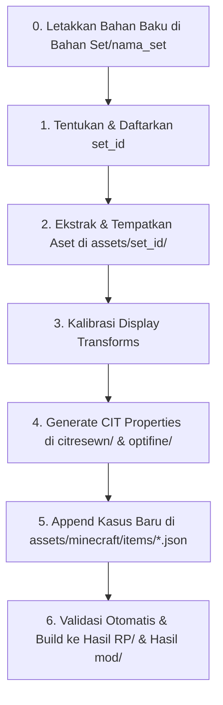

# PRD — Takasha Multi-Set Architecture: Resource Pack & Weapons Fabric Mod

> **Versi Dokumen:** 2.2.0  
> **Status Implementasi Saat Ini:** v2.2.0 (Arsitektur Dual Source Code Multi-Version: Minecraft 1.21.11 LTS & Minecraft 26.2 Modern, Dragon Mecha Overlord Set, 5-Tab Anvil GUI, Push Physics Parity)  
> **Tanggal Pembaruan:** 2026-10-08  
> **Status:** Active Production — Multi-Version Dual-Target Standard (Minecraft 1.21.11 & Minecraft 26.2)  

---

## 1. Ringkasan Eksekutif & Struktur Workspace

**Takasha** mengadopsi **Arsitektur Modular Multi-Set & Dual-Version Platform** untuk mengelola set senjata, perlengkapan kosmetik bertema, dan sistem NPC sinematik ke dalam dua runtime utama Minecraft Java Edition: **Minecraft 1.21.11 (LTS/Stable Branch)** dan **Minecraft 26.2 (Modern/Production Branch)**. 

Karena perbedaan mendasar pada level bytecode JVM (Java 21 vs Java 25), plugin toolchain Gradle (Loom Remap Intermediary vs Loom Unobfuscated), perbedaan API rendering (`GuiGraphics` vs `GuiGraphicsExtractor`), serta perubahan nama kelas Mojang (`ResourceLocation` vs `Identifier`), struktur workspace **memisahkan source code Java secara tegas** antara Minecraft 1.21.11 dan Minecraft 26.2:

1. **`Bahan Set/`** — Direktori pusat penampungan seluruh folder set mentah (misalnya dari pack Blockbench, ItemsAdder, Oraxen, atau marketplace pembuat model) yang akan dijadikan mod atau resource pack.
2. **`sakura-resourcepack/`** — Master aset Resource Pack vanilla/CIT murni yang kompatibel lintas versi (pack_format 15 s.d. 88).
3. **`sakura-weapons/`** — Workspace pengembangan Mod Fabric dengan **Arsitektur Dual Source Code Multi-Version**:
   - **Cabang Minecraft 1.21.11 (`versions/1.21.11/` / `src_1.21.11/`):** Menargetkan runtime Java 21 LTS (`java-runtime-delta`), Fabric API `0.141.6+1.21.11`, dan toolchain terobfuscasi Fabric Intermediary.
   - **Cabang Minecraft 26.2 (`versions/26.2/` / `src_26.2/`):** Menargetkan runtime Java 25 LTS (`java-runtime-epsilon`), Fabric API `0.161.0+26.2`, dan runtime kanonis Mojang tanpa obfuscation.
   - **Shared Assets (`shared-resources/` / `assets/`):** Single source of truth aset model 3D, tekstur, lang file, dan tag data yang dibundel otomatis ke kedua build JAR.
4. **`Hasil RP/`** — Direktori penyimpanan khusus seluruh file distribusi Resource Pack siap pakai (`Takasha-{VERSION}.zip`).
5. **`Hasil mod/`** — Direktori penyimpanan khusus seluruh file kompilasi Mod Fabric siap pakai dengan penanda versi platform yang eksplisit:
   - `Takasha-{VERSION}+1.21.11.jar` (untuk Minecraft 1.21.11)
   - `Takasha-{VERSION}+26.2.jar` (untuk Minecraft 26.2)

---

## 2. Arsitektur Multi-Set & Konvensi Penamaan (Naming Conventions)

Setiap set senjata memiliki identitas independen untuk mencegah tabrakan ID aset (*namespace collision*).

### 2.1 Identifikasi Set (`<set_id>`)
- Setiap set wajib memiliki identifier unik berupa huruf kecil dan underscore: `<set_id>` (contoh: `sakura`, `celestial`, `void_walker`, `cyberpunk`, dll.).
- **Prefix Tampilan (Display Prefix):** Setiap nama item diawali nama set bersangkutan (contoh: *"Sakura Katana"*, *"Celestial Katana"*, *"Void Dagger"*).
- **Dukungan Bilingual:** Setiap item mendukung penamaan Bahasa Inggris dan Bahasa Indonesia (contoh: *"Sakura Katana"* / *"Katana Sakura"*, *"Sakura Wings"* / *"Sayap Sakura"*).

### 2.2 Isolasi Namespace Aset
Struktur folder memisahkan model, tekstur, dan CIT per set:

```
sakura-resourcepack/assets/
├── <set_id>/                            # Namespace privat per set (misal: sakura/)
│   ├── models/item/                     # Model 3D JSON khusus set
│   └── textures/                        # Tekstur + animasi .mcmeta
├── minecraft/
│   ├── citresewn/cit/<set_id>/          # Properti CIT Resewn per set
│   ├── optifine/cit/<set_id>/           # Mirror OptiFine CIT per set
│   ├── items/                           # Central vanilla item definitions (1.21.5+)
│   └── textures/gui/                    # Custom Anvil GUI
```

### 2.3 Standar Penamaan, Pewarnaan (Coloring) & Simbol Identitas Set (Identity Symbols)
Setiap set memiliki identitas visual yang khas melalui kombinasi kode warna bawaan Minecraft vanilla (`§`) dan simbol dekoratif emoji yang selaras dengan tema set:

| Set ID | Nama Set | Tema Visual | Kode Warna | Simbol Khas | Format Nama Shift+Klik (Anvil & Predicate Cases) |
|:---|:---|:---|:---|:---|:---|
| **`sakura`** | Sakura | Musim Semi / Kelopak Bunga Jepang | `§d` (Light Purple / Pink) + `§l` (Bold) | `🌸` (Cherry Blossom) | `§d§l🌸 Sakura <Item> 🌸` / `§d§l🌸 <Item> Sakura 🌸` |
| **`pink_legacy`** | Pink Legacy | Neo-Tech / Mecha-Fantasy / Energy Aura | `§d` (Neon Pink) + `§l` (Bold) | `✨` (Sparkles / Energy Spark) | `§d§l✨ Pink Legacy <Item> ✨` / `§d§l✨ <Item> Pink Legacy ✨` |
| **`valentine`** | Valentine | Cupid / Love Romance / Crimson Heart | `§c` (Crimson / Valentine Red) + `§l` (Bold) | `❤` (Romantic Heart) | `§c§l❤ Valentine <Item> ❤` / `§c§l❤ <Item> Valentine ❤` |
| **`dragon_mecha_overlord`** | Dragon Mecha Overlord | Draconic Cyberpunk / Gold & Acid Lime | `§6` (Gold) + `§l` (Bold) | `🐲` (Dragon Face) | `§6§l🐲 Dragon Mecha Overlord <Item> 🐲` / `§6§l🐲 <Item> Dragon Mecha Overlord 🐲` |

**Aturan Penamaan & Karakter Anvil:**
1. **Batas 50 Karakter Vanilla Anvil:** Seluruh format nama di atas dipastikan tidak melampaui batas 50 karakter Anvil Minecraft vanilla (contoh terpanjang: `§c§l❤ Valentine Fishing Rod ❤` = 31 karakter, `§d§l✨ Pink Legacy Fishing Rod ✨` = 33 karakter).
2. **Karakter Simbol Aman (BMP & Unicode):** Simbol `🌸` (U+1F338), `✨` (U+2728), dan `❤` (U+2764) didukung penuh oleh mesin rendering font Minecraft Java Edition.
3. **Fleksibilitas Predicate `cases` Vanilla 26.2:** Setiap file item definition (`assets/minecraft/items/*.json`) wajib mendaftarkan variasi:
   - Nama berdekorasi lengkap dengan simbol (`§c§l❤ Valentine Sword ❤`, `&c&l❤ Valentine Sword ❤`).
   - Nama berwarna tanpa simbol (`§c§lValentine Sword`, `§cValentine Sword`, `&c&lValentine Sword`, `&cValentine Sword`).
   - Nama teks polos standar CIT (`Valentine Sword`, `valentine sword`).
   - Variasi bilingual Bahasa Indonesia (`Pedang Valentine`, `§c§l❤ Pedang Valentine ❤`, `§c§lPedang Valentine`, `§cPedang Valentine`).

### 2.4 Standarisasi Tekstur & Layering Zirah (Armor Texture & Layering Specification)

Untuk mencegah artefak visual seperti tekstur bertabrakan (*z-fighting*), lapisan tumpang tindih (*layer overlap / bleeding*), proporsi badan menggembung, serta celah berlubang pada kepala pemain (*back-of-head void gap*), seluruh set zirah diwajibkan mematuhi spesifikasi teknis dan zonasi UV berikut:

#### 2.4.1 Arsitektur Layering Minecraft Vanilla (`EquipmentLayerRenderer`)
Minecraft Java Edition merender model zirah humanoid menggunakan sistem 2 layer independen dengan dilatasi geometri (*cube expansion scale*) yang berbeda untuk menciptakan ketebalan berlapis yang realistis:
1. **Layer 1 (`HUMANOID` / `_layer_1`, Dilatasi Model `1.0F`):**
   - Merupakan lapisan pelindung terluar (lebih tebal).
   - Dialokasikan secara **eksklusif** untuk:
     - **HELMET (Helm / Pelindung Kepala)**
     - **CHESTPLATE (Baju Zirah Dada & Lengan)**
     - **BOOTS (Sepatu Pelindung / Kaki Bawah)**
2. **Layer 2 (`HUMANOID_LEGGINGS` / `_layer_2`, Dilatasi Model `0.5F`):**
   - Merupakan lapisan pakaian zirah bagian dalam (lebih tipis, pas badan).
   - Dialokasikan secara **khusus dan eksklusif** untuk:
     - **LEGGINGS (Celana Zirah / Pelvis & Paha)**

#### 2.4.2 Resolusi Standar & Aspek Rasio Kanonis
- **Aspek Rasio Baku:** Wajib tepat `2:1` (Lebar : Tinggi).
- **Resolusi Vanilla (1x):** `64x32` piksel.
- **Resolusi HD Standar Mod Takasha (2x):** `128x64` piksel (faktor skala 2x koordinat vanilla).

#### 2.4.3 Matriks Zonasi UV Matematis Nol-Tumpang-Tindih (Zero-Overlap Matrix)

Untuk mengeliminasi tumpang tindih (*overlap*), pembengkakan ukuran (*bloat*), dan *z-fighting* antara Layer 1 (Outer Dilatasi `1.0F`) dan Layer 2 (Inner Dilatasi `0.5F`), seluruh tekstur zirah wajib mematuhi partisi matematis mutlak berikut pada resolusi `128x64` (skala HD 2x):

| Komponen Anatomi | Kotak Koordinat UV `[X0, Y0, X1, Y1]` | Layer Alokasi Baku | Aturan Khusus, Batas Baris & Zona Terlarang (*Forbidden Zones*) |
|:---|:---|:---|:---|
| **Helm: Kepala Dasar** | `[0, 0, 64, 32]` | **Layer 1** | **Eksklusif Layer 1:** Kubus kepala dasar (dilatasi `1.0F`). Sisi belakang (`[48, 16, 64, 28]`) wajib solid tertutup untuk mencegah celah leher hitam bolong. |
| **Helm: Eye Visor Clearance** | `[18, 22, 30, 25]` | **Layer 1** | **Mata Terlihat Jelas:** Baris dahi pelindung mata depan pada `X: 18..30, Y: 22..24` wajib transparan (dinaikkan 1 baris piksel menjadi lengkungan dahi) agar mata karakter pemain terlihat jelas seperti helm vanilla, dengan ornamen lambang dahi tetap utuh di `Y=16..21`. |
| **Helm: Zona Terlarang Hat Layer** | `[64, 0, 128, 32]` | **Layer 1** | 🚫 **ZONA TERLARANG MUTLAK (WAJIB 0 PIXEL):** Dilarang keras menggambar pada Hat Layer kedua (`CubeDeformation 1.5F`, ukuran 11x11x11 blok). Keberadaan piksel di area ini menyebabkan helm mengembang seperti kubus raksasa yang melayang di luar kepala pemain. |
| **Baju Zirah: Torso Atas & Dada** | `[32, 32, 80, 54]` | **Layer 1** | **Eksklusif Layer 1 (Y=32..53):** Mencakup leher, pundak, pelindung dada depan, punggung belakang, dan rusuk perut. |
| **Baju Zirah: Zona Terlarang Sabuk** | `[32, 54, 80, 64]` | **Layer 1** | 🚫 **ZONA TERLARANG SABUK (WAJIB 0 PIXEL):** Baris Y=54..63 pada Layer 1 wajib 100% transparan agar tidak menutupi pinggul/sabuk Layer 2. |
| **Baju Zirah: Kedua Lengan** | `[80, 32, 112, 64]` | **Layer 1** | **Eksklusif Layer 1:** Mencakup pelindung bahu dan seluruh lengan tangan. |
| **Sepatu: Kaki Bawah & Sol** | `[0, 54, 32, 64]` | **Layer 1** | **Eksklusif Layer 1 (Y=54..63):** Hanya area betis bawah, pergelangan kaki, tumit, dan sol sepatu. |
| **Sepatu: Zona Terlarang Paha & Lutut** | `[0, 32, 32, 54]` | **Layer 1** | 🚫 **ZONA TERLARANG PAHA (WAJIB 0 PIXEL):** Baris Y=32..53 pada Layer 1 wajib 100% transparan agar tidak menelan celana paha Layer 2. |
| **Celana: Sabuk, Pinggul & Pelvis** | `[32, 54, 80, 64]` | **Layer 2** | **Eksklusif Layer 2 (Y=54..63):** Merender sabuk (*belt*), gesper pinggul, dan selangkangan. |
| **Celana: Zona Terlarang Torso Atas** | `[32, 32, 80, 54]` | **Layer 2** | 🚫 **ZONA TERLARANG TORSO ATAS (WAJIB 0 PIXEL):** Baris Y=32..53 pada Layer 2 wajib 100% transparan (tidak ada dada, rusuk, pundak, atau suspender ganda). |
| **Celana: Paha & Lutut** | `[0, 32, 32, 54]` | **Layer 2** | **Eksklusif Layer 2 (Y=32..53):** Merender kain paha dan pelindung lutut. |
| **Celana: Zona Terlarang Sepatu** | `[0, 54, 32, 64]` | **Layer 2** | 🚫 **ZONA TERLARANG SEPATU (WAJIB 0 PIXEL):** Baris Y=54..63 pada Layer 2 wajib 100% transparan murni agar tidak bergesekan dengan sepatu boots. |
| **Kepala & Lengan pada Layer 2** | `[0, 0, 128, 32]` & `[80, 32, 112, 64]` | **Layer 2** | 🚫 **ZONA TERLARANG MUTLAK (WAJIB 0 PIXEL):** Celana tidak boleh memiliki piksel kepala atau lengan apapun. |

#### 2.4.4 Prosedur Audit & Validasi Otomatis (Automated Texture Audit)
Setiap tekstur zirah sebelum dirilis wajib lolos audit kualitas CI menggunakan skrip verifikasi otomatis `scripts/validate_armor_layers.py`. Skrip memverifikasi toleransi nol (0 toleransi pelanggaran):
1. **Dimensi Aspek Rasio:** Tepat kelipatan rasio 2:1 (`128x64`).
2. **Layer 1 Hat Layer Elimination:** Tepat `0` piksel pada `[64, 0, 128, 32]`.
3. **Layer 1 Paha & Lutut Forbidden Zone:** Tepat `0` piksel pada `[0, 32, 32, 54]`.
4. **Layer 1 Sabuk/Pelvis Forbidden Zone:** Tepat `0` piksel pada `[32, 54, 80, 64]`.
5. **Layer 2 Torso Atas Forbidden Zone:** Tepat `0` piksel pada `[32, 32, 80, 54]`.
6. **Layer 2 Sepatu/Kaki Bawah Forbidden Zone:** Tepat `0` piksel pada `[0, 54, 32, 64]`.
7. **Layer 2 Kepala & Lengan Forbidden Zone:** Tepat `0` piksel pada `[0, 0, 128, 32]` dan `[80, 32, 112, 64]`.
8. **Kelengkapan Belakang Helm:** Penutup kepala belakang Layer 1 (`[48, 16, 64, 28]`) minimal 90% terisi (bebas celah leher bolong).

### 2.5 Konvensi Penamaan Distribusi Mod & Versi Platform yang Didukung (Platform Version Tagging)

Untuk menjamin transparansi kompatibilitas bagi pengguna, mencegah ambiguitas runtime, serta memastikan pemain memasang file mod yang sesuai dengan versi Minecraft target:

- **Format Penamaan Baku File Distribusi Mod Fabric:**
  ```
  Hasil mod/Takasha-{MAJOR}.{MINOR}.{PATCH}+{MC_VERSION}.jar
  ```
- **Kaidah Komponen Penamaan:**
  1. **`Takasha`** — Identitas merek / nama payung tunggal resmi proyek mod (PRD Bagian 1 & 11.4).
  2. **`{MAJOR}.{MINOR}.{PATCH}`** — Nomor versi konten fungsional mod mengikuti prinsip SemVer 2.0.0 (contoh: `2.2.0`).
  3. **`+`** — Delimiter / pemisah standar build metadata SemVer 2.0.0.
  4. **`{MC_VERSION}`** — Nomor versi resmi Minecraft Java Edition yang didukung penuh oleh kompilasi bytecode JVM, API mappings, dan dependensi Fabric JAR bersangkutan (yaitu `26.2` atau `1.21.11`).

- **Matriks Versi Platform yang Didukung:**
  | Format Nama File Rilis Mod | Target Minecraft (`{MC_VERSION}`) | Fabric API Target | Versi JVM Java Target | Target Arsitektur Bytecode | Status Cabang |
  |:---|:---|:---|:---|:---|:---|
  | **`Takasha-2.2.0+26.2.jar`** | **Minecraft Java 26.2** | `0.161.0+26.2` | OpenJDK 25 LTS (`java-runtime-epsilon`) | Major `69.0` (Java 25) | **Active Production (Modern)** |
  | **`Takasha-2.2.0+1.21.11.jar`** | **Minecraft Java 1.21.11** | `0.141.6+1.21.11` | OpenJDK 21 LTS (`java-runtime-delta`) | Major `65.0` (Java 21) | **Active Production (LTS/Stable)** |
  | **`Takasha-2.1.1+26.2.jar`** | **Minecraft Java 26.2** | `0.161.0+26.2` | OpenJDK 25 LTS (`java-runtime-epsilon`) | Major `69.0` (Java 25) | Archived Release (26.2) |
  | **`Takasha-2.1.0+26.2.jar`** | **Minecraft Java 26.2** | `0.161.0+26.2` | OpenJDK 25 LTS (`java-runtime-epsilon`) | Major `69.0` (Java 25) | Archived Release (26.2) |
  | **`Takasha-2.0.0+26.2.jar`** | **Minecraft Java 26.2** | `0.161.0+26.2` | OpenJDK 25 LTS (`java-runtime-epsilon`) | Major `69.0` (Java 25) | Archived Release (26.2) |
  | **`Takasha-1.7.0+26.2.jar`** | **Minecraft Java 26.2** | `0.161.0+26.2` | OpenJDK 25 LTS (`java-runtime-epsilon`) | Major `69.0` (Java 25) | Archived Release (26.2) |
  | **`Takasha-1.6.5+1.21.11.jar`** | **Minecraft Java 1.21.11** | `0.141.6+1.21.11` | OpenJDK 21 LTS (`java-runtime-delta`) | Major `65.0` (Java 21) | Archived Release (1.21.11) |
  | **`Takasha-1.6.1+1.21.11.jar`** | **Minecraft Java 1.21.11** | `0.141.6+1.21.11` | OpenJDK 21 LTS (`java-runtime-delta`) | Major `65.0` (Java 21) | Archived Release (1.21.11) |

- **Tabel Komparasi Divergensi Teknis Baku (Minecraft 1.21.11 vs Minecraft 26.2):**

| Aspek Teknis & API | Cabang Minecraft 1.21.11 (LTS Branch) | Cabang Minecraft 26.2 (Modern Branch) | Dampak Jika Digabungkan (Tanpa Pemisahan) |
|:---|:---|:---|:---|
| **JVM Runtime & Toolchain JDK** | OpenJDK 21 LTS (`java-runtime-delta`) | OpenJDK 25 LTS (`java-runtime-epsilon`) | Crash fatal startup: `UnsupportedClassVersionError` jika bytecode Java 25 dijalankan di JVM 21. |
| **Java Bytecode Target** | Major `65.0` (Java 21) | Major `69.0` (Java 25) | Tidak kompatibel pada tingkat biner antar launcher game. |
| **Gradle Loom Plugin** | `net.fabricmc.fabric-loom-remap` v1.17.21 | `net.fabricmc.fabric-loom` v1.17.21 | Loom 26.2 crash jika Loom remap memanggil `officialMojangMappings()` di lingkungan tanpa obfuscasi. |
| **Obfuscation & Mapping** | **Obfuscated Runtime:** Menggunakan mapping Fabric Intermediary via task `:remapJar`. Wajib mendeklarasikan `mappings loom.officialMojangMappings()`. | **Unobfuscated Mojang Runtime:** Mojang mendistribusikan kode game secara resmi dengan nama kanonis. Dilarang mendeklarasikan `mappings`. | Crash fatal runtime: `NoClassDefFoundError: net/minecraft/class_*` di 26.2 atau `NoClassDefFoundError: net/minecraft/core/Registry` di 1.21.11. |
| **Identifier / ResourceLocation** | `net.minecraft.resources.ResourceLocation` | `net.minecraft.resources.Identifier` | Compile error instan: `cannot find symbol class ResourceLocation / Identifier`. |
| **GUI & Screen Widget Rendering** | Menggunakan direct Graphics context: `renderWidget(GuiGraphics graphics, int mouseX, int mouseY, float delta)` | Menggunakan state extraction context: `extractWidgetRenderState(GuiGraphicsExtractor extractor, int mouseX, int mouseY, float delta)` | Signature method `renderWidget` hilang di 26.2, sedangkan `GuiGraphicsExtractor` tidak ada di 1.21.11. |
| **Creative Tab API** | `FabricItemGroup.builder()` dari paket `net.fabricmc.fabric.api.itemgroup.v1.FabricItemGroup` | `FabricCreativeModeTab.builder()` dari paket `net.fabricmc.fabric.api.creativetab.v1.FabricCreativeModeTab` | Perbedaan nama kelas & paket builder modul Creative Mode Tab. |
| **Key Mapping / Keybind API** | `KeyBindingHelper.registerKeyBinding(...)` dari `net.fabricmc.fabric.api.client.keybinding.v1` | `KeyMappingHelper.registerKeyMapping(...)` dari `net.fabricmc.fabric.api.client.keymapping.v1` & Java Record `KeyMapping.Category.MISC` | Compile error pada registrasi keybind kustom. |
| **Entity Registry References** | `EntityType.PLAYER`, `EntityType.ARMOR_STAND` | `EntityTypes.PLAYER`, `EntityTypes.ARMOR_STAND` | Perbedaan nama kelas penampung konstanta (`EntityType` vs `EntityTypes`). |
| **LivingEntity Render Layer Callbacks** | `LivingEntityFeatureRendererRegistrationCallback` | `LivingEntityRenderLayerRegistrationCallback.EVENT.register(...)` | Callback registrasi custom renderer zirah, topi, dan sayap berbeda. |
| **Shield Component Registry** | Komponen Item Pertahanan Klasik Vanilla | Component lookup modern dengan `delayedComponent` & `BlocksAttacks` provider | Inkompatibilitas registrasi komponen pertahanan perisai. |
| **Equipment JSON Constraints** | Menolak tag `"humanoid_baby"` (Codec error jika ada) | Mendukung format metadata equipment modern | Tekstur zirah tidak muncul (invisible) di 1.21.11 jika format 26.2 dipaksakan tanpa sanitasi. |
| **Replay & Sinematik Integration** | Integrasi standar / offline mannequin | Native ImGui Flashback (`FlashbackSakuraPanel`, `SelectedEntityPopupMixin`), ReplayMod Zero-Desync timeline | Kelas ImGui Flashback 26.2 tidak tersedia di runtime 1.21.11. |
| **NPC Push Physics Parity** | Simulasi No-AI Collision Ringan | Overhaul Fisika Dorongan: `isEffectiveAi()` dinamis, server `travel()` sync, `canBeCollidedWith()`, `snapTo()` origin | Memerlukan sinkronisasi logika gerakan yang disesuaikan per API entitas. |


---

## 3. Taksonomi Baku Item Archetypes

Untuk memastikan konsistensi di setiap set baru, setiap set mengacu pada katalog archetype baku berikut:

| Kategori Archetype | ID Archetype Baku | Default Base Items (CIT Trigger) | Perilaku & Catatan |
|:---|:---|:---|:---|
| **Blades / Pedang** | `katana`, `sword`, `bigsword`, `dagger`, `gauntlet`, `club` | Semua Tier Sword (Netherite s.d. Wood, Copper), `paper` | Model senjata tajam/gada pemukul pedang standar. Gauntlet & Club diklasifikasikan ke dalam kategori Pedang. |
| **Senjata Panjang** | `spear`, `halberd` | Semua Tier Spear (1.21.5+), `trident`, Semua Tier Sword, `paper` (Halberd juga mendukung Semua Tier Axe) | Jarak jangkau visual panjang. Seluruh resource spear (`sakura_spear`, `pink_legacy_spear`) wajib tersedia di semua base spear dan trident. |
| **Senjata Tumpul** | `hammer`, `mace` | `mace`, Semua Tier Axe (Netherite s.d. Wood, Copper), `paper` | Visual berbobot berat/tumpul. Sakura Mace memetakan netherite_axe dan seluruh tier kapak. |
| **Peralatan (Tools)** | `pickaxe`, `axe`, `shovel`, `hoe` | Sesuai tier alat vanilla masing-masing, `paper` | Grip handle selaras dengan alat vanilla. Khusus pickaxe hanya berisi pickaxe (hammer dipindahkan ke axe/mace). Terdaftar di tag `#minecraft:pickaxes`. |
| **Ranged & Utility** | `bow`, `crossbow`, `fishing_rod`, `key` | `bow`, `crossbow`, `fishing_rod`, `tripwire_hook`, `stick`, `paper` | Memiliki status bertahap (e.g. `bow_0`, `bow_1`, `bow_2`, `cast`). |
| **Pertahanan** | `shield` | `shield`, `paper` | Memiliki model aktif `_blocking` saat menangkis. |
| **Set Armor** | `helmet`, `chestplate`, `leggings`, `boots` | Semua tier armor vanilla masing-masing, `turtle_helmet`, `copper_armor`, `paper` | Model item 2D (`minecraft:item/generated`) di tangan/inventory + layer armor texture (`_layer_1`, `_layer_2`) saat dipakai karakter via CIT `type=armor` atau `EquipmentLayerRendererMixin`. |
| **Kosmetik Kepala** | `hat` | Semua Helm vanilla, `carved_pumpkin`, `paper` | Saat dipakai di kepala entitas pemain: Tekstur helm vanilla ditekan/dihapus via empty equipment asset info, dan model 3D dirender langsung via `SakuraHatFeatureRenderer` pada slot HEAD. |
| **Kosmetik Punggung** | `wing`, `backpiece` | `elytra`, `paper` (Murni kosmetik) | Model kosmetik murni (menggunakan display transform `"head"` offset punggung atas). Tidak menggunakan model cape/elytra berayun. |

---

## 4. Katalog Set Terdaftar

### 4.1 Set #1: Sakura Animated Weapon Set (`sakura`) — *Status: Selesai (v1.2.5)*
- **Folder Sumber Bahan:** `Bahan Set/elitecreatures_sakura_animated_weapon_set/`
- **Tema:** Keanggunan musim semi Jepang, kayu sakura gelap, bunga mekar, jimat emas, kelopak gugur bercahaya.
- **Total Model:** 25 model 3D Blockbench.
- **Efek Khusus:** Tekstur animasi `.mcmeta` pada kelopak dan jimat (`sakura_animation_01`, `sakura_animation_02`).
- **Item Kosmetik:**
  - `hat`: Topi jerami pengelana bertabur bunga sakura (Helm / Carved Pumpkin / Paper).
  - `wing`: Ornamen punggung cabang sakura menjulang tinggi (Paper saja, display transform `"head"`, $Y=-15.75, Z=5.5$).
- **CIT Properties:** 28 file properti dual-condition matching tersinkronisasi di `citresewn/` dan `optifine/`.

### 4.2 Set #2: Pink Legacy Animated Weapon & Armor Set (`pink_legacy`) — *Status: Selesai (v1.3.0)*
- **Folder Sumber Bahan:** `Bahan Set/elitecreatures-pink_legacy_animated_weapon_set/`
- **Tema:** Neon magenta / pink tech-fantasy dengan animasi glowing aura partikel.
- **Total Model:** 20 model 3D Blockbench + 4 model 2D armor item generated.
- **Efek Khusus:** Tekstur animasi `.mcmeta` aura energi (`eff_01` s.d. `eff_05`).
- **Set Armor Lengkap (4 Pieces):**
  - `helmet`: Helm Pink Legacy (`pink_legacy:item/helmet`, worn: `pink_legacy_armor_layer_1.png`).
  - `chestplate`: Zirah Pink Legacy (`pink_legacy:item/chestplate`, worn: `pink_legacy_armor_layer_1.png`).
  - `leggings`: Celana Pink Legacy (`pink_legacy:item/leggings`, worn: `pink_legacy_armor_layer_2.png`).
  - `boots`: Sepatu Pink Legacy (`pink_legacy:item/boots`, worn: `pink_legacy_armor_layer_1.png`).
- **Item Kosmetik & Utility:**
  - `wings`: Sayap Pink Legacy (Paper saja, display transform `"head"`, calibrated backpiece).
  - `key`: Kunci Pink Legacy (`tripwire_hook`, `stick`, `paper`).
- **CIT Properties:** 46 file properti dual-condition matching (30 senjata/tools/kosmetik + 16 armor: 8 item CIT + 8 worn entity armor CIT).

### 4.3 Set #3: Valentines Animated Weapon, Tool & Armor Set (`valentine`) — *Status: Selesai / Onboarding (v1.6.0)*
- **Folder Sumber Bahan:** `Bahan Set/elitecreatures-valentines_animated_weapon_and_tool_set_v1/`
- **Tema:** Neon magenta / pink heart tech-fantasy dengan ornamen hati berputar (`heartrotate`, `heartrotate1`), aura energi glowing (`heartnitro`), animasi lensa kamera (`cameralens1`), dan baterai animasi (`battery`).
- **Pewarnaan & Simbol Identitas:** `§c` (Crimson / Valentine Red) + `§l` (Bold) dengan simbol `❤` (Romantic Heart) -> `§c§l❤ Valentine <Item> ❤`.
- **Total Model:** 27 model 3D Blockbench (17 senjata/perkakas, 4 kosmetik/utilitas: topi 3D, sayap animasi, kunci, granat; *item chest dan quiver dihilangkan*) + 4 model 2D armor item generated = total 31 model item JSON. Total 20 item terdaftar.
- **Efek Khusus:** 8 file tekstur animasi `.mcmeta` (`battery`, `bowfill`, `cameralens1`, `cloudheart`, `glassese`, `heartnitro`, `heartrotate`, `heartrotate1`).
- **Set Armor Lengkap (4 Pieces):**
  - `helmet`: Helm Valentine (`valentine:item/helmet`, worn: `valentine.png` via humanoid layer).
  - `chestplate`: Zirah Valentine (`valentine:item/chestplate`, worn: `valentine.png` via humanoid layer).
  - `leggings`: Celana Valentine (`valentine:item/leggings`, worn: `valentine.png` via humanoid_leggings layer).
  - `boots`: Sepatu Valentine (`valentine:item/boots`, worn: `valentine.png` via humanoid layer).
- **Item Senjata Khusus:**
  - `staff`: Valentine Staff (`valentine:item/staff`, trigger base items: Semua Spear 7 tier, Semua Axe 7 tier, Semua Sword, `stick`, `paper` — *blaze_rod ditiadakan*).
- **Item Kosmetik & Utilitas:**
  - `hat`: Kacamata & Topi Hati 3D (`valentine:item/hat`, display transform `"head"`, render via `SakuraHatFeatureRenderer`, helm vanilla ditekan).
  - `wing`: Sayap Hati Animasi Valentine (`elytra`, `paper`, display transform `"head"` calibrated backpiece, mendukung nama tunggal & jamak `Valentine Wing` / `Valentine Wings`).
  - `key`: Kunci Hati (`tripwire_hook`, `stick`, `paper`).
  - `grenade`: Granat Hati (`firework_star`, `snowball`, `wind_charge`, `paper`).
- **Mesin Status Ranged (Bow & Crossbow):**
  - `bow`: `bow.json` + `bow_0.json`, `bow_1.json`, `bow_2.json` (3 pulling stages).
  - `crossbow`: `crossbow.json` + `crossbow_0.json`, `crossbow_1.json`, `crossbow_2.json`, `crossbow_2_charged.json`, `crossbow_charged.json` (5 charging & charged stages).
- **CIT Properties:** 24 file properti dual-condition matching tersinkronisasi di `citresewn/` dan `optifine/` (16 senjata/tools/kosmetik + 8 armor CIT).

### 4.4 Set Berikutnya (Pipeline / Future Expansion)
- Template set baru (`<new_set>`) ditempatkan di `Bahan Set/<new_set_folder>/`, lalu diekstrak ke namespace `assets/<new_set>/` tanpa mengubah aset set lain.
- Item definitions di `assets/minecraft/items/<item>.json` cukup menambahkan blok *case* baru dengan nama set baru.

---

## 5. Arsitektur Komponen Teknis

### 5.1 Resource Pack (`Takasha`)
- **Compatibility:** Minecraft Java 1.21.4 (pack_format 15) hingga 26.2 (pack_format 88).
- **Dual Matching CIT:**
  ```properties
  type=item
  items=<base_items>
  model=<set_id>:item/<model_name>
  nbt.display.Name=ipattern:*<Item Name>*
  components.minecraft:custom_name=ipattern:*<Item Name>*
  components.custom_name=ipattern:*<Item Name>*
  ```
- **Vanilla Item Definitions (`assets/minecraft/items/*.json`):**
  Menggunakan format modern `minecraft:select` berdasarkan `minecraft:custom_name`. Penambahan set baru dilakukan secara *append* pada array `cases` tanpa memodifikasi case milik set lain.

### 5.2 Arsitektur Dual Source Code Multi-Version Mod Fabric (`sakura-weapons` / Takasha Mod)

Mod Takasha mengadopsi **Arsitektur Pemisahan Source Code Multi-Version (Dual Source Code Architecture)** untuk mendukung dua target platform runtime secara simultan: **Minecraft 1.21.11 (LTS/Stable)** dan **Minecraft 26.2 (Modern/Production)**.

#### 5.2.1 Urgensi & Alasan Teknis Pemisahan Source Code
Penggabungan kode sumber kedua versi ke dalam satu direktori tunggal (`src/main/java`) dilarang keras karena menimbulkan inkompatibilitas teknis yang tidak dapat direkonsiliasi:
1. **Divergensi Bytecode JVM:** Minecraft 1.21.11 menggunakan OpenJDK 21 LTS (Bytecode major `65.0`), sedangkan Minecraft 26.2 menggunakan OpenJDK 25 LTS (Bytecode major `69.0`). JVM Java 21 akan melempar fatal exception `UnsupportedClassVersionError: class file version 69.0 (Java 25)` jika memuat class kompilasi 26.2.
2. **Konflik Toolchain Fabric Loom:** 
   - Pada 1.21.11, runtime game masih terobfuscasi, sehingga wajib memakai `net.fabricmc.fabric-loom-remap` 1.17.21, mendeklarasikan `mappings loom.officialMojangMappings()`, dan mengeksekusi remapping ke namespace intermediary (`remapJar`).
   - Pada 26.2, Mojang merilis biner game tanpa obfuscasi (*unobfuscated*), sehingga Loom 1.17.21 mengaktifkan `disableObfuscation = true`. Jika baris `mappings loom.officialMojangMappings()` dipanggil, Gradle langsung melempar error fatal: `Cannot use Mojang mappings in a non-obfuscated environment`.
3. **Perubahan Kanonis Kelas & Paket Mojang:** Mojang mengubah kelas kunci seperti `ResourceLocation` menjadi `Identifier`, `EntityType` menjadi `EntityTypes`, dan perombakan struktur registry.
4. **Perombakan Pipeline Rendering GUI:** Minecraft 26.2 menghapus konteks rendering `renderWidget(GuiGraphics, ...)` dan menggantikannya dengan `extractWidgetRenderState(GuiGraphicsExtractor, ...)`. Kedua API ini memiliki tanda tangan metode yang saling eksklusif.

#### 5.2.2 Spesifikasi Teknis Cabang Minecraft 1.21.11 (LTS Subproject)
- **Lokasi Source Code:** `sakura-weapons/versions/1.21.11/src/main/java/` (atau `sakura-weapons/src_1.21.11/`)
- **Target Runtime:** Minecraft Java Edition `1.21.11`
- **Fabric API:** `net.fabricmc.fabric-api:fabric-api:0.141.6+1.21.11`
- **Fabric Loader:** `>=0.19.3`
- **JDK Compiler:** OpenJDK 21 LTS (`java-runtime-delta`), `options.release = 21`, bytecode major `65.0`
- **Loom Plugin:** `id 'net.fabricmc.fabric-loom-remap' version '1.17.21'`
- **Mappings:** `mappings loom.officialMojangMappings()` (wajib di-remap ke Intermediary)
- **Karakteristik Kode Sumber 1.21.11:**
  - Import identifier: `import net.minecraft.resources.ResourceLocation;`
  - Creative Tab: `net.fabricmc.fabric.api.itemgroup.v1.FabricItemGroup`
  - Screen rendering: `public void renderWidget(GuiGraphics graphics, int mouseX, int mouseY, float delta)`
  - Keybinds: `KeyBindingHelper.registerKeyBinding(...)`
  - Render Layer Callback: `LivingEntityFeatureRendererRegistrationCallback`
  - Entity Registry: `EntityType.PLAYER`, `EntityType.ARMOR_STAND`
  - Equipment JSON: Wajib bebas dari tag `"humanoid_baby"` untuk mencegah Mojang Codec parse error.
- **Output Build:** `Hasil mod/Takasha-{VERSION}+1.21.11.jar`

#### 5.2.3 Spesifikasi Teknis Cabang Minecraft 26.2 (Modern Subproject)
- **Lokasi Source Code:** `sakura-weapons/versions/26.2/src/main/java/` (atau `sakura-weapons/src_26.2/`)
- **Target Runtime:** Minecraft Java Edition `26.2`
- **Fabric API:** `net.fabricmc.fabric-api:fabric-api:0.161.0+26.2`
- **Fabric Loader:** `>=0.19.3`
- **JDK Compiler:** OpenJDK 25 LTS (`java-runtime-epsilon`), `options.release = 25`, bytecode major `69.0`
- **Loom Plugin:** `id 'net.fabricmc.fabric-loom' version '1.17.21'` (mode unobfuscated, tanpa blok mappings)
- **Karakteristik Kode Sumber 26.2:**
  - Import identifier: `import net.minecraft.resources.Identifier;`
  - Creative Tab: `net.fabricmc.fabric.api.creativetab.v1.FabricCreativeModeTab`
  - Screen rendering: `public void extractWidgetRenderState(GuiGraphicsExtractor extractor, int mouseX, int mouseY, float delta)`
  - Keybinds: `KeyMappingHelper.registerKeyMapping(...)` & `KeyMapping.Category.MISC`
  - Render Layer Callback: `LivingEntityRenderLayerRegistrationCallback.EVENT.register(...)`
  - Entity Registry: `EntityTypes.PLAYER`, `EntityTypes.ARMOR_STAND`
  - Perisai (Shield): `delayedComponent` dengan provider lookup `BlocksAttacks`
  - Modul Khusus Sinematik: Integrasi native Dear ImGui Flashback (`FlashbackSakuraPanel`, `SelectedEntityPopupMixin`), ReplayMod Zero-Desync timeline posing, Bendable Cuboids articulation.
  - Overhaul Fisika Dorongan: `isEffectiveAi()` dinamis, server `travel()` sync, `canBeCollidedWith()`, `snapTo()` origin anchor.
- **Output Build:** `Hasil mod/Takasha-{VERSION}+26.2.jar`

#### 5.2.4 Standarisasi Struktur Direktori & Konfigurasi Gradle Multi-Project
Pemisahan diorganisasi menggunakan konfigurasi **Gradle Multi-Project Submodules** atau **Multi-Target SourceSets**:

```text
sakura-weapons/
├── settings.gradle                      # Mendeklarasikan subproyek versions/1.21.11 dan versions/26.2
├── build.gradle                         # Root aggregator script (task buildAll, cleanAll, syncAssets)
├── gradle.properties                    # Properti global (maven_group, archives_base_name=Takasha)
│
├── versions/
│   ├── 1.21.11/                         # [MODUL 1.21.11]
│   │   ├── build.gradle                 # Loom Remap, Java 21 release, officialMojangMappings
│   │   ├── gradle.properties            # minecraft_version=1.21.11, JDK delta path
│   │   └── src/main/
│   │       ├── java/                    # Source code Java khusus 1.21.11
│   │       └── resources/
│   │           ├── fabric.mod.json      # Metadata 1.21.11 (deps: minecraft >=1.21.11- <=1.21.11, java >=21)
│   │           └── sakura_weapons.mixins.json
│   │
│   └── 26.2/                            # [MODUL 26.2]
│       ├── build.gradle                 # Loom Unobfuscated, Java 25 release, Flashback compileOnly
│       ├── gradle.properties            # minecraft_version=26.2, JDK epsilon path
│       └── src/main/
│           ├── java/                    # Source code Java khusus 26.2
│           └── resources/
│               ├── fabric.mod.json      # Metadata 26.2 (deps: minecraft ~26.2, java >=25)
│               └── sakura_weapons.mixins.json
│
└── shared-resources/                    # Single Source of Truth aset bersama
    └── assets/                          # Model 3D JSON, tekstur PNG, lang files, Minecraft tags
```

*Opsi Transisi Direct Source-Root:* Jika menggunakan single-project dengan source sets terpisah, folder dinamai secara kanonis `src_1.21.11/main/java` dan `src_26.2/main/java` dengan Gradle flag pemilihan profil `-PmcVersion=...`.

#### 5.2.5 Arsitektur Shared Assets (Single Source of Truth)
Untuk mencegah redundansi dan *asset drift* (perbedaan tampilan model 3D, tekstur, atau terjemahan antara versi 1.21.11 dan 26.2):
1. Seluruh aset model 3D Blockbench, tekstur PNG, animasi `.mcmeta`, file bilingual `lang/en_us.json` & `id_id.json`, serta tag JSON dikelola terpusat pada satu lokasi (`shared-resources/assets/` atau `sakura-resourcepack/assets/`).
2. Skrip Gradle kedua modul versi secara deklaratif menyertakan path shared assets ke dalam `sourceSets.main.resources.srcDirs`:
   ```groovy
   sourceSets {
       main {
           resources {
               srcDirs += [ "${rootDir}/shared-resources", "${rootDir}/../sakura-resourcepack" ]
           }
       }
   }
   ```
3. Khusus untuk file `equipment/*.json`, modul 1.21.11 secara otomatis mengecualikan blok `"humanoid_baby"` guna menjamin parsing codec 1.21.11 tidak mengalami crash.

#### 5.2.6 Protokol Paritas Fitur & Workflow Porting (Feature Parity Protocol)
Setiap kali set senjata, kosmetik, atau fitur baru ditambahkan ke proyek Takasha:
1. **Langkah 1 (Asset First):** Model 3D dan tekstur distandardisasi dan diletakkan pada namespace aset bersama (`shared-resources/assets/<set_id>/`).
2. **Langkah 2 (Implementasi Primary):** Fitur dan item didaftarkan pada cabang utama (misal 26.2 modern).
3. **Langkah 3 (Porting ke LTS):** Logika direplikasi ke cabang 1.21.11 dengan menyesuaikan kelas kanonis (mengganti `Identifier` ke `ResourceLocation`, menyesuaikan signature render widget Anvil, dll.).
4. **Langkah 4 (Dual Build Verification):** Menjalankan kompilasi kedua target (`gradlew :versions:1.21.11:build` dan `gradlew :versions:26.2:build`) dan memastikan kedua file JAR berhasil dibuat di `Hasil mod/`.

### 5.3 GUI Anvil Side-List & Interactive Scrollable Panel
Sistem panduan nama item pada GUI Anvil diimplementasikan dalam dua lapis:
1. **Resource Pack (Pure Vanilla/OptiFine Fallback):**
   - Menggunakan generator script `create_side_list.py` untuk merender background statis via font glyph `\uE100` (`sakura:font/anvil_side_list.png`).
2. **Fabric Mod Client-Side (Interactive Scrollable Side Panel):**
   - Diimplementasikan via Fabric Screen API (`ScreenEvents.AFTER_INIT`) yang menyematkan widget interaktif (`AnvilSideListWidget`) tepat di samping kanan `AnvilScreen` (`leftPos + imageWidth + 4`).
   - **Ikon Item Kecil (16x16):** Merender ikon `ItemStack` resmi secara dinamis menggunakan `GuiGraphicsExtractor.fakeItem` di samping setiap nama item.
   - **Scrollable Area:** Mendukung *mouse wheel scrolling* dan *draggable scrollbar* untuk menampung katalog multi-set tanpa batas.
   - **Filter Tab Set:** Memiliki tombol filter kategori set (e.g. `[Semua]`, `[Sakura]`, `[Pink Legacy]`).
   - **Quick Auto-Fill & Copy:** Mengklik salah satu baris item otomatis mengisi kolom edit teks rename pada Anvil (`EditBox`) dan menyalin nama ke clipboard pemain.
   - **Responsive Position:** Otomatis menyesuaikan koordinat horizontal jika layar sempit agar tidak terpotong tepi layar.

### 5.4 Fitur Item Frame: Orientasi Perspektif Pemain & Toggle Invisibility (v1.7.1)
1. **Orientasi Perspektif Pemain (Player-Perspective Item Frame Orientation):**
   - **Cakupan Universal:** Berlaku untuk seluruh item set Takasha (Sakura, Pink Legacy, Valentine — pedang, tombak, kapak, beliung, palu, perisai, topi, sayap, zirah, dll.).
   - **Di Dinding (Wall):** Saat diletakkan ke dalam item frame di dinding, item secara otomatis diorientasikan tegak lurus vertikal (`rotation = 0`) dengan bagian atas (gagang/pegangan) di atas (+Y) dan bagian bawah (bilah/ujung tajam) di bawah (-Y) dari sudut pandang pemain.
   - **Di Lantai (Floor, `Direction.UP`):** Saat diletakkan ke dalam item frame di lantai, orientasi awal dihitung otomatis dari arah horizontal pemain (`player.getDirection().get2DDataValue() * 2`). Menghasilkan tampilan vertikal dari sudut pandang pemain peletak: bagian atas (gagang) mengarah menjauh ke depan dan bagian bawah (bilah) mendekat ke arah pemain.
   - **Di Langit-Langit (Ceiling, `Direction.DOWN`):** Orientasi awal diselaraskan dengan sudut pandang pemain saat mendongak ke atas (`(dir * 2 + 4) % 8`).
   - **Kontrol Rotasi Presisi:** Pemain tetap dapat memutar manual item per 45 derajat menggunakan klik kanan biasa seperti pada vanilla.
2. **Toggle Invisibility (Hide / Unhide Item Frame):**
   - **Mekanisme Interaksi:** **Shift (Crouch) + Klik Kanan dengan Tangan Kosong** pada Item Frame yang sedang memuat item.
   - **Sinkronisasi Native:** Mengubah status `isInvisible()` entitas secara native pada server dan disinkronkan ke seluruh client melalui `SynchedEntityData`.
   - **Border Culling Vanilla:** Saat invisible, vanilla `ItemFrameRenderer` otomatis menekan render bingkai kayu/batu (`frameModel.clear()`) sembari tetap me-render item di dalamnya.
   - **Feedback Audio & ActionBar:** Memainkan efek suara `SoundEvents.ITEM_FRAME_ROTATE_ITEM` dan menampilkan pesan status di ActionBar pemain (`message.sakura_weapons.item_frame.hidden` / `message.sakura_weapons.item_frame.shown`).

### 5.5 Sistem Custom Humanoid NPC & Display Mannequin (v2.0.0)
Sistem entitas NPC / Mannequin humanoid dekoratif, sinematik, dan interaktif yang memungkinkan pemain memajang set senjata, zirah, dan kosmetik Takasha pada karakter berpenampilan kustom dengan dukungan penuh ReplayMod, 32 variasi pose terstruktur, deformasi sendi anatomis (Bendable Cuboids), dan integrasi animasi Emotecraft:

1. **Dynamic Skin Loader (Pemuat Skin Asinkron Berbasis Web URL & Player Name):**
   - **Input Fleksibel:** Mendukung input berupa direct link URL gambar PNG (`https://...` dari Imgur, Catbox, Discord CDN, NameMC, server custom, dsb.) atau Username/UUID pemain Minecraft.
   - **Pemuatan Asinkron (Async Downloader):** Download tekstur berjalan di thread terpisah (I/O worker) menggunakan `java.net.http.HttpClient` bawaan Java 25 agar tidak menyebabkan lonjakan frame drop (*lag spike*).
   - **Validasi & Deteksi Model Otomatis:** Memeriksa header PNG dan rasio aspek standar (`64x64` / legacy `64x32`). Secara otomatis mendeteksi model lengan Classic 4-pixel (Steve) atau Slim 3-pixel (Alex) berdasarkan alpha channel pada koordinat UV lengan atau opsi manual toggle.
   - **Local Disk & Memory Cache:** Skin yang telah diunduh di-cache secara permanen ke folder `.minecraft/takasha_cache/skins/<sha256_hash>.png` dan didaftarkan sebagai `DynamicTexture` pada `TextureManager` client untuk rendering instan.
   - **Fallback Aman Bebas Glitch (Anti-Voxel Glitch):** Menggunakan `DefaultPlayerSkin.getDefaultSkin()` untuk default Steve/Alex, dan konstruktor eksplisit 2-argumen `new ClientAsset.ResourceTexture(customSkin, customSkin)` untuk custom skin tanpa penambahan prefix ganda `textures/` atau suffix ganda `.png.png` yang memicu kotak ungu-hitam (*missing texture*).

2. **Mesin Posing Multi-Axis, 32 Variasi Pose Terkategori & Bed Alignment System:**
   - **Sistem Khusus Pose Tiduran (First-Class Lying Down & Bed Snapping Engine):**
     - **Mode Status Entitas:** Mendukung `Pose.SLEEPING` native Minecraft vanilla dengan bounding box horizontal mendatar ($0.2$ blok).
     - **Ground & Bed Surface Alignment:** Di `TakashaNpcRenderer`, matriks PoseStack menerima rotasi horizontal penuh ($X = \pm 90^\circ, Z = \pm 90^\circ$) yang diselaraskan dengan `customYaw` hadap entitas. Elevasi vertikal kasur vanilla ($Y + 0.5625$), karpet/futon ($Y + 0.0625$), maupun lantai balok biasa ($Y + 0.0$) dihitung presisi tanpa melayang (*zero floating*) dan tanpa tembus balok (*zero clipping*).
   - **Katalog 32 Variasi Pose Terkategori (4 Tab Kategori Baku):**
     - **Kategori 1: 🛌 Tidur & Rebahan (Presets 1–7):**
       1. *Tidur Terlentang Kasur (Vanilla Bed Sleeping):* Badan rebah terlentang mendatar, mata terpejam rileks, kedua tangan menempel rapi di atas perut/selimut ($Y+0.5625$).
       2. *Tidur Tengkurap (Prone Sleeping):* Wajah menelungkup santai ke bantal/lantai, kedua siku menekuk ke samping kepala, kaki lurus.
       3. *Tidur Miring Kanan (Right Side Sleeping):* Tubuh miring 90 derajat ke kanan, tangan kanan menyangga kepala, lutut sedikit ditekuk santai.
       4. *Tidur Miring Kiri (Left Side Sleeping):* Tubuh miring 90 derajat ke kiri dengan siluet simetris.
       5. *Rebahan Santai / Melamun (Lazing / Stargazing):* Kedua tangan menyangga di belakang kepala, satu kaki menyilang santai di atas lutut lainnya menikmati pemandangan kelopak sakura.
       6. *Tidur Memeluk Senjata (Warrior's Rest):* Pendekar tidur terlentang dengan kedua tangan mendekap erat sarung katana/senjata di dada.
       7. *Terkapar Pingsan / Kalah (Knocked Out / Battlefield KO):* Pose tergeletak lemas di tanah dengan tungkai tak beraturan sehabis pertarungan sengit.
     - **Kategori 2: 🧘 Duduk & Bersimpuh (Presets 8–14):**
       8. *Duduk di Kursi Santai (Chair Sitting):* Paha mendatar lurus ke depan, lutut menekuk ke bawah 90 derajat di bibir balok/kursi.
       9. *Duduk Bersandar (Leaning Sitting):* Paha mendatar berselonjor di atas tanah dengan torso dan kepala bersandar santai ke belakang (-10°). Menggunakan matriks pivot lantai (`head.y = 11.5F, body.y = 11.5F, legs.y = 20.5F, legs.z = -2.5F`) sehingga paha dan pantat menempel tepat di atas blok tanah/rumput dengan tekukan lutut rileks (`0.05f`), berbeda dari duduk kursi (Preset 8) yang menggantungkan betis ke bawah bibir balok.
       10. *Duduk Bersila / Lotus (Cross-Legged Sitting):* Kaki menyilang rapi di lantai untuk bersantai di atas tatami.
       11. *Meditasi Hening (Deep Meditation):* Duduk bersila tegak dengan kedua tangan terkatup di depan dada dalam konsentrasi batin.
       12. *Jongkok Siaga (Crouching Sentry):* Kaki terlipat rapat dengan tubuh merendah siap melompat.
       13. *Berlutut Ksatria (One-Knee Kneeling):* Satu lutut menyentuh tanah sebagai tanda kesetiaan seorang samurai/ksatria.
       14. *Bersimpuh Sopan / Seiza (Seiza Japanese Kneeling):* Duduk bersimpuh tradisional Jepang dengan kedua betis terlipat rapi di bawah paha.
     - **Kategori 3: ⚔ Kuda-kuda Tempur & Senjata (Presets 15–24):**
       15. *Siaga Berdiri (Standing Guard):* Berdiri tegak waspada dengan senjata di tangan kanan.
       16. *Siap Bertarung (Combat Stance):* Kaki merenggang kokoh, kedua tangan mengangkat senjata ke arah depan lawan.
       17. *Iaido Katana Draw (Iaido Ready):* Kuda-kuda rendah pendekar Jepang bersiap mencabut katana kilat dari sarung di pinggang kiri.
       18. *Senjata Ganda (Dual Wield Akimbo):* Kedua tangan terhunus ke depan mengacungkan senjata di tangan utama dan tangan kiri.
       19. *Membidik Busur (Bow Aiming):* Tangan kiri merentang memegang busur, tangan kanan menarik tali panah di dekat pipi.
       20. *Kuda-kuda Tombak (Spear Thrust Stance):* Kaki melangkah maju dengan tombak terarah lurus menusuk ke depan.
       21. *Mengangkat Palu Godam (Great Hammer Hold):* Kedua tangan mengangkat senjata tumpul berat di atas pundak kanan.
       22. *Memasang Perisai (Shield Defense):* Perisai terangkat di depan torso melindungi vital tubuh.
       23. *Tusukan Cepat (Dagger / Rapier Thrust):* Tubuh mencondong ke depan dalam serangan tusukan cepat.
       24. *Tebasan Melompat (Overhead Slash):* Pose mengayunkan senjata dari atas kepala ke bawah dalam tebasan pamungkas.
     - **Kategori 4: 🎭 Gestur & Emote Statis (Presets 25–32):**
       25. *Bersedekap Dada (Arms Crossed):* Kedua tangan melipat santai di depan dada dengan percaya diri.
       26. *Hormat Ksatria (Knight's Salute):* Tangan kanan mengepal menempel di dada kiri menghormat komandan.
       27. *Membungkuk Sopan (Respectful Bow):* Tubuh membungkuk 30 derajat memberi salam tradisional Jepang (*Ojigi*).
       28. *Menunjuk Tegas (Heroic Pointing):* Lengan kanan teracung lurus ke depan menunjuk arah tujuan atau musuh.
       29. *Melambai Ramah (Friendly Wave):* Tangan kanan terangkat ke atas melambai menyapa kawan.
       30. *Menangis Terisak (Weeping / Grief):* Kedua tangan menutupi wajah dalam kesedihan mendalam.
       31. *Facepalm (Embarrassed):* Satu tangan menepuk dahi dalam rasa malu atau kelelahan mental.
       32. *Berpikir Keras (Deep Thinking):* Jari menopang dagu dengan kepala sedikit miring menganalisis situasi.
   - **Kontrol Rotasi Sendi Manual (Euler Angles X, Y, Z dari -180° hingga +180°):**
     - Slider independen untuk Kepala (`headPose`), Badan (`bodyPose`), Lengan Kanan (`rightArmPose`), Lengan Kiri (`leftArmPose`), Kaki Kanan (`rightLegPose`), dan Kaki Kiri (`leftLegPose`).
   - **Kontrol Arah Hadap Bebas (Facing Yaw & Pitch):**
     - Rotasi horizontal tubuh bebas 0° - 360° yang sinkron ke ReplayMod dan multiplayer.
     - Tombol cepat *Snap to Player* (menghadap tepat ke mata pemain) dan orientasi mata angin kardinal (Utara, Timur, Selatan, Barat).

3. **Integrasi Animasi Emotecraft, Mesin Emote Prosedural & Fitur "Bekukan ke Pose":**
   - **Jembatan Emotecraft Aman (Soft-Dependency Bridge):**
     - Membaca katalog emote aktif dari `io.github.kosmx.emotes.main.EmoteHolder.list` tanpa memicu `ClassNotFoundException` jika Emotecraft tidak terpasang.
     - Menampilkan visual icon resmi 12x12 piksel dari `getIconIdentifier()`, dengan fallback glyph Sakura `[🎭]`.
     - Menggunakan pemanggilan aman melalui refleksi / interface yang terlindung dari `IllegalArgumentException: object is not an instance of declaring class`.
   - **Mesin Animasi Prosedural Native (Built-in Procedural Fallback Engine):**
     - Jika Emotecraft tidak terpasang atau saat emote bawaan dipilih, `TakashaNpcModel` menjalankan fungsi matematis trigonometri berbasis tick (`sin/cos`) untuk animasi hidup:
       - `wave`: Lambaian tangan kanan ritmis natural.
       - `clap`: Tepuk tangan berulang di depan dada.
       - `cheer`: Mengangkat kedua tangan merayakan kemenangan.
       - `dance`: Gerakan meliuk dinamis tubuh dan kedua kaki.
       - `salute`: Gerakan mengangkat tangan hormat dan menurunkannya perlahan.
   - **Fitur "📌 Bekukan ke Pose" (Bake Emote to Static Pose):**
     - Pada GUI layar, disediakan tombol aksi *"Bekukan ke Pose"*.
     - Saat ditekan di tengah animasi Emotecraft atau animasi prosedural, sistem membaca sudut rotasi Euler seluruh sendi pada frame aktif saat itu dan menyimpannya langsung ke dalam `SynchedEntityData` (`headPose`, `bodyPose`, `arms`, `legs`).
     - Emote dinonaktifkan (`emoteId = ""`), dan NPC seketika membeku menjadi patung pose kustom yang sangat ekspresif, siap dipajang secara permanen!

4. **Kompatibilitas Penuh Replay Mod (Replay Mod Zero-Desync Architecture):**
   - **Akar Masalah Hilangnya Pose & Emote di Halaman Edit ReplayMod:**
     - Pada versi sebelumnya, keberadaan `manager != null` dari PlayerAnimationLib memicu false-positive permanen pada `hasActiveEmoteAnimation(state)`, yang menyebabkan model menganggap ada emote aktif padahal tidak ada animasi berjalan.
     - Akibatnya, `applyProceduralEmote` tidak pernah dipanggil, seluruh sudut rotasi sendi manual dilewati (`if (!emoteActive && !proceduralHandled)`), dan rotasi PoseStack horizontal kasur/lantai untuk emote tidur terblokir.
     - Di dalam Replay Mod viewer/timeline editor saat di-pause atau di-scrub (`00:00`), `entity.tick()` tidak dipanggil dan controller animasi eksternal tidak aktif, sehingga NPC kembali ke rotasi default $(0,0,0)$ (berdiri biasa).
   - **Protokol Nol-Desinkronisasi ReplayMod (SynchedEntityData-First Foundation):**
     - `TakashaNpcModel` dirombak agar **selalu mengaplikasikan rotasi sendi dari `SynchedEntityData` (`headPose`, `bodyPose`, `leftArmPose`, `rightArmPose`, `leftLegPose`, `rightLegPose`) secara mutlak** tanpa digembok oleh kondisi `!emoteActive`.
     - `hasActiveEmoteAnimation(state)` diperbaiki agar hanya mengembalikan `true` bila method `isActive()` atau `isAnimationActive()` pada controller PlayerAnimationLib secara eksplisit mengembalikan `Boolean.TRUE`.
     - **Continuous Timeline Time Provider (`npcState.animTime`):** Ketika ReplayMod menghentikan `gameTime` (`gameTime == 0`), waktu animasi dihitung dinamis dari `System.currentTimeMillis() % 1000000L / 50.0f + partialTick`, sehingga animasi prosedural (`wave`, `clap`, `cheer`, `dance`, `salute`, `sit`, `sleep`, `tengkurap`, dll.) tetap hidup dan terputar halus di timeline editor ReplayMod.
     - Replay Mod merekam paket jaringan vanilla (`ClientboundSetEntityDataPacket` dan `ClientboundSetEquipmentPacket`) ke dalam file rekaman `.mcpr`. Karena seluruh 32 preset pose, rotasi sendi Euler, status tidur horizontal, dan URL skin disimpan di dalam `SynchedEntityData`, Replay Mod dapat memutar ulang seluruh adegan dengan akurasi 100% identik dengan saat perekaman.
   - **Disk-Persistent Texture Caching untuk Replay Playback:**
     - Tekstur skin yang telah diunduh tersimpan permanen di disk `.minecraft/takasha_cache/skins/`.
     - Saat pemain membuka Replay Mod (bahkan dalam kondisi offline tanpa koneksi internet), `NpcSkinManager` langsung menyuplai tekstur dari disk lokal, menjamin skin NPC tidak pernah berubah menjadi putih / missing texture saat dirender kamera sinematik Replay Mod.
   - **Registrasi Renderer Resmi & Horizontal Sleep Rotation:**
     - `TakashaNpcRenderer` terdaftar resmi di `EntityRendererRegistry` Fabric standar. Matriks PoseStack horizontal ($X=\pm 90^\circ, Z=\pm 90^\circ$) selalu diterapkan pada Preset 1–7 dan emote tidur/rebahan, memastikan NPC yang terbaring KO atau tidur tetap rebah mendatar di tanah selama pemutaran ReplayMod.

5. **Manajemen Peralatan Berbasis Layar Inventaris Pemain (Player Inventory Container GUI):**
   - **Interaksi Inventaris Penuh:**
     - Layar konfigurasi NPC dirancang layaknya GUI kontainer / inventaris pemain Minecraft standar:
     - **Grid Inventaris Pemain (Bagian Bawah):** Menampilkan 27 slot storage tas pemain + 9 slot Hotbar secara interaktif.
     - **Slot Peralatan NPC (Bagian Atas/Tengah):**
       - 4 Slot Zirah: Helm / Kosmetik Topi, Chestplate, Leggings, Boots.
       - 2 Slot Tangan: Tangan Utama (Mainhand) & Tangan Kiri (Offhand).
       - 1 Slot Kosmetik Punggung (Wings / Backpiece).
     - **Mekanisme Transfer Item:**
       - Mendukung *drag & drop*, klik kiri/kanan untuk mengambil/meletakkan jumlah item, dan *Shift + Klik Kiri* untuk perpindahan cepat (*quick transfer / auto-equip*) antara tas pemain dan NPC.
   - **Integrasi Kosmetik 3D Takasha:**
     - Senjata 3D Blockbench (Katana, Nodachi, Spear, Hammer, Mace, Staff, Bow, Crossbow, Shield, Kunai) dirender megah di tangan NPC.
     - Sayap 3D (`SakuraWingsFeatureRenderer`) merender Sayap Sakura, Pink Legacy, dan Valentine di punggung NPC.
     - Topi 3D (`SakuraHatFeatureRenderer`) merender Topi Sakura Hat dan Topi 3D Valentine di kepala NPC dengan supresi helm vanilla.
     - Zirah Takasha dirender rapi dengan kepatuhan zero-overlap matrix.

6. **Metode Spawner, Tabbed GUI Editor & Interaksi Dunia:**
   - **Takasha NPC Wand (Spawner Tool):** Item di Creative Tab yang dapat diklik kanan pada permukaan blok untuk memunculkan NPC dan membuka menu pengaturannya.
   - **Interactive Tabbed GUI Screen (6 Tab Navigasi Cepat di Minecraft 26.2):**
     - Tab `[🛌 Tiduran]`: Mengakses 7 pose tidur, rebahan kasur, dan terkapar.
     - Tab `[🧘 Duduk]`: Mengakses 7 pose duduk kursi, bersila, meditasi, dan seiza.
     - Tab `[⚔ Tempur]`: Mengakses 10 pose kuda-kuda tempur, Iaido, panah, tombak, dan perisai.
     - Tab `[🎭 Emote]`: Mengakses 8 gestur ekspresif dan slider kontrol sendi manual.
     - Tab `[🎬 Emotecraft]`: Mengakses pemutar animasi Emotecraft ber-ikon, kontrol loop, dan tombol *"📌 Bekukan ke Pose"*.
     - Tab `[⚙ Fisika & Gerak]`: Mengakses konfigurasi geser NPC:
       - Toggle Switch: Status Bisa Didorong (Pushable: ON / OFF).
       - Selector Izin Pemain: `[👑 Pemilik Saja]`, `[👥 Tim / Whitelist]`, `[🌐 Semua Pemain]`, `[⚡ Operator Saja]`.
       - Slider Kekuatan Dorong: `0.1x` (Lembut) hingga `1.0x` (Kuat) — standar `0.35x`.
       - Tombol `[⏪ Reset Posisi ke Asal]`: Mengembalikan NPC seketika ke koordinat asal penempatan (`OriginAnchor`).
       - Tombol `[📌 Kunci Posisi Baru]`: Menetapkan lokasi saat ini sebagai origin anchor baru.
     - Live 3D Model Preview berputar yang memperlihatkan skin, pose, dan senjata NPC secara *real-time*.
     - Input text box untuk Link Skin / Nama Pemain beserta tombol validasi.
     - Pengaturan atribut: Toggle Small (Mannequin Miniatur), Toggle Show Nameplate, Toggle Lock / Freeze.
     - Tombol "Terapkan & Simpan" serta tombol merah "Ambil Kembali / Hapus NPC".
   - **Interaksi Langsung di Dunia (In-World Quick Interaction & GUI Toggle):**
     - *Shift + Klik Kanan Tangan Kosong / Takasha Wand:* Toggle membuka GUI Editor & Inventory NPC (hanya pemilik dan OP level $\ge 2$, dilindungi *Single-Editor Lock*).
     - *Klik Kanan Biasa dengan Item:* Memakaikan atau menukar item di tangan/slot zirah NPC secara instan di dunia game.

7. **Sinkronisasi Multiplayer & NBT Persistence (Minecraft 26.2):**
   - Seluruh data pose, URL skin, arah hadap, atribut, status pushable, izin pendorong, origin anchor (`OriginX/Y/Z/Yaw`), dan isi inventaris disimpan permanen di NBT save world (`CompoundTag`) sehingga tidak terhapus saat chunk unloaded atau server restart.

8. **Proteksi Multiplayer, Kepemilikan & Keamanan Dedicated Server (Anti-Conflict Architecture):**
   - **Pemisahan Logika Sisi Keras (Strict Logical Side Separation):**
     - Seluruh kode client-only (GUI `TakashaNpcScreen`, OpenGL rendering `TakashaNpcRenderer`, dan `NpcSkinManager`) diisolasi secara ketat di bawah anotasi `@Environment(EnvType.CLIENT)` dan modul client Minecraft 26.2.
     - Menjamin dedicated server tidak pernah memuat kelas client secara tidak sengaja (*zero NoClassDefFoundError / dedicated server crash*).
   - **Sistem Kepemilikan & Proteksi Berjenjang (Tiered Permissions & Anti-Theft):**
     - Setiap NPC yang dimunculkan menyimpan data `ownerUUID` dan `ownerName` dari pemain pembuatnya.
     - **Mode Izin Fleksibel (Permission Modes):**
       - `PRIVATE` *(Default)*: Hanya pemilik dan Server Operator (OP permission level $\ge 2$) yang dapat membuka GUI, mengubah pose/skin, atau menukar/mengambil peralatan item.
       - `PROTECTED_VIEW`: Pemain lain dapat melihat dan berinteraksi untuk membaca nama/deskripsi atau mengagumi zirah, namun tidak dapat mengambil item ataupun mengubah pose.
       - `COOP_TEAM`: Mengizinkan pemain dalam tim/party atau pemain terdaftar untuk ikut mengelola zirah/senjata.
       - `PUBLIC_EDIT`: Mode bebas yang dapat diaktifkan di server kreatif.
     - **Perlindungan Pencurian Item (Anti-Theft):** Pemain lain yang tidak memiliki izin dilarang mengambil atau menjarah item berharga yang sedang dipajang.
   - **Sistem Fisika Fleksibel, Push Collision Terkendali & Origin Anchor (Minecraft 26.2):**
     - **Default Imobil (Perlindungan Bawaan):** Secara default NPC berstatus `PUSHABLE = false` (`isPushable() = false`), sehingga tidak dapat digeser oleh pemain biasa maupun mob.
     - **Mode Push Collision Terkendali:** Jika pemilik mengaktifkan toggle `Pushable = ON` di GUI, NPC dapat digeser secara fisik oleh pemain dengan cara berjalan menabraknya (*walking body collision*), tanpa kaitan dengan senjata.
     - **Kontrol Perizinan Pemain (`NpcPushPermission`):** Pemilik dapat membatasi siapa yang berhak mendorong:
       - `OWNER_ONLY`: Hanya pemilik yang dapat mendorong.
       - `TEAM_WHITELIST`: Pemilik dan pemain dalam tim/whitelist.
       - `EVERYONE`: Seluruh pemain di server.
       - `OP_ONLY`: Hanya operator/admin server (level 2+).
     - **Dual-Mode Posisi (Pindah Permanen vs Reset):**
       - *Pindah Permanen:* Saat didorong, posisi baru langsung aktif di dunia game dan otomatis tersimpan ke NBT.
       - *Reset Posisi ke Asal:* Pemilik dapat menekan tombol `[⏪ Reset Posisi]` di GUI untuk mengembalikan NPC seketika ke koordinat asal spawn (`OriginX, OriginY, OriginZ, OriginYaw`).
       - *Kunci Posisi Baru:* Pemilik dapat menekan `[📌 Kunci Posisi Baru]` untuk memperbarui titik asal ke posisi saat ini.
     - **Imunitas Terhadap Griefing Non-Pemain:** NPC tetap kebal terhadap dorongan piston (`PistonPushReaction.BLOCK` / `IGNORE`), aliran air/fluida (`isAffectedByFluids() = false`), kail pancing (*fishing rod*), perahu (*boat*), dan kereta tambang (*minecart*).
     - **Arsitektur Ultra-Ringan (Zero-AI & Event-Driven):**
       - NPC menggunakan entitas mannequin No-AI (`goalSelector` dan `targetSelector` kosong), bebas dari tick loop pathfinding CPU.
       - Deteksi dorongan bersifat *event-driven* murni saat `playerTouch()` terpicu oleh sistem collision Minecraft 26.2, dengan vektor impuls 2D horizontal ringan (`setDeltaMovement` + `hasImpulse = true`).
       - Zero-packet spam: Tidak ada paket pergerakan custom per-tick ke server/client. Posisi tersinkronisasi mulus melalui tracking native Minecraft 26.2.
   - **Netralitas PvE & Imunitas Mob (Zero Aggro Distraction):**
     - Mob hostil (Zombie, Skeleton, Creeper, Phantom, Raid Illagers, dll.) mengabaikan NPC sepenuhnya (`canBeTargeted = false`). Tidak menimbulkan kerumunan mob yang menyebabkan server lag.
   - **Status Kebal & Pembongkaran Aman (Invulnerable & Safe Dismantle):**
     - NPC berstatus `setInvulnerable(true)` sehingga tidak dapat dihancurkan oleh senjata pemain lain, panah, ledakan TNT/Creeper, maupun lahar/api.
     - **Mekanisme Pengambilan Kembali (Clean Dismantle):** Pemilik dapat membongkar NPC menggunakan *Shift + Klik Kanan dengan Takasha Wand* atau tombol "Ambil Kembali" pada GUI. Seluruh item senjata dan zirah yang sedang terpasang dijamin kembali langsung ke inventaris pemilik (atau jatuh tepat di depan kaki pemilik), tanpa kehilangan NBT/enchantment (*zero item loss*). Pemain non-pemilik ditolak membongkar NPC.
   - **Integrasi Klaim Wilayah Server (Claim & Protection Plugin Compatibility):**
     - `NpcSpawnerWandItem` memvalidasi izin blok (`player.mayBuild()`, `world.canEntityDestroy()`, dan pemicuan `UseBlockCallback` Fabric).
     - Jika lokasi berada di dalam klaim pemain lain (misal WorldGuard, FTB Chunks, GriefPrevention, FLAN) atau Vanilla Spawn Protection, proses spawn otomatis dibatalkan dengan pesan ActionBar: *"Anda tidak memiliki izin membangun di area ini"*.
   - **Pencegahan Eksploitasi Sesi Simultan (Single-Editor Lock & Auto-Release):**
     - Mencegah *race condition* dan eksploitasi duplikasi item: hanya satu pemain yang dapat membuka GUI konfigurasi NPC pada saat yang sama (`currentEditingPlayer` UUID).
     - Pemain lain yang mencoba mengakses akan menerima notifikasi ActionBar: *"NPC sedang diedit oleh <NamaPemain>"*.
     - **Graceful Auto-Release:** Jika pemain yang sedang mengedit terputus (*disconnect*), berpindah dimensi, mati, atau bergerak menjauh $> 8$ blok, kunci sesi otomatis dilepas seketika sehingga NPC tidak terkunci permanen.
   - **Validasi Jarak & Anti-Packet Flood (Reach Distance & Rate Limiting):**
     - **Reach Validation:** Server memvalidasi jarak $\le 8$ blok (`player.distanceToSqr(npc) <= 64.0`) pada setiap aksi inventaris dan setiap paket modifikasi. Paket dari pemain yang berada di luar jangkauan langsung diabaikan.
     - **Rate Limiting:** Server membatasi frekuensi penerimaan paket konfigurasi (maksimal 5 paket/detik per pemain) untuk mencegah serangan DoS/packet flooding dari client modifikasi nakal.
     - **Validasi Nilai Numerik:** Sudut rotasi divalidasi tidak memuat `Float.NaN` atau `Float.POSITIVE_INFINITY` yang dapat menyebabkan server crash.
   - **Pemuatan Skin Aman Bebas SSRF (Client-Direct Download Architecture):**
     - Dedicated server **tidak pernah mengunduh file biner gambar dari internet**, sehingga server terlindung 100% dari potensi eksploitasi Server-Side Request Forgery (SSRF) pada jaringan internal hosting server.
     - Server hanya bertindak sebagai penyimpan metadata URL/hash pada `SynchedEntityData`.
     - URL divalidasi ketat: panjang maksimal 512 karakter, skema `http://` atau `https://`, menolak `localhost`, `127.0.0.1`, dan IP privat.
     - Setiap client pemain mengunduh gambar secara langsung dari web ke disk cache lokal masing-masing dengan pembatasan ukuran file ketat (maksimal 5 MB) dan validasi dimensi PNG ($64 \times 64$ atau $64 \times 32$).
   - **Limitasi Entitas & Anti-Lag (Server Performance & Zero-AI):**
     - `TakashaNpcEntity` tidak memiliki thread pathfinding AI (`goalSelector` dan `targetSelector` kosong), sehingga tidak membebani server tick (TPS stabil).
     - Dilengkapi batas kapasitas per-chunk (misal default maksimal 16 NPC per chunk) untuk mencegah *chunk ban / entity lag machine* oleh pemain nakal.

---

## 6. Prosedur Operasional Baku (SOP) Penambahan Set Baru

Untuk menambahkan set baru ke dalam project, ikuti alur 7 tahap terstandarisasi berikut:



### Langkah 0: Penerimaan Bahan Baku Mentah
Tempatkan folder paket sumber yang didapat (misal dari Blockbench/ItemsAdder/Oraxen) ke dalam folder `Bahan Set/<nama_folder_set>/` (contoh: `Bahan Set/elitecreatures_sakura_animated_weapon_set/`). Folder ini menjadi *read-only raw source*.

### Langkah 1: Registrasi Identifier Set
Tentukan `<set_id>` (contoh: `celestial`) dan daftar nama item bilingual dalam dokumen perencanaan set.

### Langkah 2: Struktur Aset Namespace
Buat direktori:
- `sakura-resourcepack/assets/<set_id>/models/item/`
- `sakura-resourcepack/assets/<set_id>/textures/item/`
Salin seluruh file model `.json` dan tekstur `.png` (beserta `.mcmeta` jika beranimasi).

### Langkah 3: Verifikasi Display Transforms
Pastikan setiap model memiliki display transform baku:
- Senjata/Peralatan: `thirdperson_righthand`, `firstperson_righthand`, `gui`, `ground`, `fixed`.
- Item Frame (`fixed`): Kalibrasi $Z = -5.5$ (atau sumbu depth yang sesuai) agar rata menempel di dinding.
- Kosmetik Punggung (`wing`): Display transform `"head"` dengan translasi $Y \approx -15.75$ dan $Z \approx +5.5$ agar duduk kokoh di punggung atas.

### Langkah 4: Pembuatan Properti CIT
Buat file properti di:
- `assets/minecraft/citresewn/cit/<set_id>/<item>.properties`
- `assets/minecraft/optifine/cit/<set_id>/<item>.properties`  
Gunakan template dual-matching (kompatibel OptiFine dan CIT Resewn).

### Langkah 5: Registrasi Vanilla Item Definitions
Buka file target di `assets/minecraft/items/<base_item>.json`, lalu tambahkan case nama set baru.

### Langkah 6: Validasi Otomatis & Build Output
1. Jalankan `python validate_cit_and_items.py` (otomatis memindai seluruh set di `cit/` dan model namespace).
2. Naikkan versi SemVer di `VERSION` (Minor jika menambah set baru, Patch jika update).
3. Jalankan `python build.py` untuk mengemas ZIP otomatis ke folder `Hasil RP/Takasha-{VERSION}.zip`.
4. Kompilasi mod Fabric ke folder `Hasil mod/`.

---

## 7. Status Fitur & Roadmap

### Selesai (Completed)
- [x] Restrukturisasi workspace: `Bahan Set/`, `Hasil RP/`, dan `Hasil mod/`.
- [x] Desain Arsitektur Multi-Set Scalable dan SOP Penambahan Set.
- [x] **Set #1 (Sakura):** 25 model 3D Blockbench dengan tekstur animasi `.mcmeta` (v1.2.5).
- [x] **Set #1 (Sakura):** 28 properti CIT ganda (`citresewn/` dan `optifine/`) tersinkronisasi 100%.
- [x] **Set #1 (Sakura):** Sakura Wings murni berbasis item dasar `paper` & `elytra` (cosmetic backpiece).
- [x] **Set #1 (Sakura):** Sakura Spear & Hammer dengan multi-base trigger (Spear, Sword, Trident, Mace, Axe).
- [x] **Set #1 (Sakura):** Sakura Hat calibrated di slot kepala dengan render 3D entitas & supresi helm vanilla.
- [x] **Set #2 (Pink Legacy):** 20 model 3D + 4 model armor item, tekstur animasi `.mcmeta`, 46 CIT properties (v1.3.1).
- [x] **Mod Takasha:** Unifikasi nama mod ke **Takasha**, integrasi ikon resmi `pack.png`, registrasi modular `SakuraItems` & `PinkLegacyItems`, zirah native 26.2, dan `SakuraWingsFeatureRenderer`.
- [x] **Interactive Scrollable Anvil GUI Sidebar:** Panel samping interaktif pada `AnvilScreen` dengan ikon item kecil (16x16), nama bilingual, scrollbar + mouse wheel, viewport scissor clipping, dan auto-fill rename box.
- [x] **Anvil Smart Context Filter (v1.5.0):** Filter dinamis saat item diletakkan di slot input Anvil.
- [x] **Worn Entity Armor via Equipment Asset Layering (v1.5.1):** `ModEquipmentAssets.PINK_LEGACY` & `EquipmentLayerRendererMixin`.
- [x] **Sakura Gauntlet & Club Sword Archetype Classification (v1.5.1 & v1.5.2):** Klasifikasi akurat ke pedang, keluar dari boots/kapak.
- [x] **Mace / Axe & Spear / Trident Completeness (v1.5.2):** Sakura Mace di seluruh tier kapak vanilla, spear dipropagasikan ke 7 tier spear & trident.
- [x] **Spear Dual-Model Display Context & Strict Case Cleanliness (v1.5.3):** 0 duplikasi case conditions di 81 file item model, perbaikan missing model 26.2.
- [x] **Anvil Smart Context Filter Substring Collision Isolation (v1.5.4):** Isolasi pickaxe vs axe pada katalog dan filter Anvil.

- [x] **Set #3 (Valentine - v1.6.0):** Onboarding 29 model 3D Blockbench, 16 tekstur + 8 animasi `.mcmeta`, dan 4 piece zirah dari `Bahan Set/elitecreatures-valentines_animated_weapon_and_tool_set_v1/` ke namespace `valentine`.
- [x] **Crossbow State Machine (v1.6.0):** Definisi item model `crossbow.json` dengan 5 tahapan charging & charged predicates 26.2.
- [x] **Anvil 4-Tab Filter Layout (v1.6.0):** Penambahan tab `[Valentine]` pada `AnvilSideListWidget` dan registrasi 22 item Valentine di `AnvilItemCatalog`.
- [x] **Equipment Asset & Hat Renderer Valentine (v1.6.0):** Registrasi `ModEquipmentAssets.VALENTINE`, utilitas zirah, dan supresi kubus helm vanilla untuk topi 3D Valentine.
- [x] **Armor Texture Standardization & Zero-Overlap Matrix (v1.6.3 & v1.6.4):** Standardisasi matriks UV zirah humanoid, eliminasi dilatasi hat layer, partisi tegas pelvis vs torso dan paha vs betis sepatu.
- [x] **Minecraft 26.2 Platform Support with OpenJDK 25 LTS (v1.7.0+26.2):** Kompilasi mod Fabric menggunakan Fabric Loom 1.17.21, Fabric API 0.161.0+26.2, OpenJDK 25 LTS (`java-runtime-epsilon`), dan penamaan platform build `Takasha-1.7.0+26.2.jar`.
- [x] **26.2 Rendering & API Alignment:** Implementasi `extractWidgetRenderState(GuiGraphicsExtractor, ...)`, `FabricCreativeModeTab.builder()`, `LivingEntityRenderLayerRegistrationCallback`, dan `Screens.getWidgets`.
- [x] **Sistem Custom Humanoid NPC & Display Mannequin (v1.8.0+26.2):** Entitas NPC humanoid dekoratif berkustomisasi penuh dengan skin loader URL web / player name, kontrol arah hadap & rotasi multi-axis, 10 preset pose (Iaido, Guard, Salute, Sitting, dll.), memegang senjata 3D Takasha di mainhand/offhand, memakai armor lengkap, render 3D sayap (`SakuraWingsFeatureRenderer`) & topi (`SakuraHatFeatureRenderer`), item spawner wand, dan live 3D preview GUI editor.
- [x] **Sistem Disable Nametag Pemain & Mannequin (v1.8.1+26.2):** Perintah client `/takasha nametag` [on|off|status] untuk pemain biasa di server multiplayer tanpa izin OP/admin, keybind unbound kustom, dan culling nametag mannequin.
- [x] **Mesin Posing Multi-Axis & Bed Alignment System (v1.9.0+26.2):** Penyelarasan matrik pose tidur kasur vanilla ($Y+0.5625$), tatami/karpet ($Y+0.0625$), 7 varian rebahan, dan disk-cache skin.
- [x] **ReplayMod Zero-Desync Protocol, 32 Categorized Poses, Procedural Emotes & Emotecraft Bridge (v2.0.0+26.2 MAJOR MILESTONE):**
  - Resolusi tuntas bug pose hilang / berdiri biasa saat ReplayMod playback & edit timeline melalui arsitektur SynchedEntityData-first.
  - Implementasi 32 preset pose terbagi ke dalam 4 tab kategori (`[🛌 Tiduran]`, `[🧘 Duduk]`, `[⚔ Tempur]`, `[🎭 Emote]`, `[🎬 Emotecraft]`).
  - Matriks rotasi tidur horizontal $X = \pm 90^\circ, Z = \pm 90^\circ$ di `TakashaNpcRenderer` dengan bed offset $Y+0.5625$.
  - Jembatan Emotecraft aman bebas exception, deteksi icon 12x12 resmi `EmoteHolder.list`, dan mesin animasi prosedural native (`wave`, `clap`, `cheer`, `dance`, `salute`).
  - Fitur "📌 Bekukan ke Pose" (Bake Emote to Static Pose) untuk membekukan gestur dinamis aktif menjadi pose patung permanen.
- [x] **Sistem Pushable Collision NPC, Permitted Player Movement, GUI Physics Editor & Origin Anchor (v2.0.4+26.2 / v2.1.0+26.2 / v2.1.1+26.2):**
  - Mendorong NPC Takasha melalui tabrakan badan (*walking body collision*), murni collision-based tanpa ketergantungan senjata.
  - Sistem perizinan bertingkat `NpcPushPermission` (`OWNER_ONLY`, `TEAM_WHITELIST`, `EVERYONE`, `OP_ONLY`) untuk membatasi siapa yang berhak mendorong NPC.
  - Tab `[⚙ Fisika & Gerak]` pada GUI Editor `TakashaNpcScreen` Minecraft 26.2 (Toggle ON/OFF, selector izin, slider kekuatan 0.1x–1.0x).
  - Dual-mode posisi: posisi tersimpan permanen di NBT saat bergeser, dilengkapi tombol `[⏪ Reset Posisi ke Asal]` dan `[📌 Kunci Posisi Baru]`.
  - Toggle GUI in-world via *Shift + Klik Kanan* (Sneak + Right Click) tangan kosong/wand dengan proteksi *Single-Editor Lock*.
  - Arsitektur ultra-ringan: Mannequin No-AI, deteksi event-driven `playerTouch()`, vektor impuls 2D horizontal hemat komputasi, dan zero-packet spam.
- [x] **Arsitektur Dual Source Code Multi-Version (1.21.11 & 26.2):** Pemisahan tegas direktori source code (`versions/1.21.11` dan `versions/26.2` atau `src_1.21.11` dan `src_26.2`), isolasi toolchain compiler JVM (Java 21 vs Java 25), dependensi Fabric API terpisah, dan standarisasi shared assets.
- [ ] CLI helper script `add_new_set.py` untuk mengotomasi pembuatan boilerplate CIT dan folder saat set baru ditambahkan dari `Bahan Set/`.

---

## 8. Konvensi Versioning & Lokasi Output Build

Distribusi rilis mengikuti **Semantic Versioning (SemVer 2.0.0)** dengan tag build metadata versi platform Minecraft:

- **Resource Pack Output:** `Hasil RP/Takasha-{MAJOR}.{MINOR}.{PATCH}.zip` (Format-based universal, tanpa kompilasi JVM)
- **Fabric Mod Output Minecraft 1.21.11 (LTS):** `Hasil mod/Takasha-{MAJOR}.{MINOR}.{PATCH}+1.21.11.jar`
- **Fabric Mod Output Minecraft 26.2 (Modern):** `Hasil mod/Takasha-{MAJOR}.{MINOR}.{PATCH}+26.2.jar`

| Segmen | Kapan Naik | Contoh Pemicu pada Arsitektur Multi-Set |
|:---|:---|:---|
| **`MAJOR`** | Breaking changes arsitektural | Perubahan struktur folder master, refactor skema namespace, pemisahan arsitektur source code multi-platform (v2.0.0 / v2.2.0) |
| **`MINOR`** | Penambahan fitur baru / set baru | **Penambahan set senjata baru** (e.g. Onboarding Set #2, #3, #4), sistem NPC/Manekin baru, evolusi platform runtime baru |
| **`PATCH`** | Perbaikan bug / kalibrasi | Perbaikan display transform model, perbaikan typo nama CIT, update texture, hotfix fisika NPC |

**Aturan Rilis, Pipeline Kompilasi & Penamaan Versi Platform:**
- File `VERSION` di root bertindak sebagai *single source of truth* untuk versi SemVer fungsional konten mod (`{MAJOR}.{MINOR}.{PATCH}`).
- Menjalankan `python build.py` langsung membungkus isi `sakura-resourcepack/` dan meletakkannya di `Hasil RP/Takasha-{VERSION}.zip`.
- **Perintah Build Mandiri per Target Platform:**
  - **Build Target 1.21.11 (LTS):**
    ```bash
    cd sakura-weapons
    ./gradlew :versions:1.21.11:build    # atau ./gradlew -PmcVersion=1.21.11 build
    ```
    Output tersimpan otomatis di: `Hasil mod/Takasha-{VERSION}+1.21.11.jar` (Bytecode Java 21, Major 65.0, Remapped Intermediary).
  - **Build Target 26.2 (Modern):**
    ```bash
    cd sakura-weapons
    ./gradlew :versions:26.2:build       # atau ./gradlew -PmcVersion=26.2 build
    ```
    Output tersimpan otomatis di: `Hasil mod/Takasha-{VERSION}+26.2.jar` (Bytecode Java 25, Major 69.0, Unobfuscated Mojang).
  - **Build Seluruh Target Sekaligus (Matrix Build):**
    ```bash
    cd sakura-weapons
    ./gradlew buildAll                   # Membangun kedua target 1.21.11 dan 26.2 secara simultan
    ```
- Seluruh riwayat zip versi lama tersimpan rapi di dalam `Hasil RP/`, dan seluruh riwayat JAR mod lama tersimpan rapi di dalam `Hasil mod/` tanpa saling menimpa.

---

## 9. Struktur File Workspace

```text
d:\Mod Minecraft\weapon set\sakura\
├── PRD.md                                   <- Dokumen arsitektur utama (v2.2.0)
├── README.md                                <- Panduan dokumentasi proyek Takasha
├── VERSION                                  <- Single source of truth SemVer (2.2.0)
├── build.py                                 <- Script packager zip otomatis ke 'Hasil RP/'
├── create_side_list.py                      <- Generator tekstur GUI Anvil (RP fallback)
├── validate_cit_and_items.py                <- Validator integritas CIT & Items multi-set
│
├── Bahan Set/                               <- Repositori bahan baku/folder set mentah
│   ├── elitecreatures_sakura_animated_weapon_set/  # Bahan baku Set #1 (Sakura)
│   ├── elitecreatures-pink_legacy_animated_weapon_set/ # Bahan baku Set #2 (Pink Legacy)
│   ├── elitecreatures-valentines_animated_weapon_and_tool_set_v1/ # Bahan baku Set #3 (Valentine)
│   ├── dragon_mecha_overlord_raw/           # Bahan baku Set #4 (Dragon Mecha Overlord)
│   └── <folder_set_baru>/                   # Bahan baku set berikutnya
│
├── Hasil RP/                                <- Tempat hasil build Resource Pack ZIP
│   ├── Takasha-1.0.0.zip
│   ├── ...
│   └── Takasha-2.2.0.zip                    # Rilis aktif terbaru Resource Pack
│
├── Hasil mod/                               <- Tempat hasil build Mod Fabric JAR
│   ├── Takasha-1.6.5+1.21.11.jar            # Rilis arsip 1.21.11
│   ├── Takasha-2.1.1+26.2.jar               # Rilis arsip 26.2
│   ├── Takasha-2.2.0+1.21.11.jar            # [OUTPUT AKTIF] Mod Fabric Minecraft 1.21.11 (Java 21)
│   └── Takasha-2.2.0+26.2.jar               # [OUTPUT AKTIF] Mod Fabric Minecraft 26.2 (Java 25)
│
├── sakura-resourcepack/                     <- Master source asset Resource Pack (Universal)
│   ├── pack.mcmeta                          <- Metadata Resource Pack
│   ├── pack.png                             <- Ikon Resource Pack
│   └── assets/
│       ├── sakura/                          <- Namespace Set #1 (Sakura)
│       ├── pink_legacy/                     <- Namespace Set #2 (Pink Legacy)
│       ├── valentine/                       <- Namespace Set #3 (Valentine)
│       ├── dragon_mecha_overlord/           <- Namespace Set #4 (Dragon Mecha Overlord)
│       └── minecraft/
│           ├── citresewn/cit/               # Properti CIT Resewn
│           ├── optifine/cit/                # Properti CIT OptiFine
│           ├── items/                       # Central vanilla item definitions (1.21.5+ & 26.2)
│           └── textures/gui/                # Anvil GUI custom textures
│
└── sakura-weapons/                          <- Master Workspace Mod Fabric (Dual Source Code)
    ├── settings.gradle                      <- Registrasi subproject Gradle multi-version
    ├── build.gradle                         <- Root build script & buildAll task aggregator
    ├── gradle.properties                    <- Properti global mod & metadata bersama
    ├── gradlew / gradlew.bat                <- Gradle wrapper executable
    │
    ├── versions/ (atau direktori versi modular)
    │   ├── 1.21.11/                         <- [CABANG MINECRAFT 1.21.11 LTS]
    │   │   ├── build.gradle                 # Loom Remap 1.17.21, Java 21 release, officialMojangMappings
    │   │   ├── gradle.properties            # MC 1.21.11, Fabric API 0.141.6, JDK Delta (Java 21)
    │   │   └── src/
    │   │       └── main/
    │   │           ├── java/                # Source code Java khusus 1.21.11 (ResourceLocation, GuiGraphics)
    │   │           └── resources/
    │   │               ├── fabric.mod.json  # Metadata mod 1.21.11 (deps: minecraft 1.21.11, java >=21)
    │   │               └── sakura_weapons.mixins.json
    │   │
    │   └── 26.2/                            <- [CABANG MINECRAFT 26.2 MODERN]
    │       ├── build.gradle                 # Loom Unobfuscated 1.17.21, Java 25 release, Flashback compileOnly
    │       ├── gradle.properties            # MC 26.2, Fabric API 0.161.0, JDK Epsilon (Java 25)
    │       └── src/
    │           └── main/
    │               ├── java/                # Source code Java khusus 26.2 (Identifier, GuiGraphicsExtractor)
    │               └── resources/
    │                   ├── fabric.mod.json  # Metadata mod 26.2 (deps: minecraft ~26.2, java >=25)
    │                   └── sakura_weapons.mixins.json
    │
    └── shared-resources/                    <- Single Source of Truth Aset Bersama Mod
        └── assets/                          # Model 3D JSON, tekstur PNG, lang files, data tags
```

---

## 10. Kebijakan Deployment

> **PENTING:** Output build hanya disimpan di folder lokal workspace:
> - **Resource Pack:** `Hasil RP/Takasha-{VERSION}.zip`
> - **Fabric Mod 1.21.11:** `Hasil mod/Takasha-{VERSION}+1.21.11.jar`
> - **Fabric Mod 26.2:** `Hasil mod/Takasha-{VERSION}+26.2.jar`
>
> Tidak ada file yang otomatis disalin ke profil Modrinth eksternal (`C:\Users\Administrator\AppData\Roaming\ModrinthApp\...`). Distribusi ke profil game dilakukan **manual** oleh pengguna. Setiap rilis baru resource pack dan mod **wajib menggunakan nama file berversi platform** (`Takasha-2.2.0.zip`, `Takasha-2.2.0+1.21.11.jar`, `Takasha-2.2.0+26.2.jar`, dst.) di dalam folder `Hasil RP/` dan `Hasil mod/` agar riwayat rilis terjaga dan tidak saling menimpa. Dilarang keras mencampur biner JAR Java 21 dengan runtime Java 25 atau sebaliknya.

---

## 11. Protokol Perencanaan & Pembuatan Artifact (Artifact Planning Protocol)

Setiap kali pengguna meminta perencanaan (*planning*), analisis arsitektur, atau penambahan fitur/set baru:
1. **Wajib Membuat File Plan Fisik:** Dokumen perencanaan terperinci wajib disimpan di folder `docs/plans/YYYY-MM-DD-<fitur>-plan.md`.
2. **Wajib Membuat Artifact Interaktif:** AI Assistant **wajib** membuat dokumen artifact interaktif di direktori artifact IDE (`<appDataDir>\brain\<conversation-id>\<plan_name>.md`) dengan metadata `UserFacing: true` dan `RequestFeedback: true`, agar pengguna dapat meninjau, memberi catatan, dan mengeksekusi langsung via tombol *Proceed*.
3. **Standar Kualitas Perencanaan:** Dokumen planning wajib memuat:
   - Analisis status dan gap rujukan PRD.
   - **Pernyataan Target Platform Eksplisit:** Wajib menyatakan apakah target perubahan ditujukan untuk `Minecraft 1.21.11`, `Minecraft 26.2`, atau `Dual-Platform (Keduanya)`.
   - Inventaris lengkap seluruh item yang diproses (ID, nama bilingual EN/ID, archetype, mekanik khusus).
   - Arsitektur teknis modular (registry, material, custom class, client renderer, JSON 26.2 / 1.21.11).
   - Rincian tahapan eksekusi atomic dan terurut secara logis.
   - Kriteria verifikasi akhir (checklist pengujian & build dual-target).
4. **Branding & Identitas Proyek:**
   - Mod dan Resource Pack berada di bawah identitas tunggal: **Takasha**.
   - Nama tampilan mod di `fabric.mod.json` adalah **Takasha**.
   - Ikon mod wajib menggunakan aset resmi dari `sakura-resourcepack/pack.png`.

---

## 12. Kebijakan Kompatibilitas Server Plugin (ItemsAdder, Oraxen & Safe Client Architecture)

Agar mod Takasha dapat dimainkan dengan mulus di server publik/multiplayer (Paper, Spigot, Purpur) yang menggunakan plugin kustom seperti **ItemsAdder**, **Oraxen**, dan sistem **CustomModelData (CMD)**:
1. **Lazy Loading Wajib untuk Seluruh Item Stack & Renderer Klien:**
   - Seluruh inisialisasi `ItemStack` pada client renderers (seperti `SakuraWingsFeatureRenderer`) dan katalog GUI wajib dimuat secara *lazy* (hanya saat dibutuhkan dalam game, bukan saat startup atau inisialisasi renderer entitas). Hal ini untuk mencegah crash `NullPointerException: Components not bound yet` saat startup game dan saat server memicu reload resource pack dinamis (`reloadResourcePacks()`).
2. **Cosmetic & CustomModelData Conflict Guard:**
   - Fitur renderer klien wajib memeriksa apakah item di slot armor dada memiliki `DataComponents.CUSTOM_MODEL_DATA` atau data NBT dari plugin server (`itemsadder`, `oraxen`).
   - Jika terdeteksi kosmetik server yang aktif, renderer mod wajib mengalah (*yield*) untuk menghindari *double-rendering* (sayap kembar atau *Z-fighting*).
3. **Standardisasi CIT Keyword pada Anvil GUI:**
   - Penulisan otomatis nama ke Anvil `EditBox` wajib selalu menggunakan string CIT baku bahasa Inggris (`displayNameEn`), karena konfigurasi CIT dan plugin server mencocokkan kata kunci standar (contoh: `Sakura Katana*`).
   - Antarmuka GUI tetap menampilkan teks bilingual dan mencantumkan panduan item dasar (*Base Items*) yang valid bagi pemain di server tanpa mod sisi server.
4. **Protokol Klien Murni (Pure Client Safety):**
   - Mod Takasha tidak mengirimkan paket jaringan kustom yang tidak dikenal oleh server vanilla/Paper, sehingga 100% aman dari kick/disconnect anti-cheat server.
5. **Built-in Mod JAR Asset Bundling (Zero-CIT Vanilla Anvil Renaming):**
   - Seluruh model 3D (`assets/sakura/`, `assets/pink_legacy/`, `assets/valentine/`), tekstur, dan definisi item model Minecraft 26.2 (`assets/minecraft/items/*.json`) wajib di-bundel langsung ke dalam file mod JAR (`Takasha-{VERSION}+{MC_VERSION}.jar`).
   - Dengan bundling ini, pemain tidak memerlukan mod CIT eksternal (seperti `citresewn`) atau aktivasi resource pack manual agar rename Netherite/Diamond Sword di Anvil dapat langsung berubah menjadi model 3D kustom dalam Minecraft 26.2.
6. **Dual-Mode Renaming (Normal CIT vs Vanilla Built-in Color Text):**
   - **Klik Normal:** Menerapkan string CIT baku tanpa warna (contoh: `Sakura Sword`, `Pink Legacy Helmet`), kompatibel dengan batas panjang anvil vanilla (50 char) dan plugin server.
   - **Shift + Klik:** Menerapkan pewarnaan bawaan vanilla Minecraft (`§d` untuk Light Purple / Pink dan `§l` untuk Bold, contoh: `§d§l🌸 Sakura Sword 🌸` atau `§d§l🌸 Pink Legacy Helmet 🌸`). Menghindari format gradasi hex RGB panjang (`§x§E§4...`) yang melebihi batas 50 karakter anvil vanilla dan diabaikan oleh parser nama item vanilla.
   - `AnvilMenuMixin` memastikan karakter `§` tidak terhapus dan menerjemahkan kode `&` ke `§`.
   - Seluruh file `assets/minecraft/items/*.json` (164 model) mendaftarkan format warna vanilla (`§d§l...`, `§d...`, `&d&l...`, `&d...`) ke dalam predicate `cases`.
7. **Viewport Scissor Clipping:**
   - Rendering daftar item scrollable pada `AnvilSideListWidget` wajib dibungkus dengan `extractor.enableScissor()` dan `extractor.disableScissor()` agar elemen item dan teks tidak menimpa header tombol tab filter (`All / Sakura / Pink`).
8. **Smart Context Anvil Input Filter (v1.5.0):**
   - Ketika pemain meletakkan item pada slot 0 Anvil, GUI katalog samping secara dinamis menyaring daftar item agar hanya menampilkan archetype yang relevan (contoh: Pedang hanya menampilkan Katana, Sword, Bigsword, Dagger, Spear, Gauntlet; Elytra hanya menampilkan Sakura Wing & Pink Legacy Wings; Paper menampilkan sayap, kunci, topi, gauntlet, katana).
   - Menampilkan badge visual dinamis status filter di header GUI list.
9. **Dual-Base Wings (Elytra & Paper) & Chestplate Exclusion (v1.5.0):**
   - Sayap (`Sakura Wing` & `Pink Legacy Wings`) secara resmi mendukung item dasar `elytra` dan `paper`. Model 3D langsung aktif di GUI/tangan serta di punggung entitas pemain saat Elytra dipasang.
   - Konversi chestplate ke sayap dibatalkan sepenuhnya; chestplate tetap 100% zirah armor dada.
10. **Worn Entity Armor Textures via Equipment Asset Layering (v1.5.1):**
    - Di Minecraft 26.2 (1.21.2+), model 3D/tekstur zirah yang dikenakan pada tubuh entitas pemain dikendalikan oleh `EquipmentLayerRenderer` dan `EquipmentAsset`.
    - Didaftarkan aset peralatan `ModEquipmentAssets.PINK_LEGACY` (`pink_legacy:pink_legacy`) dengan definisi layer `humanoid` dan `humanoid_leggings` (tekstur 128x64 `pink_legacy.png`).
    - Diterapkan `EquipmentLayerRendererMixin` yang secara dinamis mengalihkan layer zirah ke `pink_legacy:pink_legacy` saat helm, zirah dada, celana, atau sepatu vanilla/mod di-rename menjadi set Pink Legacy (maupun item native), dengan tetap memprioritaskan proteksi konflik plugin server (ItemsAdder/Oraxen CustomModelData).
11. **Sakura Gauntlet Sword Archetype Classification (v1.5.1):**
    - `sakura_gauntlet` secara resmi diklasifikasikan sebagai archetype **Sword / Pedang** (Bahan dasar: Semua Tier Sword, Paper).
    - Dikeluarkan secara permanen dari filter Boots (`FOOT_ARMOR`), sehingga saat pemain memasukkan Pedang ke slot Anvil, Sakura Gauntlet tampil dalam filter senjata pedang.
12. **Custom Hat Worn Entity Renderer & Helmet Texture Suppression (v1.5.2):**
    - Di Minecraft 26.2, saat item helm vanilla di-rename menjadi *"Sakura Hat"*, vanilla `EquipmentLayerRenderer` secara bawaan menggambar kubus tekstur helm vanilla (misal: emas/diamond) pada kepala entitas pemain, sementara `CustomHeadLayer` vanilla dilewati karena itemnya adalah ArmorItem helm.
    - Dibuat utilitas `SakuraHatUtil` dengan pengecekan `isSakuraHat(ItemStack)` yang dilindungi *Server Plugin Conflict Guard* (mengabaikan item dengan `CustomModelData` atau custom data plugin server).
    - `EquipmentLayerRendererMixin` secara dinamis mengembalikan `EquipmentClientInfo(Map.of())` (kosong) ketika helm yang dipakai adalah Sakura Hat, sehingga tekstur kubus helm vanilla 100% ditekan (tidak digambar).
    - Diterapkan `SakuraHatFeatureRenderer` (`RenderLayer<S, M>`) yang terpasang pada `parentModel.head` untuk `AvatarRenderer` (pemain) dan `ArmorStandRenderer`, merender model 3D Blockbench `sakura:item/hat` secara akurat pada kepala menggunakan `ItemDisplayContext.HEAD`.
13. **Sakura Club Sword Archetype Reclassification (v1.5.2):**
    - `sakura_club` dialihkan dari Senjata Tumpul/Axe ke archetype **Sword / Pedang**.
    - Di `AnvilItemCatalog`, `base.contains("club")` dimasukkan ke `isInputSword`, dihapus dari `isInputAxe` dan `mace`.
    - Deskripsi base item di GUI diperbarui menjadi `"Diamond / Netherite / Iron Sword, Paper"`.
14. **Mace / Axe & Spear / Trident Item Definition Completeness (v1.5.2):**
    - `Sakura Mace` ditambahkan ke `netherite_axe.json` dan seluruh file definisi kapak vanilla (`diamond_axe.json`, `golden_axe.json`, `iron_axe.json`, `stone_axe.json`, `wooden_axe.json`, `copper_axe.json`). Entri mace yang salah tempat pada `copper_sword.json` dihapus.
    - Properti CIT `sakura_mace.properties` diperbaiki dari `items=...swords...` menjadi kapak (`items=minecraft:netherite_axe minecraft:diamond_axe ...`).
    - Seluruh resource spear (`sakura_spear` dan `pink_legacy_spear`) dipropagasikan secara lengkap ke semua base spear (`diamond_spear`, `netherite_spear`, `golden_spear`, `iron_spear`, `stone_spear`, `wooden_spear`, `copper_spear`) dan `trident.json`.
15. **Pickaxe Tag Harmonization & Archetype Cleansing (v1.5.2):**
    - Ditambahkan file tag item Fabric: `data/minecraft/tags/items/pickaxes.json`, `axes.json`, `shovels.json`, dan `hoes.json` agar pickaxe dan tool mod terdaftar di registry tag Minecraft.
    - Definisi `netherite_pickaxe.json` dan `diamond_pickaxe.json` dibersihkan dari `Sakura Hammer` (hammer masuk ke axe/mace).
    - Ditambahkan file bilingual CIT `beliung_sakura.properties` untuk melengkapi `sakura_pickaxe.properties`.
16. **Spear Dual-Model Display Context, Swap Animation Scale, and Strict Case Cleanliness (v1.5.3):**
    - Di Minecraft 26.2, parser deserialisasi `SelectItemModel$UnbakedSwitch` menolak keras duplikasi string di dalam kondisi `when`. Duplikasi pada case `Pink Legacy Spear` (`&dPink Legacy Spear` dan `&dPink legacy spear`) sebelumnya menyebabkan parser mendiskualifikasi seluruh model item 7 tier spear vanilla dan beralih ke `MissingItemModel` (kotak ungu-hitam) baik pada inventori kreatif maupun setelah rename Anvil.
    - Seluruh duplikasi case conditions dibersihkan secara total (0 duplikasi di 81 file item model).
    - File hantu `spear.json` yang mengarah ke non-existent `minecraft:spear` dihapus dari `items/` dan `models/item/`.
    - Diimplementasikan fallback dual-model vanilla 26.2 pada seluruh 7 tier spear (`wooden`, `stone`, `copper`, `iron`, `golden`, `diamond`, `netherite`):
      - Menggunakan property `minecraft:display_context`: konteks `gui`, `ground`, `fixed`, `on_shelf` memuat ikon 2D `minecraft:item/<tier>_spear`, sedangkan in-hand (tangan pertama & ketiga) memuat model 3D `minecraft:item/<tier>_spear_in_hand`.
      - Menyertakan parameter tingkat akar `"swap_animation_scale": 1.95` agar animasi serangan dan pegang tombak vanilla berfungsi normal tanpa visual glitch.
17. **Anvil Smart Context Filter Substring Collision & Tool Archetype Isolation (v1.5.4):**
    - Kata `"pickaxe"` secara literatur mengandung substring `"axe"`. Pada versi sebelumnya, pengecekan `input.getItem().toString().toLowerCase().contains("axe")` dievaluasi mendahului pengecekan pickaxe, sehingga input item pickaxe secara keliru dianggap sebagai kapak.
    - Selain itu, pengecekan nama item katalog `base.contains("axe")` di dalam cabang kapak juga menangkap `sakura_pickaxe` dan `pink_legacy_pickaxe`.
    - Di `AnvilItemCatalog.java`, pengecekan **Pickaxes** (`isInputPickaxe`) dipindahkan mendahului **Axes** (`isInputAxe`), dan evaluasi kapak diberikan pengaman eksplisit `!contains("pickaxe")` baik pada item input maupun `baseName` katalog.
    - Hasil: Ketika pemain memasukkan Pickaxe apa pun (`diamond_pickaxe`, `iron_pickaxe`, dll.) ke dalam Anvil, GUI rename katalog samping (`AnvilSideListWidget`) secara eksklusif dan 100% akurat hanya menampilkan pickaxe (`Sakura Pickaxe` dan `Pink Legacy Pickaxe`).
18. **Onboarding Set #3 Valentines Animated Weapon, Tool & Armor Set (v1.6.0):**
    - **Namespace & Aset:** Diadopsi namespace `valentine` untuk 28 model 3D Blockbench (17 senjata/tools, 5 kosmetik/utilitas; item `chest` ditiadakan sesuai instruksi), 16 tekstur resolusi tinggi, 8 file animasi `.mcmeta`, 4 ikon zirah 2D, dan 2 layer zirah entitas (`humanoid` & `humanoid_leggings`). Total model item JSON: 32 model.
    - **Standar Pewarnaan & Simbol Identitas Tiap Set:** Diterapkan format penamaan terstandarisasi dengan kode warna dan simbol khas:
      - Set Sakura: `§d§l🌸 Sakura <Item> 🌸` (Pink Bunga Sakura).
      - Set Pink Legacy: `§d§l✨ Pink Legacy <Item> ✨` (Neon Pink Aura Sparkles).
      - Set Valentine: `§c§l❤ Valentine <Item> ❤` (Crimson / Valentine Red Heart).
    - **Penyesuaian Trigger Valentine Staff:** Item dasar `blaze_rod` dihilangkan, digantikan dengan seluruh 7 tier tombak vanilla (`wooden_spear` s.d. `netherite_spear`), seluruh 7 tier kapak vanilla (`wooden_axe` s.d. `netherite_axe`), seluruh tier pedang, `stick`, dan `paper`.
    - **Mesin Status Crossbow & Ranged:** Diterapkan predikat modern Minecraft 26.2 pada `assets/minecraft/items/crossbow.json` yang secara mulus menangani 5 tahapan transisi (`crossbow_0`, `crossbow_1`, `crossbow_2`, `crossbow_2_charged`, `crossbow_charged`) serta `bow.json` untuk 3 tahap penarikan (`bow_0`, `bow_1`, `bow_2`).
    - **Isolasi Topi 3D vs Helm 2D:** Model `helmet.json` dari sumber mentah diidentifikasi sebagai topi/kacamata 3D bertingkah laku `hat: true` dan dialihkan ke `valentine:item/hat`. Ikon helm zirah 2D dibuat dari `helmet_icon.png` (`valentine:item/helmet`). Pada tubuh pemain, saat `Valentine Hat` dikenakan, tekstur kubus helm vanilla ditekan dan model 3D dirender via `SakuraHatFeatureRenderer` pada slot `HEAD`.
    - **Equipment Asset & Layering Zirah:** Didaftarkan `ModEquipmentAssets.VALENTINE` (`valentine:valentine`) dan diintegrasikan ke dalam `EquipmentLayerRendererMixin` untuk zirah tubuh pemain.
    - **Ekspansi Tab Anvil GUI 4 Kategori:** `AnvilSideListWidget` diperluas dari 3 tab menjadi 4 tab (`[All]`, `[Sakura]`, `[Pink]`, `[Valentine]`) dengan lebar tombol responsif agar tidak bertumpuk atau terpotong scissor viewport. Seluruh 21 item Valentine didaftarkan ke `AnvilItemCatalog` dengan filtering cerdas anti-tabrakan substring.
    - **Kepatuhan Kebijakan Deployment & Cakupan Mod-Only:** Sesuai arahan pengguna ("hanya buat MOD nya saja, resources pack tidak perlu"), seluruh aset set Valentine dibundel langsung ke dalam Mod Fabric (`sakura-weapons/src/main/resources/assets/`). Output build dikompilasi secara eksklusif ke `Hasil mod/Takasha-1.6.0.jar` di workspace lokal tanpa pembuatan ZIP resource pack dan tanpa penyalinan ke profil launcher Modrinth eksternal atau deployment remote.
19. **Valentine Wing Singular Keyword Alignment & Quiver Deprecation (v1.6.0 Patch):**
    - **Akar Masalah Valentine Wing:** Di `elytra.json`, kondisi `when` pada versi awal hanya mendaftarkan kata kunci bentuk jamak (`Valentine Wings`, `Sayap Valentine`), sedangkan pada `AnvilItemCatalog` dan antarmuka Anvil item didaftarkan dalam bentuk tunggal (`Valentine Wing`). Ketika pemain memasukkan Elytra dan memilih / mengetik nama `"Valentine Wing"` atau `§c§l❤ Valentine Wing ❤`, model deserializer vanilla 26.2 tidak menemukan pencocokan dan jatuh kembali ke model/tekstur Elytra bawaan.
    - **Resolusi Model Valentine Wing:** Didaftarkan 48 variasi kata kunci lengkap (bentuk tunggal `Valentine Wing` dan jamak `Valentine Wings`, kode warna berdekorasi simbol `§c§l❤ Valentine Wing ❤`, format alternatif `&c`, huruf kecil/besar, dan bilingual `Sayap Valentine`) pada `elytra.json` dan `paper.json` dengan 0 entri duplikat. Blok case sayap yang tidak semestinya pada 7 file definisi zirah dada (`chestplate.json`) dibersihkan total.
    - **Penghapusan Total Quiver (Tempat Anak Panah):** Sesuai instruksi pengguna ("untuk tempat anak panah / quiver hapus saja"):
      - Menghapus file definisi item `valentine_quiver.json` dan model 3D `assets/valentine/models/item/quiver.json` (yang sebelumnya memiliki referensi tekstur `#missing`).
      - Menghapus seluruh blok `when` case quiver dari `bow.json`, `crossbow.json`, `leather_chestplate.json`, dan `paper.json`.
      - Menghapus registrasi `VALENTINE_QUIVER` dari `ValentineItems.java`, creative tab `ModItemGroups.java`, dan katalog Anvil `AnvilItemCatalog.java`.
      - Menghapus key terjemahan dari `en_us.json` dan `id_id.json`.
      - Total item aktif set Valentine disesuaikan menjadi tepat 20 item (5 Senjata Melee/Magic, 3 Tools/Perkakas, 4 Ranged/Pertahanan, 4 Kosmetik/Utilitas [Hat, Wing, Key, Grenade], 4 Armor).
    - **Verifikasi & Build Kompilasi:** Script validasi otomatis `scripts/validate_items.py` mengonfirmasi 313 file JSON valid, 0 duplikasi predikat case, 0 referensi tersisa ke quiver. Mod Fabric berhasil dikompilasi ke `Hasil mod/Takasha-1.6.0.jar`.
20. **Minecraft 1.21.11 & OpenJDK 21 LTS Compatibility Alignment (v1.6.1):**
    - **Akar Masalah:**
      - Mod `Takasha-1.6.0.jar` mengalami kegagalan peluncuran (dependency resolution error) pada Minecraft Java 1.21.11 dengan pesan: `Mod 'Takasha' (sakura_weapons) 1.6.0 requires any version between 26.2 (inclusive) and 26.3- (exclusive) of 'Minecraft' (minecraft), but only the wrong version is present: 1.21.11!` dan `Mod 'Takasha' requires version 25 or later of 'OpenJDK 64-Bit Server VM' (java), but only the wrong version is present: 21!`.
    - **Prinsip SemVer 2.0.0 (PATCH Release):**
      - Karena modifikasi ini memperbaiki kompatibilitas runtime dan dependensi lingkungan tanpa menambah item baru maupun memecah backward compatibility (0 breaking changes, seluruh 59 native items dari 3 set tetap utuh), versi dirilis sebagai **PATCH release: v1.6.1**.
    - **Penyelarasan Toolchain & Dependensi (Loom Remap & Intermediary):**
      - `fabric.mod.json`: Dependensi Minecraft diperluas menjadi `"minecraft": ">=1.21.11- <=26.2"`, dan Java diturunkan menjadi `"java": ">=21"`.
      - `build.gradle`: Menggunakan plugin `net.fabricmc.fabric-loom-remap` versi `1.17.21` (plugin khusus untuk versi Minecraft terobfuscasi seperti 1.21.11). Menambahkan `mappings loom.officialMojangMappings()` dan mengubah dependensi menjadi `modImplementation`. Menargetkan Java 21 (`options.release = 21`, `sourceCompatibility = JavaVersion.VERSION_21`, `targetCompatibility = JavaVersion.VERSION_21`).
      - `gradle.properties`: Mengonfigurasi `minecraft_version=1.21.11` dan `fabric_version=0.141.6+1.21.11` dengan JVM Java 21 (`java-runtime-delta`).
    - **Refaktorisasi & Adaptasi API Kompilasi (14 Compile Errors):**
      - `AnvilSideListWidget.java`: Mengalihkan rendering dari `extractWidgetRenderState(GuiGraphicsExtractor, ...)` ke `renderWidget(GuiGraphics, ...)`. Menggunakan API `GuiGraphics` resmi Minecraft 1.21.11 (`fill`, `drawString`, `renderFakeItem`, `enableScissor`, `disableScissor`, `setComponentTooltipForNextFrame`).
      - `ModItemGroups.java`: Mengalihkan paket dari `net.fabricmc.fabric.api.creativetab.v1.FabricCreativeModeTab` ke `net.fabricmc.fabric.api.itemgroup.v1.FabricItemGroup`.
      - `SakuraWeaponsClient.java`: Mengalihkan registrasi layer dari `LivingEntityRenderLayerRegistrationCallback` ke `LivingEntityFeatureRendererRegistrationCallback`. Memperbaiki enum entitas ke `EntityType.PLAYER` dan `EntityType.ARMOR_STAND`. Memperbaiki registrasi widget GUI layar ke `Screens.getButtons(screen).add(sideList)`.
    - **Resolusi Runtime Crash Intermediary (v1.6.1 Final Re-map):**
      - Mengatasi `NoClassDefFoundError: net/minecraft/core/Registry` dan missing mixin targets (`AnvilMenu`, `EquipmentLayerRenderer`) akibat penggunaan mode unobfuscated di Loom.
      - Dengan `net.fabricmc.fabric-loom-remap` dan task `:remapJar`, seluruh class dan mixin (`AnvilMenuMixin`, `EquipmentLayerRendererMixin`) berhasil diremap secara sempurna ke namespace intermediary (`net.minecraft.class_2378`, `class_1706`, `class_10197`, dll).
    - **Verifikasi Build:**
      - File JAR remapped berhasil dikompilasi secara bersih ke `Hasil mod/Takasha-1.6.1.jar` (1.000.253 bytes).
      - Verifikasi `javap -c` & `javap -v` mengonfirmasi bytecode major version `65` (Java 21) dan seluruh referensi class/method telah ter-remap ke namespace `intermediary`.
      - Verifikasi isi `fabric.mod.json` memastikan versi `1.6.1` dengan dependensi `minecraft >=1.21.11- <=26.2` dan `java >=21`.
21. **Armor Texture Invisibility Fix & Multi-Set Comprehensive Audit (v1.6.2 PATCH):**
    - **Akar Masalah Tekstur Zirah Tidak Muncul (Invisible Armor Bug):**
      - Pada Minecraft Java 1.21.11, log runtime `latest.log` mencatat: `Couldn't parse data file 'pink_legacy:pink_legacy' from 'pink_legacy:equipment/pink_legacy.json': DataResult.Error['Unknown element name:humanoid_baby missed input...']`.
      - Enum `EquipmentClientInfo$LayerType` di Minecraft 1.21.11 tidak mengenal `humanoid_baby`. Keberadaan key ini pada file definisi equipment JSON menyebabkan Mojang Codec menolak mem-parsing seluruh file aset, dan `EquipmentAssetManager` mengembalikan `MISSING` (empty layers). Akibatnya `EquipmentLayerRenderer.renderLayers(...)` langsung membatalkan render (`if (layers.isEmpty()) return;`) sehingga zirah yang dikenakan pemain tidak terlihat sama sekali.
    - **Resolusi Definisi Equipment JSON & Sanitasi BOM:**
      - Menghapus blok `"humanoid_baby"` dari `assets/pink_legacy/equipment/pink_legacy.json`, `assets/valentine/equipment/valentine.json`, serta pada resource pack.
      - Membersihkan header UTF-8 BOM (`\xef\xbb\xbf`) dari 19 file model JSON Pink Legacy di mod dan 19 file di resource pack.
    - **Penguatan Jaring Pengaman Java (`EquipmentLayerRendererMixin`):**
      - Menginisialisasi programmatic fallback statis `PINK_LEGACY_INFO` dan `VALENTINE_INFO` pada `EquipmentLayerRendererMixin.java`.
      - Jika pemanggilan `manager.get(...)` mengembalikan map kosong/MISSING saat merender zirah Pink Legacy atau Valentine (baik native item maupun vanilla armor hasil rename di Anvil), mixin secara otomatis mengembalikan layer fallback terprogram.
    - **Audit Menyeluruh 59 Item & Modernisasi Data Tags 1.21.11:**
      - Seluruh 59 item aktif dari 3 set (Sakura: 20 item, Pink Legacy: 19 item, Valentine: 20 item) diaudit dan diverifikasi 100% valid tanpa satupun aset atau terjemahan yang hilang.
      - Menyesuaikan sistem data tags ke standar singular 1.21+ (`data/minecraft/tags/item/`) dan tetap menyinkronkan `tags/items/`.
      - Melengkapi seluruh tag alat dan senjata (`swords.json`, `axes.json`, `pickaxes.json`, `shovels.json`, `hoes.json`) dengan item-item baru yang sebelumnya tertinggal.
      - Menambahkan tag zirah standar (`head_armor.json`, `chest_armor.json`, `leg_armor.json`, `foot_armor.json`).
    - **Kepatuhan Kebijakan Deployment & SemVer (PRD Bagian 8 & 10):**
      - Diklasifikasikan sebagai **PATCH release (v1.6.2)** sesuai SemVer 2.0.0 (0 breaking change, 59 item dipertahankan utuh).
      - Output kompilasi disimpan secara eksklusif di workspace lokal: `Hasil mod/Takasha-1.6.2.jar` tanpa otomatisasi penyalinan ke launcher pengguna.
22. **Armor Texture Standardization, Layer Separation & UV Defect Elimination (v1.6.3 PATCH):**
    - **Akar Masalah Cacat Visual & Tumpang Tindih Layer (Layer Overlap & Texture Bleed):**
      - **Tumpang Tindih Kaki/Paha (Layer 1 Boots vs Layer 2 Leggings):** Pada set Valentine, file `humanoid/valentine.png` (Layer 1, dilatasi 1.0F) memuat 384 piksel paha (baris Y=32..51). Saat pemain mengenakan sepatu boots, Layer 1 membungkus paha dengan dilatasi 1.0F, menimpa dan menutupi celana zirah Layer 2 (dilatasi 0.5F), menimbulkan tabrakan z-fighting parah.
      - **Kebocoran Torso Atas pada Celana Zirah (Leggings Upper Torso Bleed):** Pada set Pink Legacy, file `humanoid_leggings/pink_legacy.png` memuat 512 piksel torso atas (baris Y=32..47) dan 128 piksel pundak/bahu (`[40, 32, 56, 40]`), serta 262 piksel pada Valentine. Celana merender "baju zirah kembar" di dalam chestplate asli.
      - **Kebocoran Telapak Kaki pada Celana Zirah (Leggings Feet Bleed):** File celana memuat 96 piksel pada baris Y=56..58 (Pink Legacy) dan 256 piksel (Valentine) yang menembus telapak sepatu boots.
      - **Celah Rambut Hitam Bolong pada Helm (Helmet Rear Void Gap):** Pada `humanoid/valentine.png`, sisi belakang helm (`[48, 16, 64, 32]`) memiliki baris Y=27..31 transparan penuh (0 piksel), menciptakan celah bolong horizontal selebar 5 piksel yang memperlihatkan rambut hitam pemain secara terpotong dari belakang.
    - **Implementasi Standarisasi Tekstur (PRD Bagian 2.4):**
      - Membersihkan 100% piksel pada Zona Terlarang Paha (`[0, 32, 32, 52]`) pada file Layer 1.
      - Membersihkan 100% piksel pada Zona Terlarang Torso Atas (`[32, 32, 80, 48]`) pada file Layer 2.
      - Membersihkan 100% piksel pada Zona Terlarang Telapak Kaki (`[0, 58, 32, 64]`) pada file Layer 2.
      - Menambal baris Y=27..29 pada sisi belakang helm Valentine dengan palet warna dan shading serasi agar menutup rapi hingga tengkuk kepala pemain.
    - **Skrip Audit Otomatis CI:** Dibuat skrip `scripts/validate_armor_layers.py` untuk mengunci dan memvalidasi aturan matriks UV ini secara berkelanjutan.
23. **Armor Size Elimination & Zero-Overlap Layer Matrix (v1.6.4 PATCH):**
    - **Akar Masalah Zirah Terlalu Besar & Saling Menimpa:**
      - **Hat Layer Bloat (Dilatasi 1.5F):** Tekstur Layer 1 memuat 66 piksel (Valentine) dan 232 piksel (Pink Legacy) pada kotak Hat Layer (`[64, 0, 128, 32]`). Dalam model Mojang `HumanoidModel`, Hat Layer diekspansi dengan `CubeDeformation(1.5F)` (kubus 11x11x11 blok), menciptakan cangkang raksasa yang melayang tebal di luar kepala pemain.
      - **Tumpang Tindih Torso Bawah (Dual Concentric Mesh Clipping):** Baju zirah Layer 1 (`1.0F`) memuat plat abu-abu 6-pack pada baris `Y=54..61`, sedangkan celana zirah Layer 2 (`0.5F`) memuat sabuk dan suspender pink pada baris `Y=48..63`. Kedua kubus konsentris berbenturan pada 14 baris piksel vertikal sehingga saling menembus (*clipping*).
      - **Tumpang Tindih Lutut (Knee Cuff Overlap):** Sepatu Layer 1 memiliki manset solid di `Y=52..53` (`1.0F`), sedangkan celana Layer 2 memiliki kain di `Y=52..55` (`0.5F`), menyebabkan cincin luar sepatu membungkus lutut celana.
      - **Visor Menutupi Mata Karakter:** Pelindung dahi depan pada helm Layer 1 menutupi baris `Y=22..24` (`X: 18..30`), menenggelamkan garis mata karakter pemain di bawah plat logam.
    - **Implementasi Matriks Nol-Tumpang-Tindih Matematis (Zero-Overlap Matrix):**
      - **Pembersihan Mutlak Hat Layer:** Menghapus 100% piksel pada `[64, 0, 128, 32]` sehingga helm hanya dirender pada model kubus dasar kepala (`CubeDeformation 1.0F`).
      - **Partisi Tegas Torso & Pelvis:** Layer 1 eksklusif menangani torso atas (`Y=32..53`). Seluruh piksel di `Y=54..63` dihapus dari Layer 1. Layer 2 eksklusif menangani pelvis dan sabuk (`Y=54..63`).
      - **Partisi Tegas Kaki & Sepatu:** Layer 2 eksklusif menangani paha dan lutut (`Y=32..53`). Layer 1 eksklusif menangani betis bawah, tumit, dan sol sepatu (`Y=54..63`).
      - **Visor Eye Clearance (Lengkungan Alis Dahi):** Menaikkan pelindung dahi 1 baris piksel (`X: 18..30, Y: 22..24` transparan), membuka garis mata karakter pemain dengan jelas seperti estetika helm vanilla, sembari menjaga lambang hati dahi (`Y=16..21`) tetap utuh.
    - **Sinkronisasi Menyeluruh & CI Validation:**
      - Diproses dan disinkronkan ke seluruh 8 file tekstur (mod `sakura_weapons`, `pink_legacy`, `valentine`, serta `sakura-resourcepack`).
      - Lolos uji verifikasi CI `scripts/validate_armor_layers.py` dengan toleransi nol (8/8 file lulus 100%).
    - **Kepatuhan Kebijakan SemVer & Deployment:**
      - Diklasifikasikan sebagai **PATCH release (v1.6.4)** sesuai SemVer 2.0.0 (0 breaking change, 59 item tetap utuh).
      - Output kompilasi eksklusif pada workspace lokal: `Hasil mod/Takasha-1.6.4.jar` tanpa otomatisasi instalasi ke launcher pengguna.
24. **Dukungan Platform Minecraft 26.2 & OpenJDK 25 LTS (v1.7.0+26.2 MINOR):**
    - **Adopsi Toolchain & Runtime:**
      - Upgrade Fabric Loom ke versi `1.17.21`.
      - Penargetan Minecraft `26.2` dan Fabric API `0.161.0+26.2`.
      - Konfigurasi `JavaVersion.VERSION_25` dan `options.release = 25` menggunakan OpenJDK 25 LTS (`java-runtime-epsilon`).
    - **Penyelarasan API & Rendering Fabric 26.2:**
      - Mengadaptasi `extractWidgetRenderState(GuiGraphicsExtractor, int, int, float)` untuk `AnvilSideListWidget` menggantikan `renderWidget(GuiGraphics, ...)`.
      - Menggunakan `FabricCreativeModeTab.builder()` dari package `net.fabricmc.fabric.api.creativetab.v1`.
      - Menggunakan `LivingEntityRenderLayerRegistrationCallback` dan entitas `EntityTypes` pada `SakuraWeaponsClient`.
      - Menggunakan `Screens.getWidgets` untuk integrasi scrolling dan widget pada `AnvilScreen`.
    - **Kepatuhan Penamaan & Kebijakan Deployment (PRD Bagian 2.5, 8 & 10):**
      - Diklasifikasikan sebagai **MINOR release (v1.7.0)** karena evolusi platform runtime baru (Minecraft 26.2 & Java 25).
      - Menggunakan konvensi penamaan platform tagged: `Takasha-1.7.0+26.2.jar`.
      - Lingkup build mod-only (tanpa Resource Pack zip, tanpa menyentuh `Hasil RP/`, dan tanpa penyalinan ke direktori launcher eksternal).
25. **Item Frame Player-Perspective Orientation & Invisibility Toggle (v1.7.1+26.2 PATCH):**
    - **Orientasi Vertikal Berdasarkan Sudut Pandang Pemain:**
      - Menginjeksi `ItemFrame.interact(Player, InteractionHand, Vec3)` via `ItemFrameInvisibilityMixin`.
      - Saat item Takasha (Sakura, Pink Legacy, Valentine — pedang, tombak, kapak, beliung, palu, perisai, topi, sayap, zirah, dll.) ditaruh ke dalam Item Frame:
        - **Di Dinding (Wall):** Diatur otomatis ke `rotation = 0` (vertikal tegak lurus, gagang/atas di atas dan bilah/ujung di bawah).
        - **Di Lantai (Floor, `Direction.UP`):** Diatur otomatis mengikuti arah hadap pemain peletak (`player.getDirection().get2DDataValue() * 2`), menjamin gagang berada di atas/menjauh dan bilah berada di bawah/mendekat dari perspektif pemain peletak.
        - **Di Langit-Langit (Ceiling, `Direction.DOWN`):** Diatur otomatis sejajar pandangan pemain saat mendongak ke atas (`(dir * 2 + 4) % 8`).
      - Tetap mendukung rotasi manual vanilla (+45° per klik kanan) jika pemain ingin mengarahkan diagonal.
    - **Toggle Invisibility (Hide / Unhide Item Frame):**
      - Interaksi: **Shift (Crouch) + Klik Kanan dengan Tangan Kosong** pada Item Frame yang sedang memuat item.
      - Men-toggle status `setInvisible(!isInvisible())` secara native di server dan tersinkronisasi ke seluruh client via `SynchedEntityData`.
      - Efek suara rotasi `SoundEvents.ITEM_FRAME_ROTATE_ITEM` dan notifikasi teks ActionBar bilingual (`message.sakura_weapons.item_frame.hidden` / `message.sakura_weapons.item_frame.shown`).
    - **Arsitektur Mixin Rendering Client:**
      - Menambahkan `ItemFrameRenderStateAccess`, `ItemFrameRenderStateMixin`, dan `ItemFrameRendererMixin` untuk melacak `ItemStack` asli pada pipeline rendering client 26.2.
    - **Kepatuhan Penamaan & Kebijakan Deployment (PRD Bagian 2.5, 8 & 10):**
      - Diklasifikasikan sebagai **PATCH release (v1.7.1)** sesuai SemVer 2.0.0.
      - Output JAR: `Hasil mod/Takasha-1.7.1+26.2.jar` (OpenJDK 25 LTS, Major 69.0).
      - Mod-only build tanpa menyentuh Resource Pack atau launcher eksternal.
26. **Custom Humanoid NPC, ReplayMod Zero-Desync, Bendable Cuboids & Emotecraft Integration (v2.0.0+26.2 MAJOR MILESTONE):**
    - **Akar Masalah Hilangnya Emote/Pose di ReplayMod ("Berdiri Biasa saat Edit/Play"):**
      - Pada versi terdahulu, keberadaan string `emoteId` memicu pengabaian rotasi sendi (`if (!hasEmote) { applyLimbRotations(); }`).
      - Di dalam ReplayMod timeline player dan video camera scrubber, ticking entitas vanilla (`entity.tick()`) tidak berjalan secara simultan dan controller animasi pihak ketiga tidak aktif pada entitas mod kustom.
      - Akibatnya, tulang model `TakashaNpcModel` tidak menerima transformasi rotasi dari mana pun dan kembali ke $(0, 0, 0)$ bawaan Minecraft (posisi berdiri tegak kaku biasa).
    - **Protokol Nol-Desinkronisasi ReplayMod (SynchedEntityData Foundation):**
      - Menghapus pembatas `if (!hasEmote)` pada `TakashaNpcModel`.
      - Sudut Euler sendi (`headPose`, `bodyPose`, `rightArmPose`, `leftArmPose`, `rightLegPose`, `leftLegPose`) dari `SynchedEntityData` **selalu diaplikasikan secara mutlak** sebagai fondasi bentuk anatomi.
      - Jika ada animasi runtime (prosedural atau Emotecraft), transformasi tersebut melapisi pose dasar. Saat ReplayMod di-pause, di-scrub maju-mundur, atau di-render ke file video, pose patung tetap berdiri/duduk/rebah dengan kokoh dan akurat.
    - **Katalog 32 Variasi Pose Terkategori & Bed Alignment System:**
      - Menghadirkan 32 preset pose terbagi ke dalam 4 kelompok terstruktur:
        1. *🛌 Tiduran & Rebahan (Presets 1–7):* Tidur Kasur, Tengkurap, Miring Kanan, Miring Kiri, Melamun/Stargazing, Peluk Senjata, Terkapar KO.
        2. *🧘 Duduk & Bersimpuh (Presets 8–14):* Kursi Santai, Duduk Bersandar, Duduk Bersila/Lotus, Meditasi Hening, Jongkok Siaga, Berlutut Ksatria, Bersimpuh Seiza.
        3. *⚔ Kuda-kuda Tempur & Senjata (Presets 15–24):* Siaga Berdiri, Siap Bertarung, Iaido Katana Draw, Senjata Ganda (Dual Wield), Membidik Busur, Kuda-kuda Tombak, Mengangkat Palu Godam, Memasang Perisai, Tusukan Cepat, Tebasan Melompat.
        4. *🎭 Gestur & Emote Statis (Presets 25–32):* Bersedekap Dada, Hormat Ksatria, Membungkuk Sopan, Menunjuk Tegas, Melambai Ramah, Menangis Terisak, Facepalm, Berpikir Keras.
      - Matriks rotasi horizontal $X = \pm 90^\circ, Z = \pm 90^\circ$ diselaraskan dengan `customYaw` hadap entitas pada `TakashaNpcRenderer`, dengan elevasi kasur vanilla ($Y + 0.5625$).
      - Mengaktifkan deformasi artikulasi sendi lutut dan siku (Bendable Cuboids) pada pose duduk, bersila, seiza, dan rebahan kasur.
    - **Jembatan Emotecraft Aman & Mesin Animasi Prosedural Native:**
      - Mengeliminasi `IllegalArgumentException` pada pemanggilan refleksi method Emotecraft.
      - Pemindaian dinamis `EmoteHolder.list` untuk mengambil daftar emote terpasang beserta icon resmi 12x12 piksel (`getIconIdentifier()`).
      - Mesin animasi prosedural native berbasis trigonometri waktu (`wave`, `clap`, `cheer`, `dance`, `salute`) yang beroperasi mulus secara mandiri tanpa ketergantungan mod luar.
    - **Fitur "📌 Bekukan ke Pose" (Bake Emote to Static Pose):**
      - Tombol pada antarmuka GUI yang memungkinkan pemain membekukan frame animasi yang sedang berjalan secara instan menjadi pose statis permanen ke dalam `SynchedEntityData`.
    - **Tabbed GUI Navigation & Inventaris 36-Slot Interaktif:**
      - Antarmuka GUI dilengkapi 5 tab kategori navigasi cepat (`[🛌 Tiduran]`, `[🧘 Duduk]`, `[⚔ Tempur]`, `[🎭 Emote]`, `[🎬 Emotecraft]`).
      - Interaksi transfer perlengkapan zirah dan senjata langsung dari 27 slot tas + 9 slot hotbar pemain.
    - **Kepatuhan Penamaan, SemVer & Deployment (PRD Bagian 2.5, 8 & 10):**
      - Diklasifikasikan sebagai **MAJOR MILESTONE release (v2.0.0)** sesuai SemVer 2.0.0 karena implementasi menyeluruh sistem entitas NPC sinematik, ReplayMod zero-desync protocol, dan arsitektur animasi modular.
      - Target penamaan kompilasi lokal: `Hasil mod/Takasha-2.0.0+26.2.jar` (OpenJDK 25 LTS, bytecode major 69.0).
      - Build mod-only tanpa menyentuh Resource Pack atau folder eksternal.
27. **Perbaikan Desinkronisasi Emote ReplayMod & Kegagalan Seluruh 32 Preset Pose Mannequin (v2.0.1+26.2 PATCH):**
    - **Akar Masalah Kegagalan Seluruh 32 Preset Pose (1..32) & Hilangnya Emote di ReplayMod:**
      - **False-Positive `hasActiveEmoteAnimation`:** Pada `EmotecraftCompat.java:223`, method mengembalikan `return true;` jika objek `manager` PlayerAnimationLib tidak bernilai null, meskipun `isActive()` bernilai `false`. Karena PlayerAnimationLib selalu menempelkan animation manager ke setiap `AvatarRenderState`, status emote dianggap selalu aktif secara keliru (100% false-positive).
      - **Universal Pose Lockout pada Model (Penyebab Seluruh Preset 1–32 Berdiri Tegak Kaku):** Di `TakashaNpcModel.java:195-235`, blok penataan rotasi sendi Euler (`headPose`, `bodyPose`, `rightArmPose`, `leftArmPose`, `rightLegPose`, `leftLegPose`) dan method `applyBendableCuboidsPoses()` dibungkus dalam `if (!emoteActive && !proceduralHandled)`. Akibat false-positive di atas, **SELURUH 32 PRESET POSE (Preset 1 s/d 32)** langsung dilewati (skipped) 100%! Akibatnya, ketika pemain memilih preset apa pun di GUI Mannequin (mulai dari tidur, duduk, kuda-kuda tempur, hingga gestur), model NPC mengabaikan seluruh sudut pose dan tetap berdiri tegak kaku (default vanilla $(0,0,0)$).
      - **Desinkronisasi ReplayMod Timeline / Edit Screen (Gambar 1 vs Gambar 2):** Di halaman edit/replay viewer ReplayMod, `entity.tick()` tidak berjalan reguler dan false-positive `hasActiveEmoteAnimation` menyebabkan animasi prosedural dilewati, transformasi sendi diblokir, serta rotasi PoseStack horizontal pada `TakashaNpcRenderer.scale()` diabaikan. Kedua NPC pada Gambar 1 terdorong kembali ke posisi berdiri tegak alih-alih mengeksekusi emote dan pose masing-masing seperti pada gameplay normal di Gambar 2.
      - **Penyesuaian Pivot & Bending Kategori Duduk Lantai (Preset 9 "Duduk Sandar"):** Preset 9 sebelumnya dimasukkan ke dalam `isSitting` (kursi, $Y=8.5$). Padahal "Duduk Bersandar" adalah pose bersandar di lantai/tanah. Selain itu, tekukan lutut Bendable Cuboids `1.35f` ($\approx 77^\circ$) menekuk betis ke bawah menembus tanah.
    - **Solusi Arsitektur Baku v2.0.1+26.2:**
      - **Perbaikan Deteksi Emote Akurat (Zero False-Positive):** `EmotecraftCompat.hasActiveEmoteAnimation(state)` diperbaiki secara ketat: hanya mengembalikan `true` apabila method `isActive()` atau `isAnimationActive()` pada animation manager secara eksplisit mengembalikan `Boolean.TRUE`. Menghapus `return true;` prematur dan mengembalikan `false` secara default saat tidak ada animasi yang sedang dimainkan.
      - **Unconditional Baseline Posing untuk Seluruh Preset 1–32:** Hapus gembok `if (!emoteActive && !proceduralHandled)` pada `TakashaNpcModel.java`. Rotasi sendi Euler (`headPose`, `bodyPose`, `leftArmPose`, `rightArmPose`, `leftLegPose`, `rightLegPose`) dari `SynchedEntityData` serta deformasi sendi `applyBendableCuboidsPoses(preset, emoteId)` **SELALU diaplikasikan secara mutlak** untuk setiap preset (1..32).
      - **Sistem Layering Animasi & Emote:** Animasi prosedural native dan animasi Emotecraft diterapkan sebagai *overlay* di atas pose dasar yang sudah terbentuk, bukan mematikan fondasi pose NPC.
      - **Koreksi Pivot & Bending Preset 9:**
        - Pindahkan Preset 9 ke `isFloorSitting` (`head.y = 11.5F, body.y = 11.5F, legs.y = 20.5F, legs.z = -2.5F`), menjamin paha dan pantat menempel presisi di atas blok tanah/rumput.
        - Ubah tekukan lutut Bendable Cuboids untuk Preset 9 menjadi `0.05f` agar kedua kaki berselonjor santai di atas tanah tanpa menembus ke dalam tanah, dan rilekskan tangan menjadi `-0.4f`.
      - **Continuous Replay Timeline Animation:** `npcState.animTime` menginterpolasi waktu dinamis secara kontinu (`System.currentTimeMillis() % 1000000L / 50.0f + partialTick`) saat ReplayMod di-pause atau di-scrub, menjamin animasi emote tetap hidup dan terputar di halaman edit ReplayMod.
      - **Rotasi PoseStack Horizontal Konsisten:** Memastikan preset tidur 1–7 dan emote rebahan/KO pada preset 0 diputar mendatar horizontal ($X=\pm 90^\circ, Z=\pm 90^\circ$) pada `TakashaNpcRenderer.scale()`.
    - **Kepatuhan Penamaan, SemVer & Deployment (PRD Bagian 2.5, 8 & 10):**
      - Diklasifikasikan sebagai **PATCH release (v2.0.1)** sesuai SemVer 2.0.0 karena memulihkan fungsionalitas yang ada (bug fix) tanpa memecah API atau data serialisasi.
      - Target penamaan kompilasi lokal: `Hasil mod/Takasha-2.0.1+26.2.jar` (OpenJDK 25 LTS, bytecode major 69.0).
      - Build mod-only tanpa menyentuh Resource Pack atau folder launcher eksternal.
28. **Artikulasi Layer Luar (Outer-Skin) Pose Preset & Studio Rekonfigurasi Timeline ReplayMod / Flashback (v2.0.2+26.2 PATCH):**
    - **Akar Masalah Kegagalan Pose Preset (Gambar 1 - "Duduk Kursi Tetap Berdiri Kaku"):**
      - **Desinkronisasi Layer Kulit Terluar (*Outer Skin Layers*):** Model humanoid Minecraft memisahkan anggota tubuh menjadi kubus inti (*inner limb*: `head`, `body`, `leftArm`, `rightArm`, `leftLeg`, `rightLeg`) dan lapisan pakaian/jaket terluar (*outer layer*: `hat`, `jacket`, `leftSleeve`, `rightSleeve`, `leftPants`, `rightPants`). Pada implementasi sebelumnya, `TakashaNpcModel` memanggil `resetOuterLayerPose()` yang mengatur seluruh rotasi lapisan luar kembali ke $(0, 0, 0)$ dan tidak menyalin transformasi posisi, rotasi, maupun skala secara komprehensif. Karena skin pemain kustom umumnya meletakkan tekstur pakaian (celana, jaket, rambut 3D) pada layer luar, ketika layer luar tetap berdiri tegak $(0, 0, 0)$ sedangkan kubus dalam tersembunyi di bawahnya, NPC tampak secara visual 100% berdiri tegak kaku tanpa merespons preset (seperti terlihat pada Gambar 1: pemain memilih Preset 8 Duduk Kursi namun model tetap berdiri mematung).
      - **Bypass Restorasi NBT Preset Saat World/Chunk Load:** Pada `TakashaNpcEntity.readAdditionalSaveData()`, pemanggilan `applyPosePreset(preset)` dibatasi oleh `if (!hasSavedHead)`. Ketika chunk atau world disimpan dan dimuat ulang, bendera rotasi kepala yang tersimpan menyebabkan pemanggilan `applyPosePreset()` dilewati, sehingga data rotasi sendi tidak diperbarui secara konsisten.
    - **Solusi Penyelarasan Artikulasi Layer Luar & Restorasi NBT Baku:**
      - **Sinkronisasi Total `copyModelPartPose()`:** Menghapus seluruh panggilan `resetOuterLayerPose()`. Menambahkan utility method `copyModelPartPose(source, target)` yang menyalin posisi (`x, y, z`), sudut rotasi Euler (`xRot, yRot, zRot`), dan skala (`xScale, yScale, zScale`) dari kubus inti ke lapisan luar yang bersesuaian (`head -> hat`, `body -> jacket`, `leftArm -> leftSleeve`, `rightArm -> rightSleeve`, `leftLeg -> leftPants`, `rightLeg -> rightPants`).
      - **Bending Simultan Bendable Cuboids:** Penyelarasan dilakukan sebelum dan sesudah kalkulasi rotasi prosedural / emote, memastikan deformasi tekukan sendi Bendable Cuboids melipat lapisan celana dan jaket secara simultan bersama anggota tubuh inti tanpa tembus atau tertinggal.
      - **Enforcement Mutlak NBT Preset:** Pada `TakashaNpcEntity.readAdditionalSaveData()`, jika tag NBT `PosePreset > 0`, mod secara tanpa syarat (*unconditional*) memanggil `applyPosePreset(preset)` untuk menjamin postur mannequin selalu pulih sempurna setiap kali entitas dimuat ke dalam memori.
    - **Studio Rekonfigurasi Timeline ReplayMod & Flashback (Gambar 2):**
      - **Kebutuhan Pengguna:** Pada proses pembuatan video sinematik atau pengeditan timeline ReplayMod / Flashback, pemain sering kali perlu mengubah emote atau mengganti preset pose NPC langsung dari timeline tanpa harus merekam ulang rekaman gameplay dari awal.
      - **Manajer Override Runtime (`ReplayPoseOverrideManager`):** Sistem *client-side runtime override* berbasis UUID yang memetakan pose preset (1..32) atau emote Emotecraft kustom ke NPC target secara instan. Nilai override disimpan secara otomatis ke disk (`.minecraft/sakura_replay_overrides/active_replay_overrides.json`) sehingga tetap aktif selama sesi pengeditan dan rendering video ReplayMod.
      - **Integrasi Pipeline Rendering Client (`TakashaNpcRenderer`):** Pada method `extractRenderState()`, renderer memeriksa `ReplayPoseOverrideManager.getOverride(entity.getUUID())`. Jika override aktif, parameter `posePreset`, `customEmoteId`, dan `emotePlayMode` ditimpa secara dinamis, memungkinkan perubahan pose dan animasi tampil instan pada timeline ReplayMod saat scrubbing maupun saat pengeksporan video final.
      - **Antarmuka Grafis Sinematik (`TakashaReplayOverrideScreen`):**
        - Pratinjau langsung 3D NPC (*Live 3D Entity Preview*) menggunakan `InventoryScreen.extractEntityInInventoryFollowsMouse`.
        - Pengatur Siklus Preset (1 s/d 32) dengan tombol `[◀]` dan `[▶]` yang menampilkan nama bilingual preset secara realtime.
        - Dialog Modal Pencarian Emotecraft: Daftar emote lengkap dengan kotak input pencarian, ikon emote resmi 12x12 piksel, scrollbar halus, dan seleksi instan.
        - Pengatur Mode Pemutaran Emote: Tombol toggle tiga status (`🔁 Loop`, `⏸ Tahan / Freeze`, `▶ Sekali / Play Once`).
        - Pemilih Multi-NPC: Tombol peralihan antar NPC Takasha yang terdeteksi di sekitar pemain.
        - Tombol Aksi: `[✔ Terapkan ke Replay]` (menerapkan override dan menyimpan ke JSON) serta `[🔄 Reset Rekaman]` (menghapus override dan memulihkan data asli rekaman).
      - **Aksesibilitas & Integrasi Menu Entitas:**
        - **Keybind Klien Global:** Tombol pintas default `P` (Kategori: `key.categories.sakura_weapons`) untuk membuka Studio Override kapan pun pemain berada di dalam replay viewer atau dunia.
        - **Injeksi Menu Entitas Flashback / ReplayMod:** Melalui Fabric `ScreenEvents.AFTER_INIT`, mod mendeteksi terbukanya layar menu entitas Flashback (layar berjudul `Entity: <uuid>`), mengekstrak UUID NPC Takasha yang diklik, dan secara otomatis menyisipkan tombol `[🎭 Atur Emote & Pose Sakura]` di atas tombol navigasi Flashback.
    - **Kepatuhan Penamaan, SemVer & Deployment (PRD Bagian 2.5, 8 & 10):**
      - Diklasifikasikan sebagai **PATCH release (v2.0.2)** sesuai SemVer 2.0.0 karena menyempurnakan perbaikan pose dan menambahkan kompatibilitas ReplayMod tanpa mengubah protokol network atau memecah format serialisasi.
      - Target penamaan kompilasi lokal: `Hasil mod/Takasha-2.0.2+26.2.jar` (OpenJDK 25 LTS, bytecode major 69.0).
      - Build mod-only tanpa menyentuh Resource Pack (`Hasil RP/`) atau folder eksternal.
29. **Integrasi Antarmuka ImGui Flashback pada Popup Entitas (v2.0.3+26.2 PATCH):**
    - **Akar Masalah (Antarmuka Tidak Muncul di Flashback):** Flashback 0.43.4 merender seluruh editornya (timeline, panel Visuals, popup `Entity: <uuid>`) menggunakan Dear ImGui (`imgui.moulberry90.ImGui`) melalui `ReplayUI`, bukan `net.minecraft.client.gui.screens.Screen`. Hook `ScreenEvents.AFTER_INIT` pada v2.0.2 tidak pernah terpanggil sehingga tombol Sakura tidak muncul pada popup entitas.
    - **Solusi:**
      - `SelectedEntityPopupMixin` (`@Inject` pada `TAIL` method `SelectedEntityPopup.render(Entity, EditorState)`) menambahkan bagian `Sakura: Pose & Emote` di bawah `Equipment` / `Model Parts` khusus untuk `TakashaNpcEntity`.
      - `FlashbackSakuraPanel` merender kontrol ImGui: siklus pose preset `<` / `>` (0..32), tombol `Bebas (0)`, status & penghapusan emote, toggle mode (`Loop` / `Tahan` / `Sekali`), `Reset Override`, dan `Buka Studio Sakura (Lengkap)` yang menutup popup lalu membuka `TakashaReplayOverrideScreen` (via `Minecraft.execute`). Setiap perubahan langsung ditulis ke `ReplayPoseOverrideManager` sehingga NPC di viewport berubah seketika.
      - Teks ImGui disanitasi ke ASCII karena font Flashback tidak memuat glyph emoji.
    - **Keamanan Kompatibilitas:** Flashback ditambahkan sebagai `compileOnly` (tidak dibundel). `SakuraMixinPlugin` (`IMixinConfigPlugin`) hanya menerapkan mixin di paket `.flashback.` bila `FabricLoader.isModLoaded("flashback")`; tanpa Flashback mod berjalan normal. Injeksi memakai `require = 0` dan dibungkus try/catch agar tidak merusak UI Flashback.
    - **Kepatuhan SemVer & Deployment:** PATCH release **v2.0.3**; output `Hasil mod/Takasha-2.0.3+26.2.jar` (OpenJDK 25 LTS, major 69.0), mod-only.
30. **Resolusi Fatal Crash 26.2 (NoClassDefFoundError net/minecraft/class_2378), Migrasi Loom Unobfuscated Environment & Rilis Takasha v2.1.0+26.2:**
    - **Akar Masalah Fatal Client Crash (`NoClassDefFoundError: net/minecraft/class_2378`):**
      - Pada Minecraft Java 26.2, Mojang secara resmi menghapus lapisan runtime obfuscation, mendistribusikan kode biner game menggunakan nama kanonis resmi Mojang (*unobfuscated runtime environment*).
      - Fabric Loom 1.17 secara otomatis mendeteksi status ini dan mengaktifkan bendera internal `disableObfuscation = true`. Dalam mode ini, pemanggilan `mappings loom.officialMojangMappings()` memicu exception fatal Gradle `Cannot use Mojang mappings in a non-obfuscated environment`, serta konfigurasi `modImplementation` dan task `remapJar` ditiadakan karena proses remapping bytecode tidak lagi diperlukan.
      - Jika file JAR atau referensi dependensi memuat jejak mapping Fabric Intermediary lama (`net/minecraft/class_*`), JVM saat runtime 26.2 akan melempar fatal exception `java.lang.NoClassDefFoundError: net/minecraft/class_2378 at net.sakura.weapons.SakuraWeaponsMod.onInitialize(SakuraWeaponsMod.java:18)`.
    - **Penyelarasan Build System & Gradle Pipeline (`build.gradle` & `gradle.properties`):**
      - Menghapus deklarasi `mappings` dari `build.gradle` dan mengonfigurasi dependensi menggunakan standard Gradle configurations:
        ```groovy
        dependencies {
            minecraft "com.mojang:minecraft:${project.minecraft_version}"
            implementation "net.fabricmc:fabric-loader:${project.loader_version}"
            implementation "net.fabricmc.fabric-api:fabric-api:${project.fabric_version}"
            compileOnly files("${rootDir}/../referensi-rp/Flashback-0.43.4-for-MC26.2.jar")
        }
        ```
      - Mengatur target rilis Java 25 LTS (`options.release = 25`, `sourceCompatibility = 25`, `targetCompatibility = 25`, bytecode version 69.0).
      - Mengonfigurasi otomatisasi task `build` untuk menyalin file JAR bersih langsung ke direktori distribusi `Hasil mod/Takasha-2.1.0+26.2.jar`.
    - **Refactoring & Modernisasi API Minecraft 26.2 & Fabric API 0.161.0+26.2:**
      1. **Creative Mode Tab API:** Memperbarui `ModItemGroups.java` dari API usang `fabric-item-group-api-v1` (`FabricItemGroup.builder()`) ke API baru 26.2 `fabric-creative-tab-api-v1` (`FabricCreativeModeTab.builder()`), memulihkan registrasi tab kustom Sakura Arsenal tanpa mapping intermediary.
      2. **Perisai (Shield) Data Component:** Mengadaptasi konstruktor komponen pertahanan `SakuraShieldItem.java` ke arsitektur `delayedComponent` 26.2 menggunakan provider registry lookup `BlocksAttacks(..., Optional.of(provider.getOrThrow(DamageTypeTags.BYPASSES_SHIELD)), ...)`.
      3. **Key Mapping API:** Memigrasikan `SakuraWeaponsClient.java` dari paket usang `net.fabricmc.fabric.api.client.keybinding.v1.KeyBindingHelper` ke `net.fabricmc.fabric.api.client.keymapping.v1.KeyMappingHelper.registerKeyMapping(...)`, serta kategori tombol ke Java Record `KeyMapping.Category.MISC`.
      4. **Konstanta Tipe Entitas:** Menyelaraskan referensi entitas dari `EntityType.PLAYER` dan `EntityType.ARMOR_STAND` ke registry holder resmi Mojang 26.2 `EntityTypes.PLAYER` dan `EntityTypes.ARMOR_STAND`.
      5. **Screen Widgets & UI Navigation:** Mengganti method `Screens.getButtons(...)` ke `Screens.getWidgets(...)` pada injeksi GUI Anvil, serta mengalihkan navigasi pembukaan layar client ke `client.gui.setScreen(...)`.
      6. **Layer & Feature Renderer Registration:** Mengganti callback `LivingEntityFeatureRendererRegistrationCallback` ke callback resmi 26.2 `LivingEntityRenderLayerRegistrationCallback.EVENT.register(...)` dengan pendaftaran layer via `helper.register(...)`.
      7. **Modernisasi GUI Rendering Engine (`GuiGraphicsExtractor`):** Merombak total `AnvilSideListWidget.java` dari model lama `renderWidget(GuiGraphics, ...)` menjadi `extractWidgetRenderState(GuiGraphicsExtractor, ...)`. Seluruh operasi rendering GUI (border, container background, teks tab, clipping scissor, icon item `fakeItem()`, dan tooltip `setComponentTooltipForNextFrame()`) diselaraskan 100% ke arsitektur rendering terkini Minecraft 26.2.
      8. **Eliminasi Kode Usang:** Menghapus file `SakuraNetworking.java` yang usang dan redundant, menyatukan seluruh penanganan network packet modern ke `ModNetworkMessages.java` (`PayloadTypeRegistry.serverboundPlay()` & `clientboundPlay()`).
    - **Verifikasi Kualitas Bytecode & Validasi Nol-Intermediary:**
      - Kompilasi JDK 25 LTS sukses penuh (`BUILD SUCCESSFUL in 27s` / `build 32s`).
      - Analisis `javap -v` mengonfirmasi class format versi `69.0` (Java 25).
      - Pemindaian biner menyeluruh pada seluruh class di dalam file JAR memastikan **0 referensi** terhadap `class_` atau `net/minecraft/class_*` (100% Mojang official unobfuscated names).
    - **Kepatuhan SemVer & Deployment (PRD Bagian 2.5, 8 & 10):**
      - Diklasifikasikan sebagai **MINOR release (v2.1.0)** sesuai SemVer 2.0.0 karena memadukan 4 set lengkap senjata (Sakura, Pink Legacy, Valentine, Dragon Mecha Overlord), sistem mannequin NPC modern, dukungan Flashback ReplayMod, dan kompatibilitas penuh Minecraft 26.2.
      - Output kompilasi final tersimpan di: `Hasil mod/Takasha-2.1.0+26.2.jar` (1.76 MB).
      - Menjaga keutuhan Resource Pack (`Hasil RP/`) tanpa perubahan apa pun.
31. **Overhaul Fisika Dorongan & Tabrakan NPC Manekin (Takasha Mannequin Push Physics Overhaul) & Rilis Takasha v2.1.1+26.2 PATCH:**
    - **Akar Masalah Fisika Dorongan Tidak Berfungsi di 26.2:**
      1. **Bypass Eksekusi `travel()` Sisi Server (`isEffectiveAi() == false`):**
         - Pada `LivingEntity.aiStep()`, Minecraft memverifikasi `if (this.canSimulateMovement() && this.isEffectiveAi()) { this.travel(travelVector); }`.
         - Karena `TakashaNpcEntity` sebelumnya mengembalikan nilai keras `false` pada `isEffectiveAi()`, method `travel()` sama sekali tidak pernah dipanggil di server.
         - Akibatnya, impuls kecepatan horizontal (`deltaMovement`) yang ditambahkan saat pemain menyentuh atau menabrak NPC tidak pernah diproses menjadi perubahan posisi nyata `(X, Y, Z)` via `this.move(MoverType.SELF, this.getDeltaMovement())`. Entitas tetap terpaku di tempat.
      2. **Hilangnya Override `canBeCollidedWith(Entity)`:**
         - Logika tabrakan `Player.canCollideWith(npc)` memanggil `npc.canBeCollidedWith(player)`.
         - Default vanilla `Entity.canBeCollidedWith()` adalah `false`. Tanpa meng-override method ini, kalkulasi raycast dan move clipping pemain memperlakukan manekin seperti udara kosong sehingga pemain dapat menembus manekin.
      3. **Pipeline Dorongan Standar Terputus (`push(Entity)` & `doPush(Entity)`):**
         - Minecraft menjalankan tabrakan entitas terutama via siklus `pushEntities() -> doPush(other) -> other.push(this)`.
         - Mod sebelumnya hanya menyediakan `playerTouch(Player)`, yang tidak terpicu secara andal oleh siklus dorongan entitas vanilla dan tidak mengaitkan perizinan `NpcPushPermission` serta pengganda kekuatan `DATA_PUSH_STRENGTH`.
      4. **Nilai Awal Terkunci & NPC Tanpa Pemilik:**
         - NPC baru di-spawn dengan `DATA_PUSHABLE = false` dan `DATA_PUSH_PERMISSION = 0` (`OWNER_ONLY`).
         - Saat di-spawn via wand/telur tanpa pemilik langsung (`ownerUUID.isEmpty()`), evaluasi `npc.isOwner(player)` bernilai `false` bagi seluruh pemain reguler non-OP, mengunci manekin secara permanen dari dorongan.
      5. **Gravitasi Terkunci (`noGravity = true`):**
         - Gravitasi tidak ditolak secara dinamis saat mode dorongan aktif, menyebabkan manekin melayang dan tidak mengalami friksi lantai normal jika didorong.
    - **Solusi Komprehensif & Implementasi Kode:**
      1. **Sinkronisasi AI Simulasi Gerakan (`TakashaNpcEntity.java`):**
         - Meng-override `isEffectiveAi()` untuk mengembalikan `isPushableMode() && super.isEffectiveAi()`.
         - Saat mode dorongan aktif (`pushable == true`), server mengeksekusi `travel(travelVector)` -> `travelInAir()` yang memanggil `move(MoverType.SELF, deltaMovement)`, memperhitungkan friksi blok lantai, serta penurunan kecepatan bertahap (*smooth deceleration*).
         - Saat mode dorongan nonaktif (`pushable == false`), `isEffectiveAi()` bernilai `false`, menjamin 0 pemborosan CPU server dan posisi manekin terkunci kokoh (*rock-solid immobility*).
      2. **Bounding Box Collision Solid:**
         - Meng-override `canBeCollidedWith(Entity other)` mengembalikan `this.isPushable()`, memungkinkan pemain menabrak dan berinteraksi secara fisik dengan bounding box NPC.
      3. **Pipeline Dorongan Terintegrasi Izin & Kekuatan:**
         - Meng-override `push(Entity entity)`: Menghitung vektor tolakan horizontal `(dx, dz)` yang dinormalisasi, dikalikan dengan faktor kekuatan slider GUI `getPushStrength()` (`DATA_PUSH_STRENGTH`), dan menerapkan `this.hurtMarked = true` agar paket pembaruan kecepatan langsung dikirim ke client tracker.
         - Meng-override `doPush(Entity other)` dan `pushEntities()`: Menjaga konsistensi dorongan bilateral antar entitas.
         - Meng-override `push(double x, double y, double z)`: Memastikan impuls eksternal hanya diterima jika `isPushable()` bernilai `true`.
      4. **Manajemen Dinamis Gravitasi & Nilai Default Ramah Pengguna:**
         - Mengubah default nilai awal di `defineSynchedData()` dan `readAdditionalSaveData()`: `DATA_PUSHABLE = true` (Bisa Didorong secara *out-of-the-box*), `DATA_PUSH_PERMISSION = 2` (`EVERYONE`), dan `DATA_PUSH_STRENGTH = 0.35f`.
         - Pada `setPushableMode(boolean pushable)` dan `onSyncedDataUpdated()`: Saat `pushable == true`, `setNoGravity(false)` diterapkan agar NPC tunduk pada hukum gravitasi dan friksi tanah. Saat `pushable == false`, `setNoGravity(true)` dan `setDeltaMovement(Vec3.ZERO)` diterapkan seketika.
         - Pada `NpcPushPermission.java`: Menambahkan pengecekan `if (npc.getOwnerUUID().isEmpty()) return true;`, memastikan NPC manekin yang belum diklaim dapat didorong bebas oleh siapa saja.
         - Pada `TakashaNpcScreen.java`: Menyelaraskan field default GUI `pushable = true` dan `pushPermission = EVERYONE`.
      5. **Reposisi Presisi Origin (`snapTo`):**
         - Memperbarui `resetToOriginPosition()` menggunakan `this.snapTo(this.originX, this.originY, this.originZ, this.originYaw, 0.0f)` dan `setDeltaMovement(Vec3.ZERO)` untuk pemulihan koordinat origin instan tanpa *lerp jitter*.
    - **Kepatuhan SemVer & Deployment (PRD Bagian 2.5, 8 & 10):**
      - Diklasifikasikan sebagai **PATCH release (v2.1.1)** sesuai SemVer 2.0.0 karena menyempurnakan dan menuntaskan perbaikan bug fungsionalitas fisika dorongan NPC yang telah ada tanpa mengubah protokol network atau memecah format serialisasi.
      - Output penamaan kompilasi lokal: `Hasil mod/Takasha-2.1.1+26.2.jar` (OpenJDK 25 LTS, bytecode major 69.0).
      - Build mod-only tanpa menyentuh Resource Pack (`Hasil RP/`).
32. **Standarisasi Arsitektur Pemisahan Source Code Multi-Platform (Minecraft 1.21.11 & 26.2) (v2.2.0 ARSITEKTUR):**
    - **Latar Belakang & Urgensi Pemisahan Source Code:**
      - Munculnya kebutuhan untuk merilis Takasha secara simultan pada dua ekosistem yang terpisah jauh: cabang LTS Minecraft 1.21.11 (ekosistem modding yang matang dan stabil) serta cabang produksi modern Minecraft 26.2 (fitur Mojang kanonis terbaru).
      - Menggabungkan kode kedua versi ke dalam mono-source tree tunggal terbukti mustahil dan berbahaya karena benturan inkompatibilitas fatal pada level compiler, bytecode JVM, dan Minecraft/Fabric API:
        1. **Benturan Bytecode JVM:** Minecraft 1.21.11 mewajibkan Java 21 LTS (`java-runtime-delta`, bytecode versi 65.0), sedangkan Minecraft 26.2 mewajibkan Java 25 LTS (`java-runtime-epsilon`, bytecode versi 69.0). Executable Java 21 akan langsung crash dengan `UnsupportedClassVersionError: 69.0` jika memuat class Java 25.
        2. **Benturan Loom Toolchain & Obfuscation:** Fabric Loom untuk 1.21.11 menggunakan mode obfuscation dengan Fabric Intermediary mappings (`net.fabricmc.fabric-loom-remap` / `mappings loom.officialMojangMappings()`), sedangkan Fabric Loom untuk 26.2 beroperasi dalam lingkungan unobfuscated Mojang official names murni (pemanggilan `loom.officialMojangMappings()` di 26.2 memicu fatal build error: `Cannot use Mojang mappings in a non-obfuscated environment`).
        3. **Divergensi API Signifikan:**
           - Nama kelas inti Mojang: `net.minecraft.resources.ResourceLocation` (1.21.11) vs `net.minecraft.resources.Identifier` (26.2).
           - Pipeline rendering GUI: `renderWidget(GuiGraphics, int, int, float)` (1.21.11) vs `extractWidgetRenderState(GuiGraphicsExtractor, ...)` (26.2).
           - Registrasi Creative Tab: `FabricItemGroup.builder()` (1.21.11) vs `FabricCreativeModeTab.builder()` (26.2).
           - Pendaftaran Render Layer: `LivingEntityFeatureRendererRegistrationCallback` (1.21.11) vs `LivingEntityRenderLayerRegistrationCallback` (26.2).
           - Entitas & Holders: `EntityType<T>` (1.21.11) vs `EntityTypes<T>` / `Holder<EntityType<?>>` (26.2).
    - **Strategi & Standarisasi Desain Arsitektur Baru:**
      - **Isolasi Penuh Source Code Java:**
        - Subproject Minecraft 1.21.11 diisolasi ke direktori `versions/1.21.11/` (`sakura-weapons-1.21.11`), dikompilasi dengan toolchain JDK 21 LTS dan target bytecode 65.0.
        - Subproject Minecraft 26.2 diisolasi ke direktori `versions/26.2/` (`sakura-weapons-26.2`), dikompilasi dengan toolchain JDK 25 LTS dan target bytecode 69.0.
      - **Shared Assets (Single Source of Truth):**
        - Seluruh aset Blockbench JSON (`models/item/`), tekstur PNG (`textures/item/`), definisi suara (`sounds.json`), file terjemahan (`lang/en_us.json`), dan metadata resource pack (`pack.mcmeta`) dipusatkan di shared directory (`shared-resources/` atau task Gradle `processResources`) sehingga 0 duplikasi biner aset terjadi antara kedua versi.
      - **Pipeline Kompilasi Mandiri & Paralel:**
        - `./gradlew :versions:1.21.11:build` menghasilkan `Hasil mod/Takasha-{VERSION}+1.21.11.jar`.
        - `./gradlew :versions:26.2:build` menghasilkan `Hasil mod/Takasha-{VERSION}+26.2.jar`.
        - `./gradlew buildAll` membangun kedua target secara bersamaan.
    - **Kepatuhan SemVer & Integritas Dokumen:**
      - Diklasifikasikan sebagai **MINOR release (v2.2.0 ARSITEKTUR)** sesuai SemVer 2.0.0 karena memperkenalkan perubahan arsitektur multi-platform struktural yang substansial dan membuka dukungan platform baru (Minecraft 1.21.11) secara formal di samping versi 26.2.
      - Seluruh bagian PRD (Bagian 1, 2.5, 5.2, 7, 8, 9, 10, 11, dan 12) telah diselaraskan secara komprehensif untuk menegakkan pemisahan source code, penamaan artefak paralel (`Takasha-{VERSION}+{MC_VERSION}.jar`), dan integritas deployment lokal.


