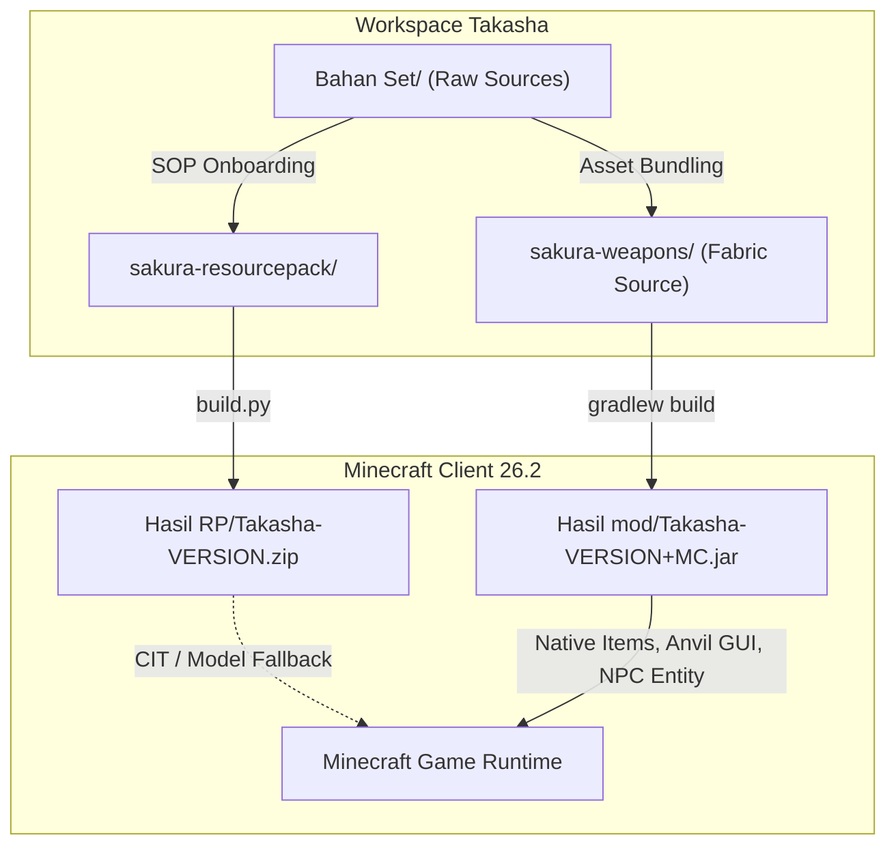
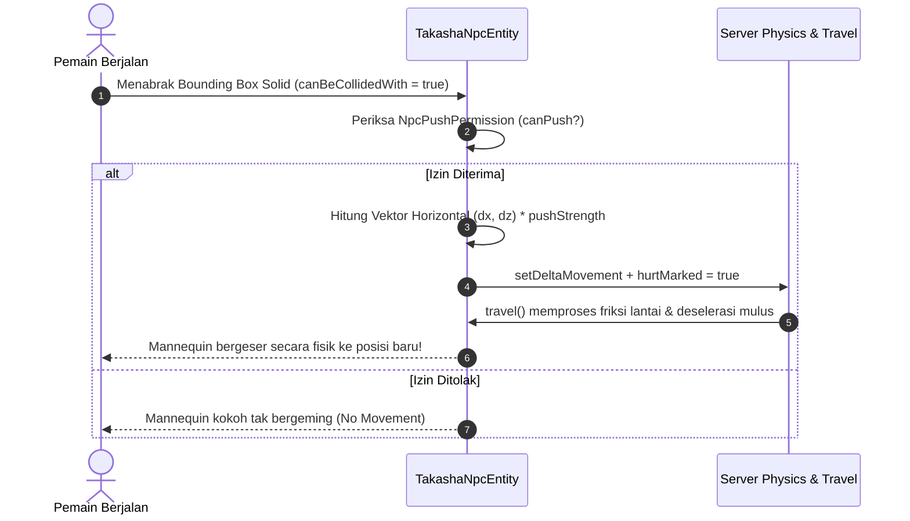
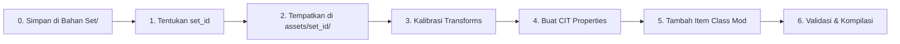

# Takasha — Multi-Set Weapons, Armor & Cinematic Mannequin NPC

<p align="center">
  
</p>

<p align="center">
  <b>Ekosistem Senjata Animasi 3D, Set Zirah Multi-Tema, Sistem Anvil Cerdas, dan Manekin NPC Sinematik untuk Minecraft Java Edition.</b>
</p>

<p align="center">
  
  
  
  
  
  
</p>

---

## 📑 Daftar Isi

- [1. Ringkasan Proyek & Arsitektur Dual-System](#1-ringkasan-proyek--arsitektur-dual-system)
- [2. Katalog 4 Set Senjata & Zirah Tematik](#2-katalog-4-set-senjata--zirah-tematik)
  - [2.1 Set #1: Sakura Animated Weapon Set (`sakura`)](#21-set-1-sakura-animated-weapon-set-sakura)
  - [2.2 Set #2: Pink Legacy Set (`pink_legacy`)](#22-set-2-pink-legacy-set-pink_legacy)
  - [2.3 Set #3: Valentines Set (`valentine`)](#23-set-3-valentines-set-valentine)
  - [2.4 Set #4: Dragon Mecha Overlord (`dragon_mecha_overlord`)](#24-set-4-dragon-mecha-overlord-dragon_mecha_overlord)
  - [2.5 Matriks Penamaan, Simbol & Format Anvil](#25-matriks-penamaan-simbol--format-anvil)
- [3. Sistem Antarmuka Anvil Kustom (5-Tab Rename Guide)](#3-sistem-antarmuka-anvil-kustom-5-tab-rename-guide)
- [4. Entitas Manekin Sinematik Takasha (Takasha NPC System)](#4-entitas-manekin-sinematik-takasha-takasha-npc-system)
  - [4.1 Posing Engine & Katalog 32 Preset Pose](#41-posing-engine--katalog-32-preset-pose)
  - [4.2 Artikulasi Sendi & Layer Luar (Bendable Cuboids)](#42-artikulasi-sendi--layer-luar-bendable-cuboids)
  - [4.3 Dynamic Skin Loader Asinkron & Keamanan SSRF](#43-dynamic-skin-loader-asinkron--keamanan-ssrf)
  - [4.4 Integrasi Emotecraft & Mesin Emote Prosedural](#44-integrasi-emotecraft--mesin-emote-prosedural)
  - [4.5 Overhaul Fisika Dorongan & Tabrakan (v2.1.1)](#45-overhaul-fisika-dorongan--tabrakan-v211)
  - [4.6 Proteksi Dedicated Server & Sistem Kepemilikan](#46-proteksi-dedicated-server--sistem-kepemilikan)
- [5. Kompatibilitas Sinematik ReplayMod & Flashback](#5-kompatibilitas-sinematik-replaymod--flashback)
- [6. Fitur Kosmetik & Utilitas Tambahan](#6-fitur-kosmetik--utilitas-tambahan)
- [7. Standarisasi Tekstur Zirah (Zero-Overlap Matrix)](#7-standarisasi-tekstur-zirah-zero-overlap-matrix)
- [8. Struktur Direktori Workspace](#8-struktur-direktori-workspace)
- [9. Panduan Penggunaan & Instalasi (Pemain)](#9-panduan-penggunaan--instalasi-pemain)
- [10. Panduan Pengembang & Build (Developer)](#10-panduan-pengembang--build-developer)
- [11. Prosedur Penambahan Set Baru (SOP)](#11-prosedur-penambahan-set-baru-sop)
- [12. Troubleshooting & FAQ](#12-troubleshooting--faq)
- [13. Riwayat Rilis & Semantic Versioning](#13-riwayat-rilis--semantic-versioning)

---

## 1. Ringkasan Proyek & Arsitektur Dual-System

**Takasha** adalah proyek kustomisasi tingkat tinggi untuk Minecraft Java Edition yang menggabungkan keindahan estetika visual dengan rekayasa perangkat lunak modern. Proyek ini mengimplementasikan **Arsitektur Dual-System**:



### Pilar Utama Proyek:
1. **Fabric Mod (`sakura-weapons` -> `Hasil mod/Takasha-2.1.1+26.2.jar`):**
   - Berjalan pada **Minecraft 26.2** menggunakan **Java 25 LTS** dengan lingkungan resmi Mojang *unobfuscated* (tanpa lapisan mapping intermediary usang).
   - Mendaftarkan **84+ item senjata, peralatan, dan zirah asli (native items)** dalam Creative Tab kustom.
   - Menyertakan **Anvil Side-List Widget** (5 tab responsif dengan filter konteks otomatis).
   - Menyediakan **Takasha Mannequin NPC Entity** dengan 32 preset pose, live 3D preview, dynamic skin URL loader, integrasi Emotecraft, studio ReplayMod/Flashback, serta sistem fisika dorongan penuh (*push physics* v2.1.1).
   - Membundel seluruh aset model 3D langsung di dalam JAR (*Zero-CIT Vanilla Renaming*).

2. **Resource Pack Standar (`sakura-resourcepack` -> `Hasil RP/Takasha-{VERSION}.zip`):**
   - Menyediakan definisi model kustom murni vanilla 26.2 (`assets/minecraft/items/*.json`) berbasis komponen `minecraft:custom_name`.
   - Kompatibel dengan mod CIT pihak ketiga (**CIT Resewn** & **OptiFine CIT**).
   - Berisi tekstur HD 128x64 dengan kalibrasi *Zero-Overlap Matrix* untuk menghilangkan *z-fighting*.

---

## 2. Katalog 4 Set Senjata & Zirah Tematik

Proyek ini telah menuntaskan implementasi **4 set senjata & zirah lengkap** dari sumber Blockbench resolusi tinggi:

```
Bahan Set/
├── elitecreatures_sakura_animated_weapon_set/               -> [Set 1: sakura]
├── elitecreatures-pink_legacy_animated_weapon_set/          -> [Set 2: pink_legacy]
├── elitecreatures-valentines_animated_weapon_and_tool_set_v1/ -> [Set 3: valentine]
└── Dragon Mecha Overlord/                                   -> [Set 4: dragon_mecha_overlord]
```

---

### 2.1 Set #1: Sakura Animated Weapon Set (`sakura`)
* **Tema Visual:** Keanggunan musim semi Jepang, kayu hitam berukir, jimat emas, kelopak sakura berguguran, dan bilah bercahaya pink lembut.
* **Simbol Identitas:** `🌸` (Cherry Blossom)
* **Kode Warna:** `§d§l` (Light Purple / Pink Bold)
* **Total Item & Model:** 20 Item Native, 25 Model 3D Blockbench, 2 Tekstur Animasi `.mcmeta`.
* **Daftar Senjata & Perlengkapan:**
  - **Melee:** Sakura Sword, Sakura Katana, Sakura Big Sword, Sakura Dagger, Sakura Spear, Sakura Halberd, Sakura Club, Sakura Mace, Sakura Hammer, Sakura Gauntlet.
  - **Ranged & Defense:** Sakura Bow, Sakura Shield, Sakura Fishing Rod.
  - **Tools:** Sakura Pickaxe, Sakura Axe, Sakura Shovel, Sakura Hoe.
  - **Kosmetik & Aksesori:**
    - `Sakura Hat`: Topi jerami pengelana 3D bertabur kelopak sakura (dirender di kepala dengan supresi helm vanilla).
    - `Sakura Wing`: Ornamen cabang bunga sakura di punggung (mendukung `elytra` & `paper`).
    - `Sakura Key`: Kunci kuil kayu sakura bertali merah.

---

### 2.2 Set #2: Pink Legacy Set (`pink_legacy`)
* **Tema Visual:** Neo-Tech Mecha-Fantasy, kristal energi neon magenta, aura partikel futuristik bertenaga tinggi.
* **Simbol Identitas:** `✨` (Sparkles / Energy Sparks)
* **Kode Warna:** `§d§l` (Neon Pink Bold)
* **Total Item & Model:** 19 Item Native, 20 Model 3D + 4 Piece Zirah HD.
* **Daftar Senjata & Perlengkapan:**
  - **Melee:** Pink Legacy Sword, Pink Legacy Battle Axe, Pink Legacy Spear, Pink Legacy Halberd, Pink Legacy Hammer, Pink Legacy Staff.
  - **Ranged & Defense:** Pink Legacy Bow, Pink Legacy Shield, Pink Legacy Fishing Rod.
  - **Tools:** Pink Legacy Pickaxe, Pink Legacy Axe, Pink Legacy Shovel, Pink Legacy Hoe.
  - **Full Armor Set (4 Pieces):** Helmet, Chestplate, Leggings, Boots (Tekstur HD 128x64 dengan zero-overlap).
  - **Kosmetik & Aksesori:** Pink Legacy Wings (sayap energi bersudut tajam), Pink Legacy Key.

---

### 2.3 Set #3: Valentines Set (`valentine`)
* **Tema Visual:** Cupid Romance, kristal hati crimson, ornamen cinta berputar (`heartrotate`), lensa kamera futuristik (`cameralens1`), dan baterai energi cinta.
* **Simbol Identitas:** `❤` (Romantic Heart)
* **Kode Warna:** `§c§l` (Crimson / Valentine Red Bold)
* **Total Item & Model:** 20 Item Native, 27 Model 3D + 4 Piece Zirah HD, 8 File Animasi `.mcmeta`.
* **Daftar Senjata & Perlengkapan:**
  - **Melee & Magic:** Valentine Sword, Valentine Axe, Valentine Hammer, Valentine Spear, Valentine Staff.
  - **Ranged & Defense:** Valentine Bow (3 tahap penarikan), Valentine Crossbow (5 tahap charging), Valentine Shield, Valentine Fishing Rod.
  - **Tools:** Valentine Pickaxe, Valentine Shovel, Valentine Hoe.
  - **Full Armor Set (4 Pieces):** Helmet, Chestplate, Leggings, Boots.
  - **Kosmetik & Utilitas Khusus:**
    - `Valentine Hat`: Kacamata hati 3D dengan tiara permata.
    - `Valentine Wing`: Sayap malaikat hati beraura crimson (mendukung kata kunci tunggal `Valentine Wing` & jamak `Valentine Wings`).
    - `Valentine Key`: Kunci hati cupid bertatahkan emas.
    - `Valentine Grenade`: Granat tangan proyektil hati.

---

### 2.4 Set #4: Dragon Mecha Overlord (`dragon_mecha_overlord`)
* **Tema Visual:** Cybernetic Dragonic Overlord, paduan logam emas kekaisaran (`Gold`), karbon hitam pekat, dan bilah laser plasma hijau asam (`Acid Lime / Neon Green`).
* **Simbol Identitas:** `🐲` (Dragon Face)
* **Kode Warna:** `§6§l` (Gold Bold)
* **Total Item & Model:** 25 Item Native, 29 Model 3D + 4 Piece Zirah HD.
* **Daftar Senjata & Perlengkapan:**
  - **Melee & Senjata Berat:** Dragon Mecha Overlord Sword, Great Sword, Rapier Sword, Dagger, Spear, Staff, Scythe (Sabit Pembasmi), Hammer (Palu Naga Raksasa), Trident (Trisula Naga Plasma).
  - **Ranged & Defense:** Dragon Mecha Overlord Bow, Crossbow, Shield, Fishing Rod.
  - **Tools:** Dragon Mecha Overlord Pickaxe, Axe, Shovel, Hoe.
  - **Full Armor Set (4 Pieces):** Helmet (Tanduk Naga Mecha), Chestplate (Reaktor Dada Naga), Leggings, Boots.
  - **Kosmetik & Aksesori:**
    - `Dragon Mecha Overlord Hat`: Mahkota tanduk mecha 3D.
    - `Dragon Mecha Overlord Wing` & `Wing 1`: Sayap naga mecha berkibar plasma ganda.
    - `Dragon Mecha Overlord Key`: Kunci inti reaktor naga.

---

### 2.5 Matriks Penamaan, Simbol & Format Anvil

Setiap item mendukung dua metode pemberian nama saat di-rename di Anvil:
1. **Format Teks CIT Normal (Klik Kiri):** String teks baku tanpa kode warna (contoh: `Sakura Katana`).
2. **Format Simbol Vanilla Berwarna (Shift + Klik Kiri):** Format resmi menggunakan kode warna Minecraft bawaan (`§`) dan emoji khas yang dijamin **tidak melebihi batas 50 karakter Anvil**:

| Set ID | Nama Set | Tema Visual | Kode Warna | Simbol | Contoh Format Shift+Klik Anvil (Maksimal 50 Karakter) |
|:---|:---|:---|:---|:---|:---|
| **`sakura`** | Sakura | Musim Semi Jepang | `§d§l` (Pink) | `🌸` | `§d§l🌸 Sakura Katana 🌸` *(25 char)* |
| **`pink_legacy`** | Pink Legacy | Neo-Tech Mecha | `§d§l` (Neon Pink) | `✨` | `§d§l✨ Pink Legacy Spear ✨` *(29 char)* |
| **`valentine`** | Valentine | Cupid Crimson Love | `§c§l` (Crimson) | `❤` | `§c§l❤ Valentine Staff ❤` *(26 char)* |
| **`dragon_mecha_overlord`**| Dragon Overlord | Draconic Cyberpunk | `§6§l` (Gold) | `🐲` | `§6§l🐲 Dragon Mecha Overlord Sword 🐲` *(40 char)* |

---

## 3. Sistem Antarmuka Anvil Kustom (5-Tab Rename Guide)

Di dalam game, pemain tidak perlu menghafal nama file CIT atau format sintaks yang rumit. Saat membuka antarmuka Anvil vanilla, Takasha menyematkan panel katalog interaktif di sisi kanan layar:

<p align="center">
  
</p>

### Fitur Unggulan Anvil Side-List Widget:
* **5 Tab Kategori Terintegrasi:**
  - `[All]`: Menampilkan seluruh 84+ item dari semua set.
  - `[Sakura]`: Filter khusus set Sakura.
  - `[Pink]`: Filter khusus set Pink Legacy.
  - `[Valentine]`: Filter khusus set Valentine.
  - `[Dragon]`: Filter khusus set Dragon Mecha Overlord.
* **Smart Context Filter (Penyaringan Cerdas Input Slot 0):**
  - Ketika pemain memasukkan item tertentu ke slot kiri Anvil, katalog secara otomatis menyaring item yang kompatibel:
    - Masukkan **Diamond/Netherite Sword** -> Hanya menampilkan Pedang, Katana, Rapier, Dagger, Scythe.
    - Masukkan **Pickaxe** -> Hanya menampilkan Pickaxe (bebas dari tabrakan substring Axe/Hammer).
    - Masukkan **Elytra / Paper** -> Hanya menampilkan Sayap (Wings).
    - Masukkan **Shield** -> Hanya menampilkan Perisai.
* **Live Item Preview:** Setiap baris dilengkapi icon 16x16 resmi dari item Minecraft.
* **Auto-Fill & Clipboard Sync:**
  - **Klik Kiri:** Mengisi kotak rename Anvil dengan nama CIT standar (contoh: `Dragon Mecha Overlord Scythe`) dan menyalin ke clipboard.
  - **Shift + Klik Kiri:** Mengisi kotak rename dengan format emoji berwarna (contoh: `§6§l🐲 Dragon Mecha Overlord Scythe 🐲`).
* **Scissor Viewport Clipping:** Daftar item discroll mulus menggunakan mouse wheel tanpa tembus atau menimpa header tab.

---

## 4. Entitas Manekin Sinematik Takasha (Takasha NPC System)

Mod Takasha menyediakan entitas pajangan dan sinematik khusus berbasis humanoid: **Takasha Mannequin NPC** (`net.sakura.weapons.entity.TakashaNpcEntity`).

Entitas ini didesain sebagai pengganti Armor Stand vanilla yang jauh lebih canggih, ekspresif, dan ramah sinematografi.

```
Spawner Item: Takasha Mannequin Wand (Creative Tab Sakura Arsenal)
Akses GUI:   Shift + Klik Kanan pada Mannequin (Tangan Kosong / Wand)
Quick Equip: Klik Kanan langsung membawa senjata/zirah di tangan
```

---

### 4.1 Posing Engine & Katalog 32 Preset Pose

Manekin dilengkapi sistem posing multi-axis dengan **32 preset pose terstruktur** yang dapat diganti seketika melalui GUI:

```
Tab GUI Pose:
├── 🛌 Tiduran & Rebahan (Presets 1–7)
│   ├── 1. Tidur Terlentang Kasur (Offset Kasur Y+0.5625)
│   ├── 2. Tidur Tengkurap (Prone)
│   ├── 3. Tidur Miring Kanan
│   ├── 4. Tidur Miring Kiri
│   ├── 5. Rebahan Santai / Stargazing
│   ├── 6. Tidur Memeluk Senjata
│   └── 7. Terkapar Pingsan / Battlefield KO
│
├── 🧘 Duduk & Bersimpuh (Presets 8–14)
│   ├── 8. Duduk di Kursi Santai
│   ├── 9. Duduk Bersandar di Lantai (Floor Leaning)
│   ├── 10. Duduk Bersila / Lotus
│   ├── 11. Meditasi Hening
│   ├── 12. Jongkok Siaga (Crouching Sentry)
│   ├── 13. Berlutut Ksatria (One-Knee)
│   └── 14. Bersimpuh Seiza Jepang
│
├── ⚔ Kuda-kuda Tempur & Senjata (Presets 15–24)
│   ├── 15. Siaga Berdiri (Standing Guard)
│   ├── 16. Siap Bertarung (Combat Stance)
│   ├── 17. Iaido Katana Draw (Cabut Katana Kilat)
│   ├── 18. Senjata Ganda (Dual Wield Akimbo)
│   ├── 19. Membidik Busur (Bow Aiming)
│   ├── 20. Kuda-kuda Tombak (Spear Thrust)
│   ├── 21. Mengangkat Palu Godam (Great Hammer Hold)
│   ├── 22. Memasang Perisai (Shield Defense)
│   ├── 23. Tusukan Cepat (Dagger / Rapier Thrust)
│   └── 24. Tebasan Melompat (Overhead Slash)
│
└── 🎭 Gestur & Emote Statis (Presets 25–32)
    ├── 25. Bersedekap Dada (Arms Crossed)
    ├── 26. Hormat Ksatria (Knight's Salute)
    ├── 27. Membungkuk Sopan (Ojigi Japanese Bow)
    ├── 28. Menunjuk Tegas (Heroic Pointing)
    ├── 29. Melambai Ramah (Friendly Wave)
    ├── 30. Menangis Terisak (Weeping / Grief)
    ├── 31. Facepalm (Embarrassed)
    └── 32. Berpikir Keras (Deep Thinking)
```

---

### 4.2 Artikulasi Sendi & Layer Luar (Bendable Cuboids)
* **Bendable Cuboids:** Model mannequin mendukung tekukan sendi anatomis pada siku dan lutut, sehingga pose duduk bersila, seiza, dan tidur terlihat luwes seperti manusia asli.
* **Outer-Skin Synchronizer (`copyModelPartPose`):** Seluruh lapisan pakaian terluar pemain (`hat`, `jacket`, `leftSleeve`, `rightSleeve`, `leftPants`, `rightPants`) disinkronkan secara presisi dengan kubus inti, mencegah masalah pakaian/rambut melayang atau tertinggal saat berpose.

---

### 4.3 Dynamic Skin Loader Asinkron & Keamanan SSRF
* **Input URL Bebas / Nama Pemain:** Pemain dapat memasukkan URL langsung gambar PNG (`https://...` dari Imgur, Catbox, Discord, NameMC) atau nama pemain Minecraft.
* **Pemuatan Asinkron Bebas Lag:** Unduhan diproses di thread terpisah (`java.net.http.HttpClient` Java 25) sehingga tidak menyebabkan frame drop.
* **SSRF & Security Guard:** Server game **tidak pernah mengunduh file biner gambar**. Server hanya menyimpan metadata URL/hash. Setiap client mengunduh skin ke direktori cache lokal (`.minecraft/takasha_cache/skins/`), melindungi dedicated server 100% dari celah keamanan jaringan lokal.
* **Deteksi Model Lengan:** Mendukung pendeteksian otomatis lengan Classic (Steve 4px) dan Slim (Alex 3px).

---

### 4.4 Integrasi Emotecraft & Mesin Emote Prosedural
* **Jembatan Emotecraft Aman:** Jika mod **Emotecraft** terpasang, Takasha secara otomatis mendeteksi seluruh emote yang dimiliki pemain beserta ikon 12x12 resminya.
* **Mode Pemutaran Fleksibel:** Mendukung 3 mode pemutaran (`🔁 Loop`, `⏸ Tahan / Freeze`, `▶ Sekali / Play Once`).
* **Fitur "📌 Bekukan ke Pose" (Bake Emote to Static Pose):** Pemain dapat membekukan frame animasi aktif menjadi sudut pose permanen yang disimpan ke `SynchedEntityData`.
* **Animasi Prosedural Bawaan (Native Fallback):** Jika Emotecraft tidak terpasang, manekin tetap dapat menjalankan animasi hidup prosedural: `wave` (melambai), `clap` (tepuk tangan), `cheer` (sorak), `dance` (menari), dan `salute` (hormat).

---

### 4.5 Overhaul Fisika Dorongan & Tabrakan (v2.1.1)

Pada rilis **v2.1.1+26.2**, Takasha merombak total sistem fisika dorongan agar manekin dapat dipindahkan dan didorong oleh pemain di server dengan rasa fisik yang solid:



#### Spesifikasi Teknis Fisika v2.1.1:
1. **Dynamic Gravity & Server AI Simulation:**
   - Meng-override `isEffectiveAi()` untuk mengembalikan `isPushableMode() && super.isEffectiveAi()`.
   - Saat dorongan aktif, server memproses simulasi `travel(travelVector)` dan deselerasi friksi tanah secara mulus.
   - Saat dorongan nonaktif, NPC terkunci 100% tanpa beban komputasi CPU (*Zero CPU overhead*).
2. **Solid Bounding Box Collision:**
   - Meng-override `canBeCollidedWith(Entity)` mengembalikan `isPushable()`, memungkinkan interaksi tabrakan fisik pemain.
3. **Slider Kekuatan Dorong Dinamis:**
   - Dapat diatur dari `0.05x` (sangat berat/lembut) hingga `1.0x` (mudah bergeser), nilai default: `0.35x`.
4. **Sistem Perizinan Bertingkat (`NpcPushPermission`):**
   - `OWNER_ONLY`: Hanya pemilik yang dapat mendorong.
   - `TEAM_WHITELIST`: Pemilik dan anggota tim/whitelist.
   - `EVERYONE`: Seluruh pemain di server (nilai bawaan ramah pengguna).
   - `OP_ONLY`: Khusus Operator / Admin server.
   - *Catatan:* Manekin yang belum diklaim (*unclaimed NPC*) dapat didorong bebas oleh siapa saja.
5. **Origin Anchor System:**
   - Tombol `[⏪ Reset Posisi ke Asal]`: Mengembalikan manekin seketika ke koordinat awal penempatan menggunakan `snapTo()` tanpa desinkronisasi.
   - Tombol `[📌 Kunci Posisi Baru]`: Menetapkan koordinat saat ini sebagai titik origin baru.

---

### 4.6 Proteksi Dedicated Server & Sistem Kepemilikan
* **Pemisahan Logika Sisi Keras (Strict Side Separation):** Seluruh kelas OpenGL, GUI, dan skin loader diisolasi di modul client (`@Environment(EnvType.CLIENT)`). Dedicated server dijamin 100% bebas crash `NoClassDefFoundError`.
* **Single-Editor Session Lock:** Mencegah dua pemain mengedit manekin yang sama secara simultan untuk menghindari duplikasi item. Kunci otomatis dilepas jika pemain terputus (*disconnect*) atau bergerak $> 8$ blok.
* **Perlindungan Wilayah (WorldGuard / GriefPrevention Compat):** Spawner Wand memeriksa izin pembangunan (`player.mayBuild()`). Pemain tidak dapat memunculkan manekin di area klaim pemain lain.
* **Kebal & Pengambilan Aman (Safe Dismantle):** Manekin berstatus `invulnerable` (kebal dari ledakan TNT/Creeper, lahar, dan serangan pemain). Pemilik dapat mengambil kembali manekin dengan *Shift + Klik Kanan Takasha Wand* atau tombol "Hapus / Ambil Kembali" pada GUI tanpa risiko kehilangan item zirah/senjata.

---

## 5. Kompatibilitas Sinematik ReplayMod & Flashback

Takasha didesain dari awal untuk pembuat film sinematik dan kreator konten Minecraft:

### 1. ReplayMod Zero-Desync Protocol
* Seluruh 32 preset pose, rotasi Euler kepala/tangan/kaki, dan status tidur kasur disimpan di dalam `SynchedEntityData` dan direkam ke paket `.mcpr`.
* **Continuous Timeline Time Provider (`npcState.animTime`):** Saat ReplayMod di-pause (`gameTime == 0`) atau di-scrub, animasi emote dan hembusan nafas prosedural tetap terputar mulus di layar preview timeline.
* **Penyimpanan Tekstur Permanen:** Tekstur tersimpan di `.minecraft/takasha_cache/skins/`, sehingga skin NPC tetap tampil sempurna meski komputer offline saat proses rendering video.

### 2. Studio Rekonfigurasi Timeline (`TakashaReplayOverrideScreen`)
* Tekan tombol pintas **`P`** kapan saja di dalam replay viewer atau dunia untuk membuka Studio Replay.
* Memungkinkan kreator mengubah pose preset (1..32), memilih emote Emotecraft, atau mengganti mode loop secara instan tanpa perlu merekam ulang adegan gameplay!
* Override disimpan ke `.minecraft/sakura_replay_overrides/active_replay_overrides.json`.

### 3. Integrasi Khusus Flashback Replay (`FlashbackSakuraPanel`)
* Pada mod replay **Flashback**, Takasha secara otomatis menyematkan kontrol ImGui langsung pada menu klik entitas (`SelectedEntityPopup`):
  - Mengatur siklus pose preset `<` / `>` (0..32).
  - Mengatur mode pemutaran emote.
  - Tombol pintas `[Buka Studio Sakura (Lengkap)]`.

---

## 6. Fitur Kosmetik & Utilitas Tambahan

### 1. Item Frame Perspektif Pemain & Invisibility Toggle
* **Orientasi Cerdas Otomatis:**
  - Saat ditaruh di **Dinding**: Otomatis tegak lurus vertikal (gagang di atas, bilah di bawah).
  - Saat ditaruh di **Lantai**: Otomatis menghadap searah pandangan mata pemain yang meletakkannya.
  - Saat ditaruh di **Langit-langit**: Otomatis menghadap ke arah hadap pemain saat mendongak.
* **Toggle Transparan (Hide / Unhide):**
  - **Shift + Klik Kanan dengan Tangan Kosong** pada Item Frame yang berisi item untuk menyembunyikan atau menampilkan bingkai kayu/batu.
  - Efek suara rotasi dan notifikasi ActionBar bilingual.

### 2. Topi 3D & Supresi Helm Vanilla
* Saat item topi 3D (`Sakura Hat`, `Valentine Hat`, `Dragon Mecha Overlord Hat`) dikenakan di slot kepala:
  - Tekstur kubus helm vanilla secara dinamis ditekan (tidak dirender).
  - Model 3D Blockbench dirender megah melalui `SakuraHatFeatureRenderer` pada kepala pemain atau manekin.

### 3. Sayap 3D & Kompatibilitas Elytra
* Sayap Takasha (`Sakura Wing`, `Pink Legacy Wings`, `Valentine Wing`, `Dragon Mecha Overlord Wing`) mendukung item dasar `elytra` dan `paper`.
* Dirender di punggung melalui `SakuraWingsFeatureRenderer` tanpa merusak animasi terbang Elytra.

### 4. Toggle Nametag Klien (`/takasha nametag`)
* Perintah mandiri sisi klien untuk pemain biasa di server multiplayer:
  - `/takasha nametag off` — Menyembunyikan nama di atas kepala seluruh pemain untuk tangkapan layar bersih.
  - `/takasha nametag on` — Menampilkan kembali nametag pemain.
  - `/takasha nametag status` — Menampilkan status aktif nametag saat ini.

---

## 7. Standarisasi Tekstur Zirah (Zero-Overlap Matrix)

Untuk mengeliminasi cacat visual seperti *z-fighting*, lapisan membengkak (*mesh bloat*), dan leher bolong pada seluruh set zirah, Takasha menetapkan partisi UV matematis mutlak pada resolusi HD **128x64**:

| Anatomi | Koordinat UV `[X0, Y0, X1, Y1]` | Layer Alokasi | Aturan Khusus & Zona Terlarang |
|:---|:---|:---|:---|
| **Helm: Kepala Dasar** | `[0, 0, 64, 32]` | **Layer 1** (1.0F) | Sisi belakang (`[48, 16, 64, 28]`) wajib solid tertutup (anti-leher bolong). |
| **Helm: Eye Visor Clearance** | `[18, 22, 30, 25]` | **Layer 1** (1.0F) | Baris dahi pelindung mata transparan agar mata karakter pemain terlihat jelas. |
| **Helm: Hat Layer Terlarang** | `[64, 0, 128, 32]` | **Layer 1** (1.0F) | 🚫 **WAJIB 0 PIXEL:** Menghilangkan kubus helm raksasa (dilatasi 1.5F). |
| **Baju Zirah: Torso & Dada** | `[32, 32, 80, 54]` | **Layer 1** (1.0F) | Eksklusif menangani dada, leher, dan punggung atas (Y=32..53). |
| **Baju Zirah: Zona Sabuk Terlarang**| `[32, 54, 80, 64]` | **Layer 1** (1.0F) | 🚫 **WAJIB 0 PIXEL:** Baris Y=54..63 transparan agar tidak menimpa sabuk. |
| **Baju Zirah: Kedua Lengan** | `[80, 32, 112, 64]` | **Layer 1** (1.0F) | Eksklusif pundak dan kedua lengan tangan. |
| **Sepatu: Kaki Bawah & Sol** | `[0, 54, 32, 64]` | **Layer 1** (1.0F) | Eksklusif betis bawah, tumit, dan sol sepatu (Y=54..63). |
| **Sepatu: Zona Paha Terlarang** | `[0, 32, 32, 54]` | **Layer 1** (1.0F) | 🚫 **WAJIB 0 PIXEL:** Baris Y=32..53 transparan agar tidak menelan celana paha. |
| **Celana: Sabuk, Pinggul & Pelvis** | `[32, 54, 80, 64]` | **Layer 2** (0.5F) | Eksklusif menangani sabuk dan pelvis pinggul (Y=54..63). |
| **Celana: Zona Torso Terlarang** | `[32, 32, 80, 54]` | **Layer 2** (0.5F) | 🚫 **WAJIB 0 PIXEL:** Celana tidak boleh memiliki baju zirah dada ganda. |
| **Celana: Paha & Lutut** | `[0, 32, 32, 54]` | **Layer 2** (0.5F) | Eksklusif kain paha dan pelindung lutut (Y=32..53). |
| **Celana: Zona Sepatu Terlarang** | `[0, 54, 32, 64]` | **Layer 2** (0.5F) | 🚫 **WAJIB 0 PIXEL:** Celana tidak boleh menembus telapak sepatu boots. |

---

## 8. Struktur Direktori Workspace

Workspace proyek disusun secara modular dan terorganisir rapi:

```
d:\Mod Minecraft\weapon set\sakura\
├── PRD.md                                   <- Dokumen Spesifikasi Produk Utama
├── README.md                                <- Panduan Komprehensif Proyek Ini
├── VERSION                                  <- Single Source of Truth SemVer (2.1.1)
├── build.py                                 <- Script Pembuat Resource Pack ZIP
├── create_side_list.py                      <- Script Pembuat Tekstur Fallback Anvil RP
├── validate_cit_and_items.py                <- Validator Sintaks CIT & Model Items
│
├── Bahan Set/                               <- Penyimpanan Master Model Baku (Read-Only)
│   ├── elitecreatures_sakura_animated_weapon_set/
│   ├── elitecreatures-pink_legacy_animated_weapon_set/
│   ├── elitecreatures-valentines_animated_weapon_and_tool_set_v1/
│   └── Dragon Mecha Overlord/
│
├── Hasil RP/                                <- Arsip Distribusi Resource Pack ZIP
│   ├── Takasha-1.0.0.zip
│   ├── ...
│   └── Takasha-1.6.0.zip
│
├── Hasil mod/                               <- Hasil Kompilasi Mod Fabric JAR Siap Pakai
│   ├── Takasha-1.7.0+26.2.jar
│   ├── Takasha-2.0.0+26.2.jar
│   ├── Takasha-2.1.0+26.2.jar
│   └── Takasha-2.1.1+26.2.jar               <- RILIS PRODUKSI TERKINI
│
├── sakura-resourcepack/                     <- Master Resource Pack (Aset & CIT)
│   ├── pack.mcmeta
│   ├── pack.png
│   └── assets/
│       ├── sakura/                          # Model & Tekstur Set Sakura
│       ├── pink_legacy/                     # Model & Tekstur Set Pink Legacy
│       ├── valentine/                       # Model & Tekstur Set Valentine
│       ├── dragon_mecha_overlord/           # Model & Tekstur Set Dragon
│       └── minecraft/
│           ├── citresewn/cit/               # Properti CIT Resewn
│           ├── optifine/cit/                # Properti OptiFine CIT
│           └── items/                       # Vanilla Item Definitions (1.21.5+/26.2)
│
├── sakura-weapons/                          <- Master Source Code Mod Fabric
│   ├── build.gradle                         # Konfigurasi Gradle & Loom Unobfuscated
│   ├── gradle.properties                    # Versi MC 26.2 & Fabric Loader
│   ├── gradlew.bat                          # Gradle Wrapper Windows
│   └── src/main/
│       ├── java/net/sakura/weapons/
│       │   ├── SakuraWeaponsMod.java        # Main Mod Initializer
│       │   ├── SakuraWeaponsClient.java     # Client Mod Initializer
│       │   ├── entity/                      # TakashaNpcEntity & Pushing Physics
│       │   ├── registry/                    # Registrasi Item 4 Set Lengkap
│       │   ├── client/gui/                  # Anvil Widget & TakashaNpcScreen
│       │   ├── client/render/               # Hat/Wings Feature Renderers
│       │   └── mixin/                       # AnvilMenu & Armor Layer Mixins
│       └── resources/
│           ├── fabric.mod.json              # Mod Metadata (v2.1.1+26.2)
│           └── assets/                      # Model 3D Bundled (Zero-CIT Standalone)
│
└── scripts/                                 <- Skrip Verifikasi & Utilitas CI
    ├── validate_armor_layers.py             # Validator Zero-Overlap Matrix Zirah
    ├── validate_items.py                    # Validator JSON Predicate Items
    └── fix_armor_textures.py                # Pembersih UV Mask Zirah Otomatis
```

---

## 9. Panduan Penggunaan & Instalasi (Pemain)

### 9.1 Memasang Mod Fabric (Direkomendasikan)
1. **Prasyarat:**
   - Minecraft Java Edition **26.2**.
   - **Fabric Loader** versi `0.19.3` atau lebih baru.
   - **Fabric API** untuk versi 26.2.
   - Java Runtime: **Java 25 LTS**.
2. **Langkah Pemasangan:**
   - Ambil file JAR terbaru dari folder:
     ```
     Hasil mod/Takasha-2.1.1+26.2.jar
     ```
   - Masukkan file tersebut ke dalam folder `.minecraft/mods/` (atau melalui launcher favorit Anda seperti Prism Launcher / Modrinth App).
   - Jalankan game. Seluruh senjata 3D, zirah, dan manekin NPC langsung tersedia di Creative Tab **"Sakura Arsenal"** tanpa memerlukan resource pack tambahan!

### 9.2 Menggunakan Resource Pack Saja (Tanpa Mod)
Jika Anda bermain di server vanilla / Paper dan hanya ingin menggunakan Resource Pack:
1. Ambil file ZIP dari folder `Hasil RP/Takasha-{VERSION}.zip`.
2. Masukkan ke folder `.minecraft/resourcepacks/` dan aktifkan di dalam menu game.
3. Pasang mod **CIT Resewn** atau **OptiFine** untuk mengaktifkan rename CIT pada pedang vanilla.

---

## 10. Panduan Pengembang & Build (Developer)

### 10.1 Prasyarat Lingkungan Pengembangan
- **JDK 25 LTS** (misal: Microsoft OpenJDK 25, Eclipse Temurin 25, atau Zulu 25).
- **Python 3.10+** (untuk menjalankan skrip automasi dan validasi).
- Git (opsional).

### 10.2 Kompilasi Mod Fabric
Buka terminal PowerShell pada direktori `sakura-weapons/` lalu jalankan:

```powershell
# Berpindah ke direktori mod
cd "d:\Mod Minecraft\weapon set\sakura\sakura-weapons"

# Kompilasi bersih proyek
.\gradlew.bat clean build
```

Hasil kompilasi akan otomatis disalin ke:
`d:\Mod Minecraft\weapon set\sakura\Hasil mod\Takasha-2.1.1+26.2.jar`

### 10.3 Membuat Distribusi Resource Pack
Buka terminal pada root project:

```powershell
# Build dengan versi aktif saat ini di file VERSION
python build.py

# Atau build sekaligus menaikkan versi SemVer
python build.py --patch    # e.g. 2.1.1 -> 2.1.2
python build.py --minor    # e.g. 2.1.1 -> 2.2.0
python build.py --major    # e.g. 2.1.1 -> 3.0.0
```

Hasil ZIP akan tersimpan di folder `Hasil RP/`.

### 10.4 Menjalankan Skrip Validasi Kualitas
Sebelum melakukan rilis atau commit kode baru, selalu jalankan skrip audit otomatis:

```powershell
# Validasi matriks zirah (zero-overlap, zero hat-bloat)
python scripts/validate_armor_layers.py

# Validasi seluruh file JSON item definitions & CIT
python scripts/validate_items.py
python validate_cit_and_items.py
```

---

## 11. Prosedur Penambahan Set Baru (SOP)

Untuk menambahkan set senjata ke-5 atau seterusnya, ikuti alur 7 tahap terstandarisasi berikut:



1. **Langkah 0:** Masukkan file mentah ke `Bahan Set/<nama_set_baru>/`.
2. **Langkah 1:** Tentukan identifier huruf kecil unik: `<set_id>` (contoh: `celestial`, `void_walker`). Tentukan simbol emoji dan kode warnanya.
3. **Langkah 2:** Salin model `.json` ke `assets/<set_id>/models/item/` dan tekstur ke `assets/<set_id>/textures/`.
4. **Langkah 3:** Pastikan display transform `fixed` (Item Frame) terkalibrasi $Z = -5.5$, dan `wing` terkalibrasi `"head"` dengan $Y = -15.75, Z = 5.5$.
5. **Langkah 4:** Buat properti CIT di `assets/minecraft/citresewn/cit/<set_id>/` dan `optifine/cit/<set_id>/`.
6. **Langkah 5:** Daftarkan class registry item baru (e.g. `CelestialItems.java`) di `sakura-weapons`, daftarkan di `ModItemGroups.java`, dan tambahkan tab baru di `AnvilSideListWidget.java`.
7. **Langkah 6:** Jalankan `python scripts/validate_armor_layers.py` dan `.\gradlew.bat build`.

---

## 12. Troubleshooting & FAQ

### Q1: Game crash dengan pesan `NoClassDefFoundError: net/minecraft/class_2378`?
> **Penyebab:** Mod dikompilasi dengan mapping Intermediary lama pada runtime Minecraft 26.2 yang sudah unobfuscated.  
> **Solusi:** Pastikan Anda menggunakan versi `Takasha-2.1.0+26.2.jar` atau `Takasha-2.1.1+26.2.jar` terbaru yang menggunakan standard official Mojang mappings.

### Q2: Manekin NPC tidak dapat didorong oleh pemain di server?
> **Penyebab:** Pada versi sebelum v2.1.1, status `isEffectiveAi()` mengembalikan false atau izin pendorong disetel ke `OWNER_ONLY`.  
> **Solusi:** Pasang versi `v2.1.1+26.2`. Buka GUI Mannequin (Shift + Klik Kanan), pilih tab `[⚙ Fisika & Interaksi]`, pastikan toggle **Bisa Didorong: AKTIF**, dan ubah izin ke **Semua Pemain**.

### Q3: Pose manekin berdiri tegak biasa saat timeline ReplayMod di-pause?
> **Penyebab:** Desinkronisasi ticking timeline ReplayMod.  
> **Solusi:** Mod Takasha telah mengimplementasikan `SynchedEntityData-first baseline` dan `npcState.animTime`. Pastikan mod terpasang di client pemutar replay. Tekan tombol **`P`** untuk membuka Sakura Replay Studio dan sesuaikan override langsung pada timeline.

### Q4: Mengapa helm zirah terlihat tebal seperti kubus melayang di luar kepala?
> **Penyebab:** Pelanggaran Hat Layer (dilatasi 1.5F) pada tekstur zirah Layer 1.  
> **Solusi:** Jalankan `python scripts/fix_armor_textures.py` dan pastikan lolos verifikasi `python scripts/validate_armor_layers.py` (0 piksel pada area `[64, 0, 128, 32]`).

---

## 13. Riwayat Rilis & Semantic Versioning

* **v2.1.1+26.2 (Current Active):**
  - Overhaul total sistem fisika dorongan manekin NPC (`isEffectiveAi()`, `travel()`, `canBeCollidedWith`).
  - Slider kekuatan dorong (0.05x–1.0x) dan perizinan dorong bertingkat (`NpcPushPermission`).
  - Origin Anchor reposisi presisi (`snapTo()`).
* **v2.1.0+26.2:**
  - Migrasi penuh ke Minecraft 26.2 Mojang unobfuscated runtime & Java 25 LTS.
  - Onboarding Set #4: **Dragon Mecha Overlord** (25 item native, 4 armor piece, 2 sayap plasma).
  - Modernisasi AnvilSideListWidget ke 5 Tab responsif.
* **v2.0.3+26.2:** Integrasi ImGui Flashback Replay (`FlashbackSakuraPanel`).
* **v2.0.2+26.2:** Penyelarasan outer-skin articulation dan studio timeline ReplayMod (`TakashaReplayOverrideScreen`).
* **v2.0.0+26.2 (Major Milestone):** Entitas Manekin Sinematik Takasha, 32 katalog preset pose, jembatan Emotecraft, Bendable Cuboids, dan ReplayMod Zero-Desync.
* **v1.7.1+26.2:** Orientasi Item Frame perspektif pemain & toggle invisibility transparan.
* **v1.6.4:** Standarisasi tekstur zirah Zero-Overlap Matrix matematis.
* **v1.6.0:** Onboarding Set #3: **Valentine** (20 item native, 8 animasi mcmeta, crossbow state machine).
* **v1.3.1:** Onboarding Set #2: **Pink Legacy** (19 item native, full armor).
* **v1.2.5:** Peluncuran awal Set #1: **Sakura** (20 item native, 25 model 3D Blockbench).

---

## 📄 Lisensi & Kredit

* **Pengembang Mod & Integrasi:** Boma Narakasura
* **Pembuat Aset Model 3D Mentah:** EliteCreatures (Sakura, Pink Legacy, Valentine, Dragon Mecha Overlord Sets)
* **Lisensi Mod:** All Rights Reserved (ARR) untuk distribusi mod Takasha.
