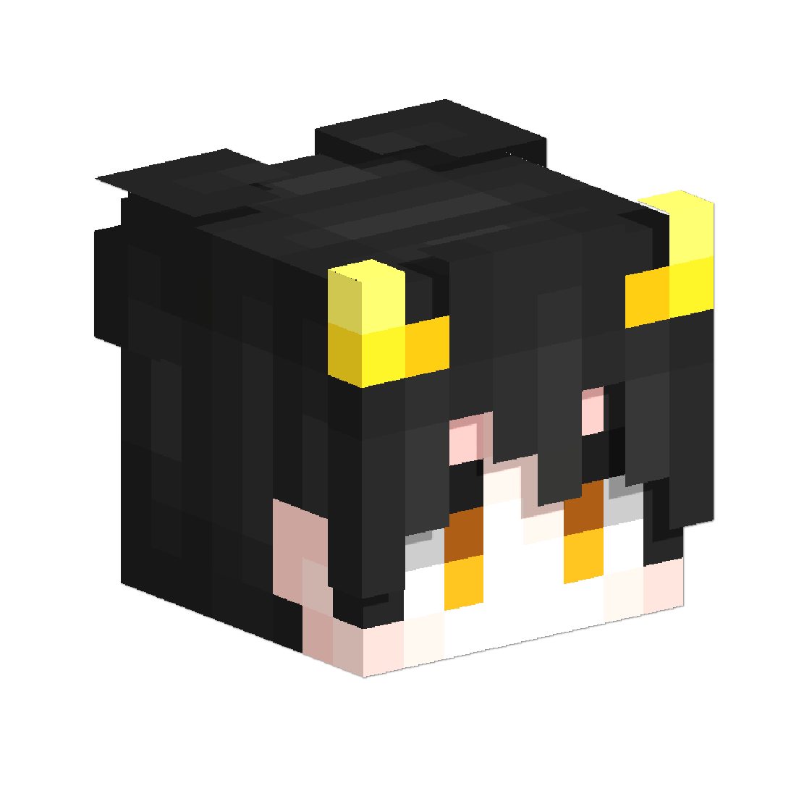
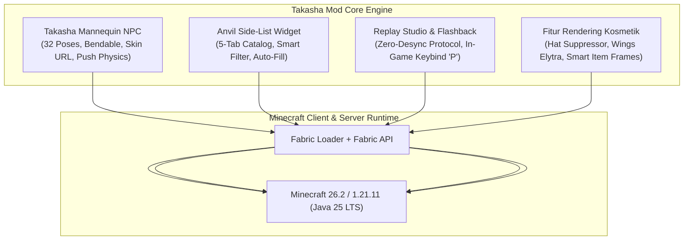
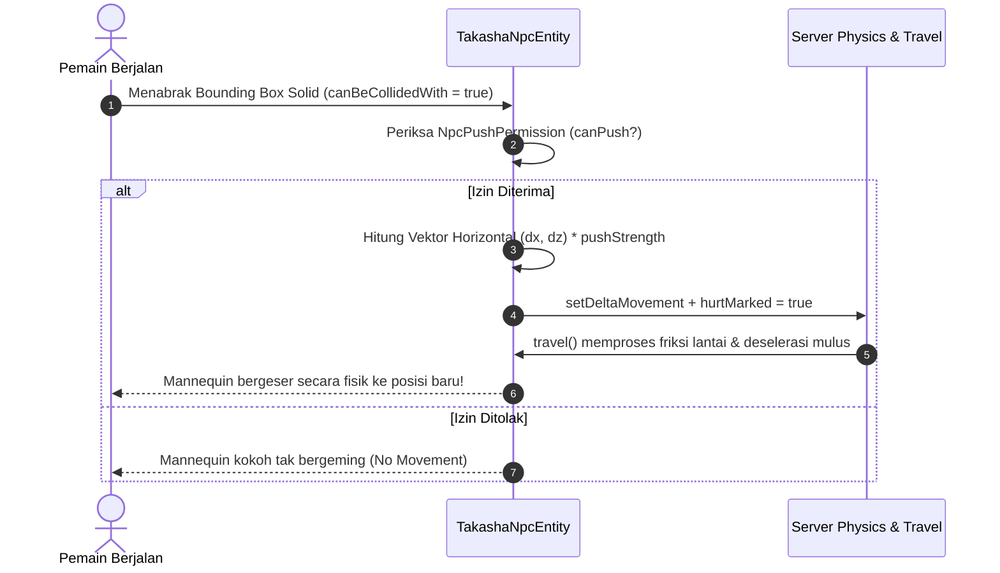
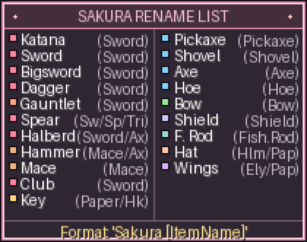

# Takasha — Cinematic Mannequin NPC, Smart Anvil & Equipment Engine

<p align="center">
  
</p>

<p align="center">
  <b>Mod Fabric Tingkat Lanjut untuk Minecraft Java Edition: Sistem Manekin NPC Sinematik, Katalog Anvil Interaktif, Studio Replay, dan Framework Perlengkapan Kustom.</b>
</p>

<p align="center">
  
  
  
  
  
  
</p>

---

## 📑 Daftar Isi

- [1. Ringkasan Proyek & Arsitektur Mod](#1-ringkasan-proyek--arsitektur-mod)
- [2. Entitas Manekin Sinematik Takasha (Takasha NPC System)](#2-entitas-manekin-sinematik-takasha-takasha-npc-system)
  - [2.1 Posing Engine & Katalog 32 Preset Pose](#21-posing-engine--katalog-32-preset-pose)
  - [2.2 Artikulasi Sendi & Layer Luar (Bendable Cuboids)](#22-artikulasi-sendi--layer-luar-bendable-cuboids)
  - [2.3 Dynamic Skin Loader Asinkron & Keamanan SSRF](#23-dynamic-skin-loader-asinkron--keamanan-ssrf)
  - [2.4 Integrasi Emotecraft & Mesin Emote Prosedural](#24-integrasi-emotecraft--mesin-emote-prosedural)
  - [2.5 Overhaul Fisika Dorongan & Tabrakan](#25-overhaul-fisika-dorongan--tabrakan)
  - [2.6 Proteksi Dedicated Server & Sistem Kepemilikan](#26-proteksi-dedicated-server--sistem-kepemilikan)
- [3. Sistem Antarmuka Anvil Kustom (Smart Side-List Catalog)](#3-sistem-antarmuka-anvil-kustom-smart-side-list-catalog)
  - [3.1 Tab Kategori Dinamis & Smart Context Filter](#31-tab-kategori-dinamis--smart-context-filter)
  - [3.2 Auto-Fill & Format Simbol Anvil](#32-auto-fill--format-simbol-anvil)
- [4. Kompatibilitas Sinematik ReplayMod & Flashback Studio](#4-kompatibilitas-sinematik-replaymod--flashback-studio)
- [5. Fitur Kosmetik & Utilitas Tambahan](#5-fitur-kosmetik--utilitas-tambahan)
  - [5.1 Item Frame Perspektif Pemain & Invisibility Toggle](#51-item-frame-perspektif-pemain--invisibility-toggle)
  - [5.2 Topi 3D & Supresi Helm Vanilla](#52-topi-3d--supresi-helm-vanilla)
  - [5.3 Sayap 3D & Integrasi Terbang Elytra](#53-sayap-3d--integrasi-terbang-elytra)
  - [5.4 Toggle Nametag Klien (`/takasha nametag`)](#54-toggle-nametag-klien-takasha-nametag)
- [6. Standarisasi Tekstur Zirah (Zero-Overlap Matrix 128x64)](#6-standarisasi-tekstur-zirah-zero-overlap-matrix-128x64)
- [7. Struktur Direktori Repositori](#7-struktur-direktori-repositori)
- [8. Panduan Penggunaan & Instalasi](#8-panduan-penggunaan--instalasi)
- [9. Panduan Pengembang & Kompilasi (Developer Guide)](#9-panduan-pengembang--kompilasi-developer-guide)
- [10. Panduan Ekstensi & Penambahan Konten](#10-panduan-ekstensi--penambahan-konten)
- [11. Troubleshooting & FAQ](#11-troubleshooting--faq)
- [12. Riwayat Rilis & Semantic Versioning](#12-riwayat-rilis--semantic-versioning)
- [13. Lisensi & Kredit](#13-lisensi--kredit)

---

## 1. Ringkasan Proyek & Arsitektur Mod

**Takasha** adalah mod Fabric kelas produksi untuk Minecraft Java Edition yang menggabungkan rekayasa grafis tingkat tinggi, sistem rendering entitas interaktif, dan utilitas penunjang pembuatan konten/sinematografi:



### Pilar Utama Mod:
1. **Manekin NPC Sinematik Penuh:** Pengganti Armor Stand vanilla dengan dukungan 32 preset pose, pergerakan sendi luwes (Bendable Cuboids), unduhan skin dinamis via URL/nama pemain, integrasi Emotecraft, serta fisika dorongan solid di server.
2. **Katalog Anvil Cerdas:** Widget 5-tab di sisi kanan antarmuka Anvil vanilla yang secara otomatis menyaring item berdasarkan slot input dengan dukungan live preview dan auto-fill nama berwarna.
3. **Studio Rekonfigurasi Replay:** Mengatur ulang pose manekin, emote, dan properti visual secara langsung pada timeline ReplayMod dan Flashback tanpa perlu merekam ulang adegan gameplay.
4. **Rendering Kosmetik Modern:** Fitur penampil topi 3D dengan supresi helm bawaan, sayap 3D dengan integrasi gliding Elytra, dan rotasi otomatis Item Frame berdasarkan orientasi peletakan pemain.

---

## 2. Entitas Manekin Sinematik Takasha (Takasha NPC System)

Mod menyediakan entitas humanoid pajangan dan sinematik: **Takasha Mannequin NPC** (`net.sakura.weapons.entity.TakashaNpcEntity`).

```
Spawner Item : Takasha Mannequin Wand (Creative Tab Sakura Arsenal)
Akses GUI    : Shift + Klik Kanan pada Mannequin (Tangan Kosong / Wand)
Quick Equip  : Klik Kanan langsung membawa item/zirah di tangan
```

---

### 2.1 Posing Engine & Katalog 32 Preset Pose

Manekin dilengkapi sistem posing multi-axis dengan **32 preset pose terstruktur** yang dapat diganti seketika melalui GUI:

```
Katalog Tab GUI Pose:
├── 🛌 Tiduran & Rebahan (Presets 1–7)
│   ├── 1. Tidur Terlentang Kasur (Offset Kasur Y+0.5625)
│   ├── 2. Tidur Tengkurap (Prone)
│   ├── 3. Tidur Miring Kanan
│   ├── 4. Tidur Miring Kiri
│   ├── 5. Rebahan Santai / Stargazing
│   ├── 6. Tidur Memeluk Perlengkapan
│   └── 7. Terkapar Pingsan / Battlefield KO
│
├── 🧘 Duduk & Bersimpuh (Presets 8–14)
│   ├── 8. Duduk di Kursi Santai
│   ├── 9. Duduk Bersandar di Lantai (Floor Leaning)
│   ├── 10. Duduk Bersila / Lotus
│   ├── 11. Meditasi Hening
│   ├── 12. Jongkok Siaga (Crouching Sentry)
│   ├── 13. Berlutut Ksatria (One-Knee)
│   └── 14. Bersimpuh Seiza
│
├── ⚔ Kuda-kuda Tempur & Kesiagaan (Presets 15–24)
│   ├── 15. Siaga Berdiri (Standing Guard)
│   ├── 16. Siap Bertarung (Combat Stance)
│   ├── 17. Cabut Senjata Kilat (Draw Stance)
│   ├── 18. Senjata Ganda (Dual Wield Akimbo)
│   ├── 19. Membidik Busur (Bow Aiming)
│   ├── 20. Kuda-kuda Tombak (Spear Thrust)
│   ├── 21. Mengangkat Senjata Berat (Great Weapon Hold)
│   ├── 22. Memasang Perisai (Shield Defense)
│   ├── 23. Tusukan Cepat (Thrust Guard)
│   └── 24. Tebasan Melompat (Overhead Strike)
│
└── 🎭 Gestur & Emote Statis (Presets 25–32)
    ├── 25. Bersedekap Dada (Arms Crossed)
    ├── 26. Hormat Ksatria (Salute)
    ├── 27. Membungkuk Sopan (Formal Bow)
    ├── 28. Menunjuk Tegas (Commanding Gesture)
    ├── 29. Melambai Ramah (Friendly Wave)
    ├── 30. Berduka / Sedih (Grief)
    ├── 31. Facepalm (Embarrassed)
    └── 32. Berpikir Keras (Deep Thinking)
```

---

### 2.2 Artikulasi Sendi & Layer Luar (Bendable Cuboids)
* **Bendable Cuboids:** Model mannequin mendukung tekukan sendi anatomis pada siku dan lutut, sehingga pose duduk bersila, bersimpuh, dan tidur terlihat luwes.
* **Outer-Skin Synchronizer (`copyModelPartPose`):** Seluruh lapisan pakaian terluar pemain (`hat`, `jacket`, `leftSleeve`, `rightSleeve`, `leftPants`, `rightPants`) disinkronkan secara presisi dengan kubus inti, mencegah masalah pakaian/rambut melayang saat berpose.

---

### 2.3 Dynamic Skin Loader Asinkron & Keamanan SSRF
* **Input URL Bebas / Nama Pemain:** Pemain dapat memasukkan URL langsung gambar PNG (`https://...`) atau nama pemain Minecraft.
* **Pemuatan Asinkron Bebas Lag:** Unduhan diproses di background thread terpisah (`java.net.http.HttpClient` Java 25) sehingga tidak menyebabkan frame drop.
* **SSRF & Security Guard:** Server game **tidak pernah mengunduh file biner gambar**. Server hanya menyimpan metadata URL/hash. Setiap client mengunduh skin ke direktori cache lokal (`.minecraft/takasha_cache/skins/`), melindungi dedicated server 100% dari celah keamanan jaringan lokal.
* **Deteksi Model Lengan:** Mendukung pendeteksian otomatis lengan Classic (Steve 4px) dan Slim (Alex 3px).

---

### 2.4 Integrasi Emotecraft & Mesin Emote Prosedural
* **Jembatan Emotecraft Aman:** Jika mod **Emotecraft** terpasang, Takasha secara otomatis mendeteksi seluruh emote yang dimiliki pemain beserta ikon resminya.
* **Mode Pemutaran Fleksibel:** Mendukung 3 mode pemutaran (`🔁 Loop`, `⏸ Tahan / Freeze`, `▶ Sekali / Play Once`).
* **Fitur "📌 Bekukan ke Pose" (Bake Emote to Static Pose):** Frame animasi aktif dapat dibekukan menjadi sudut pose permanen yang disimpan ke `SynchedEntityData`.
* **Animasi Prosedural Bawaan (Native Fallback):** Jika Emotecraft tidak terpasang, manekin tetap dapat menjalankan animasi hidup prosedural: `wave`, `clap`, `cheer`, `dance`, dan `salute`.

---

### 2.5 Overhaul Fisika Dorongan & Tabrakan

Takasha mengimplementasikan simulasi fisika dorongan penuh agar manekin dapat dipindahkan dan didorong oleh pemain di server dengan interaksi fisik yang solid:



#### Spesifikasi Teknis Fisika:
1. **Dynamic Gravity & Server AI Simulation:** Meng-override `isEffectiveAi()` untuk mengembalikan `isPushableMode() && super.isEffectiveAi()`. Saat dorongan nonaktif, NPC terkunci 100% tanpa beban komputasi CPU (*Zero CPU overhead*).
2. **Solid Bounding Box Collision:** Meng-override `canBeCollidedWith(Entity)` mengembalikan `isPushable()`, memungkinkan interaksi tabrakan fisik pemain.
3. **Slider Kekuatan Dorong Dinamis:** Dapat diatur dari `0.05x` (sangat berat/lembut) hingga `1.0x` (mudah bergeser), nilai default: `0.35x`.
4. **Sistem Perizinan Bertingkat (`NpcPushPermission`):**
   - `OWNER_ONLY`: Hanya pemilik yang dapat mendorong.
   - `TEAM_WHITELIST`: Pemilik dan anggota tim/whitelist.
   - `EVERYONE`: Seluruh pemain di server (nilai bawaan ramah pengguna).
   - `OP_ONLY`: Khusus Operator / Admin server.
5. **Origin Anchor System:**
   - Tombol `[⏪ Reset Posisi ke Asal]`: Mengembalikan manekin seketika ke koordinat awal penempatan menggunakan `snapTo()` tanpa desinkronisasi.
   - Tombol `[📌 Kunci Posisi Baru]`: Menetapkan koordinat saat ini sebagai titik origin baru.

---

### 2.6 Proteksi Dedicated Server & Sistem Kepemilikan
* **Pemisahan Logika Sisi Keras (Strict Side Separation):** Seluruh kelas OpenGL, GUI, dan skin loader diisolasi di modul client (`@Environment(EnvType.CLIENT)`). Dedicated server dijamin 100% bebas crash `NoClassDefFoundError`.
* **Single-Editor Session Lock:** Mencegah dua pemain mengedit manekin yang sama secara simultan untuk menghindari duplikasi item. Kunci otomatis dilepas jika pemain terputus (*disconnect*) atau bergerak $> 8$ blok.
* **Perlindungan Wilayah:** Spawner Wand memeriksa izin pembangunan (`player.mayBuild()`). Pemain tidak dapat memunculkan manekin di area klaim pemain lain.
* **Kebal & Pengambilan Aman (Safe Dismantle):** Manekin berstatus `invulnerable`. Pemilik dapat mengambil kembali manekin dengan *Shift + Klik Kanan Takasha Wand* atau tombol "Hapus / Ambil Kembali" pada GUI tanpa risiko kehilangan perlengkapan.

---

## 3. Sistem Antarmuka Anvil Kustom (Smart Side-List Catalog)

Saat membuka antarmuka Anvil vanilla, Takasha menyematkan panel katalog interaktif di sisi kanan layar untuk mempermudah pemain:

<p align="center">
  
</p>

### 3.1 Tab Kategori Dinamis & Smart Context Filter
* **5 Tab Kategori Terintegrasi:** Tab `[All]` dan 4 tab kategori tematik untuk memudahkan navigasi.
* **Smart Context Filter (Penyaringan Slot 0 Otomatis):**
  - Masukkan **Sword** -> Hanya menampilkan entri senjata bilah (Sword, Katana, Dagger, Rapier).
  - Masukkan **Pickaxe** -> Hanya menampilkan entri beliung (Pickaxe).
  - Masukkan **Axe** -> Hanya menampilkan entri kapak tempur/perkakas.
  - Masukkan **Elytra / Paper** -> Hanya menampilkan entri sayap (Wings).
  - Masukkan **Shield** -> Hanya menampilkan entri perisai.
* **Scissor Viewport Clipping:** Daftar item discroll mulus menggunakan mouse wheel tanpa tembus atau menimpa header tab.

### 3.2 Auto-Fill & Format Simbol Anvil
* **Klik Kiri:** Mengisi kotak rename Anvil dengan nama item standar dan menyalin ke clipboard.
* **Shift + Klik Kiri:** Mengisi kotak rename dengan format simbol dan kode warna Minecraft (`§`) yang telah disesuaikan agar **tidak melebihi batas 50 karakter Anvil**.

---

## 4. Kompatibilitas Sinematik ReplayMod & Flashback Studio

Takasha didesain dari awal untuk kreator konten dan pembuat film sinematik Minecraft:

### 1. ReplayMod Zero-Desync Protocol
* Seluruh 32 preset pose, rotasi Euler, dan status tidur kasur disimpan di dalam `SynchedEntityData` dan direkam ke paket `.mcpr`.
* **Continuous Timeline Time Provider (`npcState.animTime`):** Saat ReplayMod di-pause (`gameTime == 0`) atau di-scrub, animasi emote dan napas prosedural tetap terputar mulus di layar preview timeline.
* **Penyimpanan Tekstur Permanen:** Tekstur tersimpan di `.minecraft/takasha_cache/skins/`, sehingga skin NPC tetap tampil sempurna meski komputer offline saat rendering video.

### 2. Studio Rekonfigurasi Timeline (`TakashaReplayOverrideScreen`)
* Tekan tombol pintas **`P`** kapan saja di dalam replay viewer atau dunia untuk membuka Studio Replay.
* Memungkinkan kreator mengubah pose preset (1..32), memilih emote, atau mengganti mode loop secara instan tanpa perlu merekam ulang adegan gameplay.
* Override disimpan ke `.minecraft/sakura_replay_overrides/active_replay_overrides.json`.

### 3. Integrasi Khusus Flashback Replay (`FlashbackSakuraPanel`)
* Pada mod replay **Flashback**, Takasha secara otomatis menyematkan kontrol ImGui langsung pada menu klik entitas (`SelectedEntityPopup`):
  - Mengatur siklus pose preset `<` / `>` (0..32).
  - Mengatur mode pemutaran emote.
  - Tombol pintas `[Buka Studio Sakura (Lengkap)]`.

---

## 5. Fitur Kosmetik & Utilitas Tambahan

### 5.1 Item Frame Perspektif Pemain & Invisibility Toggle
* **Orientasi Cerdas Otomatis:**
  - Saat ditaruh di **Dinding**: Otomatis tegak lurus vertikal (gagang di atas, bilah di bawah).
  - Saat ditaruh di **Lantai**: Otomatis menghadap searah pandangan mata pemain yang meletakkannya.
  - Saat ditaruh di **Langit-langit**: Otomatis menghadap ke arah hadap pemain saat mendongak.
* **Toggle Transparan (Hide / Unhide):**
  - **Shift + Klik Kanan dengan Tangan Kosong** pada Item Frame yang berisi item untuk menyembunyikan atau menampilkan bingkai kayu/batu.
  - Efek suara rotasi dan notifikasi ActionBar bilingual.

### 5.2 Topi 3D & Supresi Helm Vanilla
* Saat item kosmetik topi dikenakan di slot kepala:
  - Tekstur kubus helm vanilla secara dinamis ditekan (tidak dirender).
  - Model 3D dirender melalui `SakuraHatFeatureRenderer` pada kepala pemain atau manekin.

### 5.3 Sayap 3D & Integrasi Terbang Elytra
* Model sayap mendukung item dasar `elytra` dan `paper`.
* Dirender di punggung melalui `SakuraWingsFeatureRenderer` tanpa mengganggu animasi terbang bawaan Elytra.

### 5.4 Toggle Nametag Klien (`/takasha nametag`)
* Perintah mandiri sisi klien untuk pemain di server multiplayer:
  - `/takasha nametag off` — Menyembunyikan nama di atas kepala seluruh pemain untuk tangkapan layar bersih.
  - `/takasha nametag on` — Menampilkan kembali nametag pemain.
  - `/takasha nametag status` — Menampilkan status aktif nametag saat ini.

---

## 6. Standarisasi Tekstur Zirah (Zero-Overlap Matrix 128x64)

Untuk mengeliminasi cacat visual seperti *z-fighting*, lapisan membengkak (*mesh bloat*), dan leher bolong pada zirah kustom, Takasha menetapkan partisi UV matematis mutlak pada resolusi HD **128x64**:

| Anatomi | Koordinat UV `[X0, Y0, X1, Y1]` | Layer Alokasi | Aturan Khusus & Zona Terlarang |
| :--- | :--- | :--- | :--- |
| **Helm: Kepala Dasar** | `[0, 0, 64, 32]` | **Layer 1** (1.0F) | Sisi belakang (`[48, 16, 64, 28]`) wajib solid tertutup (anti-leher bolong). |
| **Helm: Eye Visor Clearance** | `[18, 22, 30, 25]` | **Layer 1** (1.0F) | Baris dahi pelindung mata transparan agar mata karakter pemain terlihat jelas. |
| **Helm: Hat Layer Terlarang** | `[64, 0, 128, 32]` | **Layer 1** (1.0F) | 🚫 **WAJIB 0 PIXEL:** Menghilangkan kubus helm raksasa (dilatasi 1.5F). |
| **Baju Zirah: Torso & Dada** | `[32, 32, 80, 54]` | **Layer 1** (1.0F) | Eksklusif menangani dada, leher, dan punggung atas (Y=32..53). |
| **Baju Zirah: Zona Sabuk Terlarang**| `[32, 54, 80, 64]` | **Layer 1** (1.0F) | 🚫 **WAJIB 0 PIXEL:** Baris Y=54..63 transparan agar tidak menimpa sabuk. |
| **Baju Zirah: Kedua Lengan** | `[80, 32, 112, 64]` | **Layer 1** (1.0F) | Eksklusif pundak dan kedua lengan tangan. |
| **Sepatu: Kaki Bawah & Sol** | `[0, 54, 32, 64]` | **Layer 1** (1.0F) | Eksklusif betis bawah, tumit, dan sol sepatu (Y=54..63). |
| **Sepatu: Zona Paha Terlarang** | `[0, 32, 32, 54]` | **Layer 1** (1.0F) | 🚫 **WAJIB 0 PIXEL:** Baris Y=32..53 transparan agar tidak menelan celana paha. |
| **Celana: Sabuk, Pinggul & Pelvis** | `[32, 54, 80, 64]` | **Layer 2** (0.5F) | Eksklusif menangani sabuk dan pelvis pinggul (Y=54..63). |
| **Celana: Zona Torso Terlarang** | `[32, 32, 80, 54]` | **Layer 2** (0.5F) | 🚫 **WAJIB 0 PIXEL:** Celana tidak boleh memiliki baju zirah dada ganda. |
| **Celana: Paha & Lutut** | `[0, 32, 32, 54]` | **Layer 2** (0.5F) | Eksklusif kain paha dan pelindung lutut (Y=32..53). |
| **Celana: Zona Sepatu Terlarang** | `[0, 54, 32, 64]` | **Layer 2** (0.5F) | 🚫 **WAJIB 0 PIXEL:** Celana tidak boleh menembus telapak sepatu boots. |

---

## 7. Struktur Direktori Repositori

Repositori ini berfokus murni pada **kode sumber engine, logika mod Fabric, dan script otomasi**:

```
Takasha/
├── .gitignore                               <- Konfigurasi filter berkas raksasa & cache
├── README.md                                <- Dokumentasi komprehensif repositori ini
├── VERSION                                  <- Semantic Versioning aktif
├── build.py                                 <- Script otomasi utilitas build
├── create_side_list.py                      <- Script pembuat tekstur catalog Anvil
├── validate_cit_and_items.py                <- Validator integritas data model
│
├── docs/                                    <- Dokumentasi teknis & walkthrough arsitektur
│   ├── anvil_side_list_preview.png
│   ├── plans/                               # Dokumen rencana arsitektur & fitur
│   └── walkthroughs/                        # Panduan integrasi sistem
│
├── sakura-weapons/                          <- Master Source Code Mod Fabric Multi-Version
│   ├── build.gradle                         # Konfigurasi Gradle Loom multi-project
│   ├── gradle.properties                    # Target versi Minecraft & Fabric Loader
│   ├── settings.gradle                      # Konfigurasi subproyek versi
│   ├── gradlew.bat                          # Gradle Wrapper Windows
│   │
│   ├── versions/
│   │   ├── 26.2/                            # Target kompilasi Minecraft 26.2
│   │   └── 1.21.11/                         # Target kompilasi Minecraft 1.21.11
│   │
│   └── src/main/
│       ├── java/net/sakura/weapons/
│       │   ├── SakuraWeaponsMod.java        # Mod Initializer (Common)
│       │   ├── SakuraWeaponsClient.java     # Mod Initializer (Client)
│       │   ├── entity/                      # TakashaNpcEntity & Pushing Physics
│       │   ├── inventory/                   # Container & Menu logic
│       │   ├── network/                     # Custom Payloads & Network Messages
│       │   ├── registry/                    # Registrasi entitas, menu & item
│       │   ├── client/gui/                  # Anvil Widget & TakashaNpcScreen
│       │   ├── client/render/               # Hat/Wings Feature Renderers & Models
│       │   ├── compat/                      # Kompatibilitas Emotecraft & Flashback
│       │   └── mixin/                       # AnvilMenu & Invisibility Mixins
│       └── resources/
│           ├── fabric.mod.json              # Metadata mod Fabric
│           └── assets/                      # UI Textures (Anvil, Icon, Font, Lang)
│
└── scripts/                                 <- Skrip Utilitas Python & Validasi Audit
    ├── validate_armor_layers.py             # Validator Zero-Overlap Matrix Zirah
    ├── validate_items.py                    # Validator predicate items
    └── fix_armor_textures.py                # Pembersih UV mask zirah otomatis
```

---

## 8. Panduan Penggunaan & Instalasi

### 8.1 Memasang Mod Fabric (Pengguna / Pemain)
1. **Prasyarat:**
   - Minecraft Java Edition **26.2** atau **1.21.11**.
   - **Fabric Loader** versi `0.19.3` atau lebih baru.
   - **Fabric API** yang sesuai dengan versi Minecraft.
   - Java Runtime: **Java 25 LTS**.
2. **Pemasangan:**
   - Unduh file JAR rilis dari tab [Releases](https://github.com/alief03/Takasha/releases).
   - Masukkan file ke folder `.minecraft/mods/` Anda.
   - Jalankan Minecraft. Entitas Manekin NPC dan Anvil Catalog langsung aktif di dalam game!

---

## 9. Panduan Pengembang & Kompilasi (Developer Guide)

### 9.1 Prasyarat Lingkungan Pengembangan
- **JDK 25 LTS** (Microsoft OpenJDK 25, Eclipse Temurin 25, atau Zulu 25).
- **Python 3.10+** (untuk skrip validasi dan pipeline).
- Git.

### 9.2 Kompilasi Mod Fabric
Buka terminal PowerShell pada direktori `sakura-weapons/`:

```powershell
# Berpindah ke direktori mod
Set-Location "sakura-weapons"

# Kompilasi bersih seluruh versi
.\gradlew.bat clean build
```

Hasil kompilasi file JAR akan berada di direktori `build/libs/` pada masing-masing sub-proyek versi.

### 9.3 Menjalankan Skrip Validasi Kualitas
Sebelum membuat perubahan atau melakukan pull request:

```powershell
# Validasi matriks zirah (zero-overlap, zero hat-bloat)
python scripts/validate_armor_layers.py

# Validasi seluruh model dan file konfigurasi
python scripts/validate_items.py
python validate_cit_and_items.py
```

---

## 10. Panduan Ekstensi & Penambahan Konten

Untuk menambahkan kategori item baru ke dalam katalog Anvil dan registrasi mod:
1. Daftarkan kelas item baru pada package `net.sakura.weapons.registry`.
2. Daftarkan item ke dalam Creative Tab di `ModItemGroups.java`.
3. Tambahkan tab dan filter baru pada `AnvilSideListWidget.java` dan `AnvilItemCatalog.java`.
4. Jalankan `python scripts/validate_armor_layers.py` dan kompilasi ulang dengan `.\gradlew.bat build`.

---

## 11. Troubleshooting & FAQ

### Q1: Game crash dengan pesan `NoClassDefFoundError: net/minecraft/class_2378`?
> **Penyebab:** Mod dikompilasi dengan mapping Intermediary lama pada runtime Minecraft 26.2 yang sudah unobfuscated.  
> **Solusi:** Pastikan proyek dikompilasi dengan konfigurasi resmi Mojang mapping pada subproyek versi 26.2.

### Q2: Manekin NPC tidak dapat didorong oleh pemain di server?
> **Penyebab:** Status `isEffectiveAi()` mengembalikan false atau izin pendorong disetel ke `OWNER_ONLY`.  
> **Solusi:** Buka GUI Mannequin (Shift + Klik Kanan), pilih tab `[⚙ Fisika & Interaksi]`, pastikan toggle **Bisa Didorong: AKTIF**, dan sesuaikan izin ke **Semua Pemain**.

### Q3: Pose manekin berdiri tegak biasa saat timeline ReplayMod di-pause?
> **Penyebab:** Desinkronisasi ticking timeline ReplayMod.  
> **Solusi:** Mod Takasha telah mengimplementasikan `SynchedEntityData-first baseline` dan `npcState.animTime`. Tekan tombol **`P`** di dalam game untuk membuka Replay Studio dan sesuaikan override langsung pada timeline.

---

## 12. Riwayat Rilis & Semantic Versioning

* **v2.2.0 (Dual-Version Support):**
  - Standardisasi arsitektur multi-version Fabric Gradle (Minecraft 26.2 & 1.21.11).
  - Integrasi penuh ReplayMod Studio & Flashback Replay panel.
* **v2.1.1+26.2:**
  - Overhaul total sistem fisika dorongan manekin NPC (`isEffectiveAi()`, `travel()`, `canBeCollidedWith`).
  - Slider kekuatan dorong dinamis (0.05x–1.0x) dan perizinan dorong bertingkat (`NpcPushPermission`).
  - Origin Anchor reposisi presisi (`snapTo()`).
* **v2.1.0+26.2:**
  - Migrasi penuh ke Minecraft 26.2 Mojang unobfuscated runtime & Java 25 LTS.
  - Modernisasi AnvilSideListWidget ke 5 Tab responsif.
* **v2.0.0+26.2 (Major Milestone):**
  - Entitas Manekin Sinematik Takasha, 32 katalog preset pose, jembatan Emotecraft, Bendable Cuboids, dan ReplayMod Zero-Desync.
* **v1.7.1+26.2:** Orientasi Item Frame perspektif pemain & toggle invisibility transparan.
* **v1.6.4:** Standarisasi tekstur zirah Zero-Overlap Matrix matematis.

---

## 13. Lisensi & Kredit

* **Arsitektur & Pengembangan Mod:** Boma Narakasura
* **Platform:** Fabric Mod Loader (Minecraft Java Edition)
* **Lisensi Mod:** All Rights Reserved (ARR) untuk distribusi mod Takasha.
