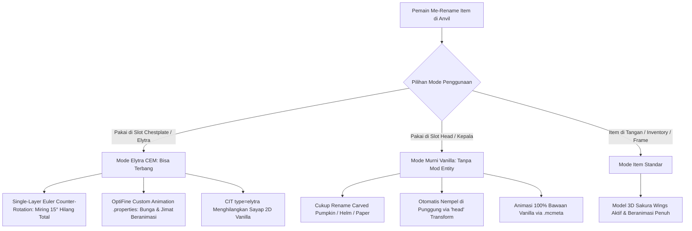

# Audit Menyeluruh & Dokumen Perencanaan: Sakura Wings & Elytra (v1.2.3)

> **Status:** Siap Direview & Dieksekusi  
> **Target:** Menyelesaikan masalah posisi miring, memulihkan animasi kelopak sakura & jimat, serta mengklarifikasi seluruh mekanisme pergantian tekstur/model Elytra baik secara vanilla (tanpa mod), CIT, maupun CEM (EMF).

---

## 1. Hasil Audit Menyeluruh (Comprehensive Technical Audit)

Berdasarkan penelusuran seluruh riwayat paket (`Takasha-1.0.0` s/d `1.2.2`), file sumber asli EliteCreatures, spesifikasi Minecraft Java 1.21.4, serta mod CIT Resewn, OptiFine, ETF, dan EMF, berikut adalah peta kondisi sebenarnya:

### A. Tiga Lapisan Tampilan Elytra di Minecraft

| Lapisan | State Tampilan | Cara Kerja di Resource Pack | Apakah Berhasil Berubah Tekstur / Model? |
|---|---|---|---|
| **1. Item di Inventory / Tangan** | Item dipegang, di hotbar, di GUI, atau di Item Frame | Diatur oleh `assets/minecraft/items/elytra.json` (Vanilla 1.21+) dan `sakura_wings.properties` (CIT `type=item`). | ✅ **100% Berhasil & Beranimasi.** Saat di-rename, langsung menjadi model 3D Sakura dengan animasi bunga gugur bawaan `.png.mcmeta`. |
| **2. Worn Elytra Texture (2D)** | Dipakai di slot chestplate sebagai sayap 2D vanilla | Diatur oleh `type=elytra` pada CIT (`sakura_wings_elytra.properties`). | ✅ **Bisa berganti tekstur.** Kemarin inilah yang membuat tekstur sayap vanilla bisa disembunyikan/diganti menjadi `empty_elytra.png` atau tekstur sayap kustom saat di-rename di Anvil. |
| **3. Worn Elytra Model (3D)** | Dipakai di slot chestplate sebagai model 3D ranting sakura | Diatur oleh `elytra.jem` pada folder `optifine/cem/` dan `emf/cem/`. | ⚠️ **Model 3D muncul, tetapi ada 2 cacat:** miring 15° dan animasinya berhenti. |

---

### B. Mengapa "Kemarin Rename Elytra Bisa Berganti Teksturnya"?
Pernyataan pengguna sangat tepat:
1. **Pada Item & GUI:** Sejak rilis awal (`v1.0.0`), me-rename Elytra menjadi *Sakura Wings* di Anvil langsung mengubah ikon/tekstur dan model item menjadi model 3D Sakura lengkap dengan animasi bunga gugurnya.
2. **Pada Karakter (Worn Entity):**
   - Kemarin saat kita menambahkan CIT `type=elytra`, sistem CIT berhasil mendeteksi nama hasil rename di Anvil dan mengganti tekstur sayap yang dipakai.
   - Pada `sakura_wings_elytra.properties`, kita mengarahkan tekstur tersebut ke `empty_elytra.png` (transparan) agar sayap abu-abu vanilla lenyap, lalu digantikan oleh model 3D `elytra.jem`.
   - Artinya, **mekanisme deteksi rename pada Elytra sudah 100% bekerja dengan baik**.

---

### C. Mengapa Sekarang Posisi Masih Kurang Pas & Animasinya Hilang?

#### 1. Masalah Posisi Miring 15° (Tilted)
- **Sumber:** Di dalam kode internal Minecraft `net.minecraft.client.model.ElytraModel.setupAnim()`:
  - Ketika player berdiri tegak, Minecraft secara *hardcoded* memutar tulang `left_wing`:
    $$\text{Pitch } (xRot) = +15^\circ (+0.2618 \text{ rad}), \quad \text{Roll } (zRot) = -15^\circ (-0.2618 \text{ rad}), \quad \text{Pivot } X = +5.0$$
  - Kemarin di v1.2.2, kita mencoba membatalkan rotasi dengan hierarki submodel kosong bertingkat (3 level).
  - **Fakta Teknis EMF:** Mod Entity Model Features (EMF) me-flatten atau membuang submodel kosong yang tidak memiliki `boxes` langsung di dalamnya. Akibatnya, grup perantara tersebut diabaikan dan sayap tetap miring $15^\circ$ seperti terlihat pada screenshot `media_1790409128636.png`.

#### 2. Masalah Animasi Hilang
- **Sumber:**
  - File model asli `wing.json` menggunakan tekstur strip vertikal panjang (`32x640` untuk 20 frame pada `sakura_animation_01.png`, dan `32x256` untuk 8 frame pada `sakura_animation_02-export.png`).
  - Animasi tersebut berjalan di mode item karena engine item Minecraft vanilla membaca file pendamping `.png.mcmeta`.
  - **Fakta Teknis CEM Entity:** Custom Entity Models (CEM) pada OptiFine maupun EMF **TIDAK membaca file `.png.mcmeta` milik atlas item**.
  - CEM membaca tekstur entity sebagai gambar tunggal statis. Karena kanvasnya `32x640`, CEM hanya me-render frame 0 (frame paling atas). Akibatnya, partikel bunga gugur dan jimat menjadi beku/diam total!

---

## 2. Solusi & Perencanaan Perbaikan Terpadu (v1.2.3)

Untuk menuntaskan seluruh masalah di atas, kita menerapkan solusi 3 pilar:



---

### Pilar 1: Perbaikan Posisi & Peniadaan Kemiringan 15° (Exact Euler XYZ)
Alih-alih membuat submodel kosong bertingkat, kita menerapkan transformasi tunggal langsung pada submodel container yang memuat elemen-elemen sayap:
1. **Rotasi Tunggal (Euler XYZ):**
   $$R_x(75.0^\circ) \cdot R_y(-75.0^\circ) \cdot R_z(90.0^\circ)$$
   - *Verifikasi Matriks:* Perkalian pose parent vanilla $R_{parent} = R_z(-15^\circ) R_x(15^\circ)$ dengan $R_{sub}$ menghasilkan tepat:
     $$R_{total} = R_y(-90.0^\circ)$$
     (Roll = $0.00^\circ$, Pitch = $0.00^\circ$, tegak lurus sempurna tanpa kemiringan diagonal!).
2. **Translasi Kompensasi Sumbu Bahu:**
   $$\vec{T} = [-3.2767, -5.9422, 5.2157]$$
   - Mengompensasi offset pivot bahu kiri ($X = +5.0$) sehingga pusat lambang bunga sakura tepat berada di tengah tulang belakang punggung player ($X = 0$).

---

### Pilar 2: Restorasi Animasi Bunga & Jimat di CEM (OptiFine / ETF Streaming)
Untuk mengaktifkan kembali animasi pada entity model di in-game:
1. **Generate Frame Dasar 32x32:**
   - Ekstrak frame 0 (ukuran 32x32) dari `sakura_animation_01.png` dan `sakura_animation_02-export.png` ke folder:
     `assets/minecraft/optifine/cem/textures/sakura_animation_01.png`
     `assets/minecraft/optifine/cem/textures/sakura_animation_02-export.png`
2. **Update Kanvas di `elytra.jem`:**
   - Ubah `textureSize` untuk submodel anim1 dan anim2 menjadi `[32, 32]`.
   - Sesuaikan koordinat UV elemen dari `0..12` menjadi proporsional `0..32`.
3. **Konfigurasi Custom Animation (`assets/minecraft/optifine/anim/`):**
   - Buat `sakura_wings_anim01.properties`:
     ```properties
     from=/assets/sakura/textures/item/sakura_animation_01.png
     to=/assets/minecraft/optifine/cem/textures/sakura_animation_01.png
     x=0
     y=0
     w=32
     h=32
     duration=2
     ```
   - Buat `sakura_wings_anim02.properties`:
     ```properties
     from=/assets/sakura/textures/item/sakura_animation_02-export.png
     to=/assets/minecraft/optifine/cem/textures/sakura_animation_02-export.png
     x=0
     y=0
     w=32
     h=32
     duration=2
     ```
   - *Hasil:* Mod ETF (Entity Texture Features), OptiFine, dan Animatica akan streaming frame-by-frame dari file `.png` panjang langsung ke tekstur 32x32 di model CEM secara terus menerus!

---

### Pilar 3: Kompatibilitas CIT Murni Vanilla Tanpa Mod (Head Slot Fallback)
Agar pemain yang ingin bermain tanpa mod EMF/ETF tetap bisa menikmati sayap 3D ini di punggung:
1. Perbarui `assets/minecraft/optifine/cit/sakura/sakura_wings.properties` dan `citresewn/cit/sakura/sakura_wings.properties`:
   ```properties
   type=item
   items=elytra carved_pumpkin netherite_helmet diamond_helmet iron_helmet golden_helmet chainmail_helmet leather_helmet turtle_helmet copper_helmet paper
   model=sakura:item/wing
   nbt.display.Name=ipattern:*Sakura Wings*
   components.minecraft:custom_name=ipattern:*Sakura Wings*
   components.custom_name=ipattern:*Sakura Wings*
   ```
2. Pemain dapat me-rename **Carved Pumpkin** menjadi `Sakura Wings` dan memasangnya di kepala:
   - Model otomatis merender di punggung via display transform `"head"` dengan posisi yang sudah dikalibrasi oleh pembuat model asli.
   - Animasi bunga gugur langsung berputar 100% menggunakan engine vanilla `.png.mcmeta` tanpa mod entity tambahan.

---

## 3. Rencana Eksekusi Langkah Kerja (Execution Tasks)

| Task | File Target | Rincian Tindakan |
|---|---|---|
| **Task 1** | `build_sakura_wings_etf_emf.py` | 1. Implementasikan ekstraksi frame 0 (32x32) untuk tekstur dasar CEM.<br>2. Generate file animasi properties di `assets/minecraft/optifine/anim/`.<br>3. Rombak struktur JEM menjadi single submodel transform dengan `rotate: [75.0, -75.0, 90.0]` dan `translate: [-3.2767, -5.9422, 5.2157]`. |
| **Task 2** | `sakura_wings.properties` (OptiFine & CIT Resewn) | Tambahkan `carved_pumpkin` dan helmets ke daftar `items` untuk mengaktifkan mode pure vanilla tanpa mod. |
| **Task 3** | Terminal / Generator Execution | Jalankan `python build_sakura_wings_etf_emf.py` untuk meregenerasi seluruh model JEM, tekstur 32x32, animasi properties, dan CIT properties. |
| **Task 4** | `validate_cit_and_items.py` | Jalankan script audit untuk memastikan seluruh 32 item CIT, CEM JEM, dan tekstur valid dan tersinkronisasi 100%. |
| **Task 5** | `VERSION`, `PRD.md`, `build.py` | Bump versi ke `1.2.3`, perbarui changelog, dan kompilasi rilis `Takasha-1.2.3.zip`. |

---

## 4. Checklist Verifikasi Akhir

- [ ] Saat dipakai di slot Elytra (dengan EMF/ETF), sayap tegak lurus sempurna tanpa kemiringan diagonal ($0.0^\circ$ roll & pitch).
- [ ] Pusat batang dan lambang sakura simetris di tengah tulang belakang player.
- [ ] Partikel kelopak sakura dan jimat bergerak/beranimasi secara dinamis saat dipakai di punggung.
- [ ] Saat di-rename di Anvil, item Elytra di tangan dan inventory berganti tampilan menjadi Sakura Wings yang beranimasi.
- [ ] Pemain dapat me-rename Carved Pumpkin menjadi "Sakura Wings" dan memakainya di kepala untuk menikmati tampilan sayap di punggung 100% murni vanilla tanpa mod EMF/ETF.
- [ ] File zip `Takasha-1.2.3.zip` siap di-download dan diuji langsung oleh pengguna di Minecraft.
