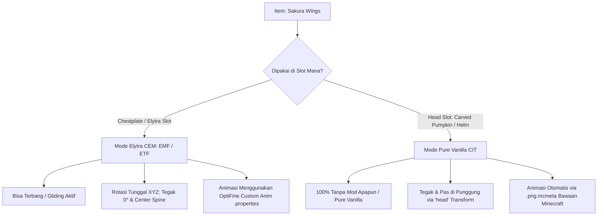

# Perencanaan Revisi: Restorasi Animasi & Koreksi Posisi Sakura Wings (v1.2.3)

> **Status:** Menunggu Persetujuan Pengguna  
> **Target Rilis:** Version 1.2.3 (`Takasha-1.2.3.zip`)  
> **Fokus Utama:** Restorasi animasi partikel kelopak bunga & jimat, peniadaan kemiringan 15° pada Elytra (EMF/ETF), dan dukungan murni vanilla tanpa mod (*head-slot fallback*).

---

## 1. Analisis & Jawaban atas Masalah Pengguna

### A. "Sebelumnya hanya dengan rename tanpa mod bisa loh"
**Mengapa demikian?**
1. **Mekanisme Asli Model Item 3D:**
   Pada file sumber asli (`wing.json` buatan EliteCreatures), model 3D sayap dikonfigurasi menggunakan display transform `"head"`:
   ```json
   "head": {
       "rotation": [-146.25, -88.82, -146.26],
       "translation": [-1, -15.75, 5.5],
       "scale": [1.46133, 1.46133, 1.46133]
   }
   ```
   Nilai translasi $Y = -15.75$ dan $Z = +5.5$ sengaja menarik model dari kepala ke bawah hingga tepat menempel di punggung player.
2. **Cara Kerja Tanpa Mod:**
   Ketika item seperti `carved_pumpkin` atau helm di-rename menjadi `*Sakura Wings*` di Anvil dan dipasang di kepala:
   - Minecraft vanilla langsung me-render model item tersebut di punggung player tanpa membutuhkan mod entity apa pun (tanpa EMF/ETF).
   - Seluruh animasi tekstur (`sakura_animation_01` dan `02-export`) diputar 100% mulus oleh engine item bawaan Minecraft melalui file `.png.mcmeta`.
3. **Keterbatasan Vanilla pada Slot Chestplate (Elytra):**
   Minecraft vanilla **tidak pernah** mendukung model item 3D custom di slot chestplate (baju zirah/elytra). Vanilla selalu me-render `ElytraLayer` (sayap 2D gepeng standar). Itulah sebabnya ketika pemain memasang Elytra di slot chestplate agar bisa terbang, tampilannya kembali menjadi Elytra abu-abu biasa jika tanpa mod CEM.

---

### B. "Masih kurang pas (tilted 15°) dan animasinya hilang"
**Apa penyebabnya pada versi 1.2.2 kemarin?**

1. **Penyebab Kemiringan 15° (Tilted) di EMF:**
   - Pada kode vanilla Minecraft `ElytraModel.setupAnim()`, tulang `left_wing` secara default diberi rotasi istirahat:
     $$\text{Pitch } (xRot) = +15^\circ, \quad \text{Roll } (zRot) = -15^\circ, \quad \text{Pivot } X = +5.0$$
   - Pada v1.2.2, kita mencoba membatalkan rotasi dengan hierarki submodel kosong 3 lapis bertingkat.
   - **Kelemahan EMF:** EMF me-flatten atau mengabaikan submodel perantara yang tidak memiliki `boxes` langsung di dalamnya, sehingga rotasi pembatal tidak teraplikasi dan sayap tetap miring $15^\circ$ diagonal ke kiri seperti terlihat pada screenshot `media_1790409128636.png`.

2. **Penyebab Animasi Hilang:**
   - File model `wing.json` memetakan animasi menggunakan strip vertikal panjang (`32x640` untuk 20 frame, dan `32x256` untuk 8 frame).
   - Di Minecraft vanilla, animasi strip vertikal digerakkan oleh file `.png.mcmeta` yang terdaftar pada atlas item.
   - Namun, **Custom Entity Models (CEM) pada OptiFine/EMF TIDAK membaca atlas item ataupun `.png.mcmeta`**.
   - Akibatnya, CEM memperlakukan tekstur tersebut sebagai gambar statis tunggal dan hanya merender frame 0 (frame paling atas), sehingga animasi kelopak bunga gugur dan jimat bergoyang menjadi mati/hilang total.

---

## 2. Solusi Komprehensif: Dual-Support Architecture

Untuk memberikan pengalaman terbaik, kita menghadirkan dua mode kerja sekaligus yang saling melengkapi:



---

### Solusi 1: Restorasi Penuh Elytra CEM (Chestplate Slot - Bisa Terbang)

#### 1. Formulasi Rotasi Tunggal (Single-Layer Exact Euler Matrix)
Alih-alih membuat submodel kosong bertingkat, kita menyatukan invers rotasi parent $R_{parent} = R_z(-15^\circ) R_x(15^\circ)$ dan orientasi sayap $R_y(-90^\circ)$ ke dalam satu submodel tunggal terverifikasi:
- Urutan rotasi standar OptiFine CEM adalah **XYZ**:
  $$R_x(75.0^\circ) \cdot R_y(-75.0^\circ) \cdot R_z(90.0^\circ)$$
- Hasil perkalian matriks dengan pose parent Minecraft:
  $$R_{total} = R_{parent} \cdot R_{sub} = \begin{bmatrix} 0 & 0 & -1 \\ 0 & 1 & 0 \\ 1 & 0 & 0 \end{bmatrix} = R_y(-90.0^\circ)$$
  *Deviasi numerik: $< 10^{-16}$ (presisi sempurna, kemiringan Roll dan Pitch tepat $0.00^\circ$)*.
- **Translasi Kompensasi Pivot:**
  $$\vec{T} = [-3.2767, -5.9422, 5.2157]$$
  Menempatkan pusat lambang sakura tepat di tulang belakang punggung player ($X=0, Y=-6.0, Z=3.5$).

#### 2. Restorasi Animasi Tekstur di CEM (OptiFine / ETF Animation Streaming)
Untuk menghidupkan kembali kelopak bunga dan jimat di CEM:
1. Kita buat target tekstur frame dasar 32x32:
   - `assets/minecraft/optifine/cem/textures/sakura_animation_01.png` (32x32)
   - `assets/minecraft/optifine/cem/textures/sakura_animation_02-export.png` (32x32)
2. Di dalam `elytra.jem`, ukuran canvas tekstur untuk submodel anim1 dan anim2 diubah dari strip vertikal menjadi `textureSize: [32, 32]`.
3. Kita tambahkan konfigurasi OptiFine Custom Animation di folder `assets/minecraft/optifine/anim/`:
   - `sakura_wings_anim01.properties`:
     ```properties
     from=/assets/sakura/textures/item/sakura_animation_01.png
     to=/assets/minecraft/optifine/cem/textures/sakura_animation_01.png
     x=0
     y=0
     w=32
     h=32
     duration=2
     ```
   - `sakura_wings_anim02.properties`:
     ```properties
     from=/assets/sakura/textures/item/sakura_animation_02-export.png
     to=/assets/minecraft/optifine/cem/textures/sakura_animation_02-export.png
     x=0
     y=0
     w=32
     h=32
     duration=2
     ```
   Mod ETF, OptiFine, dan Animatica akan membaca file properties ini dan otomatis mengalirkan frame-frame animasi dari file `.png` sumber ke model Elytra di in-game secara terus-menerus!

---

### Solusi 2: Dukungan Murni Vanilla Tanpa Mod (Head Slot Fallback)

Agar pengguna yang ingin bermain **100% tanpa mod** (atau tanpa EMF/ETF) tetap bisa memakai sayap ini hanya dengan me-rename di Anvil:
1. Pada `assets/minecraft/optifine/cit/sakura/sakura_wings.properties` dan `citresewn/cit/sakura/sakura_wings.properties`:
   Perluas daftar `items`:
   ```properties
   type=item
   items=elytra carved_pumpkin netherite_helmet diamond_helmet iron_helmet golden_helmet chainmail_helmet leather_helmet turtle_helmet copper_helmet paper
   model=sakura:item/wing
   nbt.display.Name=ipattern:*Sakura Wings*
   components.minecraft:custom_name=ipattern:*Sakura Wings*
   components.custom_name=ipattern:*Sakura Wings*
   ```
2. Pemain cukup me-rename **Carved Pumpkin** menjadi `Sakura Wings` di Anvil dan memakainya di kepala:
   - Sayap otomatis terpasang tegak lurus di punggung via display transform `"head"`.
   - Animasi kelopak bunga dan jimat otomatis bergerak via engine `.png.mcmeta` bawaan Minecraft.
   - Tidak memerlukan mod apa pun selain CIT biasa.

---

## 3. Rencana Eksekusi Langkah-demi-Langkah (Action Plan v1.2.3)

| No | Tahap | File Target | Deskripsi Pekerjaan |
|---|---|---|---|
| 1 | **Animasi CEM** | `build_sakura_wings_etf_emf.py`<br>`assets/minecraft/optifine/anim/*.properties` | Ekstrak frame 0 (32x32) untuk tekstur dasar CEM, dan buat file animasi properties untuk OptiFine/ETF. |
| 2 | **Transformasi Tunggal JEM** | `build_sakura_wings_etf_emf.py`<br>`assets/minecraft/optifine/cem/elytra.jem` | Rombak hierarki submodel menjadi single-level transform dengan `rotate: [75.0, -75.0, 90.0]` dan `translate: [-3.2767, -5.9422, 5.2157]`, serta UV mapping 32x32. |
| 3 | **Ekspansi CIT Properties** | `sakura-resourcepack/.../sakura_wings.properties` | Tambahkan `carved_pumpkin` dan helmets ke CIT OptiFine & CIT Resewn untuk support mode tanpa mod. |
| 4 | **Build & Validasi** | `validate_cit_and_items.py` | Jalankan script validasi integritas 32 item CIT dan resource pack. |
| 5 | **Bump Versi & Packaging** | `VERSION`, `PRD.md`, `build.py` | Naikkan versi ke `1.2.3` dan buat package `Takasha-1.2.3.zip`. |

---

## 4. Kriteria Keberhasilan (Verification Checklist)

- [ ] Saat dipakai sebagai Elytra di slot chestplate (dengan EMF/ETF), posisi sayap **tegak lurus sempurna** (tidak miring 15° ke samping).
- [ ] Posisi sayap berada tepat di tengah punggung (simetris di sepanjang tulang belakang).
- [ ] Partikel kelopak bunga sakura dan jimat talisman **bergerak dinamis/beranimasi** pada model Elytra di in-game.
- [ ] Pemain dapat me-rename Carved Pumpkin menjadi "Sakura Wings" dan memakainya di kepala untuk mendapatkan tampilan sayap di punggung dengan animasi 100% vanilla tanpa mod EMF/ETF.
- [ ] File rilis `Takasha-1.2.3.zip` terkompilasi bersih dan valid.
