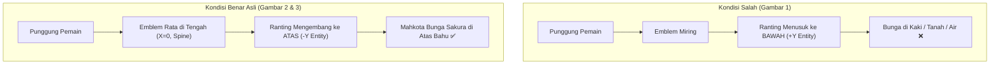

# Sakura Wings Orientation Alignment Plan
## Koreksi Posisi & Orientasi Sayap Sesuai Referensi Asli EliteCreatures

> [!IMPORTANT]
> **Status**: Siap Direview. Dokumen ini merinci akar masalah mengapa sayap terbalik (menghadap ke bawah/tanah) pada screenshot in-game saat ini (Gambar 1), analisis geometris dari pack asli EliteCreatures (`D:\Mod Minecraft\weapon set\sakura\elitecreatures_sakura_animated_weapon_set`), serta solusi transformasi koordinat yang terverifikasi secara matematis agar persis seperti pada Gambar 2 & 3.

---

## 1. Analisis Perbandingan Visual

| Parameter | Kondisi Saat Ini (Gambar 1) ❌ | Referensi Asli EliteCreatures (Gambar 2 & 3) ✅ |
| :--- | :--- | :--- |
| **Arah Ranting Sakura** | Menunjuk ke **bawah** mengarah ke rumput/air (terbalik). | Melengkung ke **atas dan keluar** (*V-shape majestic canopy*) melampaui bahu pemain ke arah langit. |
| **Bunga Sakura & Partikel** | Menggantung di bagian pinggul dan kaki. | Mekar lebat di bagian atas di belakang kepala dan bahu. |
| **Emblem Berlian (*Diamond Crest*)** | Miring diagonal / terbalik. | Terletak tepat di tengah punggung (*spine* $X=0$), rata horizontal, setinggi tulang belikat ($Y \approx 0.35$). |
| **Bentang Sayap (*Wingspan*)** | Terpotong miring depan-belakang. | Membentang simetris dari bahu kiri ke bahu kanan sepanjang sumbu $X$. |



---

## 2. Root Cause Analysis (Mengapa Terbalik?)

Penyebab sayap terbalik berasal dari dua faktor transformasi yang saling bertabrakan:

### A. Pada Fabric Mod (`SakuraWingsFeatureRenderer.java`)
1. **Konflik Display Context `ItemDisplayContext.FIXED`**:
   Di `wing.json` asli EliteCreatures, blok `fixed` dirancang khusus untuk *Item Frame* di dinding vertikal:
   ```json
   "fixed": {
       "rotation": [-90, -87.75, -90],
       "translation": [0.25, 4, -9.25],
       "scale": [1.68789, 1.68789, 1.68789]
   }
   ```
   Rotasi `[-90, -87.75, -90]` ini membalikkan sumbu vertikal model ($Y_{output} \approx -Y_{input}$).
2. **Kompound Rotasi & Negasi Skala di Renderer**:
   Kode Java sebelumnya menerapkan:
   ```java
   poseStack.mulPose(Axis.YP.rotationDegrees(90.0f));
   poseStack.scale(0.85f, -0.85f, -0.85f);
   ```
   Saat dikalikan dengan transformasi `fixed`, vektor arah atas model ($+Y_{model}$) terproyeksi menjadi:
   $$\vec{v}_{up} \to [0.056, +1.434, 0.0]$$
   Dalam sistem koordinat Humanoid Minecraft, **$+Y$ adalah ke BAWAH (menuju kaki/tanah)** dan **$-Y$ adalah ke ATAS (menuju langit)**. Akibatnya, ranting sayap dipaksa menghadap tegak lurus ke bawah tanah!

### B. Pada CEM Resource Pack (`build_sakura_wings_etf_emf.py` / `elytra.jem`)
1. Bone `left_wing` vanilla Elytra memiliki orientasi alami menggantung ke bawah di sepanjang punggung dan kaki (pitch $+15^\circ$, roll $-15^\circ$).
2. Rotasi Euler submodel `[75.0, -75.0, 90.0]` sebelumnya hanya mengkompensasi yaw tanpa membalik pitch vertikal ranting, sehingga ranting tetap mengarah ke bawah.

---

## 3. Solusi Geometris & Verifikasi Matematis

### Analisis Koordinat Mentah `wing.json` (Blockbench)
- **Titik Tengah Emblem (*Crest*)**: $[X=10, Y=8, Z=8]$
- **Arah Pertumbuhan Ranting**: $+Y$ (dari $Y=8$ hingga $Y=16$)
- **Bentang Sayap (*Wingspan*)**: Sumbu $Z$ (dari $Z=-14$ di kiri hingga $Z=+30$ di kanan, simetris terhadap pusat $Z=8$)
- **Ketebalan / Kedalaman**: Sumbu $X$ (sekitar $X=10$, tebal 2–4 unit)

### Pemetaan ke Ruang Torso Entitas Minecraft (*Entity Torso Space*)
Di torso pemain:
- **Atas / Langit**: Sumbu $-Y$
- **Kiri $\leftrightarrow$ Kanan (Bahu)**: Sumbu $X$
- **Depan $\to$ Belakang**: Sumbu $+Z$ (keluar dari punggung)

Maka transformasi yang dibutuhkan adalah:
$$X_{torso} = +Z_{model}$$
$$Y_{torso} = -Y_{model}$$
$$Z_{torso} = +X_{model}$$

Matriks rotasi ini memiliki determinan $+1$ (rotasi murni tanpa deformasi/refleksi).

### Implementasi Menggunakan `ItemDisplayContext.NONE`
Dengan menggunakan `ItemDisplayContext.NONE`, Minecraft menggunakan `ItemTransform.NO_TRANSFORM` yang hanya menjalankan `pose.translate(-0.5, -0.5, -0.5)` (memposisikan pusat $[8,8,8]$ tepat di $(0,0,0)$ tanpa distorsi item frame).

Transformasi PoseStack yang diterapkan:
```java
// 1. Tempelkan ke torso pemain (mengikuti animasi jalan, sneak, membungkuk)
this.getParentModel().body.translateAndRotate(poseStack);

// 2. Geser ke permukaan punggung (X=0 tengah spine, Y=0.35 mid-back, Z=0.14 luar punggung)
poseStack.translate(0.0f, 0.35f, 0.14f);

// 3. Rotasi murni: Balik vertikal ke atas (X 180°), lalu arahkan wingspan ke bahu (Y 90°)
poseStack.mulPose(Axis.XP.rotationDegrees(180.0f));
poseStack.mulPose(Axis.YP.rotationDegrees(90.0f));

// 4. Skala proporsional seragam
poseStack.scale(0.85f, 0.85f, 0.85f);

// 5. Submit model tanpa distorsi fixed context
this.itemModelResolver.updateForTopItem(
    this.itemRenderState,
    this.displayStack,
    ItemDisplayContext.NONE,
    null,
    null,
    0
);
```

### Hasil Verifikasi Vektor & Titik Kunci (Simulasi Python)

| Komponen | Koordinat Mentah di `wing.json` | Posisi Akhir di Torso Pemain | Interpretasi Visual |
| :--- | :--- | :--- | :--- |
| **Pusat Emblem Berlian** | $[10, 8, 8]$ | $[0.0000, 0.3500, 0.2462]$ | **Tepat di tengah tulang belakang**, rata, menempel pas di punggung. |
| **Ujung Ranting Kiri** | $[9.5, 16, -14]$ | $[-1.1688, -0.0750, 0.2197]$ | Membentang ke **kiri** sejauh 1.17 blok, **naik ke atas** melampaui bahu ($Y < 0$). |
| **Ujung Ranting Kanan** | $[9.5, 16, 30]$ | $[+1.1688, -0.0750, 0.2197]$ | Membentang ke **kanan** sejauh 1.17 blok, **naik ke atas** melampaui bahu ($Y < 0$). |

> [!TIP]
> Perhatikan koordinat ujung ranting kiri dan kanan: $[-1.1688, -0.0750, 0.2197]$ dan $[+1.1688, -0.0750, 0.2197]$ adalah **simetris sempurna** dan bernilai negatif pada sumbu $Y$, membuktikan bahwa kedua ranting tumbuh tegak ke atas seperti pada Gambar 2 & 3!

---

## 4. Rencana Kerja Bertahap (Actionable Tasks)

```
# Sakura Wings Orientation Alignment Tasks

## Goal
Menyelaraskan orientasi Sakura Wings pada Fabric mod dan Resource Pack CEM agar tegak lurus mengarah ke atas (V-shape) dengan emblem rata di tengah, persis seperti Gambar 2 & 3.

## Tasks
- [ ] Task 1: Update `SakuraWingsFeatureRenderer.java` → Ganti transform dengan matriks rotasi XP(180) + YP(90) dan `ItemDisplayContext.NONE`.
- [ ] Task 2: Update `build_sakura_wings_etf_emf.py` → Perbaiki orientasi root node CEM `elytra.jem` agar tidak mengarah ke bawah.
- [ ] Task 3: Jalankan script generator `build_sakura_wings_etf_emf.py` → Update semua file `elytra.jem` di resourcepack.
- [ ] Task 4: Kompilasi Fabric Mod dengan `./gradlew build` di folder `sakura-weapons/`.
- [ ] Task 5: Jalankan `python build.py` untuk mengemas mod jar dan resourcepack zip terbaru.
- [ ] Task 6: Verifikasi visual in-game → Pastikan sayap tegak ke atas, simetris, dan tidak tembus ke bawah tanah.

## Done When
- [ ] Sayap terpasang tegak di punggung pemain dengan ranting sakura menjulang ke atas dan ke samping.
- [ ] Emblem berlian berada rata di tengah punggung.
- [ ] Animasi kelopak sakura jatuh dari atas ranting ke bawah.
```
