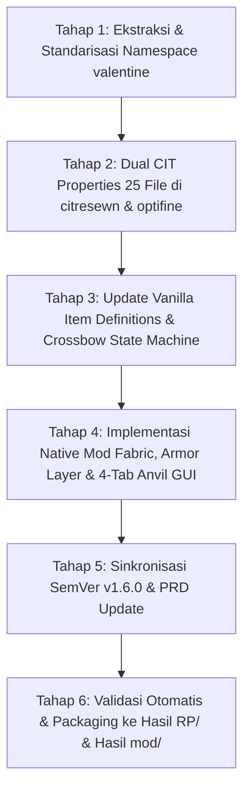

# Implementation Plan: Onboarding Set #3 — Valentines Animated Weapon, Tool & Armor Set (v1.6.0)

> **Versi Target:** v1.6.0 (SemVer MINOR — Penambahan Set Senjata, Kosmetik & Armor Baru)  
> **Status:** Menunggu Persetujuan Pengguna (Pending User Approval)  
> **Tanggal:** 2026-09-29  
> **Sumber Bahan Mentah:** `Bahan Set/elitecreatures-valentines_animated_weapon_and_tool_set_v1/`  
> **Namespace Set:** `valentine`  
> **Display Prefix:** `Valentine` (Bilingual EN/ID: Valentine / Valentine)  
> **Referensi PRD:** PRD v1.6.0 (Section 2.3 Standar Penamaan & Simbol, Section 3 Taksonomi Archetype, Section 4.3 Set #3, Section 5 Arsitektur Komponen, Section 6 SOP Penambahan Set Baru, Section 8 SemVer, Section 10 Kebijakan Deployment, Section 12.18 Onboarding Set #3)  
> **Batasan Ketat PRD Bagian 10:** **Build HANYA disimpan di workspace lokal (`Hasil RP/Takasha-1.6.0.zip` dan `Hasil mod/Takasha-1.6.0.jar`). DILARANG menyalin ke profil launcher Modrinth eksternal dan DILARANG melakukan deployment ke Modrinth.**

---

## 1. Standar Penamaan, Pewarnaan (Coloring) & Simbol Identitas Tiap Set

Sesuai arahan, setiap set memiliki identitas visual yang khas melalui kombinasi kode warna bawaan Minecraft vanilla (`§`) dan simbol dekoratif emoji:

| Set ID | Nama Set | Tema Visual | Kode Warna | Simbol Khas | Format Nama Shift+Klik (Anvil & Predicate Cases) |
|:---|:---|:---|:---|:---|:---|
| **`sakura`** | Sakura | Musim Semi / Kelopak Bunga Jepang | `§d` (Light Purple / Pink) + `§l` (Bold) | `🌸` (Cherry Blossom) | `§d§l🌸 Sakura <Item> 🌸` / `§d§l🌸 <Item> Sakura 🌸` |
| **`pink_legacy`** | Pink Legacy | Neo-Tech / Mecha-Fantasy / Energy Aura | `§d` (Neon Pink) + `§l` (Bold) | `✨` (Sparkles / Energy Spark) | `§d§l✨ Pink Legacy <Item> ✨` / `§d§l✨ <Item> Pink Legacy ✨` |
| **`valentine`** | Valentine | Cupid / Love Romance / Crimson Heart | `§c` (Crimson / Valentine Red) + `§l` (Bold) | `❤` (Romantic Heart) | `§c§l❤ Valentine <Item> ❤` / `§c§l❤ <Item> Valentine ❤` |

### 1.1 Validasi Karakter & Batas Panjang Anvil (Max 50 Karakter)
- **Sakura:** `§d§l🌸 Sakura Fishing Rod 🌸` = 30 karakter (<= 50)
- **Pink Legacy:** `§d§l✨ Pink Legacy Fishing Rod ✨` = 33 karakter (<= 50)
- **Valentine:** `§c§l❤ Valentine Fishing Rod ❤` = 31 karakter (<= 50)
- Seluruh simbol `🌸` (U+1F338), `✨` (U+2728), dan `❤` (U+2764) didukung penuh oleh font renderer Minecraft Java Edition tanpa glitch karakter.

---

## 2. Ringkasan & Inventaris Bahan Mentah Set Valentine

Berdasarkan umpan balik pengguna:
1. **`valentine_staff`:** Item dasar `blaze_rod` **dihapus**, digantikan dengan seluruh 7 tier tombak vanilla (`wooden_spear` s.d. `netherite_spear`), seluruh 7 tier kapak vanilla (`wooden_axe` s.d. `netherite_axe`), seluruh tier pedang, `stick`, dan `paper`.
2. **`valentine_chest`:** **DIHAPUS SEPENUHNYA** dari model, CIT, item vanilla definitions, item native mod, dan Anvil catalog.

### 2.1 Daftar Aset Model 3D Blockbench (28 Model Terpilih)
- **Senjata & Perkakas (17 Model):**
  - `axe.json` (Axe / Kapak)
  - `bow.json`, `bow_0.json`, `bow_1.json`, `bow_2.json` (Bow & 3 pulling stages)
  - `crossbow.json`, `crossbow_0.json`, `crossbow_1.json`, `crossbow_2.json`, `crossbow_2_charged.json`, `crossbow_charged.json` (Crossbow & 5 charging/loaded stages)
  - `hammer.json` (Hammer / Palu)
  - `hoe.json` (Hoe / Cangkul)
  - `pickaxe.json` (Pickaxe / Beliung)
  - `rod.json`, `rod_cast.json` (Fishing Rod & cast stage)
  - `shield.json`, `shield_blocking.json` (Shield & blocking stage)
  - `shovel.json` (Shovel / Sekop)
  - `spear.json` (Spear / Tombak)
  - `staff.json` (Staff / Tongkat)
  - `sword.json` (Sword / Pedang)
- **Kosmetik & Utilitas (5 Model):**
  - `helmet.json` (3D Headwear / Glasses / Hat) -> dipetakan menjadi `valentine:item/hat`
  - `wing.json`, `wing_self.json` (Animated Backpiece Wings) -> dipetakan menjadi `valentine:item/wings`
  - `key.json` (Key / Kunci) -> dipetakan menjadi `valentine:item/key`
  - `grenade.json` (Grenade / Granat) -> dipetakan menjadi `valentine:item/grenade`
  - `quiver.json` (Quiver / Wadah Panah) -> dipetakan menjadi `valentine:item/quiver`
- **Armor Items 2D (4 Model Generated):**
  - `helmet.json` (2D Item Icon via `helmet_icon.png`)
  - `chestplate.json` (2D Item Icon via `chestplate_icon.png`)
  - `leggings.json` (2D Item Icon via `leggings_icon.png`)
  - `boots.json` (2D Item Icon via `boots_icon.png`)
- **Total Model Item JSON:** **32 Model** (28 Blockbench 3D + 4 Armor Item 2D).

### 2.2 Daftar Tekstur & Animasi (.mcmeta)
- **16 Tekstur Model 3D:**
  - `valentine_tex1.png` s.d. `valentine_tex8.png`
  - `battery.png` + `battery.png.mcmeta`
  - `bowfill.png` + `bowfill.png.mcmeta`
  - `cameralens1.png` + `cameralens1.png.mcmeta`
  - `cloudheart.png` + `cloudheart.png.mcmeta`
  - `glassese.png` + `glassese.png.mcmeta`
  - `heartnitro.png` + `heartnitro.png.mcmeta`
  - `heartrotate.png` + `heartrotate.png.mcmeta`
  - `heartrotate1.png` + `heartrotate1.png.mcmeta`
- **4 Ikon Item Armor:**
  - `helmet_icon.png`, `chestplate_icon.png`, `leggings_icon.png`, `boots_icon.png`
- **2 Tekstur Zirah Entitas (Worn Armor):**
  - `armor_layer_1.png` (Humanoid & baby layer)
  - `armor_layer_2.png` (Humanoid leggings layer)

---

## 3. Rincian Rencana Tindakan Terstruktur (SOP 7 Tahap)



### Tahap 1: Ekstraksi & Standarisasi Namespace Aset (`valentine`)
1. Buat direktori namespace baru di resource pack dan mod:
   - `sakura-resourcepack/assets/valentine/models/item/`
   - `sakura-resourcepack/assets/valentine/textures/item/`
   - `sakura-resourcepack/assets/valentine/textures/entity/equipment/humanoid/`
   - `sakura-resourcepack/assets/valentine/textures/entity/equipment/humanoid_baby/`
   - `sakura-resourcepack/assets/valentine/textures/entity/equipment/humanoid_leggings/`
   - Mirroring ke `sakura-weapons/src/main/resources/assets/valentine/`.
2. Salin seluruh 16 tekstur `.png` dan 8 file animasi `.mcmeta` ke `textures/item/`.
3. Salin tekstur zirah entitas:
   - `armor_layer_1.png` -> `textures/entity/equipment/humanoid/valentine.png` dan `humanoid_baby/valentine.png`
   - `armor_layer_2.png` -> `textures/entity/equipment/humanoid_leggings/valentine.png`
4. Buat definisi peralatan zirah Minecraft 26.2 (1.21.2+):
   - `assets/valentine/equipment/valentine.json` (layers humanoid & humanoid_leggings).
5. Salin 28 file model 3D Blockbench JSON (tidak menyalin `chest.json`) dan perbarui referensi path tekstur:
   - Ganti `"elitecreatures:valentines_animated_weapon_and_tool_set_v1/<tex>"` menjadi `"valentine:item/<tex>"`.
   - Pisahkan model kacamata/topi 3D mentah (`helmet.json`) menjadi `valentine:item/hat.json`.
6. Buat 4 model 2D generated item untuk armor:
   - `helmet.json`, `chestplate.json`, `leggings.json`, `boots.json` (`parent: minecraft:item/generated`, `layer0: valentine:item/<piece>_icon`).

### Tahap 2: Pembuatan Properti Dual-Matching CIT (25 File)
Buat properti CIT di `citresewn/cit/valentine/` dan `optifine/cit/valentine/` (serta mod resources):
1. `valentine_sword.properties` (Pedang: semua tier sword, paper)
2. `valentine_axe.properties` (Kapak: semua tier axe, paper)
3. `valentine_hammer.properties` (Palu: mace, semua tier axe, paper)
4. `valentine_spear.properties` (Tombak: semua 7 tier spear, trident, sword, paper)
5. `valentine_staff.properties` (Tongkat: semua 7 tier spear, semua 7 tier axe, sword, stick, paper — **blaze_rod dihapus**)
6. `valentine_pickaxe.properties` (Beliung: semua 7 tier pickaxe, paper)
7. `valentine_shovel.properties` (Sekop: semua tier shovel, paper)
8. `valentine_hoe.properties` (Cangkul: semua tier hoe, paper)
9. `valentine_bow.properties` (Busur: bow, paper)
10. `valentine_crossbow.properties` (Busur Silang: crossbow, paper)
11. `valentine_shield.properties` (Perisai: shield, paper)
12. `valentine_fishing_rod.properties` (Alat Pancing: fishing_rod, paper)
13. `valentine_hat.properties` (Topi 3D: semua helm, carved_pumpkin, paper)
14. `valentine_wings.properties` (Sayap Animasi: elytra, paper)
15. `valentine_key.properties` (Kunci: tripwire_hook, stick, paper)
16. `valentine_grenade.properties` (Granat: firework_star, snowball, wind_charge, paper)
17. `valentine_quiver.properties` (Wadah Panah: bundle, paper)
18. `valentine_helmet_item.properties` (Ikon Helm 2D)
19. `valentine_chestplate_item.properties` (Ikon Zirah Dada 2D)
20. `valentine_leggings_item.properties` (Ikon Celana Zirah 2D)
21. `valentine_boots_item.properties` (Ikon Sepatu Zirah 2D)
22. `valentine_helmet_armor.properties` (`type=armor`)
23. `valentine_chestplate_armor.properties` (`type=armor`)
24. `valentine_leggings_armor.properties` (`type=armor`)
25. `valentine_boots_armor.properties` (`type=armor`)

*(Catatan: `valentine_chest.properties` tidak dibuat)*.

### Tahap 3: Registrasi Vanilla Item Definitions (`assets/minecraft/items/*.json`)
1. Daftarkan case Valentine dengan format penamaan lengkap:
   - Nama berdekorasi simbol: `"§c§l❤ Valentine <Item> ❤"`, `"&c&l❤ Valentine <Item> ❤"`
   - Nama berwarna: `"§c§lValentine <Item>"`, `"§cValentine <Item>"`, `"&c&lValentine <Item>"`, `"&cValentine <Item>"`
   - Nama polos: `"Valentine <Item>"`, `"valentine <item>"`
   - Nama bilingual: `"§c§l❤ <Item> Valentine ❤"`, `"<Item> Valentine"`
2. File target:
   - 7 tier swords (`netherite_sword`, `diamond_sword`, dst.)
   - 7 tier axes (`netherite_axe`, dst. — mencakup `Valentine Staff` & `Valentine Hammer`)
   - 7 tier pickaxes (`netherite_pickaxe`, dst. — eksklusif pickaxe)
   - 7 tier shovels, hoes
   - 7 tier spears & `trident.json` (mencakup `Valentine Spear` & `Valentine Staff`)
   - `bow.json`, `shield.json`, `fishing_rod.json`
   - `crossbow.json` (baru: menangani `crossbow_0` s.d. `crossbow_charged`)
   - `stick.json` (mencakup `Valentine Staff` & `Valentine Key`)
   - `mace.json` (mencakup `Valentine Hammer`)
   - `paper.json` (mencakup sayap, kunci, topi, granat, quiver, staff, dll.)
   - `elytra.json` (sayap) & `carved_pumpkin.json` (topi)
   - Semua tier armor helmets, chestplates, leggings, boots (ikon 2D)
3. **Patuhi Strict Case Cleanliness (v1.5.3):** 0 duplikasi string pada array `when`.

### Tahap 4: Implementasi Kode Fabric Mod (`sakura-weapons`)
1. **Pembaruan Utilitas Warna (`MinecraftColorUtil.java`):**
   - Tambahkan:
     ```java
     public static final String VALENTINE_COLOR = "§c"; // Crimson / Valentine Red
     public static final String PINK_LEGACY_COLOR = "§d"; // Neon Pink
     public static String formatPinkLegacyName(String baseName, boolean bold, boolean decor) {
         if (decor) return PINK_LEGACY_COLOR + (bold ? BOLD : "") + "✨ " + baseName + " ✨";
         return PINK_LEGACY_COLOR + (bold ? BOLD : "") + baseName;
     }
     public static String formatValentineName(String baseName, boolean bold, boolean decor) {
         if (decor) return VALENTINE_COLOR + (bold ? BOLD : "") + "❤ " + baseName + " ❤";
         return VALENTINE_COLOR + (bold ? BOLD : "") + baseName;
     }
     ```
2. **Registrasi Item Native (`ValentineItems.java`):**
   - Daftarkan 21 item Valentine (tanpa chest).
3. **Registrasi Tab Kreatif (`ModItemGroups.java`):**
   - Tambahkan 21 item Valentine ke Creative Tab Takasha.
4. **Peralatan & Render Zirah Entitas:**
   - Daftarkan `ModEquipmentAssets.VALENTINE` (`valentine:valentine`).
   - Buat `ValentineArmorUtil.java` dengan proteksi CustomModelData guard server.
   - Perbarui `EquipmentLayerRendererMixin.java` untuk mengalihkan zirah ke `VALENTINE`.
5. **Render Topi 3D Entitas:**
   - Perbarui `SakuraHatUtil.java` (tambahkan pengecekan `isValentineHat`) dan `SakuraHatFeatureRenderer.java` untuk merender model 3D `valentine:item/hat` pada slot kepala pemain/armor stand sekaligus menekan tekstur kubus helm vanilla.
6. **GUI Anvil Interaktif (`AnvilSideListWidget.java` & `AnvilItemCatalog.java`):**
   - Daftarkan 21 item Valentine ke `AnvilItemCatalog.java`:
     - `valentine_staff` memiliki `baseName`: `"Diamond / Netherite Spear, Axe, Sword, Stick, Paper"`.
   - Perluas tab header GUI menjadi 4 tab: `[All]`, `[Sakura]`, `[Pink]`, `[Valentine]`.
   - Sesuaikan lebar tombol tab secara dinamis agar rapi di header.
   - Sambungkan Shift+Klik ke masing-masing formatter warna:
     - Tab Sakura -> `formatSakuraName` (`§d§l🌸 ... 🌸`)
     - Tab Pink -> `formatPinkLegacyName` (`§d§l✨ ... ✨`)
     - Tab Valentine -> `formatValentineName` (`§c§l❤ ... ❤`)

### Tahap 5: Pembaruan SemVer & Dokumentasi PRD
1. SemVer `1.6.0` pada `VERSION` dan `sakura-weapons/gradle.properties`.
2. Pastikan `PRD.md` telah memuat seluruh pembaruan (telah disinkronkan).

### Tahap 6: Validasi Otomatis & Pengemasan Rilis
1. Jalankan `python validate_cit_and_items.py` untuk memastikan seluruh file CIT dan item JSON valid.
2. Jalankan `python build.py` untuk mengemas Resource Pack ke `Hasil RP/Takasha-1.6.0.zip`.
3. Jalankan `./gradlew build` untuk mengompilasi mod Fabric ke `sakura-weapons/build/libs/Takasha-1.6.0.jar`.
4. Salin hasil mod ke `Hasil mod/Takasha-1.6.0.jar`.
5. **Verifikasi Batasan PRD Bagian 10:** Pastikan tidak ada mod yang disalin ke direktori Modrinth launcher dan tidak ada tindakan deploy ke Modrinth.

---

## 4. Kriteria Verifikasi Selesai (Definition of Done)

- [x] Seluruh aset 3D (28 model) dan tekstur (16 item + 8 animasi + 4 armor icon + 2 worn layer) terpasang di namespace `valentine` di dalam Mod Fabric.
- [x] Item `chest` tidak ada di mod maupun registrasi.
- [x] `valentine_staff` dapat di-trigger dari semua tier spear, semua tier axe, sword, stick, dan paper (tanpa blaze rod).
- [x] Seluruh vanilla item definitions (`items/*.json`) memuat case Valentine dengan format `§c§l❤ Valentine <Item> ❤` tanpa duplikasi string.
- [x] Set Sakura menggunakan `§d§l🌸 ... 🌸`, Set Pink Legacy menggunakan `§d§l✨ ... ✨`, dan Set Valentine menggunakan `§c§l❤ ... ❤`.
- [x] Mod Fabric mengompilasi 21 item Valentine native, tab kreatif, dan registrasi equipment asset tanpa error.
- [x] Zirah Valentine tampil di tubuh pemain saat dipakai (native maupun rename).
- [x] Topi 3D Valentine ter-render di kepala dan helm vanilla ditekan.
- [x] Sayap Valentine (Wing) ter-render di punggung saat memakai native item atau rename Elytra.
- [x] GUI Anvil memiliki 4 tab filter (`[All]`, `[Sakura]`, `[Pink]`, `[Val]`) dan Shift+Klik menerapkan warna & simbol masing-masing set secara akurat (`§c` untuk Valentine).
- [x] File output rilis tersedia di `Hasil mod/Takasha-1.6.0.jar` (Resource pack ZIP dilewati sesuai permintaan pengguna "hanya buat MOD nya saja, resources pack tidak perlu").
- [x] Tidak ada salinan ke profil Modrinth eksternal atau deployment ke Modrinth.
