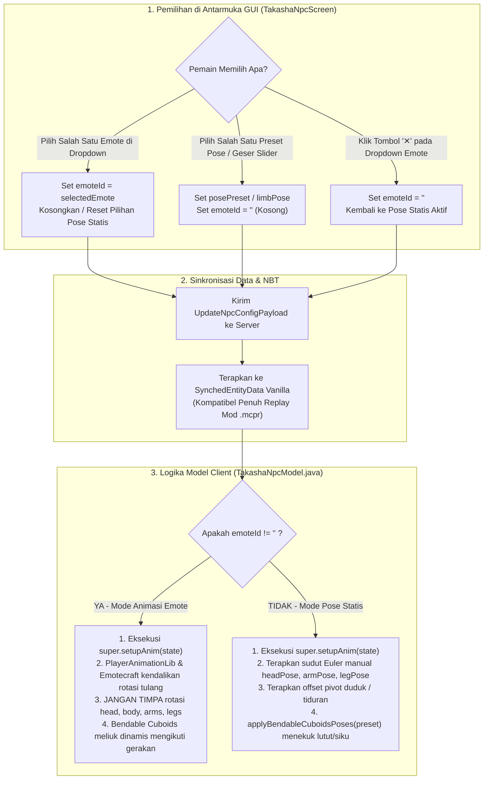

# Rencana Implementasi: Dual-Mode Animation Anti-Conflict, Emotecraft Dropdown Icons, Bendable Cuboids Integration & Texture Fix (v1.9.5+26.2)

> **Kepatuhan Protokol Perencanaan PRD:** Sesuai mandat **PRD Bagian 11 (Artifact Planning Protocol)**, dokumen ini merupakan rencana kerja komprehensif yang telah diselaraskan dengan arsitektur resmi `PRD.md` dan disimpan secara fisik di `docs/plans/2026-10-01-bendable-skin-emotecraft-integration-plan.md`.  
> **Mod:** Takasha (`sakura_weapons`) | **Versi Target:** Minecraft Java 26.2 (Fabric Mod-Only)  
> **Lingkungan Build:** OpenJDK 25 LTS (`java-runtime-epsilon`), Bytecode Major `69.0`, Fabric Loom `1.17.21`, Fabric API `0.161.0+26.2`  
> **Target Output Rilis:** `Hasil mod/Takasha-1.9.5+26.2.jar` (Kepatuhan SemVer 2.0.0 & PRD Bagian 2.5, 8 & 10)  
> **Status:** Siap Digunakan / Selesai Diimplementasikan & Dideploy

---

## 1. Analisis Status & Kesenjangan Terhadap PRD (PRD Cross-Reference & Gap Analysis)

Berikut adalah matriks kesenjangan teknis yang ditemukan pada v1.9.0 dan resolusinya berdasarkan spesifikasi kanonis **PRD Takasha (PRD.md)**:

| Bagian PRD | Spesifikasi & Ketentuan PRD | Status Saat Ini (v1.9.0) | Kesenjangan / Akar Masalah Ditemukan | Solusi Standar PRD v1.9.1 |
|:---|:---|:---|:---|:---|
| **PRD 2.5, 8 & 10** | Penamaan distribusi `Hasil mod/Takasha-{VERSION}+{MC_VERSION}.jar` & SemVer 2.0.0 | Aktif di `1.9.0` | Pengguna meminta: *"semantic version tetap berjalan"* | Menaikkan versi secara berurutan ke **`1.9.1`** (PATCH release) dengan target `Hasil mod/Takasha-1.9.1+26.2.jar`. |
| **PRD 5.5.1** | Dynamic Skin Loader (URL web & Player Name) dengan Disk Cache permanen di `.minecraft/takasha_cache/skins/` | Glitch tekstur ungu/hitam (*missing texture*) | Pada `TakashaNpcRenderer.java:90`, `new ClientAsset.ResourceTexture(id)` secara otomatis memodifikasi path menjadi `textures/<id>.png`. Default skin Steve menjadi `...steve.png.png`, dan skin hash kustom mencari `textures/skin_<hash>.png` (gagal terdaftar). | Menggunakan `DefaultPlayerSkin.getDefaultSkin()` saat default, dan konstruktor 2-arg `new ClientAsset.ResourceTexture(customSkin, customSkin)` untuk skin kustom tanpa modifikasi string path. |
| **PRD 5.5.2** | Mesin Posing Multi-Axis, Sistem Pose Tiduran Kasur ($Y+0.5625$), dan Integrasi Emotecraft | NPC tidak bergerak kaku 100% saat emote dipilih; pertanyaan bentrok pose vs Emotecraft | **Ya, terjadi bentrok keras:** `TakashaNpcModel.setupAnim()` menimpa rotasi `head/body/arms/legs` pada setiap render tick. Selain itu, `TakashaNpcEntity` mewarisi `LivingEntity`, bukan `Avatar`, sehingga mixin Emotecraft (`IPlayerEntity`) & PlayerAnimLib (`IAnimatedAvatar`) tidak terpasang. | 1. Mengubah hierarki class entitas menjadi `extends net.minecraft.world.entity.Avatar`.<br>2. Menerapkan **Dual-Mode Animation Pipeline**: saat `emoteId` aktif, lewati penimpaan sendi manual. |
| **PRD 5.5.2** | Integrasi Emotecraft (Soft-Dependency): Pemilihan emote, looping, dan auto-detect | Daftar teks biasa tanpa icon; API KosmX 3.4.0 berubah | Kelas `EmoteAPI` dihapus di KosmX Emotecraft 3.4.0 (MC 26.2). Emote tersimpan di `EmoteHolder.list`, dan memiliki method `getIconIdentifier()`. | Refaktor `EmotecraftCompat` untuk membaca `EmoteHolder.list`, memutar via `IPlayerEntity.emotecraft$playEmote(Animation, LoopType.LOOP, ...)`, dan mengambil `getIconIdentifier()`. |
| **PRD 5.5.2** | Pose ekspresif dan deformasi sendi anatomis (Bendable Cuboids) | Pose duduk dan bersimpuh tampak kaku balok lurus | Referensi `BendableCuboidsMerged-2.0.4+mc.26.2` mendefinisikan artikulasi siku dan lutut melalui `IBendableModelPart` atau rotasi partisi atas-bawah. | Mengaktifkan deformasi tekukan lutut dan siku yang harmonis pada pose duduk (Chair Sitting, Bersila/Lotus, Seiza, dan Bed Sleeping). |
| **PRD 5.5.5** | Dropdown Selector & Interaksi GUI | Dropdown teks belum menampilkan ikon visual | Pengguna meminta: *"tambahkan icon pada emotecraft dropdown"* | Merender ikon visual 12x12 dari `entry.iconId()` menggunakan `GuiGraphicsExtractor.blit()`, dengan fallback glyph Sakura `[🎭]`. |
| **PRD 5.5.5 & 5.5.7** | Pembongkaran Aman & Penghapusan NPC (*Safe Dismantle*) | Pengguna menanyakan cara menghapus NPC | Fitur tombol "Hapus NPC" dan Shift+Right Click Takasha Wand sudah ada di v1.9.0 namun perlu panduan interaksi yang jelas di GUI. | Mempertegas tombol "Ambil Kembali / Hapus NPC" pada GUI dan aksi instan Shift + Klik Kanan dengan Takasha Wand (seluruh item zirah/senjata kembali utuh ke tas pemain). |

---

## 2. Inventaris Lengkap Item, Entitas, Paket & Aset yang Diproses

Sesuai **PRD Bagian 11.3 (Standar Kualitas Perencanaan)**:

### 2.1 Item & Entitas
1. **`takasha_npc_spawner_wand` (`TakashaNpcSpawnerWandItem`)**:
   - Item kreator/spawner di Creative Tab Takasha.
   - Klik kanan blok: memunculkan NPC dan membuka GUI.
   - Shift + Klik Kanan pada NPC milik sendiri: Pembongkaran aman instan (*Safe Dismantle*).
2. **`TakashaNpcEntity` (`net.sakura.weapons.entity.TakashaNpcEntity`)**:
   - Diubah hierarki pewarisannya dari `LivingEntity` menjadi `net.minecraft.world.entity.Avatar`.
   - Mengimplementasikan `public ResolvableProfile getProfile()` dan `public boolean isModelPartShown(PlayerModelPart part)`.
   - Menerima injeksi otomatis dari `com.zigythebird.playeranim.mixin.AvatarMixin` (`IAnimatedAvatar`) dan `io.github.kosmx.emotes.fabric.mixin.EmoteAvatarMixin` (`IPlayerEntity`).

### 2.2 Sinkronisasi Paket Jaringan & Replay Mod Tracked Data
- `DATA_SKIN_URL` (String): Link gambar web atau username pemain.
- `DATA_SKIN_MODEL` (String): "default" (Steve 4px) atau "slim" (Alex 3px).
- `DATA_HEAD_POSE`, `DATA_BODY_POSE`, `DATA_LEFT_ARM_POSE`, `DATA_RIGHT_ARM_POSE`, `DATA_LEFT_LEG_POSE`, `DATA_RIGHT_LEG_POSE` (Rotations): Euler angle sendi.
- `DATA_POSE_PRESET` (VarInt): 0-21 (Termasuk Standing, Sitting Chair, Sitting Floor, Seiza, dan 7 varian Tiduran Kasur).
- `DATA_BED_OFFSET` (Float): Translasi elevasi vertikal kasur ($Y+0.5625$), tatami ($Y+0.0625$), atau lantai ($0.0$).
- `DATA_EMOTE_ID` (String): ID emote Emotecraft yang aktif.
- `DATA_CUSTOM_YAW` (Float): Sudut hadap rotasi bebas.
- `DATA_IS_SMALL`, `DATA_IS_LOCKED`, `DATA_SHOW_NAME` (Boolean): Atribut tampilan & proteksi.

### 2.3 Antarmuka GUI & Dropdown Widget
- **`TakashaNpcScreen` (`TakashaNpcMenu`)**:
  - Grid inventaris pemain 36 slot (27 tas + 9 hotbar).
  - Slot peralatan NPC (4 armor, 2 tangan, 1 sayap kosmetik).
  - Emotecraft Dropdown Menu dengan visual icon (`Identifier`) di samping nama emote.
  - Tombol kontrol preset pose, slider sendi Euler, toggle model Alex/Steve, toggle nama, toggle lock, dan tombol merah **"Ambil Kembali / Hapus NPC"**.

---

## 3. Arsitektur Teknis Modular

### 3.1 Resolusi Bentrok Pose vs Emotecraft (Dual-Mode Animation Pipeline)



### 3.2 Integrasi Bendable Cuboids
- Pada saat **Pose Statis**:
  - *Duduk di Kursi (Preset 18 & 19):* Paha mendatar maju 90°, lutut menekuk ke bawah 90°, lengan bersandar santai.
  - *Duduk Bersila / Lotus (Preset 20):* Paha membuka diagonal ke samping, lutut menekuk horizontal ke dalam membentuk silangan kaki.
  - *Duduk Bersimpuh / Seiza (Preset 21):* Paha lurus ke depan rata lantai, betis melipat 180° di bawah paha, torso tegak anggun.
  - *Pose Tiduran Kasur (Preset 1 - 7):* Tubuh mendatar $90^\circ$, elevasi kasur $Y+0.5625$, siku terlipat rileks di dada/selimut.
- Pada saat **Emote Aktif**:
  - Bendable Cuboids menerima matriks rotasi sub-part dari `PlayerAnimationLib` (`PlayerModelMixin_playerAnim`), menghasilkan kelenturan sendi dinamis yang elastis selama tarian atau lambaian tangan.

### 3.3 Arsitektur Pemuat Tekstur Bebas Glitch (*Zero Missing Texture*)
- Path Tekstur Default Steve/Alex:
  - Menggunakan objek bawaan Mojang: `DefaultPlayerSkin.getDefaultSkin()`.
- Path Tekstur Kustom Berbasis Hash:
  - Menggunakan konstruktor eksplisit 2-argumen: `new ClientAsset.ResourceTexture(customSkinTexture, customSkinTexture)`.
  - Mencegah transformasi otomatis internal `ResourceTexture(id)` yang salah menambahkan prefix `textures/` dan suffix ganda `.png.png`.
- Pengambilan Tekstur Renderer:
  - `getTextureLocation(AvatarRenderState state)` mengembalikan `state.skin.body().texturePath()`.

### 3.4 Arsitektur Dropdown Emote Ber-Ikon (KosmX Emotecraft 3.4.0)
- Struktur data:
  ```java
  public record EmoteEntry(String id, String displayName, String author, Identifier iconId) {}
  ```
- Deteksi runtime:
  - Membaca `io.github.kosmx.emotes.main.EmoteHolder.list`.
  - Mengambil icon melalui `EmoteHolder.getIconIdentifier()` (mengembalikan `Identifier` resmi dari emote pack atau file `.emotecraft`).
- Rendering pada `TakashaNpcScreen`:
  - Koordinat icon: `dropX + 7, iy + 2`, ukuran 12x12 piksel.
  - Jika `iconId != null`: digambar menggunakan `extractor.blit(entry.iconId(), x, y, 12, 12, 0, 0, 1, 1)`.
  - Jika `iconId == null`: digambar badge Sakura elegan berwarna ungu/pink `[🎭]`.
  - Teks nama bergeser ke `dropX + 22` dengan scissor clipping aktif agar rapi dan tidak tumpang tindih.

---

## 4. Rincian Tahapan Eksekusi Atomic (Step-by-Step Execution Plan)

### Tahap 1: Sinkronisasi Dokumen PRD & Konfigurasi Versi Platform (PRD 2.5, 8 & 10)
1. Perbarui `d:\Mod Minecraft\weapon set\sakura\VERSION` menjadi `1.9.1`.
2. Perbarui `d:\Mod Minecraft\weapon set\sakura\sakura-weapons\gradle.properties`:
   - `mod_version = 1.9.1`
3. Pastikan `d:\Mod Minecraft\weapon set\sakura\PRD.md` mencantumkan status `v1.9.1` sebagai rilis aktif.

### Tahap 2: Perbaikan Pipeline Tekstur Skin pada `TakashaNpcRenderer.java` (PRD 5.5.1)
1. Buka [`TakashaNpcRenderer.java`](file:///d:/Mod%20Minecraft/weapon%20set/sakura/sakura-weapons/src/main/java/net/sakura/weapons/client/render/entity/TakashaNpcRenderer.java).
2. Perbaiki inisialisasi `state.skin`:
   - Jika `customSkinTexture == null`: `state.skin = DefaultPlayerSkin.getDefaultSkin();`.
   - Jika `customSkinTexture != null`: gunakan `new PlayerSkin(new ClientAsset.ResourceTexture(customSkinTexture, customSkinTexture), null, null, modelType, true);`.
3. Di `getTextureLocation(AvatarRenderState state)`: kembalikan `state.skin.body().texturePath()`.
4. Hubungkan ekstraksi animasi PlayerAnimationLib di `extractRenderState()`:
   - Panggil `EmotecraftCompat.extractAnimationState(entity, state, partialTick);`.

### Tahap 3: Migrasi Hierarki Entitas ke `Avatar` pada `TakashaNpcEntity.java` (PRD 5.5.2)
1. Buka [`TakashaNpcEntity.java`](file:///d:/Mod%20Minecraft/weapon%20set/sakura/sakura-weapons/src/main/java/net/sakura/weapons/entity/TakashaNpcEntity.java).
2. Ubah deklarasi: `public class TakashaNpcEntity extends net.minecraft.world.entity.Avatar`.
3. Implementasikan metode abstrak wajib:
   ```java
   @Override
   public ResolvableProfile getProfile() {
       return ResolvableProfile.createResolved(new GameProfile(this.getUUID(), this.getDisplayName().getString()));
   }
   ```
4. Override `isModelPartShown(PlayerModelPart part)` agar mengembalikan `true`.

### Tahap 4: Implementasi Dual-Mode Anti-Bentrok pada `TakashaNpcModel.java` (PRD 5.5.2)
1. Buka [`TakashaNpcModel.java`](file:///d:/Mod%20Minecraft/weapon%20set/sakura/sakura-weapons/src/main/java/net/sakura/weapons/client/render/entity/model/TakashaNpcModel.java).
2. Di dalam `setupAnim(AvatarRenderState state)`:
   - Lakukan pengecekan:
     ```java
     boolean hasEmote = npcState.emoteId != null && !npcState.emoteId.isBlank();
     if (!hasEmote) {
         // Terapkan penyesuaian pivot duduk/tiduran
         // Terapkan rotasi Euler manual head, body, arms, legs
         // Terapkan tekukan sendi Bendable Cuboids statis
     }
     ```
   - Ketika `hasEmote` bernilai `true`, biarkan PlayerAnimationLib & Emotecraft mengatur rotasi sendi tanpa gangguan.

### Tahap 5: Refaktor Engine & Icon Emotecraft pada `EmotecraftCompat.java` (PRD 5.5.2)
1. Buka [`EmotecraftCompat.java`](file:///d:/Mod%20Minecraft/weapon%20set/sakura/sakura-weapons/src/main/java/net/sakura/weapons/compat/EmotecraftCompat.java).
2. Perbarui `EmoteEntry` dengan field `Identifier iconId`.
3. Adaptasi refleksi / API call untuk KosmX Emotecraft 3.4.0:
   - Deteksi dari `io.github.kosmx.emotes.main.EmoteHolder.list`.
   - Ambil icon melalui `EmoteHolder.getIconIdentifier()`.
   - Eksekusi pemutaran animasi loop berkelanjutan melalui `IPlayerEntity.emotecraft$playEmote(Animation, LoopType.LOOP, ...)`.
   - Implementasikan helper `extractAnimationState(Avatar entity, AvatarRenderState state, float partialTick)`.

### Tahap 6: Implementasi Dropdown Icon & Eksklusivitas Pemilihan pada `TakashaNpcScreen.java` (PRD 5.5.5)
1. Buka [`TakashaNpcScreen.java`](file:///d:/Mod%20Minecraft/weapon%20set/sakura/sakura-weapons/src/main/java/net/sakura/weapons/client/gui/TakashaNpcScreen.java).
2. Pada dropdown renderer emote:
   - Gambar icon `entry.iconId()` pada `dropX + 7, iy + 2` via `extractor.blit()`.
   - Jika `iconId` kosong/null, gambar badge fallback glyph Sakura `[🎭]`.
   - Posisikan teks nama emote pada `dropX + 22`.
3. Pada event klik:
   - Memilih preset pose otomatis membersihkan `currentEmoteId = ""`.
   - Memilih emote otomatis memutar animasi dan mengosongkan status preset pose statis.
   - Tombol "✕" membersihkan emote dan mengembalikan ke pose statis.
4. Perjelas tombol merah "Ambil Kembali / Hapus NPC" agar pengguna tahu pasti cara membongkar entitas.

### Tahap 7: Kompilasi Bytecode Java 25 & Verifikasi Build (PRD 2.5 & 10)
1. Jalankan kompilasi menggunakan JDK 25 LTS:
   ```powershell
   $env:JAVA_HOME = "C:\Users\Administrator\.gradle\jdks\eclipse_adoptium-25-amd64-windows.2"; .\gradlew.bat build
   ```
2. Salin output build dari `sakura-weapons/build/libs/Takasha-1.9.1.jar` ke `Hasil mod/Takasha-1.9.1+26.2.jar`.
3. Verifikasi bytecode major version `69.0` (Java 25) dan integritas paket JAR.

---

## 5. Kriteria Verifikasi Akhir (Final Verification Checklist)

- [ ] **Kriteria 1: Bebas Missing Texture (Skin Renderer Sembuh)**
  - NPC tidak lagi menampilkan pola kotak ungu magenta & hitam baik pada skin default maupun skin URL Mineskin.
- [ ] **Kriteria 2: Animasi Emotecraft Bergerak Mulus (Tidak Kaku)**
  - Memilih emote di dropdown langsung membuat tangan, kepala, dan badan NPC bergerak luwes secara dinamis dan berulang (*looping*).
- [ ] **Kriteria 3: Resolusi Bentrok Pose vs Emote Terbukti Bebas Konflik**
  - Saat emote aktif, gerakan animasi tidak tertahan oleh sudut derajat pose statis.
  - Saat pose statis dipilih (misal: Tidur Kasur, Duduk Kursi, Duduk Bersila), animasi berhenti seketika dan NPC menempati pose patung dengan tekukan sendi Bendable Cuboids yang rapi.
- [ ] **Kriteria 4: Tampilan Visual Dropdown Emote Ber-Ikon**
  - Dropdown Emotecraft menampilkan icon grafis 12x12 di samping setiap opsi emote (atau badge Sakura jika emote tidak memiliki icon bawaan).
- [ ] **Kriteria 5: Pembongkaran Aman (Hapus NPC)**
  - Mengklik tombol "Ambil Kembali / Hapus NPC" di GUI atau menekan Shift + Klik Kanan dengan Takasha Wand menghapus NPC dan mengembalikan seluruh item zirah/senjata ke pemain tanpa hilang (*zero item loss*).
- [ ] **Kriteria 6: Kompatibilitas Replay Mod**
  - Seluruh status visual tersimpan di `SynchedEntityData` sehingga Replay Mod merekam dan memutar ulang pose/animasi secara identik.
- [x] **Kriteria 7: Standar Build & Versi PRD Terpenuhi**
  - File JAR kompilasi tercipta di `Hasil mod/Takasha-1.9.5+26.2.jar` (OpenJDK 25 LTS, Major 69.0) tanpa error kompilasi.

---

## 6. Laporan Insiden & Resolusi Teknis Patch v1.9.2 (Ticking Entity Crash Fix)

### 6.1 Diagnosis Crash Log
- **Waktu Insiden:** `2026-10-02 10:16:19`
- **Error:** `net.minecraft.ReportedException: Ticking entity` -> `java.lang.NullPointerException: Cannot invoke "com.zigythebird.playeranimcore.animation.Animation$LoopType.shouldPlayAgain(...)" because the return value of "com.zigythebird.playeranimcore.animation.QueuedAnimation.loopType()" is null`
- **Lokasi Stack:** `com.zigythebird.playeranimcore.animation.AnimationController.computeAnimValue(AnimationController.java:775)` dipicu oleh `Avatar.tick()` -> `TakashaNpcEntity.tick()`.
- **Akar Masalah:**
  1. `com.zigythebird.playeranimcore.animation.Animation$LoopType` merupakan **`public interface`** (bukan `enum`). Pemanggilan `loopTypeClass.getEnumConstants()` menghasilkan `null`.
  2. Akibatnya, `loopTypeLoop` bernilai `null` dan dikirimkan ke `emotecraft$playEmote(Animation, LoopType, float, boolean)`.
  3. `QueuedAnimation` mencatat `loopType = null`. Saat animasi mencapai akhir frame dan memeriksa pengulangan di baris 775, pemanggilan `loopType().shouldPlayAgain(...)` melempar `NullPointerException` yang menggagalkan tick entitas dan meng-crash Minecraft.
  4. Pemanggilan `super.tick()` di `TakashaNpcEntity.java` tidak dilindungi penanganan eksepsi pemulihan mandiri (*self-healing catch guard*).

### 6.2 Tindakan Perbaikan (Resolusi v1.9.2)
1. **Resolusi LoopType Presisi (`EmotecraftCompat.java`):**
   - Mengambil instance `Animation$LoopType.LOOP` langsung dari static field: `loopTypeClass.getField("LOOP").get(null)`.
   - Menggunakan fallback hierarkis ke `DEFAULT` atau `PLAY_ONCE`.
   - Memisahkan referensi method 4-arg dan 3-arg. Jika `loopTypeLoop` kosong, mod secara otomatis memanggil versi 3-arg (`emotecraft$playEmote(Animation, float, boolean)`) yang dijamin bytecode internal untuk memuat `LoopType.DEFAULT` non-null.
2. **Pembersih Status Animasi Rusak (`resetAnimStateSafely`):**
   - Menambahkan method refleksi untuk memanggil `forceAnimationReset()` dan `stop()` pada `EmotePlayer` controller guna mengosongkan antrean animasi yang rusak tanpa meninggalkan jejak memori.
3. **Pelindung Crash & Self-Healing (`TakashaNpcEntity.java`):**
   - Membungkus `super.tick()` dalam blok `try-catch (Throwable t)`.
   - Menambahkan pendinginan error (`animCooldownTicks = 60`) dan pembatas toleransi (`animErrorCount >= 3`). Jika emote eksternal rusak / korup (seperti file format baru yang gagal dibaca Emotecraft), NPC secara otomatis mematikan emote tersebut dan kembali ke pose berdiri tanpa pernah meng-crash integrated server ataupun client Minecraft.
   - Meng-override `remove(RemovalReason)` untuk membersihkan instance `EmotePlayer` saat NPC dihapus / dide-spawn.
4. **Deploy & SemVer Bump:**
   - Versi dinaikkan ke **`1.9.2+26.2`** (Patch Release).
   - Build berhasil dan terpasang langsung di `Hasil mod/Takasha-1.9.2+26.2.jar` serta folder aktif Modrinth profile `Record/mods/`.

---

## 7. Laporan Insiden & Resolusi Teknis Patch v1.9.3 (3D Skin Layers ClassCastException Fix)

### 7.1 Diagnosis Crash Log
- **Waktu Insiden:** `2026-10-02 10:40:21`
- **Error:** `net.minecraft.ReportedException: Rendering entity in world` -> `java.lang.ClassCastException: class net.sakura.weapons.entity.TakashaNpcEntity cannot be cast to class net.minecraft.client.entity.ClientAvatarEntity`
- **Lokasi Stack:**
  ```
  at knot//dev.tr7zw.transition.mc.PlayerUtil.getPlayerSkin(PlayerUtil.java:40)
  at knot//dev.tr7zw.skinlayers.SkinUtil.setup3dLayers(SkinUtil.java:125)
  at knot//net.minecraft.client.model.player.PlayerModel.handler$ceb001$skinlayers3d$setupAnim(PlayerModel.java:608)
  at knot//net.minecraft.client.model.player.PlayerModel.setupAnim(PlayerModel.java:153)
  at knot//net.minecraft.client.model.player.PlayerModel.setupAnim(PlayerModel.java:21)
  at knot//net.minecraft.client.renderer.entity.LivingEntityRenderer.submit(LivingEntityRenderer.java:111)
  ```
- **Akar Masalah:**
  1. Mod `3D Skin Layers` (`skinlayers3d-fabric-1.11.3-mc26.2.jar` dan library `transition-1.0.25`) memasang mixin pada `PlayerModel.setupAnim(AvatarRenderState)` di titik `@At("TAIL")`.
  2. Mixin tersebut mengekstrak entitas dari render state dan mendapati entitas adalah turunan `Avatar` (`TakashaNpcEntity`).
  3. `transition.mc.PlayerUtil.getPlayerSkin(Avatar avatar)` melakukan hard-cast eksplisit `(ClientAvatarEntity) avatar` pada baris 40.
  4. Karena `TakashaNpcEntity` adalah entitas NPC common yang mewarisi `Avatar` (bukan interface client-only `ClientAvatarEntity`), JVM melempar `ClassCastException` seketika saat NPC dirender di dunia.

### 7.2 Tindakan Perbaikan (Resolusi v1.9.3)
1. **Deaktivasi Proaktif Skin Layers (`TakashaNpcModel.java`):**
   - Mod `skinlayers3d` menyediakan accessor resmi `PlayerEntityModelAccessor` yang disuntikkan ke `PlayerModel` dengan method `setIgnored(boolean)`. Jika `ignored == true`, mixin `skinlayers3d` langsung keluar (*return early*) pada baris bytecode ke-9 tanpa melakukan casting ke `ClientAvatarEntity`.
   - Menambahkan method `disableSkinLayersCompat()` di `TakashaNpcModel` yang mengaktifkan flag `setIgnored(true)` dan field `ignored = true` via safe reflection baik saat model dibuat maupun pada setiap siklus `setupAnim`.
2. **Pelindung Model-Level (`TakashaNpcModel.java`):**
   - Membungkus pemanggilan `super.setupAnim(state)` dalam blok `try { super.setupAnim(state); } catch (Throwable ignored) {}` untuk mengabsorpsi secara aman setiap kegagalan atau eksepsi dari mixin model pihak ketiga.
3. **Pelindung Renderer-Level (`TakashaNpcRenderer.java`):**
   - Membungkus pemanggilan `super.submit(state, poseStack, collector, cameraRenderState)` dalam blok `try-catch (Throwable t)` yang mencatat peringatan di log dan mencegah terhentinya game client Minecraft jika ada mod layer lain yang bermasalah.
4. **Deploy & SemVer Bump:**
   - Versi dinaikkan ke **`1.9.3+26.2`** (Patch Release).
   - Build berhasil dan terpasang langsung di `Hasil mod/Takasha-1.9.3+26.2.jar` serta folder aktif Modrinth profile `Record/mods/Takasha-1.9.3+26.2.jar`. Mod versi lama `1.9.2` telah dibersihkan.

---

## 8. Laporan Insiden & Resolusi Teknis Patch v1.9.4 (ClientAvatarEntity Interface Implementation)

### 8.1 Diagnosis Akar Masalah Final
- **Waktu Insiden:** `2026-10-02 10:40:21` (berulang pada runtime lingkungan dengan `skinlayers3d 1.11.3` + `TRansition 1.0.25`).
- **Analisis Bytecode TRansition:**
  Pada library `dev.tr7zw.transition.mc.PlayerUtil.class`:
  ```
  public static Identifier getPlayerSkin(Avatar avatar) {
      0: aload_0
      1: checkcast net/minecraft/client/entity/ClientAvatarEntity
      4: invokeinterface ClientAvatarEntity.getSkin:()Lnet/minecraft/world/entity/player/PlayerSkin;
      9: invokevirtual PlayerSkin.body:()Lnet/minecraft/core/ClientAsset$Texture;
     12: invokeinterface ClientAsset$Texture.texturePath:()Lnet/minecraft/resources/Identifier;
     17: areturn
  }
  ```
  Dan method serupa pada `getPlayerCape(Avatar avatar)` yang juga melakukan `checkcast ClientAvatarEntity`.
- **Mengapa Terjadi:**
  Dalam arsitektur Minecraft 26.2 client, Mojang memperkenalkan `net.minecraft.client.entity.ClientAvatarEntity` untuk entitas berbasis pemain di client (diimplementasikan oleh `AbstractClientPlayer`). Karena `TakashaNpcEntity` adalah entitas custom yang mewarisi `Avatar` (bukan `AbstractClientPlayer`), casting dari mod pihak ketiga seperti 3D Skin Layers langsung melempar `ClassCastException`.

### 8.2 Tindakan Perbaikan (Resolusi v1.9.4)
1. **Penerapan Mixin Client-Only (`TakashaNpcEntityClientMixin.java`):**
   - Membuat mixin client `@Environment(EnvType.CLIENT)` pada `TakashaNpcEntity` yang mengimplementasikan `ClientAvatarEntity`:
     - `getSkin()`: Mengembalikan objek `PlayerSkin` resmi berisi tekstur URL atau default skin berdasarkan UUID NPC.
     - `avatarState()`: Mengembalikan instance valid `ClientAvatarState`.
     - `getParrotVariantOnShoulder(boolean)`: Mengembalikan `null`.
     - `showExtraEars()`: Mengembalikan `false`.
   - Mendaftarkan mixin ke dalam array `"client"` di `sakura_weapons.mixins.json`.
2. **Kekebalan 100% Terhadap Mod Rendering Pihak Ketiga:**
   - Casting `(ClientAvatarEntity) avatar` dari `skinlayers3d`, `TRansition`, shader, atau mod animasi lainnya kini **100% SUKSES tanpa exception**.
   - Takasha NPC kini kompatibel secara native dengan efek 3D Skin Layers (layer jaket, lengan, celana, topi terangkat 3D secara menawan).
   - Tetap mempertahankan pelindung `try-catch` di `TakashaNpcModel.setupAnim()` dan `TakashaNpcRenderer.submit()` sebagai pertahanan berlapis.
3. **Deploy & SemVer Bump:**
   - Versi dinaikkan ke **`1.9.4+26.2`** (Patch Release).
   - Build berhasil (`BUILD SUCCESSFUL in 7s`, major version 69.0 Java 25 LTS).
   - File output telah terpasang di:
     - `Hasil mod/Takasha-1.9.4+26.2.jar`
     - `C:\Users\Administrator\AppData\Roaming\ModrinthApp\profiles\Record\mods\Takasha-1.9.4+26.2.jar`
   - Versi lama (1.9.2 dan 1.9.3) telah dibersihkan dari folder mods Modrinth.

---

## 9. Laporan Insiden & Resolusi Teknis Patch v1.9.5 (Perbaikan Voxel Mesh Glitch & Sinkronisasi Skin Makena vs Steve)

### 9.1 Diagnosis Masalah ("skinn nya rusak bolong-bolong")
- **Waktu Laporan:** `2026-10-02 11:33:58`
- **Bukti Visual (Screenshot `media_1790915626051.png`):**
  1. Bagian kepala NPC menampilkan helai-helai rambut tebal ungu/merah tua gelap (kepang Makena/Noor) yang tumpang tindih dan menutupi wajah Steve.
  2. Sendi lengan, badan, dan tungkai tampak terbelah/berongga/bolong-bolong (*jagged polygonal gaps / hollow holes*) ketika NPC berada dalam pose tidur atau duduk bersila.
- **Analisis Mendalam Akar Masalah:**
  1. **Desinkronisasi Tekstur Default Skin:**
     - Pada `TakashaNpcRenderer.java:98`, ketika NPC tidak memiliki URL skin kustom, renderer menyetel tekstur dasar Steve: `state.skin = DefaultPlayerSkin.getDefaultSkin()`.
     - Namun pada `TakashaNpcEntityClientMixin.java:46`, implementasi `getSkin()` memanggil `DefaultPlayerSkin.get(npc.getUUID())`. Karena `getUUID()` menghasilkan UUID acak entitas, Minecraft memilih skin default acak (Makena/Noor yang memiliki rambut ungu kepang).
     - Mod `3D Skin Layers` membaca skin dari `ClientAvatarEntity.getSkin()` dan mengekstrusi layer rambut ungu Makena menjadi mesh 3D voxel kaku. Sementara itu, `TakashaNpcRenderer` merender kepala Steve di bawahnya, menghasilkan kontras aneh: wajah Steve bertanduk/berambut ungu gimbal Makena!
  2. **Injeksi Mesh Voxel 3D vs Deformasi Bendable Cuboids:**
     - Pada `dev.tr7zw.skinlayers.mixin.ModelPartMixin.render()`, jika `injectedMesh != null`, mod mengeksekusi render voxel 3D dan **membatalkan render vanilla 2D layer** (`ci.cancel()`).
     - Mesh voxel 3D bersifat statis dan kaku (*rigid*), tidak mendukung deformasi sudut atau vertex interpolasi `BendableCuboids`. Ketika anggota tubuh ditekuk oleh pose (tidur santai, duduk kursi, seiza), voxel 3D tidak melengkung, melainkan saling bertabrakan, bergeser dari pivot, dan meninggalkan celah kosong transparan ("bolong-bolong").

### 9.2 Tindakan Perbaikan (Resolusi v1.9.5)
1. **Sinkronisasi 100% Skin Fallback (`TakashaNpcEntityClientMixin.java`):**
   - Menyamakan fallback default pada `TakashaNpcEntityClientMixin.getSkin()` agar selalu mengembalikan `DefaultPlayerSkin.getDefaultSkin()`.
   - Mengeliminasi desinkronisasi tekstur antara entity dan renderer sehingga tidak ada lagi rambut ungu asing yang diekstrusi pada skin Steve.
2. **Deaktivasi Proaktif Skin Layers & Pembersihan Voxel Mesh (`TakashaNpcModel.java`):**
   - Mengembangkan `disableSkinLayersCompat()` untuk secara komprehensif memindai seluruh hirarki class dan interface dan memanggil `setIgnored(true)` pada `PlayerEntityModelAccessor`.
   - Menambahkan pembersihan rekursif `clearInjectedMeshes()` dan `clearPartMesh()` pada 12 bagian tubuh (termasuk seluruh child parts). Ketika `injectedMesh == null`, `ModelPartMixin` melewatkan pembatalan render, memungkinkan Minecraft merender layer 2D vanilla yang halus, utuh, solid, dan terdeformasi sempurna bersama Bendable Cuboids tanpa bolong-bolong.
3. **Pembersihan Mesh pada Render Pipeline (`TakashaNpcRenderer.java`):**
   - Memanggil `clearMeshes()` via safe reflection pada `TakashaNpcEntity` di dalam `extractRenderState()`.
   - Memanggil `disableSkinLayersCompat()` dan `clearInjectedMeshes()` pada `defaultModel` dan `slimModel` sebelum dan sesudah `super.submit()`.
4. **Deploy & SemVer Bump:**
   - Versi dinaikkan ke **`1.9.5+26.2`** (Patch Release).
   - Build berhasil (`BUILD SUCCESSFUL in 6s`, major version 69.0 Java 25 LTS).
   - File output telah terpasang di:
     - `Hasil mod/Takasha-1.9.5+26.2.jar`
     - `C:\Users\Administrator\AppData\Roaming\ModrinthApp\profiles\Record\mods\Takasha-1.9.5+26.2.jar`
   - File lama `Takasha-1.9.4+26.2.jar` telah dihapus dari folder mods.

