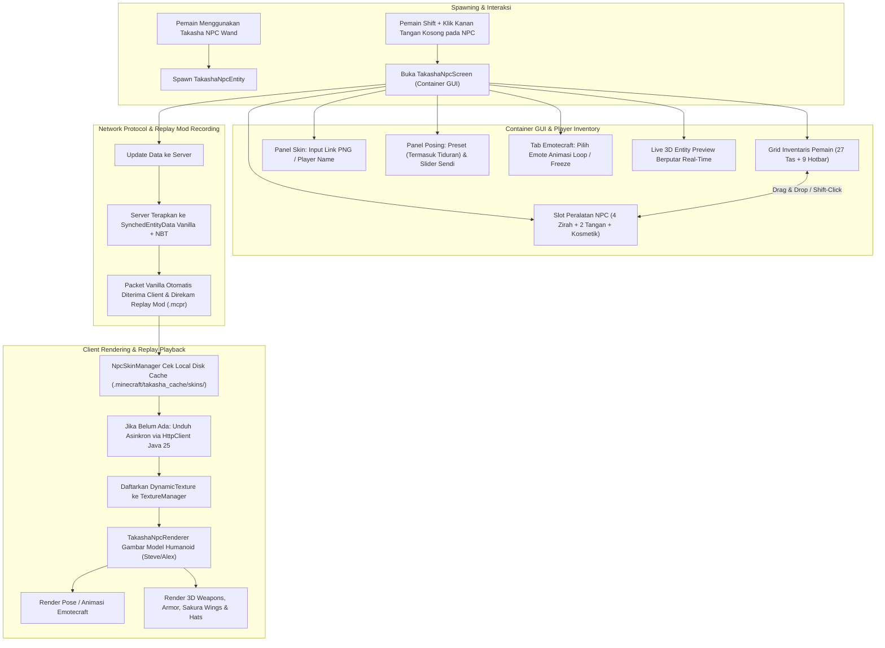

# Custom Humanoid NPC & Display Mannequin Implementation Plan

> **For Claude:** REQUIRED SUB-SKILL: Use superpowers:executing-plans to implement this plan task-by-task.

**Goal:** Membangun sistem entitas Custom Humanoid NPC / Display Mannequin pada Minecraft Java 26.2 (Fabric Mod-Only) yang mendukung input Skin URL (PNG link) / Player Name secara asinkron, mesin posing multi-axis (rotasi sendi kepala, tangan, badan, kaki) dengan 14+ preset stance (termasuk 4 varian pose tiduran), dukungan gerakan emote mod **Emotecraft**, layar GUI inventaris kontainer interaktif (seperti inventaris pemain dengan drag-and-drop & shift-click), memegang senjata 3D Takasha di mainhand/offhand, memakai zirah lengkap, sayap 3D (`SakuraWingsFeatureRenderer`), topi 3D (`SakuraHatFeatureRenderer`), item spawner wand, serta **kompatibilitas penuh Replay Mod** (zero-desync saat replay playback).

**Architecture:** 
1. **Entity Core:** Menggunakan custom `LivingEntity` (`TakashaNpcEntity`) dengan NBT persistence dan `SynchedEntityData` (untuk kompatibilitas 100% dengan Replay Mod packet capture).
2. **Container GUI:** Layar GUI (`TakashaNpcScreen` & `TakashaNpcMenu`) yang memadukan menu inventaris kontainer pemain (27 slot storage + 9 hotbar) dengan slot peralatan NPC (Armor, Hands, Wings, Hat) dan panel kontrol pose/skin di sampingnya dengan Live 3D Preview.
3. **Emotecraft Hook:** Soft-dependency check (`FabricLoader.isModLoaded("emotecraft")`) yang memungkinkan NPC memainkan animasi emote Emotecraft secara berulang atau membeku (*freeze frame*) pada pose tertentu.
4. **Replay Mod Zero-Desync:** Seluruh status visual direkam melalui paket vanilla `SynchedEntityData` dan tekstur di-cache secara permanen ke disk lokal `.minecraft/takasha_cache/skins/`, menjamin skin dan pose tetap muncul sempurna saat diputar ulang di Replay Mod.
5. **Renderer Client 26.2:** `TakashaNpcRenderer` berbasis `RenderState` dengan model dual Steve/Alex, terintegrasi dengan feature renderers kosmetik Takasha.

**Tech Stack:** Minecraft Java 26.2, Fabric Loader >= 0.19.3, Fabric API 0.161.0+26.2, Fabric Loom 1.17.21, OpenJDK 25 LTS (Bytecode Major 69.0), Java 25 `HttpClient`, Emotecraft API (Soft-Dependency), Replay Mod Vanilla Tracked Data Protocol.

---

## 1. Analisis Kebutuhan & Desain Arsitektur

---

## 2. Rincian Fitur Utama

### 2.1 Dynamic Skin Downloader & Persistent Disk Caching (Replay Mod Ready)
* **Dukungan Input:**
  * Direct Link URL gambar PNG (`https://...` dari Imgur, Catbox, Discord CDN, NameMC, server custom, dsb.).
  * Username / UUID pemain Minecraft (otomatis mengambil dari Mojang API / Session Server).
* **Asynchronous & Non-blocking:**
  * Download gambar berjalan di background thread pool menggunakan `java.net.http.HttpClient` (Java 25).
  * Tidak ada pembekuan frame (*zero game freeze / lag spike*).
* **Persistent Disk Caching untuk Replay Mod:**
  * Disimpan di folder lokal `.minecraft/takasha_cache/skins/<sha256>.png`.
  * Saat pemain membuka Replay Mod (bahkan dalam kondisi offline tanpa koneksi internet), `NpcSkinManager` langsung menyuplai tekstur dari disk lokal, menjamin skin NPC tidak pernah berubah menjadi putih / missing texture saat dirender kamera sinematik Replay Mod.
* **Deteksi Model Otomatis (Alex vs Steve):**
  * Memeriksa transparansi piksel pada layer lengan kedua (`alpha == 0` pada area slim).
  * Pengguna juga dapat memilih secara manual melalui tombol toggle *Slim (Alex)* / *Classic (Steve)* pada GUI.
* **Fallback Aman:**
  * Jika link mati atau pemain sedang offline, NPC otomatis menampilkan skin default Steve/Alex atau skin tematik samurai/miko Takasha.

### 2.2 Sistem Khusus Pose Tiduran (First-Class Lying Down & Sleeping Engine) & Mesin Posing Multi-Axis

* **Sistem Khusus Pose Tiduran & Rebahan (Lying Down / Sleeping Engine):**
  - **Dukungan `Pose.SLEEPING` Native:** Entitas secara resmi dapat beralih ke `Pose.SLEEPING` vanilla, mengubah hitbox menjadi pipih mendatar ($0.2$ tinggi blok).
  - **Ground & Bed Surface Alignment (Zero Clipping & Zero Floating):** Matriks translasi $Y$ dan rotasi $X = 90^\circ$ otomatis disesuaikan dengan permukaan balok:
    - Di atas kasur vanilla (`minecraft:bed`): Offset otomatis $Y + 0.5625$ agar tubuh berbaring pas di atas selimut/kasur.
    - Di atas karpet / tatami: Offset otomatis $Y + 0.0625$.
    - Di atas lantai balok biasa: Offset $Y + 0.0$ rata menempel lantai.
  - **7 Varian Lengkap Pose Tiduran & Rebahan:**
    1. **Tidur Terlentang Kasur (Vanilla Bed Sleeping):** Badan horizontal rata terlentang ($X = 90^\circ$), kepala rileks di bantal, kedua tangan di atas selimut/perut.
    2. **Tidur Tengkurap (Prone Sleeping):** Badan telungkup rata ($X = -90^\circ$), wajah menoleh ke samping, kedua siku menekuk santai di samping kepala.
    3. **Tidur Miring Kanan (Right Side Sleeping):** Tubuh miring 90° ke samping kanan, tangan kanan menopang kepala, lutut sedikit ditekuk santai.
    4. **Tidur Miring Kiri (Left Side Sleeping):** Tubuh miring 90° ke samping kiri, kaki santai.
    5. **Rebahan Santai / Melamun (Lazing / Stargazing):** Kepala disangga kedua tangan di belakang kepala, satu kaki menyilang santai di atas lutut lainnya menikmati pemandangan kelopak sakura.
    6. **Tidur Memeluk Senjata (Warrior's Rest):** Pendekar tidur terlentang dengan kedua tangan mendekap erat sarung katana/senjata di dada.
    7. **Terkapar Pingsan / Kalah (Knocked Out / Battlefield KO):** Pose tergeletak lemas di tanah dengan tungkai tak beraturan sehabis pertarungan sengit.
* **Preset Stance Berdiri & Aksi Tempur:**
  8. **Default / Standing:** Berdiri tegap santai.
  9. **Guard / Sentry:** Sikap siaga menjaga markas dengan senjata tegak di depan dada.
  10. **Iaido / Katana Draw:** Kuda-kuda pendekar Jepang rendah bersiap mencabut katana dari pinggang kiri.
  11. **Combat Ready:** Pose bertarung agresif siap menusuk/menebas ke depan.
  12. **Dual Wield:** Memegang senjata di kedua tangan teracung ke depan.
  13. **Salute / Hormat:** Tangan kanan menempel di dada menghormat setia.
  14. **Kneeling / Bersimpuh:** Berlutut di lantai dengan satu atau dua lutut.
  15. **Sitting / Duduk:** Duduk santai di atas balok, tangga, atau kursi.
  16. **Heroic / Pointing:** Menunjuk ke depan dengan gagah.
  17. **Meditating / Praying:** Kedua tangan terkatup di dada dalam hening.
* **Kontrol Rotasi Sendi Manual (Euler Angles X, Y, Z dari -180° hingga +180°):**
  - Slider independen untuk Kepala (`headPose`), Badan (`bodyPose`), Lengan Kanan (`rightArmPose`), Lengan Kiri (`leftArmPose`), Kaki Kanan (`rightLegPose`), dan Kaki Kiri (`leftLegPose`).
* **Dukungan Mod Emotecraft (Soft-Dependency):**
  - Mendeteksi keberadaan mod `emotecraft` di client & server (`FabricLoader.isModLoaded("emotecraft")`).
  - Jika terpasang:
    - GUI menampilkan tab Emotecraft berisi daftar emote yang dimiliki pemain.
    - Pemain dapat memilih emote untuk dimainkan berulang (*looping animation*) pada NPC.
    - Pemain dapat membekukan (*freeze frame*) pada detik tertentu sebagai pose patung yang sangat ekspresif.
    - Emote ID disinkronkan ke `SynchedEntityData` sehingga Replay Mod dan pemain lain melihat gerakan yang sama.
* **Kontrol Arah Hadap (Facing):**
  - Slider Yaw (0° - 360°) dan Pitch.
  - Tombol **"Snap to Player"**: Otomatis memutar badan dan kepala NPC menghadap tepat ke pemain saat tombol ditekan.
  - Tombol arah mata angin: Utara (North 180°), Selatan (South 0°), Barat (West 90°), Timur (East 270°).

### 2.3 Layar Inventaris Kontainer Pemain (Player Inventory Container GUI)
* **Interaksi Inventaris Penuh:**
  * Layar GUI (`TakashaNpcScreen`) dibuat berbasis `AbstractContainerScreen` yang terhubung dengan menu inventaris `TakashaNpcMenu`.
  * **Grid Inventaris Pemain (Bagian Bawah):** 27 slot tas penyimpanan + 9 slot Hotbar pemain aktif.
  * **Slot Peralatan NPC (Bagian Atas/Tengah):**
    * 4 Slot Zirah: Helm / Kosmetik Topi, Chestplate, Leggings, Boots.
    * 2 Slot Tangan: Tangan Utama (Mainhand) & Tangan Kiri (Offhand).
    * 1 Slot Kosmetik Punggung (Wings / Backpiece).
  * **Kemudahan Interaksi Item:**
    * Mendukung *drag & drop*, klik kiri/kanan untuk mengambil/meletakkan jumlah item, dan *Shift + Klik Kiri* untuk perpindahan cepat (*quick transfer / auto-equip*) antara tas pemain dan NPC.
* **Integrasi Kosmetik 3D Takasha:**
  * Senjata 3D Blockbench (Katana, Nodachi, Spear, Hammer, Mace, Staff, Bow, Crossbow, Shield, Kunai) dirender megah di tangan NPC.
  * Sayap 3D (`SakuraWingsFeatureRenderer`) merender Sayap Sakura, Pink Legacy, dan Valentine di punggung NPC.
  * Topi 3D (`SakuraHatFeatureRenderer`) merender Topi Sakura Hat dan Topi 3D Valentine di kepala NPC dengan supresi helm vanilla.
  * Zirah Takasha dirender rapi dengan kepatuhan zero-overlap matrix.

### 2.4 Kompatibilitas Penuh Replay Mod (Replay Mod Zero-Desync Architecture)
* **Vanilla Network Protocol Compliance:**
  * Seluruh data visual esensial (Skin URL / Hash, Flag Alex/Steve, Limb Pose Rotations, Yaw/Pitch Facing, Scale, Emote ID, dan Peralatan Item) disimpan di dalam `SynchedEntityData` vanilla (`EntityDataAccessor`).
  * Replay Mod merekam paket jaringan vanilla (`ClientboundSetEntityDataPacket` dan `ClientboundSetEquipmentPacket`) ke dalam file rekaman `.mcpr`. Dengan menempatkan seluruh pose dan skin di `SynchedEntityData`, saat video rekaman diputar ulang di Replay Mod, NPC 100% muncul dengan pose dan skin yang sama persis tanpa resiko T-pose atau missing state.
* **Renderer Native:**
  * `TakashaNpcRenderer` terdaftar di `EntityRendererRegistry` Fabric standar, sehingga Replay Mod mengenali dan merender entitas secara native selama render video MP4 atau timeline preview.

### 2.5 Proteksi Multiplayer, Kepemilikan & Keamanan Dedicated Server (Anti-Conflict Architecture)
Untuk menjamin pengalaman bermain yang aman, stabil, dan bebas konflik di dedicated server publik maupun privat saat dimainkan oleh banyak pemain sekaligus, sistem dirancang dengan 10 pilar proteksi:

1. **Pemisahan Logika Sisi Keras (Strict Logical Side Separation):**
   * Seluruh kode client-only (GUI `TakashaNpcScreen`, OpenGL rendering `TakashaNpcRenderer`, dan `NpcSkinManager`) diisolasi secara ketat di bawah anotasi `@Environment(EnvType.CLIENT)` dan modul client.
   * Menjamin dedicated server tidak pernah memuat kelas client secara tidak sengaja (*zero NoClassDefFoundError / dedicated server crash*).
2. **Sistem Kepemilikan & Proteksi Berjenjang (Tiered Permissions & Anti-Theft):**
   * Setiap NPC yang dimunculkan menyimpan data `ownerUUID` dan `ownerName` dari pemain pembuatnya.
   * **Mode Izin Fleksibel (Permission Modes):**
     * `PRIVATE` *(Default)*: Hanya pemilik dan Server Operator (OP permission level $\ge 2$) yang dapat membuka GUI, mengubah pose/skin, atau menukar/mengambil peralatan item.
     * `PROTECTED_VIEW`: Pemain lain dapat melihat dan berinteraksi untuk membaca nama/deskripsi atau mengagumi zirah, namun tidak dapat mengambil item ataupun mengubah pose.
     * `COOP_TEAM`: Mengizinkan pemain dalam tim/party atau pemain terdaftar untuk ikut mengelola zirah/senjata.
     * `PUBLIC_EDIT`: Mode bebas yang dapat diaktifkan di server kreatif.
   * **Perlindungan Pencurian Item (Anti-Theft):** Pemain lain yang tidak memiliki izin dilarang mengambil atau menjarah item berharga yang sedang dipajang.
3. **Fisika Imobil & Anti-Displacement (Anti-Push & Anti-Grief Movement):**
   * Pemain lain di server tidak dapat memindahkan atau mendisrupsi posisi NPC menggunakan perahu (*boat*), kereta tambang (*minecart*), kail pancing (*fishing rod*), atau dorongan badan:
     * `isPushable() = false` dan `canBeCollidedWith() = false`.
     * Imun terhadap dorongan piston (`PistonPushReaction.BLOCK` / `IGNORE`).
     * Imun terhadap dorongan aliran air atau fluida (`isAffectedByFluids() = false`).
     * Posisi terkunci permanen (*anchored*) di koordinat tempat peletakan.
4. **Netralitas PvE & Imunitas Mob (Zero Aggro Distraction):**
   * Mob hostil (Zombie, Skeleton, Creeper, Phantom, Raid Illagers, dll.) mengabaikan NPC sepenuhnya (`canBeTargeted = false`). Tidak menimbulkan kerumunan mob yang menyebabkan server lag.
5. **Status Kebal & Pembongkaran Aman (Invulnerable & Safe Dismantle):**
   * NPC berstatus `setInvulnerable(true)` sehingga tidak dapat dihancurkan oleh senjata pemain lain, panah, ledakan TNT/Creeper, maupun lahar/api.
   * **Mekanisme Pengambilan Kembali (Clean Dismantle):** Pemilik dapat membongkar NPC menggunakan *Shift + Klik Kanan dengan Takasha Wand* atau tombol "Ambil Kembali" pada GUI. Seluruh item senjata dan zirah yang sedang terpasang dijamin kembali langsung ke inventaris pemilik (atau jatuh tepat di depan kaki pemilik), tanpa kehilangan NBT/enchantment (*zero item loss*). Pemain non-pemilik ditolak membongkar NPC.
6. **Integrasi Klaim Wilayah Server (Claim & Protection Plugin Compatibility):**
   * `NpcSpawnerWandItem` memvalidasi izin blok (`player.mayBuild()`, `world.canEntityDestroy()`, dan pemicuan `UseBlockCallback` Fabric).
   * Jika lokasi berada di dalam klaim pemain lain (misal WorldGuard, FTB Chunks, GriefPrevention, FLAN) atau Vanilla Spawn Protection, proses spawn otomatis dibatalkan dengan pesan ActionBar: *"Anda tidak memiliki izin membangun di area ini"*.
7. **Pencegahan Eksploitasi Sesi Simultan (Single-Editor Lock & Auto-Release):**
   * Mencegah *race condition* dan eksploitasi duplikasi item: hanya satu pemain yang dapat membuka GUI konfigurasi NPC pada saat yang sama (`currentEditingPlayer` UUID).
   * Pemain lain yang mencoba mengakses akan menerima notifikasi ActionBar: *"NPC sedang diedit oleh <NamaPemain>"*.
   * **Graceful Auto-Release:** Jika pemain yang sedang mengedit terputus (*disconnect*), berpindah dimensi, mati, atau bergerak menjauh $> 8$ blok, kunci sesi otomatis dilepas seketika sehingga NPC tidak terkunci permanen.
8. **Validasi Jarak & Anti-Packet Flood (Reach Distance & Rate Limiting):**
   * **Reach Validation:** Server memvalidasi jarak $\le 8$ blok (`player.distanceToSqr(npc) <= 64.0`) pada setiap aksi inventaris dan setiap paket modifikasi. Paket dari pemain yang berada di luar jangkauan langsung diabaikan.
   * **Rate Limiting:** Server membatasi frekuensi penerimaan paket konfigurasi (maksimal 5 paket/detik per pemain) untuk mencegah serangan DoS/packet flooding dari client modifikasi nakal.
   * **Validasi Nilai Numerik:** Sudut rotasi divalidasi tidak memuat `Float.NaN` atau `Float.POSITIVE_INFINITY` yang dapat menyebabkan server crash.
9. **Pemuatan Skin Aman Bebas SSRF (Client-Direct Download Architecture):**
   * Dedicated server **tidak pernah mengunduh file biner gambar dari internet**, sehingga server terlindung 100% dari potensi eksploitasi Server-Side Request Forgery (SSRF) pada jaringan internal hosting server.
   * Server hanya bertindak sebagai penyimpan metadata URL/hash pada `SynchedEntityData`.
   * URL divalidasi ketat: panjang maksimal 512 karakter, skema `http://` atau `https://`, menolak `localhost`, `127.0.0.1`, dan IP privat.
   * Setiap client pemain mengunduh gambar secara langsung dari web ke disk cache lokal masing-masing dengan pembatasan ukuran file ketat (maksimal 5 MB) dan validasi dimensi PNG ($64 \times 64$ atau $64 \times 32$).
10. **Limitasi Entitas & Anti-Lag (Server Performance & Zero-AI):**
    * `TakashaNpcEntity` tidak memiliki thread pathfinding AI (`goalSelector` dan `targetSelector` kosong), sehingga tidak membebani server tick (TPS stabil).
    * Dilengkapi batas kapasitas per-chunk (misal default maksimal 16 NPC per chunk) untuk mencegah *chunk ban / entity lag machine* oleh pemain nakal.

---

## 3. Rencana Aksi Bertahap (Bite-Sized Implementation Tasks)

### Phase 1: Entitas Inti, Synched Data & Persistence (`TakashaNpcEntity`)
- **Task 1.1:** Buat kelas entitas `net.sakura.weapons.entity.TakashaNpcEntity`
  - Extends `LivingEntity`.
  - Daftarkan field kepemilikan & izin: `Optional<UUID> ownerUUID`, `String ownerName`, `byte permissionMode` (0=Private, 1=Protected View, 2=Co-op, 3=Public).
  - Terapkan imobilitas & physics anti-grief:
    - Override `isPushable()` -> `false`, `isPistonPushable()` -> `PistonPushReaction.BLOCK`.
    - Override `canCollideWith()` -> `false`, `isAffectedByFluids()` -> `false`.
    - Set `setInvulnerable(true)`, `setNoGravity(true)`.
    - Kosongkan `registerGoals()` (Zero-AI: tanpa pathfinding tick).
  - Daftarkan `EntityDataAccessor` untuk:
    - `SKIN_URL` (String)
    - `SKIN_MODEL` (String, "default"/"slim")
    - `HEAD_POSE`, `BODY_POSE`, `LEFT_ARM_POSE`, `RIGHT_ARM_POSE`, `LEFT_LEG_POSE`, `RIGHT_LEG_POSE` (`Rotations`)
    - `POSE_PRESET` (Integer, mencakup preset 0..17 dengan 7 varian khusus pose tiduran)
    - `BED_HEIGHT_OFFSET` (Float, kalibrasi ketinggian kasur Y+0.5625 / karpet Y+0.0625 / lantai Y+0.0)
    - `EMOTE_ID` (String, untuk sinkronisasi Emotecraft)
    - `YAW_ROTATION` (Float)
    - `IS_SMALL` (Boolean)
    - `IS_LOCKED` (Boolean)
    - `SHOW_NAME` (Boolean)
    - `PERMISSION_MODE` (Byte)
  - Implementasikan persistensi NBT (`addAdditionalSaveData`, `readAdditionalSaveData`) untuk seluruh pose, skin, owner, izin, dan item slot.
  - Implementasikan `SimpleContainer` untuk inventaris NPC (6 equipment + 1 wings cosmetic).
  - Proteksi interaksi multiplayer:
    - Single-editor session tracking (`currentEditingPlayer` UUID).
    - Verifikasi kepemilikan (`isOwner(player)` atau `player.hasPermissions(2)`).
    - Tolak interaksi jika sedang diedit oleh pemain lain dengan notifikasi ActionBar.
    - Implementasikan metode `dismantle(player)` yang mengembalikan seluruh senjata, zirah, dan sayap ke inventaris pemilik secara aman (*zero item loss*).
- **Task 1.2:** Registrasi Entitas & Atribut
  - Daftarkan `TAKASHA_NPC` ke `BuiltInRegistries.ENTITY_TYPE` di `ModEntities.java`.
  - Daftarkan atribut `LivingEntity.createLivingAttributes()` via `FabricDefaultAttributeRegistry`.
- **Task 1.3:** Server Lifecycle & Disconnect Event Handler
  - Daftarkan listener pada `ServerPlayConnectionEvents.DISCONNECT` untuk otomatis melepaskan `currentEditingPlayer` lock jika pemain terputus saat membuka GUI.

### Phase 2: Async Skin Downloader & Persistent Disk Caching (`NpcSkinManager`)
- **Task 2.1:** Buat kelas `net.sakura.weapons.client.util.NpcSkinManager`
  - Asynchronous HTTP download menggunakan `java.net.http.HttpClient` (Java 25).
  - SHA-256 hash hashing untuk cache path lokal di `.minecraft/takasha_cache/skins/`.
  - Persistent disk cache agar Replay Mod offline playback tetap memiliki tekstur skin.
  - Registrasi tekstur dinamis ke `TextureManager` via `DynamicTexture`.
  - Fallback ke default Steve/Alex texture jika link invalid / network offline.
  - Auto-deteksi Steve vs Alex dari alpha channel lengan.

### Phase 3: Container Menu & Layar Inventaris Pemain (`TakashaNpcMenu` & `TakashaNpcScreen`)
- **Task 3.1:** Buat `net.sakura.weapons.entity.menu.TakashaNpcMenu`
  - Extends `AbstractContainerMenu`.
  - Validasi `stillValid(player)` sisi server: Cek jarak $\le 8$ blok dan verifikasi `currentEditingPlayer == player.getUUID()`.
  - Menyediakan slot untuk inventaris pemain (3 baris storage + 1 baris hotbar) dengan transfer shift-click (`quickMoveStack`).
  - Menyediakan slot untuk NPC: Armor (Helm, Chest, Legs, Boots), Mainhand, Offhand, dan Wings.
  - Lepaskan session lock saat menu ditutup (`removed(player)`).
  - Daftarkan `MenuType` di `ModMenus.java`.
- **Task 3.2:** Buat `net.sakura.weapons.client.gui.TakashaNpcScreen`
  - Extends `AbstractContainerScreen<TakashaNpcMenu>`.
  - Merender slot kontainer pemain dan NPC dengan interaksi drag & drop / shift-click layaknya inventaris pemain standar.
  - Panel Samping Interaktif:
    - Live 3D Entity Preview berputar yang merender NPC secara realtime saat item dipasang atau slider digeser.
    - Input `EditBox` untuk URL Skin / Player Name dengan tombol "Muat Skin".
    - **Tab Kategori "🛌 Pose Tiduran & Rebahan":** 7 Tombol Varian (Tidur Terlentang Kasur, Tidur Tengkurap, Tidur Miring Kanan, Tidur Miring Kiri, Rebahan Santai, Tidur Memeluk Senjata, Terkapar Kalah KO), plus tombol Auto-Snap Kasur (Bed block Y+0.5625).
    - **Tab Kategori "⚔ Pose Berdiri & Aksi Tempur":** 10 Preset Stance (Default, Guard, Iaido, Combat, Dual Wield, Salute, Kneel, Sit, Point, Meditate).
    - Slider rotasi sendi (Head, Arms, Legs, Body) dan Slider Hadap Yaw (0-360°) + Tombol "Hadap ke Saya".
    - Selector Mode Izin (`Private`, `Protected View`, `Co-op`, `Public`).
    - Tab Emotecraft (jika terpasang): Daftar emote untuk dimainkan loop atau freeze frame.
    - Checkbox toggle: Chibi/Small, Tampilkan Nama, Kunci Entitas (Lock).
    - Tombol aksi: "Terapkan & Simpan" dan "Ambil Kembali / Hapus NPC".

### Phase 4: Integrasi Mod Emotecraft (Soft-Dependency Hook)
- **Task 4.1:** Buat kelas pembantu `net.sakura.weapons.compat.EmotecraftCompat`
  - Memeriksa `FabricLoader.getInstance().isModLoaded("emotecraft")`.
  - Jika aktif, load daftar emote yang tersedia via API Emotecraft.
  - Hook animasi pada NPC saat render frame berjalan jika `EMOTE_ID` tidak kosong.

### Phase 5: Renderer Client 26.2, Feature Layers & Replay Mod Support (`TakashaNpcRenderer`)
- **Task 5.1:** Buat `TakashaNpcRenderState`
  - Extends `HumanoidRenderState`.
  - Menyimpan `skinLocation`, `isSlim`, rotasi sendi, pose tiduran flag, bed height offset, emote data, dan status scale `isSmall`.
- **Task 5.2:** Buat `TakashaNpcRenderer`
  - Inisialisasi model `PlayerModel<TakashaNpcRenderState>` ganda (classic & slim).
  - Implementasikan transformasi rotasi horizontal ($X = 90^\circ$ / $-90^\circ$ / side roll) dan translasi vertikal saat pose tiduran aktif sehingga tubuh menempel sempurna di atas balok kasur ($Y+0.5625$) atau lantai ($Y+0.0$) tanpa tembus dan tanpa melayang.
  - Pasang layer:
    - `HumanoidArmorLayer`
    - `ItemInHandLayer`
    - `SakuraWingsFeatureRenderer` (sayap 3D di punggung NPC)
    - `SakuraHatFeatureRenderer` (topi 3D di kepala NPC)
- **Task 5.3:** Daftarkan renderer di `SakuraWeaponsClient.java` via `EntityRendererRegistry.register(ModEntities.TAKASHA_NPC, TakashaNpcRenderer::new)`.
- **Task 5.4:** Daftarkan layar GUI di client via `MenuScreens.register(ModMenus.TAKASHA_NPC_MENU, TakashaNpcScreen::new)`.

### Phase 6: Networking & Validasi Server Anti-Exploit
- **Task 6.1:** Buat payload jaringan Custom Packet (Fabric Networking API):
  - `NpcUpdatePayload` (C2S): Mengirim pembaruan URL skin, pose angles, yaw, preset, emote, mode izin, dan flag dari GUI ke server.
- **Task 6.2:** Daftarkan packet handler di `ServerPlayNetworking` dan `ClientPlayNetworking`:
  - **Server-Side Security Verification:**
    - Verifikasi jarak reach $\le 8$ blok (`player.distanceToSqr(npc) <= 64.0`).
    - Verifikasi hak kepemilikan (`isOwner(player)` atau permission level $\ge 2$).
    - Rate limiter (maksimal 5 paket/detik per pemain).
    - Sanitasi URL skin (maks 512 karakter, skema http/https, reject localhost & IP privat).
    - Validasi float (tolak `NaN` / `Infinity`).
  - Update `SynchedEntityData` dan simpan NBT entitas.

### Phase 7: Spawner Wand Item & Lokalisasi
- **Task 7.1:** Buat `NpcSpawnerWandItem`
  - Klik kanan pada blok:
    - Cek izin wilayah/klaim server (`player.mayBuild()` & pemicuan `UseBlockCallback`).
    - Cek batas entitas per-chunk (maksimal 16 NPC per chunk).
    - Spawn `TakashaNpcEntity` dengan `ownerUUID = player.getUUID()`, `ownerName = player.getName().getString()`.
    - Buka GUI `TakashaNpcScreen`.
  - Shift + Klik kanan pada NPC:
    - Jika pemain adalah pemilik atau OP: Bongkar NPC dan kembalikan seluruh item perlengkapan ke pemain (*clean dismantle*).
    - Jika non-pemilik: Tolak aksi dengan notifikasi.
  - Registrasi di `ModItems.java` dan tambahkan ke `ModItemGroups.java`.
- **Task 7.2:** Tambahkan entri string lokalisasi di `en_us.json` dan `id_id.json`:
  - Nama item, judul GUI, label preset pose (termasuk pose tiduran), slider joints, tombol aksi, mode izin, dan notifikasi ActionBar proteksi server.

### Phase 8: Kompilasi, Build & Validasi
- **Task 8.1:** Bump versi di `VERSION` (`1.8.0`) dan `sakura-weapons/gradle.properties` (`1.8.0`).
- **Task 8.2:** Jalankan `.\gradlew compileJava` dan `.\gradlew build`.
- **Task 8.3:** Verifikasi file output di `Hasil mod/Takasha-1.8.0+26.2.jar` dan cek bytecode JVM 25 LTS (Major 69.0).
- **Task 8.4:** Verifikasi integritas: Mod-Only terjaga 100%, tanpa menyentuh Resource Pack ZIP, tanpa copy ke launcher eksternal.

---

## 4. Opsi Eksekusi

Setelah rencana yang disempurnakan ini ditinjau, silakan tentukan opsi eksekusi:

1. **Subagent-Driven (Sesi Ini):** Saya akan mengeksekusi rencana tugas demi tugas secara berurutan, melakukan pengujian kompilasi pada setiap fase, hingga file build `Takasha-1.8.0+26.2.jar` selesai dan terverifikasi.
2. **Review & Penyesuaian:** Jika ada detail tambahan yang ingin disesuaikan sebelum penulisan kode dimulai.
