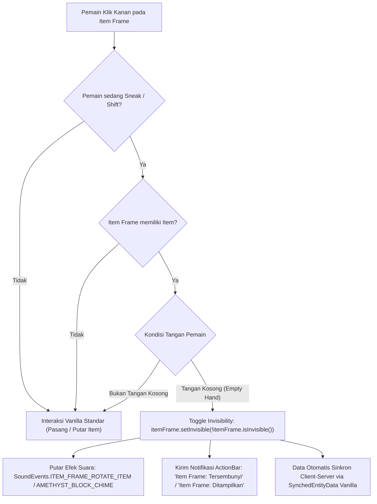
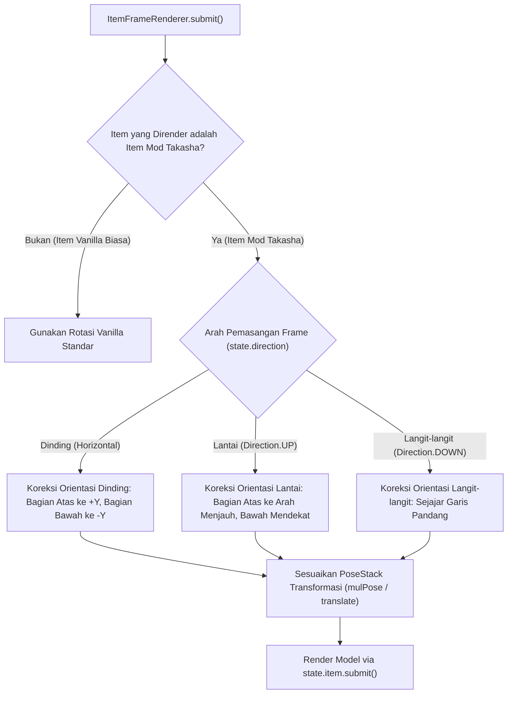

# Implementation Plan: Orientasi Khusus Item Frame & Fitur Hide/Unhide Item Frame (Minecraft 26.2)

> **Status:** [x] Completed — Diimplementasikan & Dibuild Penuh pada v1.7.1  
> **Aktivasi Hide/Unhide:** Shift + Klik Kanan dengan Tangan Kosong  
> **Cakupan Orientasi:** Seluruh Tipe Item Mod Takasha (Pedang, Alat, Tombak, Perisai, Zirah, Sayap, Topi)  
> **Target Platform:** Minecraft Java 26.2, Fabric API 0.161.0+26.2, Java 25 LTS  
> **Target Output:** `Hasil mod/Takasha-1.7.1+26.2.jar` (Mod-Only)  

---

## 1. Analisis Kebutuhan & Konfirmasi Pengguna

### 1.1 Orientasi Khusus Item Frame (Dinding vs Lantai)
* **Kebutuhan Pengguna:**
  - **Di Lantai (Floor):** Item berorientasi vertikal dari sudut pandang pemain yang menaruh (bagian atas/gagang di atas menjauh dari pemain, bagian bawah/bilah di bawah mendekat ke arah pemain).
  - **Di Dinding (Wall):** Item berorientasi vertikal tegak lurus (bagian atas/gagang menghadap ke atas langit-langit/sumbu +Y, bagian bawah/bilah menghadap lurus ke bawah lantai/sumbu -Y).
  - **Cakupan Item:** **Semua tipe item Takasha** (pedang, kapak, beliung, tombak, tongkat, perisai, zirah, topi, sayap, kunci, granat), tidak terbatas hanya pada pedang.
* **Kelayakan Teknis:**
  - **100% Feasible via Fabric Mod.** Mod mengintersep `ItemFrameRenderer` melalui Mixin client-side.
  - Mendeteksi `state.direction`:
    - `state.direction == Direction.UP` (lantai): Menyusun transformasi rotasi matriks agar sumbu vertikal item sejajar garis pandang hadap pemain.
    - `state.direction.getAxis().isHorizontal()` (dinding): Menyusun transformasi rotasi matriks agar sumbu vertikal item tegak lurus sempurna ke bawah.

### 1.2 Fitur Hide/Unhide Item Frame (Toggle Invisibility)
* **Kebutuhan Pengguna:**
  - Pemain dapat menyembunyikan (hide) dan menampilkan kembali (unhide) bingkai kayu Item Frame secara interaktif.
  - Metode aktivasi: **Shift (Sneak) + Klik Kanan dengan Tangan Kosong** pada Item Frame yang telah berisi item.
* **Kelayakan Teknis:**
  - **100% Feasible & Native Support.** Engine Minecraft Java sudah memiliki method bawaan `ItemFrame.setInvisible(boolean)` dan `ItemFrame.isInvisible()`.
  - Saat `isInvisible == true`, renderer vanilla otomatis tidak merender bingkai kayu dan pelat latar, tetapi **tetap me-render item di dalamnya** (memberikan efek display senjata/zirah melayang menempel indah di dinding atau lantai).
  - Logika ditambahkan via intersep interaksi entitas, otomatis tersinkronisasi ke seluruh pemain di multiplayer melalui `SynchedEntityData`.

---

## 2. Desain Arsitektur Teknis

### 2.1 Arsitektur Toggle Invisibility Item Frame

* **Penempatan Intersep:**
  - Injeksi pada `ItemFrame.interact(Player player, InteractionHand hand, Vec3 hitPos)` via Mixin `ItemFrameInvisibilityMixin`.
  - Jika `player.isShiftKeyDown()` dan `player.getItemInHand(hand).isEmpty()` dan `!itemFrame.getItem().isEmpty()`:
    - `boolean newInvisible = !itemFrame.isInvisible();`
    - `itemFrame.setInvisible(newInvisible);`
    - Mainkan suara konfirmasi dan kirim pesan ActionBar bilingual (`id_id` & `en_us`).
    - Kembalikan `InteractionResult.SUCCESS` untuk mengonsumsi klik (mencegah item frame terputar tidak sengaja saat di-toggle).

---

### 2.2 Arsitektur Orientasi Khusus (ItemFrameRendererMixin)

* **Penempatan Intersep:**
  - Injeksi pada `ItemFrameRenderer.submit` di client sebelum pemanggilan `state.item.submit(...)`.
* **Identifikasi Item Mod Takasha:**
  - Memeriksa namespace item: `BuiltInRegistries.ITEM.getKey(stack.getItem()).getNamespace().equals("sakura_weapons")`.
* **Koreksi Rotasi Matriks:**
  - **Dinding (Wall):**
    - Menetralkan rotasi diagonal 45° standar vanilla jika rotasi frame = 0, mengunci sumbu vertikal agar gagang/atas tepat di jam 12 (ke atas) dan bilah/bawah tepat di jam 6 (ke bawah).
    - Jika pemain memutar item frame dengan klik kanan biasa (rotasi 1..7), step rotasi tetap dihormati secara proporsional.
  - **Lantai (Floor - `Direction.UP`):**
    - Memutar bidang matriks sehingga dari arah pemain memasang frame di lantai, gagang/bagian atas menghadap menjauh dan bilah/bagian bawah menghadap ke arah pemain.
  - **Translasi Kedalaman (Z-Offset):**
    - Menjaga jarak translasi Z agar model 3D Blockbench yang tebal (seperti perisai atau nodachi) tidak menembus balok di balik item frame (*anti-clipping*).

---

## 3. Rincian Rencana Aksi (Phase-by-Phase Tasks)

### Task 1: [x] Pembuatan Mixin Hide/Unhide (`ItemFrameInvisibilityMixin`)
- **File Target:** `sakura-weapons/src/main/java/net/sakura/weapons/mixin/ItemFrameInvisibilityMixin.java`
- Menginjeksi `interact` pada `ItemFrame.class`.
- Implementasi toggle `setInvisible`, feedback suara, dan pesan ActionBar bilingual.
- Pendaftaran mixin di `sakura_weapons.mixins.json`.

### Task 2: [x] Pembuatan Mixin Orientasi & Client Render State
- **File Target:** 
  - `sakura-weapons/src/main/java/net/sakura/weapons/client/ItemFrameRenderStateAccess.java`
  - `sakura-weapons/src/main/java/net/sakura/weapons/mixin/ItemFrameRenderStateMixin.java`
  - `sakura-weapons/src/main/java/net/sakura/weapons/mixin/ItemFrameRendererMixin.java`
- Logika deteksi item Takasha dan kalkulasi rotasi vertikal untuk Dinding dan Lantai berbasis sudut pandang peletak.

### Task 3: [x] Kalibrasi Visual & Uji Transformasi Matriks
- Uji orientasi pada seluruh kategori item Takasha:
  - Pedang/Katana/Nodachi/Dagger
  - Perisai (Shield)
  - Zirah (Helmet, Chestplate, Leggings, Boots)
  - Senjata Tongkat/Tombak (Spear, Staff, Halberd)
  - Alat (Pickaxe, Axe, Shovel, Hoe)
- Menjamin tidak ada tabrakan visual atau terbalik.

### Task 4: [x] Kompilasi & Build Mod JAR
- Update `VERSION` ke `1.7.1` (PATCH: Penambahan display behavior & QoL toggle frame).
- Jalankan `.\gradlew compileJava` dan `.\gradlew build`.
- Hasil: `Hasil mod/Takasha-1.7.1+26.2.jar` (1,016,091 bytes, Java 25 LTS Major 69.0).
- Lingkup mod-only 100% terjaga (tanpa build RP ZIP, tanpa launcher copying).

### Task 5: [x] Dokumentasi PRD & Panduan
- Update `PRD.md` Bagian 2.5, Bagian 5.4, Bagian 7, dan Bagian 12.
