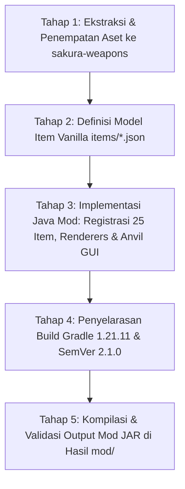

# Implementation Plan (Revisi #3): Mod Fabric Set #4 — Dragon Mecha Overlord untuk Minecraft Java 1.21.11

> **Fokus Utama:** Pembuatan Mod Fabric Saja (`sakura-weapons`) — **Eksklusif Mod, Zero Resource Pack Bloat**  
> **Versi Target Proyek:** v2.1.0+1.21.11 (SemVer MINOR — Penambahan Set Baru & Penyelarasan Platform 1.21.11)  
> **Status:** Menunggu Persetujuan Pengguna (Pending User Approval) — **TIDAK DIEKSEKUSI SEBELUM PERSETUJUAN**  
> **Tanggal Dokumen:** 2026-10-05 (Revisi Berdasarkan Feedback Pengguna: Chest Dihapus, Tekstur Armor 100% Orisinal, Mod Saja)  
> **Sumber Bahan Mentah:** `Bahan Set/Dragon Mecha Overlord/`  
> **Namespace Set:** `dragon_mecha_overlord`  
> **Target Runtime:** Minecraft Java Edition `1.21.11`, OpenJDK 21 LTS (`java-runtime-delta`), Fabric Loader `>=0.19.3`, Fabric API `0.141.6+1.21.11`  
> **Kepatuhan Kebijakan PRD Bagian 10:** Build HANYA disimpan di workspace lokal (`Hasil mod/Takasha-{VERSION}+1.21.11.jar`). DILARANG menyalin ke direktori Modrinth launcher eksternal dan DILARANG melakukan deployment ke Modrinth.

---

## 1. Tanggapan & Penyelarasan Feedback Pengguna

1. **"chest tidak perlu" (Peti Ditiadakan):**
   - Model `chest.json` resmi dikeluarkan dari seluruh roster item dan registry.
   - Total item Dragon Mecha Overlord yang didaftarkan menjadi **tepat 25 item**.
2. **"kenapa dihapus ? memangnya tidak berubah bentuknya dari sumber ?" (Tekstur Armor 100% Orisinal):**
   - **TIDAK ADA PIKSEL YANG DIHAPUS ATAU DIUBAH.**
   - Pada set sebelumnya (Valentine), penghapusan piksel dilakukan karena adanya aksen gaun/tiara yang tumpang tindih. Namun untuk set Dragon Mecha Overlord ini, tekstur zirah dari kreator Starvision Studio (`dragon_mecha_overlord_armor_layer_1.png` dan `layer_2.png`) **digunakan 100% murni/orisinal langsung dari sumber**.
   - Seluruh detail gambar zirah, helm, visor, bahu, dada, ikat pinggang, dan sepatu tetap utuh persis seperti model sumber tanpa perubahan bentuk.
3. **"buat mod nya saja" (Fokus Khusus Mod):**
   - Seluruh alur kerja diarahkan langsung ke modul **Mod Fabric (`sakura-weapons`)**.
   - Tidak ada proses packaging resource pack terpisah (`sakura-resourcepack/`). Semua model 3D, tekstur, animasi, dan definisi item diintegrasikan langsung ke dalam `sakura-weapons/src/main/resources/assets/`.
   - Output akhir tunggal: `Hasil mod/Takasha-2.1.0+1.21.11.jar`.

---

## 2. Standar Identitas & Pewarnaan (PRD Bagian 2.3)

| Atribut | Nilai Standar Takasha |
|:---|:---|
| **Set ID (`<set_id>`)** | `dragon_mecha_overlord` |
| **Nama Tampilan Resmi** | **Dragon Mecha Overlord** |
| **Tema Visual** | Cybernetic Obsidian Mecha Dragon / Toxic Lime Energy / Dark Steel |
| **Kode Warna Utama** | `§6` (Gold / Amber) & `§a` (Lime Green) + `§l` (Bold) |
| **Simbol Khas Unicode** | `🐲` (U+1F432 - Dragon Face) |
| **Format Rename Anvil (Shift+Klik)** | `§6§l🐲 Dragon Mecha Overlord <Item> 🐲` *(Maks 43 karakter — di bawah batas 50 karakter)* |
| **Dukungan Format Fleksibel** | `§a§l🐲 Dragon Mecha Overlord <Item> 🐲`, `§6Dragon Mecha Overlord <Item>`, `Dragon Mecha Overlord <Item>` |

---

## 3. Inventaris Lengkap 25 Item Mod Dragon Mecha Overlord

### 3.1 Senjata Tempur & Melee (9 Item)
1. **`dragon_mecha_overlord_sword`** (Pedang Satu Tangan / Sword) — Trigger: Semua Tier Sword, `paper`.
2. **`dragon_mecha_overlord_great_sword`** (Pedang Raksasa / Greatsword) — Trigger: Semua Tier Sword, `paper`.
3. **`dragon_mecha_overlord_rapier_sword`** (Pedang Rapier / Rapier) — Trigger: Semua Tier Sword, `paper`.
4. **`dragon_mecha_overlord_dagger`** (Belati / Dagger) — Trigger: Semua Tier Sword, `paper`.
5. **`dragon_mecha_overlord_spear`** (Tombak Panjang / Spear) — Trigger: Semua 7 Tier Spear, `trident`, Semua Tier Sword, `paper`.
6. **`dragon_mecha_overlord_staff`** (Tongkat Sakti dengan Floating Orb / Staff) — Trigger: Semua 7 Tier Spear, Semua 7 Tier Axe, Semua Tier Sword, `stick`, `paper`.
7. **`dragon_mecha_overlord_scythe`** (Sabit Maut / Scythe) — Trigger: Semua Tier Sword, Semua Tier Axe, `paper`.
8. **`dragon_mecha_overlord_hammer`** (Palu Godam / Hammer) — Trigger: `mace`, Semua Tier Axe, `paper`.
9. **`dragon_mecha_overlord_trident`** (Trisula / Trident) — Trigger: `trident`, Semua 7 Tier Spear, `paper`.

### 3.2 Peralatan / Standard Tools (4 Item)
10. **`dragon_mecha_overlord_axe`** (Kapak / Axe) — Trigger: Semua Tier Axe, `paper`.
11. **`dragon_mecha_overlord_pickaxe`** (Beliung / Pickaxe) — Trigger: Semua Tier Pickaxe, `paper` (eksklusif pickaxe).
12. **`dragon_mecha_overlord_shovel`** (Sekop / Shovel) — Trigger: Semua Tier Shovel, `paper`.
13. **`dragon_mecha_overlord_hoe`** (Cangkul / Hoe) — Trigger: Semua Tier Hoe, `paper`.

### 3.3 Senjata Jarak Jauh & Pertahanan (4 Item)
14. **`dragon_mecha_overlord_bow`** (Busur / Bow) — Trigger: `bow`, `paper` (state model: `bow_0`, `bow_1`, `bow_2`).
15. **`dragon_mecha_overlord_crossbow`** (Busur Silang / Crossbow) — Trigger: `crossbow`, `paper` (state model: `crossbow_0..2`, `charged`, `firework`).
16. **`dragon_mecha_overlord_shield`** (Perisai / Shield) — Trigger: `shield`, `paper` (state model: `shield_blocking`).
17. **`dragon_mecha_overlord_fishing_rod`** (Alat Pancing / Fishing Rod) — Trigger: `fishing_rod`, `paper` (state model: `fishing_rod_cast`).

### 3.4 Kosmetik 3D & Utilitas (4 Item)
18. **`dragon_mecha_overlord_hat`** (Topi Mecha Naga 3D / Hat) — Slot HEAD. Trigger: Semua Helm vanilla, `carved_pumpkin`, `paper`. Model 3D dirender langsung via `SakuraHatFeatureRenderer` di kepala pemain/mannequin, dan tekstur kubus helm vanilla ditekan otomatis.
19. **`dragon_mecha_overlord_wing`** (Sayap Mecha Naga Utama / Wing) — Slot CHEST. Trigger: `elytra`, `paper`. Render 3D sayap mecha lebar via `SakuraWingsFeatureRenderer`.
20. **`dragon_mecha_overlord_wing_1`** (Sayap Mecha Naga Varian / Wing Variant) — Slot CHEST. Trigger: `elytra`, `paper`. Render 3D sayap varian tajam via `SakuraWingsFeatureRenderer`.
21. **`dragon_mecha_overlord_key`** (Kunci Dragon Mecha / Key) — Trigger: `tripwire_hook`, `stick`, `paper`.

### 3.5 Set Zirah Lengkap / Armor (4 Item)
22. **`dragon_mecha_overlord_helmet`** (Helm Zirah) — Model 2D item icon + layer zirah humanoid asli.
23. **`dragon_mecha_overlord_chestplate`** (Baju Zirah Dada) — Model 2D item icon + layer zirah humanoid asli.
24. **`dragon_mecha_overlord_leggings`** (Celana Zirah) — Model 2D item icon + layer zirah humanoid asli.
25. **`dragon_mecha_overlord_boots`** (Sepatu Pelindung) — Model 2D item icon + layer zirah humanoid asli.

---

## 4. Penyelarasan Khusus Minecraft Java 1.21.11

1. **Equipment Asset JSON 1.21.11:**
   - File `equipment/dragon_mecha_overlord.json` hanya berisi layer `humanoid` dan `humanoid_leggings`.
   - Tidak menyertakan `humanoid_baby` agar lolos validasi Codec Mojang 1.21.11 tanpa error.
2. **Tekstur Zirah Utuh (Source Parity):**
   - `assets/dragon_mecha_overlord/textures/entity/equipment/humanoid/dragon_mecha_overlord.png` langsung disalin dari `dragon_mecha_overlord_armor_layer_1.png` mentah (100% utuh).
   - `assets/dragon_mecha_overlord/textures/entity/equipment/humanoid_leggings/dragon_mecha_overlord.png` langsung disalin dari `dragon_mecha_overlord_armor_layer_2.png` mentah (100% utuh).
3. **Animasi Partikel Atlas Otomatis:**
   - File `.mcmeta` (`ami.png.mcmeta`, `ami_hat_1.png.mcmeta`, `wing_ami1.png.mcmeta`, `wing_ami2.png.mcmeta`) dipasang di direktori tekstur mod sehingga energi hijau pada senjata, topi, dan sayap otomatis beranimasi halus di Minecraft 1.21.11.
4. **Data Tags Path:**
   - Tag item diletakkan di `sakura-weapons/src/main/resources/data/minecraft/tags/item/` (singular `item`).

---

## 5. Rencana Tahapan Eksekusi Mod (5 Tahap Ringkas & Terarah)

### Tahap 1: Ekstraksi & Penempatan Aset ke Mod (`sakura-weapons`)
- Buat struktur direktori di `sakura-weapons/src/main/resources/assets/dragon_mecha_overlord/`:
  - `models/item/`: 31 model 3D Blockbench JSON (senjata, tools, hat, 2 wings, key) + 4 model icon armor 2D. Path tekstur diselaraskan ke `dragon_mecha_overlord:item/<texture>`.
  - `textures/item/`: Seluruh 15 tekstur statis + 4 file animasi `.mcmeta` (`ami`, `ami_hat_1`, `wing_ami1`, `wing_ami2`) + 4 icon zirah.
  - `equipment/`: File `dragon_mecha_overlord.json` (khusus 1.21.11).
  - `textures/entity/equipment/`: Salin tekstur Layer 1 dan Layer 2 asli 100% tanpa ubahan piksel.

### Tahap 2: Registrasi Definisi Item Vanilla (`assets/minecraft/items/*.json`)
- Tambahkan blok case `dragon_mecha_overlord` pada seluruh file definisi item vanilla di mod:
  - Format Berdekorasi: `"§6§l🐲 Dragon Mecha Overlord <Item> 🐲"`, `"§a§l🐲 Dragon Mecha Overlord <Item> 🐲"`.
  - Format Berwarna: `"§6§lDragon Mecha Overlord <Item>"`, `"§6Dragon Mecha Overlord <Item>"`.
  - Format Polos: `"Dragon Mecha Overlord <Item>"`.

### Tahap 3: Implementasi Kode Fabric Mod (`sakura-weapons`)
1. **`MinecraftColorUtil.java`:** Tambahkan konstanta warna `§6` (Gold) dan `§a` (Lime Green) serta method helper format nama Dragon Mecha.
2. **`DragonMechaOverlordItems.java`:** Daftarkan seluruh 25 item native baru dengan tier material, durabilitas, dan komponen equippable.
3. **`ModItemGroups.java`:** Tambahkan 25 item ke Creative Tab Takasha.
4. **`ModEquipmentAssets.java`:** Daftarkan `DRAGON_MECHA_OVERLORD` equipment key.
5. **`DragonMechaOverlordArmorUtil.java` & `EquipmentLayerRendererMixin.java`:** Integrasikan layer armor custom.
6. **`DragonMechaOverlordHatUtil.java` & `SakuraHatFeatureRenderer.java`:** Integrasikan render 3D Topi Mecha Naga dan supresi kubus helm vanilla.
7. **`SakuraWingsFeatureRenderer.java`:** Integrasikan render 3D Sayap Mecha Naga (`wing` dan `wing_1`) pada punggung pemain.
8. **`AnvilSideListWidget.java` & `AnvilItemCatalog.java`:**
   - Perluas tab Anvil GUI menjadi 5 tab: `[All]`, `[Sakura]`, `[Pink]`, `[Val]`, `[Dragon]`.
   - Daftarkan 25 entri item Dragon Mecha Overlord ke katalog Anvil.
9. **`en_us.json`:** Tambahkan translasi nama untuk seluruh 25 item Dragon Mecha Overlord.

### Tahap 4: Penyelarasan Konfigurasi Build Minecraft 1.21.11
- Pastikan `gradle.properties`: `minecraft_version=1.21.11`, `fabric_version=0.141.6+1.21.11`.
- Perbarui SemVer di `VERSION` menjadi `2.1.0` (penambahan set baru) dan catat di `PRD.md` Bagian 4.4 sebagai Set #4: Dragon Mecha Overlord.

### Tahap 5: Kompilasi & Verifikasi Output Mod
- Jalankan `./gradlew build`.
- Pastikan file output JAR berhasil terbentuk di:
  `Hasil mod/Takasha-2.1.0+1.21.11.jar`
- Verifikasi kepatuhan PRD Bagian 10 (Nol penyalinan ke Modrinth launcher eksternal).

---

## 6. Kriteria Keberhasilan (Definition of Done)

- [ ] Seluruh 31 model 3D Blockbench dan 4 icon armor terpasang rapi di namespace `dragon_mecha_overlord` di dalam mod.
- [ ] Tekstur zirah Layer 1 dan Layer 2 utuh 100% orisinal sesuai sumber (tanpa pemotongan piksel).
- [ ] 4 tekstur animasi `.mcmeta` aktif menggerakkan aura energi di Minecraft 1.21.11.
- [ ] Seluruh file `items/*.json` vanilla di mod memuat case Dragon Mecha Overlord.
- [ ] Mod Fabric berhasil mengompilasi 25 item native, registrasi equipment asset 1.21.11 bebas error codec.
- [ ] Topi 3D Mecha Naga dan 2 Varian Sayap 3D ter-render sempurna di karakter pemain dan mannequin.
- [ ] GUI Anvil memiliki 5 tab filter (`[All]`, `[Sakura]`, `[Pink]`, `[Val]`, `[Dragon]`).
- [ ] File output kompilasi tersimpan di:
  - `Hasil mod/Takasha-2.1.0+1.21.11.jar`
- [ ] Nol file disalin ke luar workspace.
