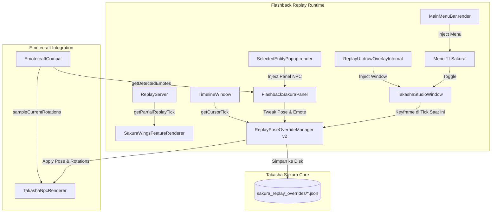

# Implementation Plan: Dukungan Mendalam Flashback Mod (v0.43.4) untuk Minecraft 26.2 (Revisi)

Dokumen ini merinci rencana teknis arsitektur dan implementasi untuk menghadirkan dukungan first-class Flashback Mod (`referensi-rp/Flashback-0.43.4-for-MC26.2`) pada modul **Minecraft 26.2** (`versions/26.2`).

> [!IMPORTANT]
> **Keputusan Desain Terkonfirmasi**:
> 1. **Fokus Eksklusif pada TakashaNpcEntity**: Entitas pemain biasa (`Player` / `AbstractClientPlayer`) **TIDAK dimodifikasi** (tidak ada override pose maupun toggle kosmetik pemain), sehingga tetap 100% vanilla dan aman tanpa risiko konflik rekaman pemain.
> 2. **Sinkronisasi Animasi Sayap**: Animasi kepakan sayap Sakura (`SakuraWingsFeatureRenderer`) disinkronkan dengan sub-tick Flashback (`getPartialReplayTick()`) agar render/export sinematik slow-motion (0.1x – 0.5x) berjalan ekstra mulus.
> 3. **Integrasi Penuh Pose & Emote KosmX Emotecraft**: Integrasi sampler rotasi Emotecraft yang sudah ada diperluas dengan **Searchable Emote Picker langsung di dalam Dear ImGui Flashback**, sehingga editor dapat memilih animasi emote terpasang tanpa perlu keluar dari viewport Flashback.
> 4. **Isolasi Dual-Version**: Modul `versions/1.21.11` tetap bersih dan tidak tersentuh. Modul 26.2 memiliki Zero-Dependency Fallback jika Flashback tidak terpasang.

---

## 1. Goal Description

Flashback mod (oleh Moulberry) adalah sistem replay editor sinematik berbasis Dear ImGui (`imgui.moulberry90.ImGui`) yang bekerja langsung di dalam render loop Minecraft 26.2.

**Tujuan Implementasi**:
1. **Fokus Penuh pada TakashaNpcEntity**:
   - Popup entitas terpilih Flashback (`SelectedEntityPopup`) menyediakan kontrol komprehensif untuk NPC: Preset pose (0-32), pemilih emote Emotecraft interaktif, mode putar (Loop / Tahan / Sekali), slider rotasi per limb (kepala, badan, tangan, kaki), skala kecil/normal, serta offset tidur.
2. **Pemilih Emote Emotecraft di ImGui**:
   - Mengintegrasikan daftar emote dari `EmotecraftCompat.getDetectedEmotes()` langsung ke Dear ImGui dengan filter pencarian instan (search box) dan daftar yang dapat diklik.
3. **Sinkronisasi Halus Sayap Sakura**:
   - `SakuraWingsFeatureRenderer` menghitung siklus kepakan berdasarkan waktu parsial replay Flashback (`ReplayServer.getPartialReplayTick()`) saat dalam mode replay, serta mendukung opsi "Pause/Freeze Wing Pose" untuk bidikan foto/still frame sinematik.
4. **Main Menu Bar Integration (`MainMenuBarMixin`)**:
   - Menambahkan menu `"🌸 Sakura"` pada menu bar atas Flashback (`MainMenuBar`) untuk akses instan ke studio dan manajemen override.
5. **Dedicated ImGui Workspace (`TakashaStudioWindow`)**:
   - Jendela floating yang memuat radar NPC di scene replay, katalog 32 pose visual, slider rotasi 3-sumbu, dan pengatur timeline keyframe.
6. **Timeline Keyframe Overrides (`ReplayPoseOverrideManager` v2)**:
   - Mendukung pergantian pose NPC di tick tertentu pada timeline Flashback (`TimelineWindow.getCursorTick()`), disimpan per sesi replay dalam file `.json`.

---

## 2. Status Integrasi Emotecraft Saat Ini vs Yang Ditingkatkan

| Fitur | Status Saat Ini | Yang Akan Diimplementasikan di Revisi Ini |
|---|---|---|
| **Pendeteksian Emote** | ✅ Otomatis mendeteksi `.minecraft/emotes/` dan built-in via `EmotecraftCompat` | Tetap dipertahankan & di-cache secara thread-safe |
| **Rotasi Stance Replay** | ✅ `EmotecraftCompat.sampleCurrentRotations()` mengekstrak 6 rotasi limb agar NPC tidak kaku di replay | Tetap aktif saat emote dipilih |
| **Pemilihan Emote di Flashback** | ❌ Hanya menampilkan nama emote aktif dan tombol "Hapus", tidak bisa memilih dari list ImGui | ✨ **Daftar Emote Interaktif & Search Box di ImGui** (Popup & Studio Window) |
| **Mode Putar Emote** | ⚠️ Tombol toggle siklus (Loop/Tahan/Sekali) | ✨ Dropdown/Combo ImGui yang jelas dengan status aktif |
| **Animasi Sayap di Replay** | ⚠️ Menggunakan tick sistem biasa (bisa patah saat slow-mo export) | ✨ **Sub-tick sync** dengan `getPartialReplayTick()` |
| **Entitas Target** | Campuran | **Eksklusif `TakashaNpcEntity`** (Player tidak disentuh) |

---

## 3. Proposed Architecture & Workflow



---

## 4. Proposed Changes (versions/26.2 Only)

### Component 1: ImGui & Emotecraft Integration (`net.sakura.weapons.compat.flashback`)

#### [MODIFY] `FlashbackSakuraPanel.java`
- Pastikan filter awal:
  ```java
  if (!(entity instanceof TakashaNpcEntity npc)) return;
  ```
  *(Entitas `Player` langsung diabaikan sesuai instruksi).*
- Tambahkan **Searchable Emote Picker**:
  - Kolom pencarian teks (`ImGui.inputText("Cari Emote##search", ...)`).
  - Child scroll area / combo list menampilkan nama emote yang terdeteksi dari `EmotecraftCompat.getDetectedEmotes()`.
  - Klik nama emote untuk langsung menerapkan ke NPC dan menyimpannya di override manager.
- Tambahkan kontrol pose terorganisir:
  - Stepper & slider untuk 32 Pose Preset Sakura dengan label ASCII ramah ImGui.
  - Pilihan mode putar emote (Loop, Tahan/Freeze Stance, Sekali Putar).
  - Slider rotasi kepala, tangan, dan tubuh untuk fine-tuning.
  - Tombol pintasan: "Buka Studio Lengkap" dan "Reset Override".

#### [NEW] `TakashaStudioWindow.java`
- Jendela ImGui floating lengkap yang dapat dibuka dari `MainMenuBar`:
  - `public static void render()`:
    - **Tab 1: Scene NPC Radar**:
      - Memindai seluruh `TakashaNpcEntity` dalam jarak render replay.
      - Menampilkan nama, posisi koordinat, jarak ke kamera, pose aktif.
      - Tombol "Arahkan Kamera ke NPC" (`lookAt`) dan tombol "Pilih NPC".
    - **Tab 2: Katalog Pose & Emote**:
      - 32 pose Sakura terbagi ke tab kategori: Combat, Idle/Santai, Valentine, Dragon Mecha.
      - Daftar Emotecraft terintegrasi dengan filter pencarian cepat.
      - Slider rotasi 3-axis (`sliderFloat3`) untuk tuning limb: Kepala, Badan, Lengan Kiri/Kanan, Kaki Kiri/Kanan.
    - **Tab 3: Kosmetik & Sayap**:
      - Kontrol animasi sayap Sakura: Normal, Slow-Mo (0.5x), Freeze Frame (0.0x / diam di pose tertentu), Cepat (1.5x).
      - Toggle partikel Sakura (kelopak bunga) pada adegan replay.
    - **Tab 4: Timeline Keyframing**:
      - Menampilkan tick timeline Flashback saat ini (`TimelineWindow.getCursorTick()`).
      - Tombol `[+] Tambah Keyframe Pose di Tick Ini`.
      - Tabel keyframe yang sudah tersimpan untuk NPC terpilih (Tick, Pose/Emote, Hapus).

#### [NEW] `FlashbackCompatHelper.java`
- Kelas utilitas terisolasi untuk berinteraksi dengan API Flashback secara aman:
  - `public static boolean isFlashbackActive()`
  - `public static int getCurrentReplayTick()` (mengambil dari `ReplayServer` atau `TimelineWindow`)
  - `public static float getPartialReplayTick()` (untuk interpolasi sub-tick)
  - `public static boolean isExporting()`

---

### Component 2: Mixin Integrations (`net.sakura.weapons.mixin.flashback`)

#### [MODIFY] `SelectedEntityPopupMixin.java`
- Memastikan signature injeksi aman dan hanya memproses `TakashaNpcEntity`:
```java
@Mixin(value = SelectedEntityPopup.class, remap = false)
public abstract class SelectedEntityPopupMixin {
    @Inject(method = "render", at = @At("TAIL"), require = 0)
    private static void sakura$renderSakuraPanel(Entity entity, EditorState editorState, CallbackInfo ci) {
        try {
            if (entity instanceof TakashaNpcEntity) {
                FlashbackSakuraPanel.render(entity);
            }
        } catch (Throwable ignored) {}
    }
}
```

#### [NEW] `MainMenuBarMixin.java`
- Menginjeksi menu item `"🌸 Sakura"` ke dalam bar menu atas Flashback (`MainMenuBar.renderInner()`):
```java
@Mixin(value = MainMenuBar.class, remap = false)
public abstract class MainMenuBarMixin {
    @Inject(method = "renderInner", at = @At("TAIL"), require = 0)
    private static void sakura$addMainMenuBar(CallbackInfo ci) {
        try {
            if (imgui.moulberry90.ImGui.beginMenu("🌸 Sakura")) {
                if (imgui.moulberry90.ImGui.menuItem("Studio Sakura", "Ctrl+Shift+S")) {
                    TakashaStudioWindow.toggle();
                }
                if (imgui.moulberry90.ImGui.menuItem("Reset Semua Override")) {
                    ReplayPoseOverrideManager.clearAll();
                }
                imgui.moulberry90.ImGui.endMenu();
            }
        } catch (Throwable ignored) {}
    }
}
```

#### [NEW] `ReplayUIMixin.java`
- Menginjeksi render loop jendela studio ke dalam `ReplayUI.drawOverlayInternal()` sesudah `WindowType.renderAll()`:
```java
@Mixin(value = ReplayUI.class, remap = false)
public abstract class ReplayUIMixin {
    @Inject(method = "drawOverlayInternal", at = @At(value = "INVOKE", target = "Lcom/moulberry/flashback/editor/ui/windows/WindowType;renderAll()V", shift = At.Shift.AFTER), require = 0)
    private static void sakura$renderStudioWindow(CallbackInfo ci) {
        try {
            TakashaStudioWindow.render();
        } catch (Throwable ignored) {}
    }
}
```

#### [MODIFY] `sakura_weapons.mixins.json`
- Mendaftarkan mixin Flashback:
  - `"flashback.SelectedEntityPopupMixin"`
  - `"flashback.MainMenuBarMixin"`
  - `"flashback.ReplayUIMixin"`

---

### Component 3: Timeline Keyframing Manager (`net.sakura.weapons.client.replay`)

#### [MODIFY] `ReplayPoseOverrideManager.java`
- Memperluas struktur penyimpanan untuk mendukung **Timeline Keyframes**:
```java
public static class NpcTimelineTrack {
    public final TreeMap<Integer, PoseOverride> keyframes = new TreeMap<>();
    
    public PoseOverride getAtTick(int tick) {
        if (keyframes.isEmpty()) return null;
        Map.Entry<Integer, PoseOverride> entry = keyframes.floorEntry(tick);
        return entry != null ? entry.getValue() : keyframes.firstEntry().getValue();
    }
}
```
- Menambahkan method:
  - `getOverride(UUID uuid, int tick)`: mencari keyframe di tick timeline, fallback ke static override jika tidak ada keyframe.
  - `setKeyframe(UUID uuid, int tick, PoseOverride override)`
  - `removeKeyframe(UUID uuid, int tick)`
  - `getKeyframes(UUID uuid)`
- Serialisasi format JSON yang rapi dan aman ke `sakura_replay_overrides/`.

---

### Component 4: Sinkronisasi Render Sayap & Sub-Tick (`net.sakura.weapons.client.render`)

#### [MODIFY] `SakuraWingsFeatureRenderer.java`
- Memperbarui perhitungan delta waktu kepakan sayap:
  - Jika klien berada dalam replay Flashback (`FlashbackCompatHelper.isFlashbackActive()`):
    - Gunakan waktu parsial `FlashbackCompatHelper.getPartialReplayTick()` sehingga animasi sayap tidak patah/stutter saat slow-motion (misal kecepatan 0.25x saat rendering video).
  - Cek apakah opsi "Freeze Wing" aktif di studio untuk mengunci sayap di sudut pose tertentu.

#### [MODIFY] `TakashaNpcRenderer.java`
- Memperbarui resolusi override saat mengekstrak render state:
  ```java
  int currentTick = FlashbackCompatHelper.getCurrentReplayTick();
  var override = ReplayPoseOverrideManager.getOverride(entity.getUUID(), currentTick);
  ```

---

## 5. Verification Plan

### Automated Build Verification
1. Jalankan kompilasi proyek versi 26.2:
   ```powershell
   ./gradlew :versions:26.2:build
   ```
   *Harus berhasil (BUILD SUCCESSFUL) tanpa error kompilasi Java 25.*
2. Jalankan build keseluruhan dual-version:
   ```powershell
   ./gradlew buildAll
   ```
   *Harus menghasilkan kedua artifact jar: `Takasha-2.2.0+1.21.11.jar` dan `Takasha-2.2.0+26.2.jar`.*

### Runtime & Fallback Verification
1. **Verifikasi Tanpa Flashback (Fallback Aman)**:
   - Jalankan mod di lingkungan tanpa Flashback mod.
   - `SakuraMixinPlugin` harus otomatis meniadakan seluruh mixin `.flashback.`.
   - Mod harus berjalan normal tanpa crash atau peringatan `ClassNotFoundException`.
2. **Verifikasi Dengan Flashback (Uji Fitur)**:
   - Masuk ke replay editor Flashback di MC 26.2.
   - Periksa keberadaan menu `"🌸 Sakura"` pada menu bar atas.
   - Buka "Studio Sakura" -> uji tab Scene Radar, Pemilih Emote, dan Kontrol Sayap.
   - Pilih `TakashaNpcEntity` -> ubah pose & cari emote Emotecraft langsung via kolom pencarian ImGui.
   - Pasang keyframe di beberapa tick berbeda -> jalankan timeline replay dan verifikasi NPC berganti pose di tick yang ditentukan.
   - Pastikan entitas pemain biasa (`Player`) tidak terdampak atau terganggu.
